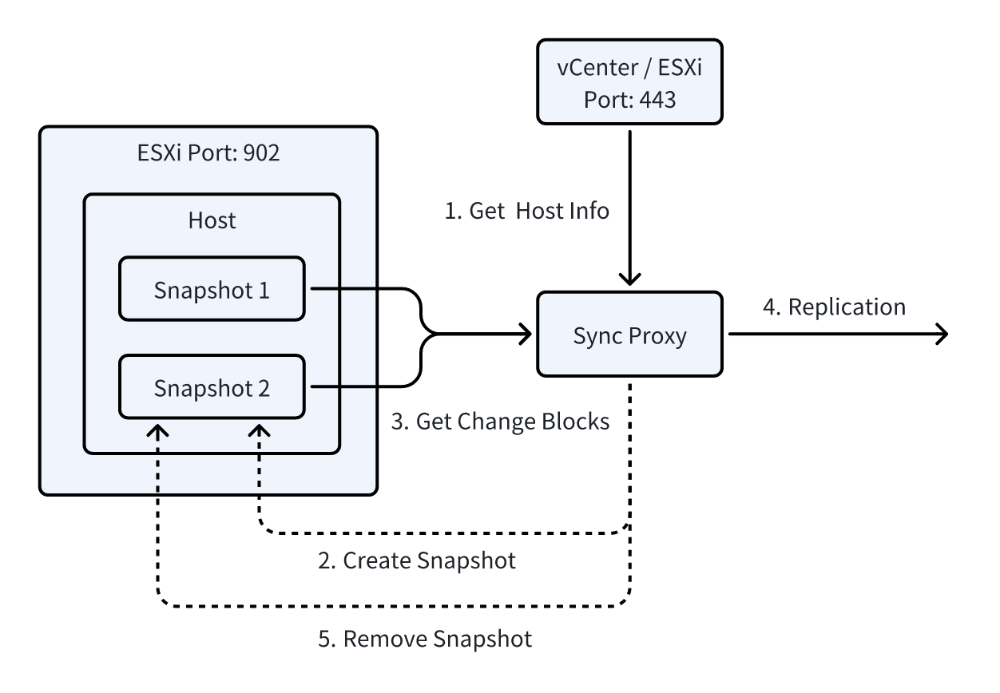
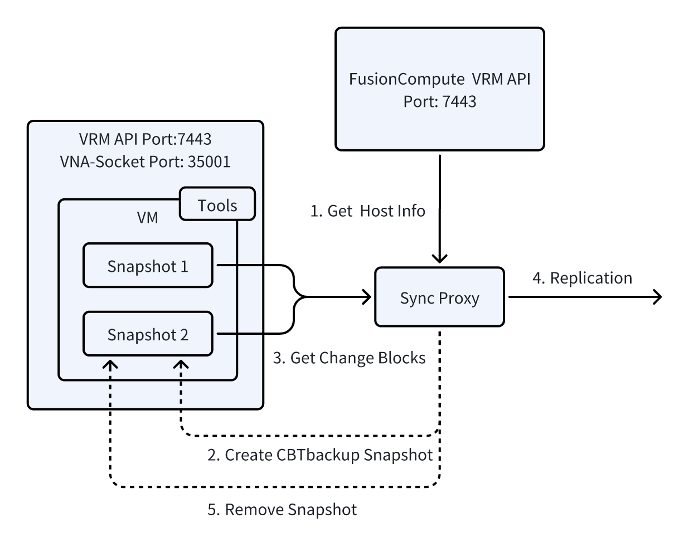

# Data Sync Fundamentals

This document aims to provide a detailed explanation of the source-side synchronization principle, covering the underlying implementation technologies of both Agent-based and Agentless modes. As one of the core technologies for data backup and recovery solutions, the efficiency and reliability of source-side synchronization directly impact the overall performance of disaster recovery systems. This document will focus on the core implementation mechanisms of our product in these two modes and provide an in-depth explanation of the incremental data acquisition principle, helping readers gain a comprehensive understanding of the key technologies behind data synchronization.

## Linux Agent

The Linux Agent consists of user-space and kernel-space modules. The kernel-space module captures I/O changes and monitors read and write operations in the file system. The user-space module transfers the captured data to the target storage using different protocols and manages the process of full and incremental backups. Through the collaboration of the kernel-space and user-space modules, the Linux Agent efficiently performs data synchronization and backup tasks.

The kernel module manages snapshots and tracks changes using a copy-on-write (COW) system. When first initialized, it creates a COW datastore file on the drive and intercepts writes at the block level. Before completing a write, it copies data that is about to be changed into the snapshot store, maintaining a consistent snapshot of the filesystem even during ongoing writes. The module uses an index at the start of the on-disk COW file to manage and access snapshot data, enabling reliable, consistent point-in-time block-level images that are more dependable than alternative methods.

## Windows Agent

**Windows Agent** is divided into two main layers: kernel mode and application layer.

1. **Kernel Mode Driver**: This layer collects all write I/O operations from protected disks and provides an interface for the application layer. By using two timestamps, the kernel driver can keep track of all write I/O sequences.
    
2. **Application Layer**: This layer is responsible for reading disk block data and writing target data (such as via iSCSI or OSS). To improve data synchronization efficiency and ensure consistency, the application layer uses Microsoft’s Volume Shadow Copy Service (VSS) technology. VSS allows for creating volume snapshots and maintains snapshot data consistency through a copy-on-write (COW) method.
    
3. **Snapshots and Synchronization**: Data synchronization is done at the block level. The application layer analyzes each protected disk to identify the start and end positions of each volume and creates a mapping. This helps the system quickly locate and read each block of data from the corresponding volume or disk.
    
4. **Efficient Data Synchronization**: To enhance synchronization efficiency, the application layer only synchronizes valid data from the volumes. It reads the metadata of each volume to check a bitmap that shows which sectors contain valid data and which do not. During data synchronization, the system skips invalid data areas to optimize the process.

## VMware Agentless

VMware agentless data synchronization is primarily achieved through VMware's Changed Block Tracking (CBT) technology. CBT is an efficient virtual machine disk change tracking technology that identifies and captures disk data blocks that have changed since the last synchronization during incremental sync. This ensures that only the changed data is synchronized, significantly improving backup efficiency.

Through the vCenter API or ESXi API, the system can access host metadata, such as virtual machine configuration, disk information, and VM power state. This allows centralized management of virtual machines across all platforms without the need to install agents on each host, preparing for subsequent data synchronization.

Before each synchronization, to ensure data consistency and integrity, the system must first call the host snapshot interface to create a virtual machine snapshot. This step ensures that disk data remains consistent during synchronization, preventing data inconsistency caused by changes to the virtual machine during the sync process.

During incremental backups, the CBT mechanism marks modified data blocks (Changed Blocks) on the disk. This allows the system to efficiently identify and sync only the changed data, without retransmitting the entire virtual machine disk content. This not only saves bandwidth and storage space but also significantly reduces the time required for backups.

## OpenStack Ceph Agentless

In agentless mode, data synchronization for an OpenStack cloud platform based on Ceph storage relies on the cooperation between the source sync proxy node, Ceph storage, and OpenStack API interfaces. This synchronization method uses incremental snapshot technology to ensure an efficient data synchronization process with optimized bandwidth utilization. Below is a detailed description of this data synchronization principle:

**Note**: Currently, this synchronization method is only applicable to OpenStack platforms using Ceph storage with RBD connection support, and no modifications are made to the OpenStack API. This mode does not support OpenStack platforms using commercial storage solutions at this time.

1. Source Sync Proxy Node

The source sync proxy node needs to have the following two access capabilities:

- **OpenStack API Access**: Used to retrieve the status information of OpenStack virtual machines, perform snapshot operations on virtual machine instances, and query other related virtual machine details.
- **Ceph Storage Network Access**: Used to read metadata from Ceph storage pools, particularly incremental data from Ceph snapshots, to identify and synchronize changed data blocks through differential comparison.

The source sync proxy node obtains the status information of virtual machines via the OpenStack API and triggers snapshot operations. It also needs to access the Ceph storage network to obtain metadata associated with the snapshot (including block device version information, modification timestamps, etc.), enabling incremental data comparison and synchronization.

2. Snapshot Operation

During incremental synchronization, the source sync proxy node first triggers a snapshot operation on the target virtual machine via the OpenStack API, generating a complete data snapshot of the virtual machine's current state. The system then calls the Ceph RBD interface to obtain the metadata of the Ceph snapshot corresponding to this snapshot. Using this metadata, the system identifies which data blocks have changed since the previous snapshot.

3. Differential Data Comparison

After obtaining the metadata of the current and previous snapshots, the system compares their differences to identify the changed data blocks. The differential comparison process relies on Ceph's incremental snapshot mechanism, with the system using version information, modification timestamps, and other metadata features to precisely identify the data blocks that need to be synchronized. Once the changed data blocks are identified, the source synchronization node reads the content of these blocks from the Ceph storage network and prepares them for synchronization to the target storage.

4. Data Synchronization to Target Storage

Once the changed data blocks are identified, the source sync proxy node synchronizes these differential data blocks to the target storage. By using incremental synchronization, only the changed data is synchronized, significantly reducing bandwidth requirements and minimizing unnecessary storage usage. This approach ensures the efficiency of data synchronization while minimizing resource consumption.

5. Snapshot Cleanup

After data synchronization is completed, the source synchronization node performs a snapshot cleanup operation. Specifically, it deletes the previous snapshot and retains the current snapshot for the next differential data comparison. This operation helps effectively release storage space while ensuring the continuity and consistency of the synchronization process, avoiding redundant storage and unnecessary resource usage.

## AWS Agentless

The advantage of AWS EC2's agentless synchronization mode mainly comes from the AWS cloud platform's AWS EBS Direct API. This technology allows users to back up and synchronize EC2 instances efficiently without installing any agents. The AWS EBS Direct API is similar in principle and mechanism to VMware CBT (Changed Block Tracking), but it provides an interface through a REST API, making it easier to integrate. Compared to traditional agent-based methods, the agentless backup mode of the EBS Direct API significantly reduces complexity and improves backup performance.

It is important to note that, currently, only AWS offers this agentless interface capability among major global cloud platforms (both public and private clouds). This allows users to back up and synchronize cloud hosts without deploying agents. This mode not only simplifies operations but also reduces the impact on host performance.

Although Oracle Cloud also provides a similar solution, its implementation differs from AWS. Oracle Cloud does not offer this capability via REST API but instead uses low-level features of the SCSI (Small Computer System Interface) protocol to achieve agentless backup. This method is more complex in terms of integration and application compared to AWS's REST API.

For other cloud platforms like Microsoft Azure, Google Cloud, Alibaba Cloud, and Huawei Cloud, agent-based methods are still required for data synchronization. While these cloud platforms offer powerful cloud storage services, they do not yet support direct backup and data synchronization via REST API or similar agentless technologies. Therefore, users still need to use agents for incremental or full backups. To achieve agentless synchronization, cloud platforms would need to actively expose relevant APIs and capabilities, which are currently not available for agentless data synchronization.

In conclusion, AWS is currently the only cloud platform that supports agentless synchronization via EBS Direct API. This innovative feature provides users with a more convenient and reliable backup solution and contributes to the development of agentless backup technology in the cloud computing industry.

More details: [Deep in AWS Agentless Mode](../presales/deep-in-aws-agentless-mode.md)

## Huawei FusionCompute Agentless

Huawei FusionCompute is a virtualization platform that supports agentless data synchronization. Its incremental snapshot function is similar to VMware's Changed Block Tracking (CBT) technology. FusionCompute uses APIs and socket interfaces to fetch incremental snapshot data for synchronization. Specifically, the API is used to request incremental snapshot information, while the socket interface is used for real-time transmission of the incremental data.

Unlike VMware, FusionCompute does not abstract the virtual machine storage layer (Datastore). VMware interacts directly with the virtual machine's disk (VMDK) through the hypervisor, allowing it to detect disk changes and perform incremental tracking. Therefore, to implement incremental snapshots (CBT), FusionCompute requires a lightweight agent to be installed on each physical host. This agent is responsible for monitoring the local host's storage layer and capturing incremental change data for each virtual machine. Due to the lack of a storage layer abstraction, FusionCompute relies on host-level agents as a supplement to achieve incremental synchronization similar to VMware.

## Oracle Cloud Agentless

Oracle Cloud's agentless backup solution utilizes the SCSI protocol's GET LBA STATUS command to achieve block-level differential replication. This solution leverages the underlying hardware control capabilities of the SCSI protocol to accurately detect changes in data blocks on storage volumes. The implementation process is as follows:

1. **Create Volume Group Backups**: To ensure data integrity, a consistent backup group for the host volumes is created first.
2. **Generate Incremental Volume**: Based on the OCIDs of the previous and current backups, an incremental volume containing the changed data blocks is created.
3. **Mount Storage Volume**: The incremental volume is mounted to a Linux instance using the iSCSI protocol.
4. **Identify Changed Data and Synchronize**: The SCSI GET LBA STATUS command is used to scan the mounted volume, identify and extract the changed data blocks, and synchronize them to the target storage.
5. **Clean Up Resources**: After synchronization, the volume is disconnected, unmounted, and deleted in sequence.

### Reference

- [Announcing OCI Block Volume Direct APIs for changed block tracking between backups](https://www.oracle.com/news/announcement/announcement-triton-2024-09-10/)
- [Direct APIs for Changed Block Tracking Between Two Backups](https://docs.oracle.com/en-us/iaas/Content/Block/Tasks/restoringdeltabetweenbackups.htm)