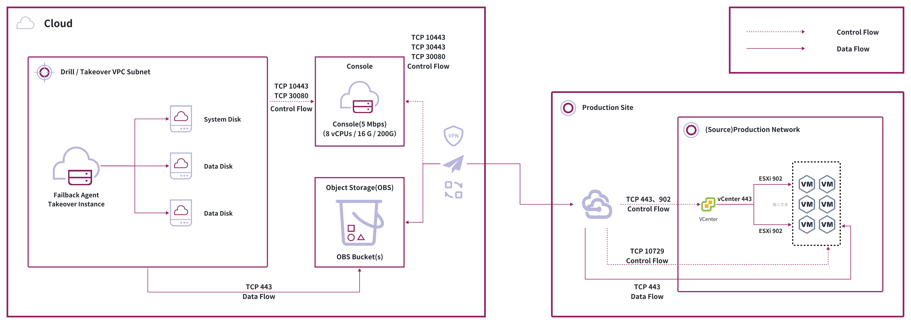

# Disaster Recovery Failback

## Overview

Disaster recovery failback is the process of switching business systems from the disaster recovery environment back to the original production environment after a disaster recovery takeover. Once the production environment is restored, businesses need to migrate their systems back to ensure continuity and data consistency.

### When to Use Failback

Failback is typically used when the original production environment has been restored and business systems need to be switched back from the disaster recovery environment.

### Key Benefits

HyperBDR's failback capability leverages migration technology to perform complete host failback through block-level full and incremental synchronization. This approach provides:

- **Data Integrity**: Complete data transmission through full and incremental synchronization
- **Business Continuity**: Minimal downtime during failback through incremental synchronization
- **Broad Compatibility**: Support for multiple virtualization and cloud platforms

## How It Works

### Data Synchronization

Failback relies on host block-level full and incremental data synchronization. Depending on the platform, you can choose between agent-based or agentless failback methods.

| Failback Method | Supported Platforms | Agent Installation Required | Description |
|-----------------|-------------------|---------------------------|-------------|
| Agentless | AWS, Oracle Cloud | No | Platform provides native host-level synchronization for direct failback |
| Agent | Other cloud platforms (Azure, Alibaba Cloud, etc.) | Yes | Requires agent installation on each host for failback |

### Available Methods

HyperBDR supports three failback methods, each with different characteristics:

| Failback Method | Applicable Environment and Main Features | Operation Complexity | Downtime Window Description |
|-----------------|------------------------------------------|---------------------|------------------------------|
| General Method | Traditional virtualization (VMware, Hyper-V, KVM) and hyper-converged environments. - Manual configuration required - Broad traditional environment support - Highly customizable | High | Short downtime - immediate cutover after final incremental sync |
| Automated Method | Cloud platforms (AWS, Azure, Alibaba Cloud) with HyperBDR integration. - Highly automated - Simple configuration - Native cloud platform interfaces | Low | Platform-dependent startup time: AWS/Oracle Cloud/Google Cloud/Huawei Cloud: ~15 minutes Other platforms: varies with data volume |
| Conditional Automated Method | VMware or Huawei FusionCompute with S3-compatible object storage. - Requires S3-compatible object storage - Highly automated - Recovery time varies with data volume | Low | Startup time depends on data volume - larger data means longer downtime |

#### General Method

The general method uses memory-based file systems to create temporary transition hosts that receive block-level full and incremental data through transmission protocols, enabling failback operations at cutover time.

**Key Components**:
1. **Temporary Transition Host**: Creates data receivers on the production platform using transition host images
2. **Block-level Synchronization**: Ensures data integrity through block-level transmission
3. **Memory-based File System**: Indirectly exposes platform disks through memory-based file systems
4. **Transmission Protocol**: Optimized protocols for efficient data transfer

#### Conditional Automated Method

The conditional automated method works with VMware or Huawei FusionCompute environments and requires S3-compatible object storage. This approach combines automation with traditional methods, using object storage as an intermediary for efficient data synchronization and automated failback.

**Key Components**:
1. **Object Storage Intermediary**: Uses S3-compatible object storage as a data synchronization hub for efficient host data transmission
2. **Automated Process Triggering**: Automatically triggers data synchronization, host creation, and failback when object storage is available
3. **Platform Integration**: Deep integration with virtualization platforms and object storage services
4. **Startup Verification**: Supports automatic or manual verification of failback hosts at different stages
5. **Operation Simplification**: Reduces manual intervention compared to general method, but requires pre-configured object storage

> **Note:** Recovery speed depends on data volume and network bandwidth. Each failback requires complete data synchronization through object storage. Larger data volumes result in longer recovery times. This method is not recommended for large-scale data scenarios. Choose your failback method based on business requirements and environmental conditions to avoid unexpected downtime.

#### Automated Method

The automated method works similarly to disaster recovery target platforms, using block storage synchronization gateways to receive data, start systems at cutover time, and complete failback after business verification.

**Key Components**:
1. **Block Storage Synchronization Gateway**: Uses cloud platform block storage synchronization capabilities
2. **Automated Deployment**: Automatically creates and manages synchronization gateways
3. **Cloud Platform Integration**: Deep integration with cloud platform native interfaces
4. **Automated Verification**: Similar to disaster recovery drills, allows flexible verification of failback hosts at different stages

## Process Overview

### Prerequisites

- **Agent Installation**:
   - Install agents on hosts after disaster recovery takeover
   - For platforms with agentless support (AWS/Oracle Cloud), use agentless failback methods
   - For other cloud platforms, install failback agents on each host

### General Method Process

| Step | Main Operations | Detailed Description |
|------|----------------|---------------------|
| Temporary Transition Host Preparation | Upload transition host image Create hosts and disks 1:1 Configure network | Upload transition host image to production platform. Create hosts and disks matching source specifications. Configure IP addresses for network connectivity. |
| Failback Configuration | Register transition hosts SSH management and pairing Select disks | Register hosts in console, use SSH for management and pairing, select appropriate disk sizes. |
| Data Synchronization | Start full sync Incremental sync Monitor duration | Begin with full synchronization, then incremental. Duration depends on data volume, bandwidth, and host load. |
| Cutover Verification | Bypass verification Verify data and applications Suspend business Final incremental sync | Verify hosts during cutover window, confirm data and applications. Suspend business, complete final incremental sync. |
| Final Cutover | Execute cutover Business verification Shut down takeover hosts | Perform cutover, verify with business team, shut down disaster recovery hosts. |

### Automated Method Process

| Step | Main Operations | Detailed Description |
|------|----------------|---------------------|
| Cloud Platform Resource Preparation | Provide authentication Auto-create sync gateways Auto-create hosts and disks Auto-configure network | Provide API keys and authentication. System auto-creates gateways, hosts, disks, and mounts them. Auto-allocate network and IP for connectivity. |
| Failback Configuration | Auto-register and manage gateways and hosts Auto-pairing Console adjustments | System auto-registers and manages gateways and hosts, completes pairing. View and adjust configurations via console. |
| Data Synchronization | Auto full sync Auto incremental sync Real-time monitoring | Auto-initiates full and incremental sync for data consistency. Monitor progress and status in real-time via console. |
| Cutover Verification | Auto/manual host verification Verify data and applications Suspend business Final incremental sync | During cutover window, auto or manually verify hosts, confirm data and applications. Suspend business, auto-complete final incremental sync. |
| Final Cutover | Auto-complete cutover Business verification Shut down takeover hosts | System auto-completes cutover, verify with business team, auto-shutdown disaster recovery hosts, business returns to production. |

> **Note:** The automated method provides high automation throughout the process, significantly reducing manual operations while improving efficiency and reliability. While similar to the general method, all steps from resource preparation to final cutover are automated, making it ideal for cloud platforms and environments with API integration.
