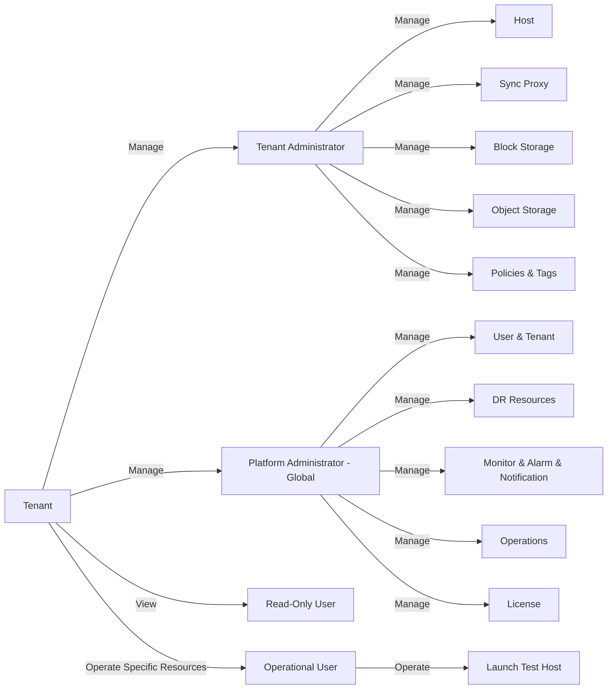

# Multi-Tenant System

## 1. Design Concept

This product supports multi-tenant resource isolation, ensuring strict separation of resources for users of our disaster recovery product. The goal is to enhance data security and clearly define operational permissions.

## 2. Resource Isolation Mechanism

All user resources are associated with a specific tenant, ensuring that data and operations remain isolated between tenants. The isolated resources include, but are not limited to:

- **Production Site Resources**: Such as hosts and source-side Sync Proxy.
- **Target-Side Resources**: Including block storage and object storage.
- **Policies and Tags**: Policies and tags created by users are isolated by tenant.

In a multi-tenant architecture, all user resources are bound to their respective tenants, ensuring precise control over resource access permissions.

## 3. Resource Visibility Within a Tenant

Within the same tenant, all users can access the tenant's resources. Additionally, in the host list, users can see which user initially added a particular resource to the process for auditing and management purposes.

## 4. Roles and Permissions

Currently, multi-tenant management is handled through a unified operations management platform. The user interface does not yet support tenant-level user management.

Users within a tenant can be assigned different roles based on specific operational needs. The primary roles include:

- **Tenant Administrator**: Has full management permissions within the tenant, including resource creation, modification, and deletion.
- **Read-Only User**: Can only view resources and is not allowed to make any changes.
- **Operational User**: Cannot add hosts but can perform specific actions such as launching test hosts.

This role-based access control ensures that users operate within appropriate permission levels, balancing operational flexibility and security.

## 5. Resource Management Diagram

## 6. Conclusion

The multi-tenant design of this product strictly adheres to the principles of resource isolation while providing a well-defined user permission management system. This ensures data security across tenants while improving collaboration and management efficiency within each tenant.

