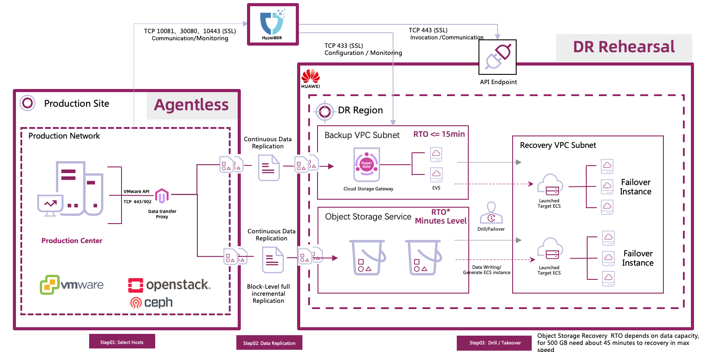
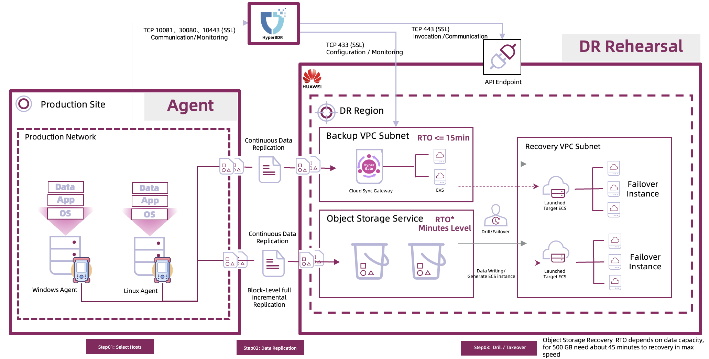
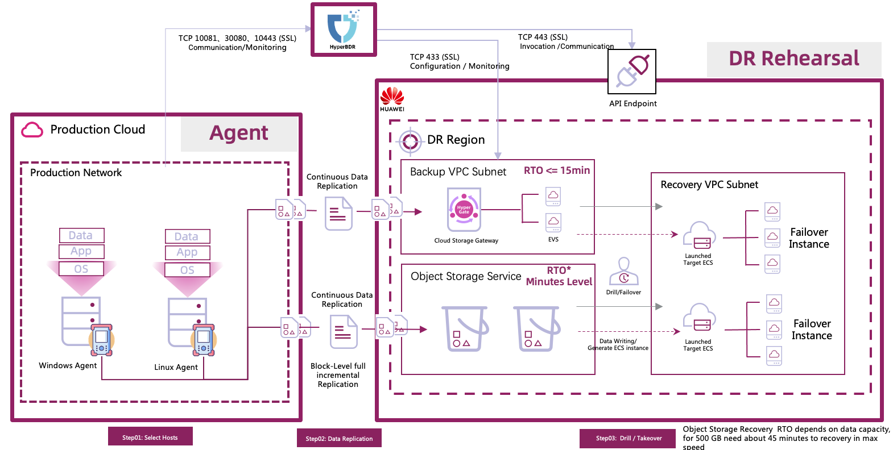
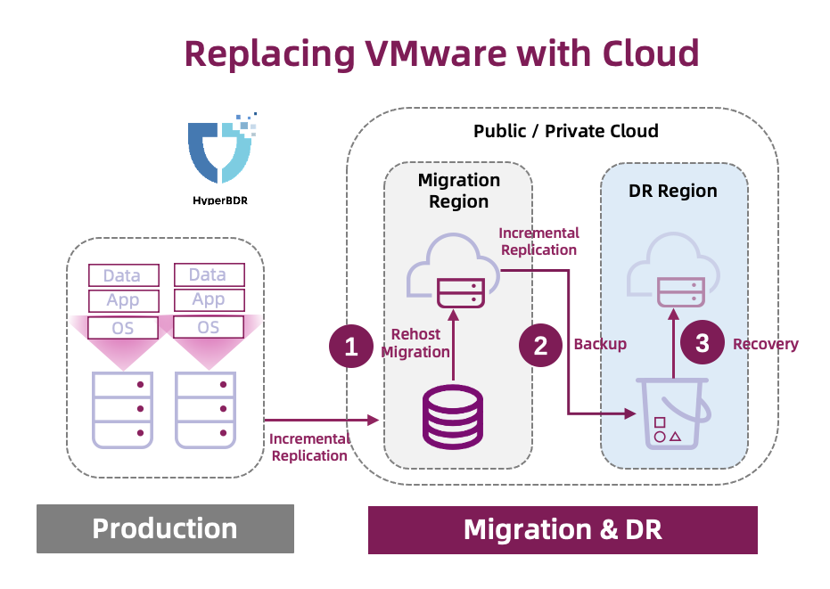
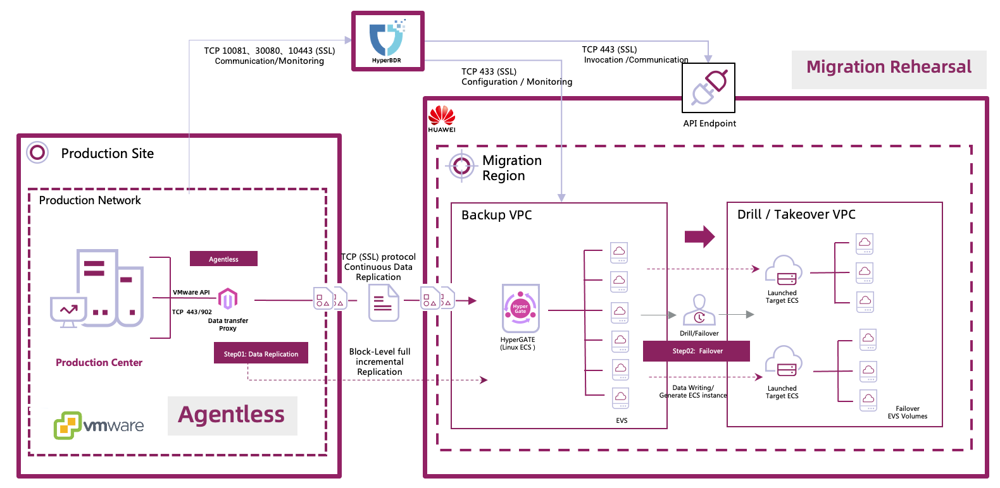
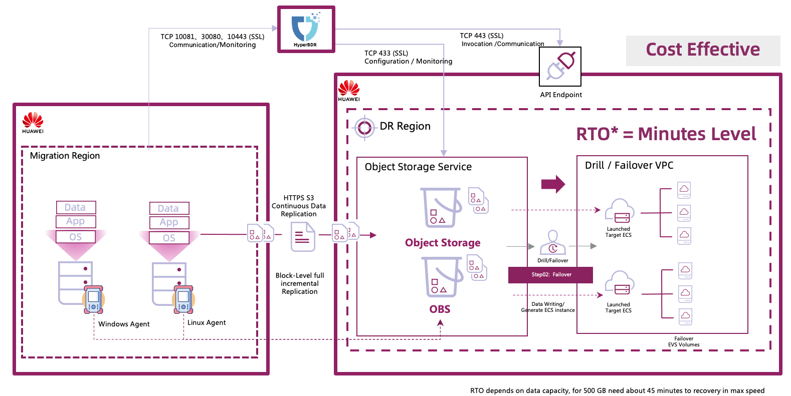
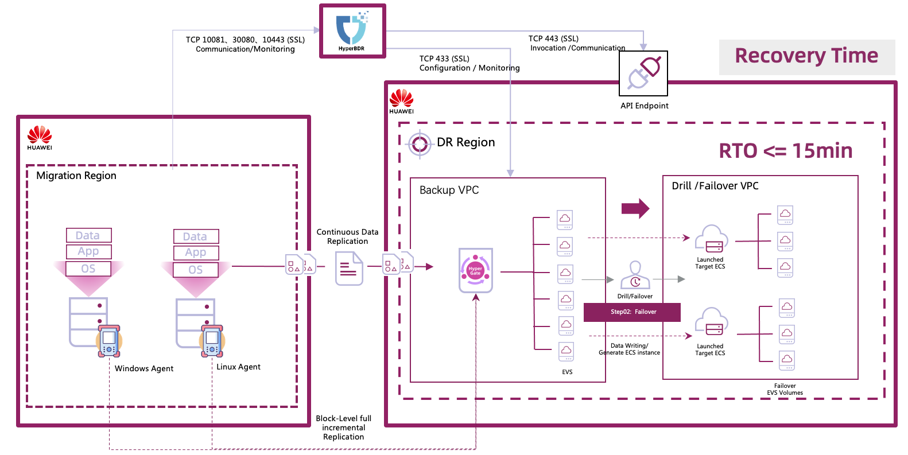

# Scenario

## Scenario 1: VMware DR to Cloud

Let's delve into the VMware disaster recovery to the cloud platform scenario, which is quite common due to the extensive VMware environment existing in many projects.

The host disaster recovery process with Hyper BDR can be broken down into three main stages: host selection and configuration, data synchronization, and finally, the rehearsal or takeover phase.

In VMware host disaster recovery, Hyper BDR eliminates the need to install agents on each source host. Instead, it gathers host information via the VMware interface and utilizes Change Block Tracking technology to capture data increments at every snapshot time point.

Data Transfer Proxy serves as a host deployed on the user‘s VMware and acts as the sole gateway in the user’s production center. Its primary function involves accessing VMware data and directly transmitting it to cloud storage. This node can be horizontally scaled, with additional Proxies recommended when more than firfty hosts.

Hyper BDR offers flexible synchronization policy settings, ranging from intervals as short as 5 minutes to hourly or monthly options. With a minimum 5-minute increment synchronization granularity, Hyper BDR ensures a potential RPO (Recovery Point Objective) time as brief as 5 minutes. However, actual RPO times might vary based on factors like incremental data size and network bandwidth, suggesting the need to adjust policy configurations according to specific circumstances.

When it comes to cloud-native storage, options include block storage or object storage, both supporting one-click start. In Huawei Cloud, block storage mode boasts an RTO (Recovery Time Objective) independent of the source-end host's disk capacity and quantity, ensuring recovery within 15 minutes. 
 
Object storage, on the other hand, offers cost advantages, albeit with recovery times closely tied to disk capacity. A thoughtful approach can combine these options based on business system RTO requirements.

After the initial synchronization, the product's Boot in Cloud feature allows for one-click recovery or rehearsal of the business system in the cloud. Users can initiate this process with a simple click, restoring the host to its startup state. With services set to start automatically, accessing the business system through the port becomes seamless.

Additionally, it's worth mentioning that, apart from the agentless method supported by the VMware platform, OpenStack private clouds leveraging Ceph as storage can also achieve disaster recovery without agents. While the process differs slightly from VMware, with Hyper BDR utilizing Ceph RBD to capture incremental data during synchronization, the overall approach remains consistent.

## Scenario 2: Linux / Windows Hosts DR to Cloud

Next, let's explore the second scenario: disaster recovery of Linux or Windows hosts to the cloud platform.

As we mentioned earlier, the Agent approach is incredibly versatile. Whether it's a physical machine, virtualized, hyper-converged, or various private and public clouds, the Agent method can handle all protection and recovery tasks that cannot be achieved agentlessly.

A common question is whether Hyper BDR can safeguard container platforms, databases, or middleware services. The answer is yes – Hyper BDR can protect all services installed on hosts, except for Oracle RAC. However, for the Oracle single-instance version, Hyper BDR remains an option.

Another common question revolves around achieving a zero RPO with Hyper BDR, particularly in database scenarios. However, given its minimum synchronization granularity of 5 minutes, Hyper BDR focuses on maintaining data integrity at each synchronization, aiming to make each snapshot time point recoverable during restoration.

For projects with database systems sensitive to RPO times, it's advisable to consider a hybird approach. For instance, real-time disaster recovery for databases like Oracle can be achieved using Oracle Data Guard or Oracle GoldenGate, while Hyper BDR can safeguard other business systems. During takeover, once Oracle completes the primary-standby switch, the business system can be restored in the cloud, and the database path can be updated to complete the takeover.

Hyper BDR streamlines different scenarios, so the synchronization and recovery processes closely mirror those of VMware, ensuring a consistent product experience. The only difference is the need to install the corresponding agent on each host requiring protection. While the Agent has system version requirements due to its kernel-level technology, it generally supports common Windows and Linux systems. Specific compatibility checks will be addressed later.

Combining Agent and Agentless modes enables seamless one-click mixed recovery. In real projects, different protection methods can be chosen based on various environments.

## Scenario 3: Cloud Hosts DR to Cloud

Disaster recovery between different cloud platforms, particularly among public clouds, is a common scenario users often consider.

In such cases, installing an Agent within the cloud host facilitates host protection and recovery to other cloud platforms.

A frequent inquiry we receive is whether Hyper BDR can safeguard relational database services (RDS). Due to certain limitations, Hyper BDR doesn't directly support RDS protection. 
However, akin to the Oracle protection method outlined earlier, a hybrid approach can still achieve disaster recovery in the cloud. 

Hosts can utilize Hyper BDR, while database synchronization can leverage platform-specific tools designed for RDS disaster recovery, such as Huawei Cloud’s DRS service. 

For businesses sensitive to database protection, employing the DRS service for database synchronization alongside Hyper BDR for host services has successful in projects.

## Scenario 4: Replacing VMware with Cloud

The fourth scenario is a recent focal point. Due to well-known reasons, there have been shifts in VMware's licensing policy, leading many users to seek alternative solutions, with the cloud being an obvious choice.

However, addressing issues related to business continuity during the transition from VMware to the cloud, as well as ensuring the protection and recovery of business systems post-migration, are crucial considerations for users during the replacement process.

Utilizing Hyper BDR can seamlessly address users' concerns. The basic process involves migrating business systems to the cloud without agents, followed by implementing cross-region disaster recovery using Hyper BDR.

This approach not only substitutes VMware but also provides a cross-region disaster recovery solution to meet the high reliability requirements of systems.

### Stage 1 - Migration

Firstly, protect the business system to the block storage of the cloud platform in an Agentless manner. Block storage offers advantages in recovery time, effectively reducing the cutover window.

Secondly, utilize the product's rehearsal feature to create a simulation environment, making it easy to validate the operation of the business system in the cloud. Once validation is complete, release the cloud resources to save costs. Throughout this period, the operation of the production environment's business system remains unaffected.

Thirdly, during the business cut-over window, temporarily suspend business system access and perform the final incremental synchronization. Due to the relatively small amount of incremental synchronization data, synchronization and business system startup can be completed quickly. After verification, shut down the source system completely to finalize the cut-over.

If any issues arise at this stage, simply restart the source system to complete the rollback. Additionally, incremental data can continue to synchronize, awaiting the next cut-over window.

With these steps, we have completed the first phase of replacing VMware with the cloud - migration.

### Stage 2 - Backup & Recovery – Object Storage Service

Once the business system operates smoothly in the cloud, we can initiate cross-region disaster recovery. We may opt for cost-effective object storage, as mentioned earlier. In object storage mode, data synchronization incurs no additional computational costs, only storage fees for the object storage.

!

Firstly, we need to install the Hyper BDR Agent on the business hosts already deployed in the cloud.

Secondly, configure the authentication details for the disaster recovery region's object storage and recovery platform, accessible through the Huawei Cloud console.

Next, establish the synchronization policy and commence the protection process.

Lastly, in case of rehearsal or disaster, launching the business system in the disaster recovery region is a simple one-click operation.

### Stage 2 - Backup & Recovery – Block Storage Service

If the business system has stringent RTO recovery time requirements, we can utilize block storage in the disaster recovery region to ensure rapid recovery. The disaster recovery steps align with those mentioned earlier for object storage.

!

Of course, depending on varying RTO requirements, a hybrid approach combining both storage methods can be considered, aiming to minimize costs while meeting RTO performance needs.

This way, we not only complete the VMware replacement but also offer highly reliable protection for the business systems in the cloud.