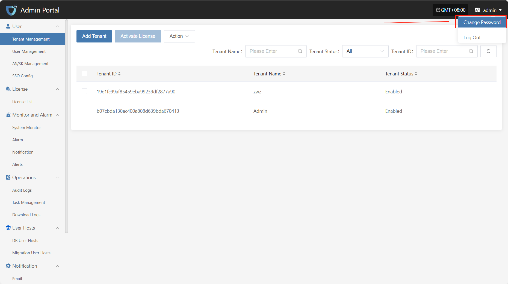
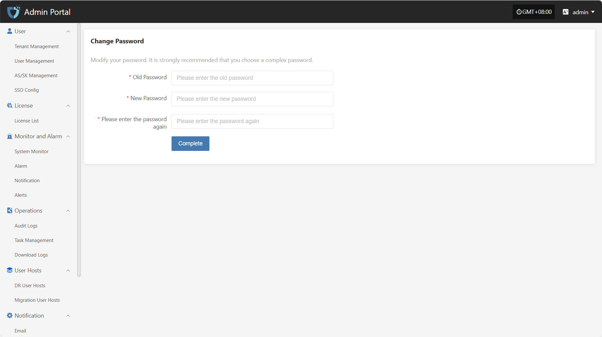

# **Change Password**

To protect the security of your account, we recommend that you change your password regularly, especially using a password with high security.

- Click on the username in the top right corner of the page to expand the dropdown menu.

- Click on the "Change Password" option to be redirected to a new page for password modification.

According to the page instructions, after entering the old password, the new password, and re-entering the new password, click **"Complete"** at the bottom to complete the password change.

> Note: Your new password must be 8-20 characters long, contain both uppercase and lowercase letters and numbers, and may include special characters (except spaces). After changing your password, please remember it to avoid login issues. The password for the Operations Management Platform will also be updated.

## **Password Management Tips**

- Change your password regularly, especially if you suspect your account security may be compromised.
- Avoid using the same password across multiple platforms. Use complex and unique passwords to enhance your account security.

