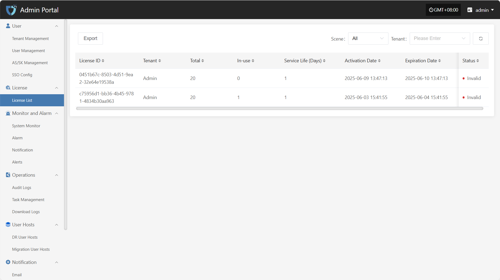

# **License List**

The "License List" module is used to centrally display existing license records in the system, making it easy for administrators to view, audit, and manage resource access permissions. License information includes tenant, license scope, and status, helping to track permission allocation and ensure operational security and compliance.

On the license list page, click the "Export" button in the upper left corner to export the current license information as a file for local archiving or permission auditing.

