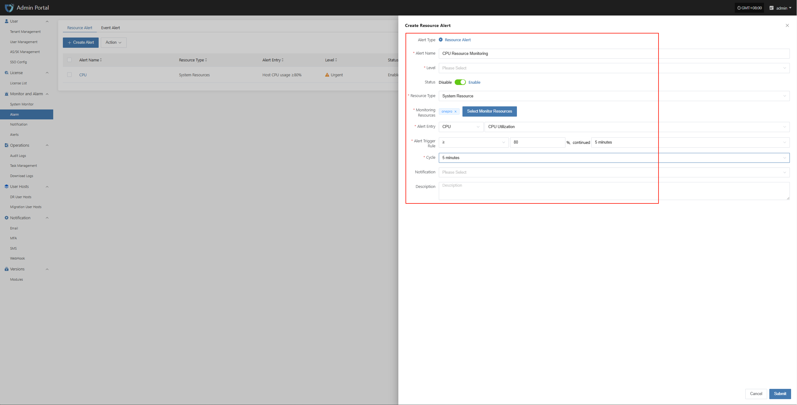
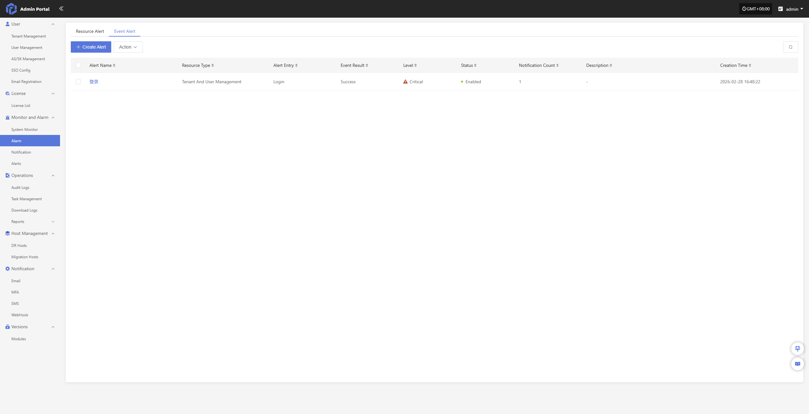
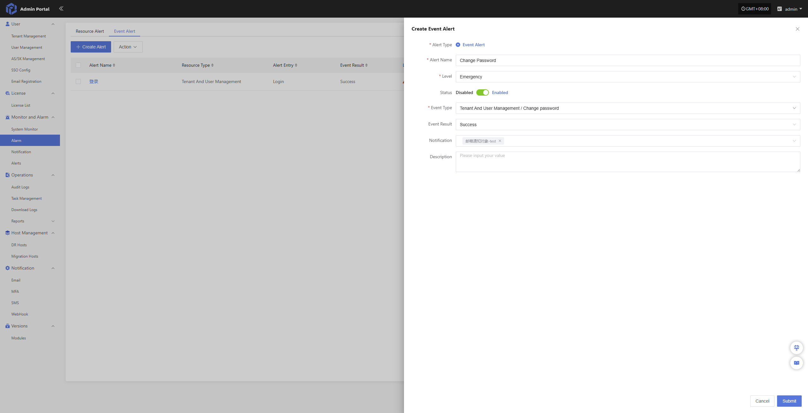
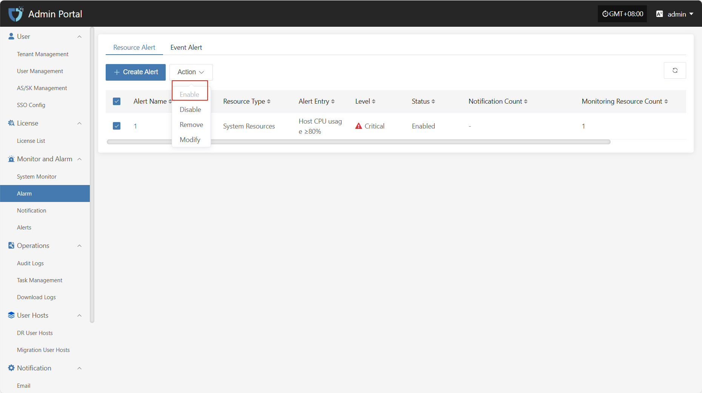
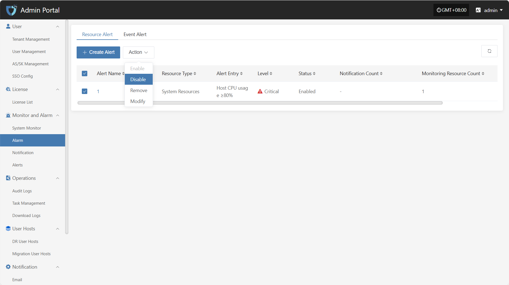
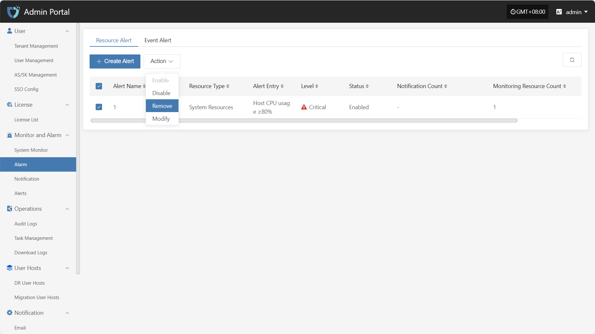
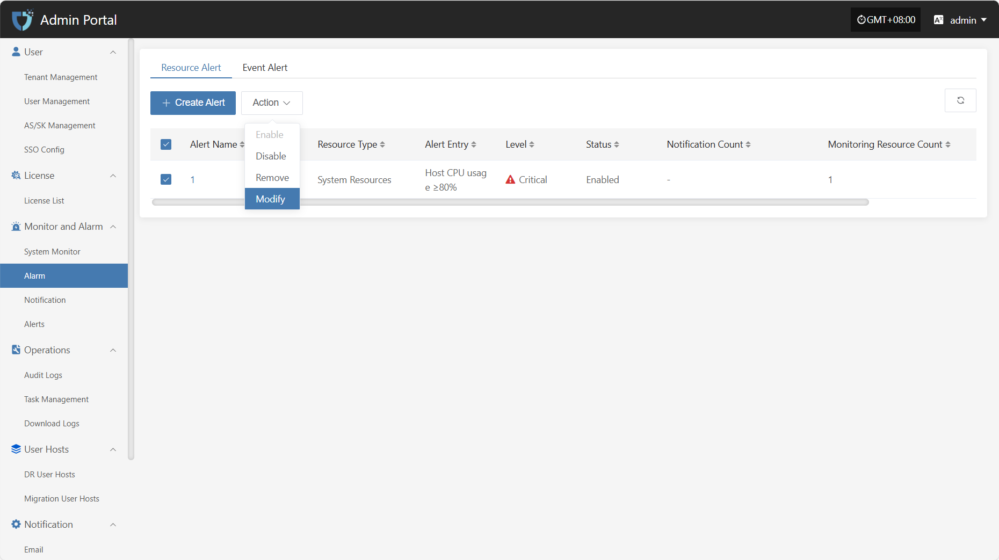

# **Alarm**

The "Alarm" module is used to centrally manage all types of alert events triggered in the system. By monitoring abnormal behaviors, resource status, or system failures in real time, the alarm can immediately trigger notifications to help O&M personnel quickly respond, locate, and handle issues, ensuring stable platform operation.

## **Resource Alert**

To ensure system stability and controllable resource usage, basic alarm thresholds have been set for key resources such as CPU, memory, and disk. When resource usage exceeds the preset warning value, the system will automatically trigger an alarm notification, allowing O&M personnel to respond and handle it in time to avoid resource bottlenecks affecting business operations.

| Resource Type | Alarm Metric                | Alarm Rule                | Alarm Level | Note |
|:-------------:|:--------------------------:|:-------------------------:|:-----------:|:----:|
| Host          | CPU Usage                  | ≥ 80%, sustained for 5 min| Critical    |      |
| Host          | Memory Usage Percentage    | ≥ 80%, sustained for 5 min| Critical    |      |
| Host          | Root Disk Usage Percentage | ≥ 80%, sustained for 5 min| Critical    |      |
| Host          | Number of Unhealthy Containers | ≥ 1, sustained for 5 min | Critical    |      |
| RabbitMQ      | Queue Message Count        | ≥ 10, sustained for 5 min | Critical    |      |

### **Resource Alert**

#### **Configuration Example: CPU Resource Alarm**

  * Click in sequence: Monitor and Alarm -- Alarm -- Resource Alert -- Create Alert

  * Fill in the corresponding level name as needed, and clarify the monitoring scope according to the table above

## **Event Alert**

To ensure the security and observability of system operations, event monitoring strategies have been set for key operational behaviors and abnormal states of DR hosts. When events such as host disconnection, sync failure, or startup exception are detected, the system will automatically record and trigger alarm notifications to help O&M personnel quickly locate and handle issues, reducing the impact of potential risks on business. Some monitorable events are as follows.

| Monitored Resource | Event Type   | Event Result | Alarm Level | Note |
|:------------------:|:------------:|:------------:|:-----------:|:----:|
| Event              | Host Disconnected | Success   | Critical    |      |
| Event              | Sync Host         | Failure   | Critical    |      |
| Event              | Boot Host        | Failure   | Critical    |      |

### **Event Alert**

#### **Configuration Example: Sync Data Failure Alarm**

  * Click in sequence: Monitor and Alarm -- Alarm -- Event Alert -- Create Alert

  * Select and fill in the corresponding monitored event type as needed

  * Specify the event result type

## **Action**

### **Enable**

Click the "Enable" button to activate a disabled alarm.

### **Disable**

Click the "Disable" button to disable an enabled alarm.

### **Remove**

Click the "Remove" button to delete the alarm.

### **Modify**

After selecting the alarm to operate in the list, click "Modify" to edit part of the authentication information.

