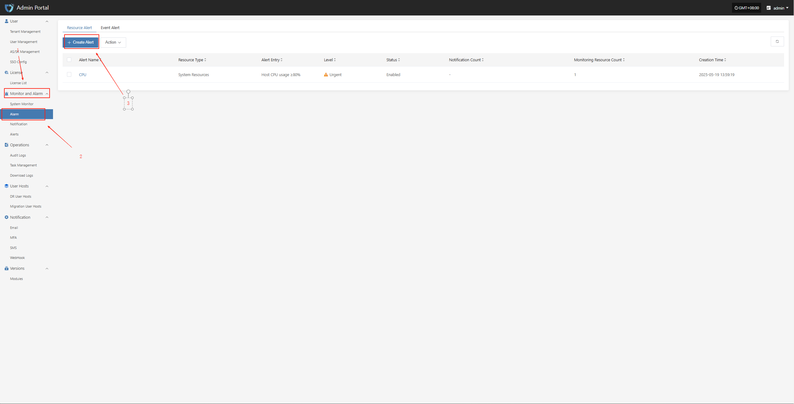
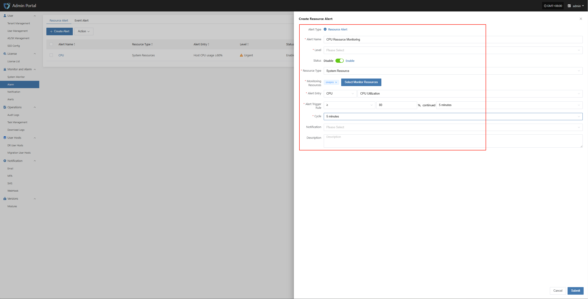
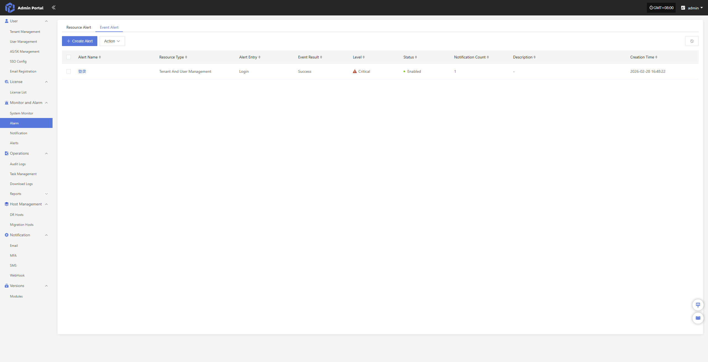
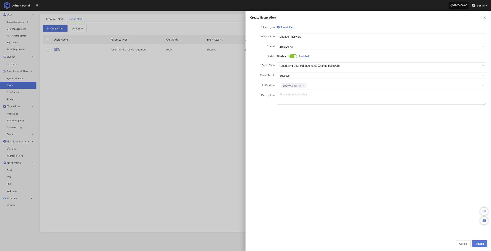
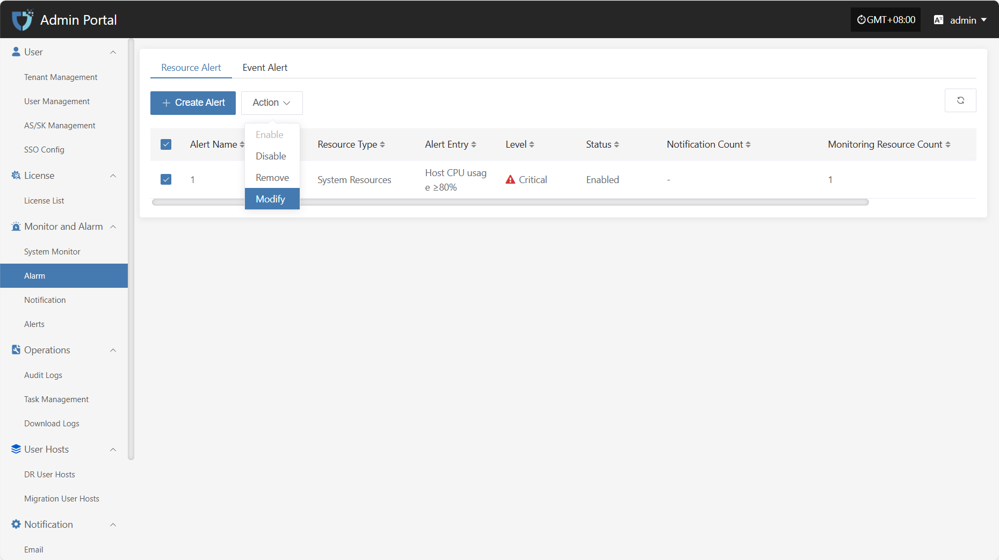
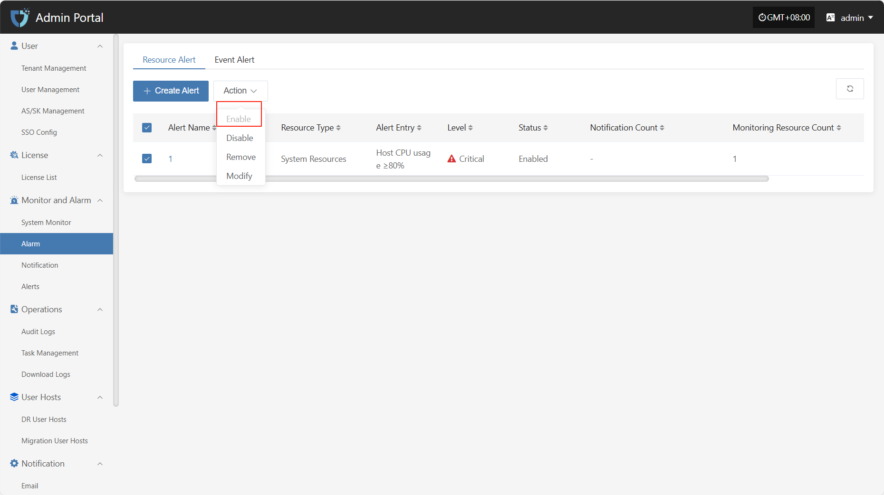
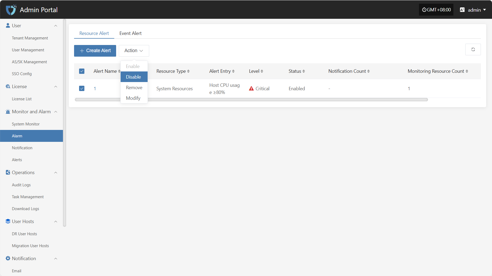
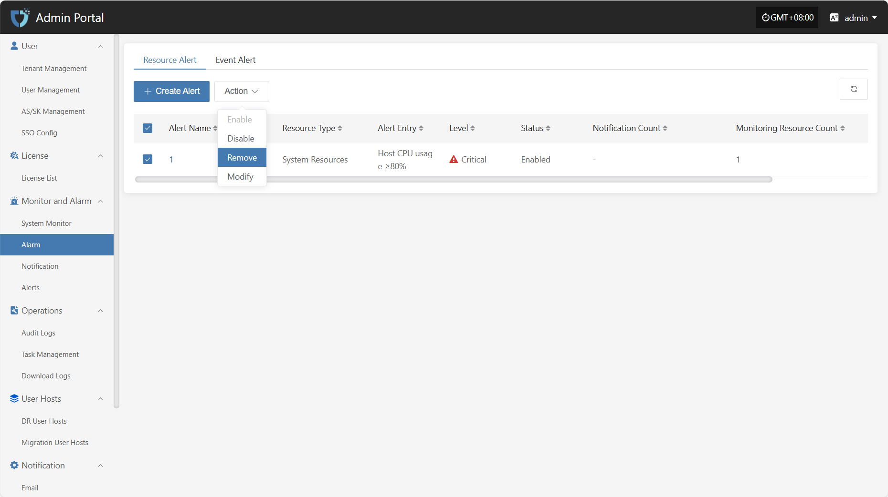

# **Alarm**

The "Alarm" module is used to centrally manage all types of alert events triggered in the system. By monitoring abnormal behaviors, resource status, or system failures in real time, the alarm can immediately trigger notifications to help O&M personnel quickly respond, locate, and handle issues, ensuring stable platform operation.

## **Resource Alert**

To ensure system stability and controllable resource usage, basic alarm thresholds have been set for key resources such as CPU, memory, and disk. When resource usage exceeds the preset warning value, the system will automatically trigger an alarm notification, allowing O&M personnel to respond and handle it in time to avoid resource bottlenecks affecting business operations.

| Resource Type | Alarm Metric                | Alarm Rule                | Alarm Level | Note |
|:-------------:|:--------------------------:|:-------------------------:|:-----------:|:----:|
| Host          | CPU Usage                  | ≥ 80%, sustained for 5 min| Critical    |      |
| Host          | Memory Usage Percentage    | ≥ 80%, sustained for 5 min| Critical    |      |
| Host          | Root Disk Usage Percentage | ≥ 80%, sustained for 5 min| Critical    |      |
| Host          | Number of Unhealthy Containers | ≥ 1, sustained for 5 min | Critical    |      |
| RabbitMQ      | Queue Message Count        | ≥ 10, sustained for 5 min | Critical    |      |

### **Create Resource Alert**

#### **Configuration Example: CPU Resource Alert**

  * Click in sequence: Monitor and Alarm -- Alarm -- Resource Alert -- Create Resource Alert

- Configuration Details

| **Field**            | **Example**                                 | **Description**                                                                                                                                                 |
| -------------------- | ------------------------------------------- | --------------------------------------------------------------------------------------------------------------------------------------------------------------- |
| Alert Type           | Resource Alert                              | The category this alert belongs to.                                                                                                                             |
| Alert Name           | HyperBDR-host-CPU                           | A unique name for the alert, used to distinguish it from other alert rules.                                                                                     |
| Level                | Critical                                    | The severity level once the alert is triggered, such as Info, Major, or Critical.                                                                               |
| Status               | Enabled                                     | Whether the alert is currently active. Once enabled, it monitors and triggers alerts based on the configured rules.                                             |
| Resource Type        | System Resource                             | The category of the resource being monitored.                                                                                                                   |
| Monitoring Resources | HyperBDR                                    | Supports three resource types: host, RabbitMQ, and MariaDB. Admins can switch between resource types as needed and select the corresponding monitoring targets. |
| Alert Entry          | CPU Usage                                   | The specific metric being monitored, such as CPU usage or memory usage.                                                                                         |
| Alert Trigger Rule   | > 80% for 5 minutes                         | Defines when the alert is triggered, for example when a metric exceeds a threshold for a certain period of time.                                                |
| Cycle                | 5 minutes                                   | The monitoring frequency or evaluation interval for the metric.                                                                                                 |
| Notification         | Email Notification Object - test            | The recipient of the alert notification, which can be email, SMS, or another notification group.                                                                |
| Description          | Sample configuration for CPU resource alert | Additional notes about the purpose or setup of this alert.                                                                                                      |

> Fill in the appropriate severity level based on your actual needs, and define the monitoring scope according to the table above.

## **Event Alert**

To keep the system secure and fully observable, you can set up event alerts for critical management actions—like changes to tenant user permissions, AK/SK credential security, or alert policy updates. This helps build a complete visibility framework from action auditing to anomaly response, making sure your operations stay compliant and the system runs smoothly and reliably.

| **Monitored Resource** | **Event Type**  | **Event Result** | **Alert Level** |
| ---------------------- | --------------- | ---------------- | --------------- |
| Event                  | Password Change | Success          | Major           |
| Event                  | Delete Tenant   | Success          | Major           |
| Event                  | Login           | Failure          | Major           |

### **Create Event Alert**

#### **Configuration Example：Password Change Event Alert**

Click in sequence: Monitor and Alarm -- Alarm -- Event Alert -- Create Event Alert

- Configuration Details

| **Field**    | **Example**                                                 | **Description**                                                                                                      |
| ------------ | ----------------------------------------------------------- | -------------------------------------------------------------------------------------------------------------------- |
| Alert Type   | Event Alert                                                 | The category this alert belongs to.                                                                                  |
| Alert Name   | Password Change                                             | A unique name for the alert, used to distinguish it from other alert rules.                                          |
| Level        | Major                                                       | The severity level once the alert is triggered, such as Info, Major, or Critical.                                    |
| Status       | Enabled                                                     | Whether the alert is currently active. Once enabled, it will trigger when the conditions are met.                    |
| Event Type   | Password Change                                             | The specific type of event being monitored, such as login, password change, or permission updates.                   |
| Event Result | Success                                                     | The result condition for the event, such as success or failure. The alert will only trigger when this result is met. |
| Notification | Email Notification Object - test                            | The recipient of the alert notification, which can be email, SMS, or another notification group.                     |
| Description  | Sample configuration for a successful password change alert | Additional notes about the purpose or setup of this alert.                                                           |

> Select the appropriate event type to monitor based on your actual needs.

## **Action**

### **Modify**

After selecting the alarm to operate in the list, click "Modify" to edit part of the authentication information.

### **Enable**

Click the "Enable" button to activate a disabled alarm.

### **Disable**

Click the "Disable" button to disable an enabled alarm.

### **Remove**

Click the "Remove" button to delete the alarm.

