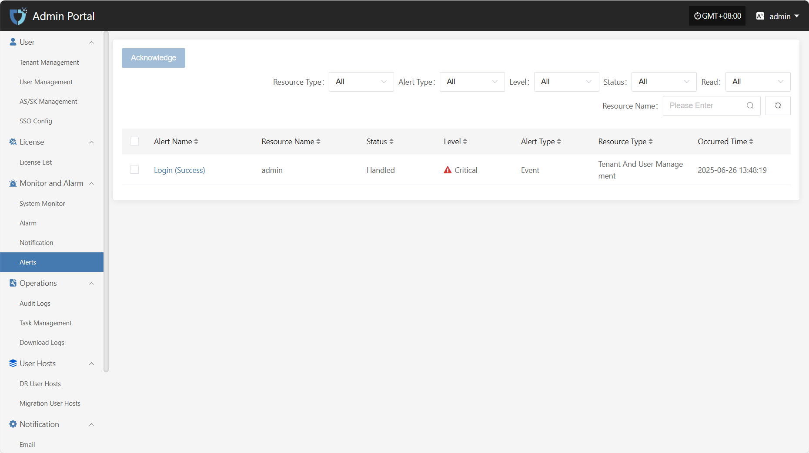
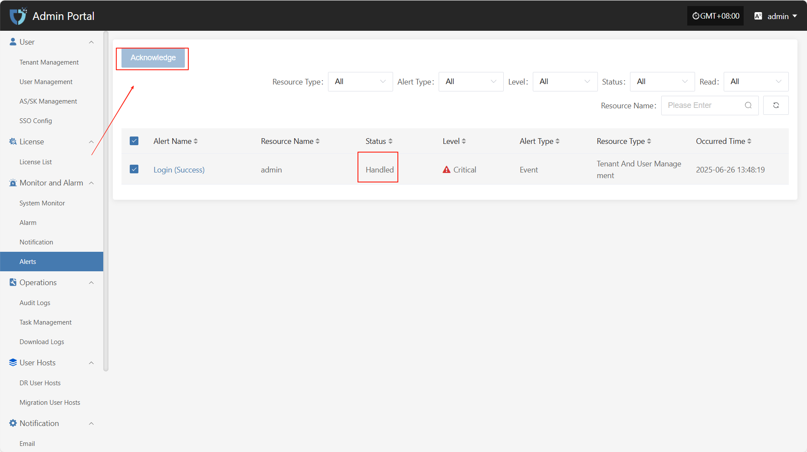

# **Alerts**

The "Alerts" module is used to centrally display various alert messages triggered by the alarm system, helping users quickly understand abnormal events that occur during system operation. This module only provides visual display of alert results. Through a unified alert message view, users can clearly see the alert level, source, content, and handling status, making it easy to respond promptly and for later auditing.

At the top of the "Alert Messages" page, you can filter alert records by multiple criteria such as Resource Type, Alert Type, and Level, making it easy for users to efficiently search and manage alerts.

After selecting the corresponding alert message, click the "Acknowledge" button in the upper right corner to change its handling status for easier management and tracking.

