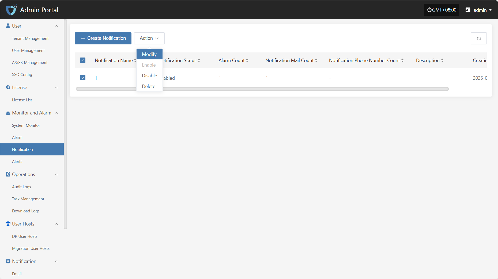
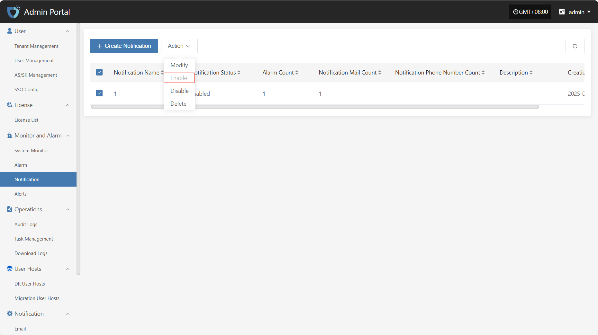
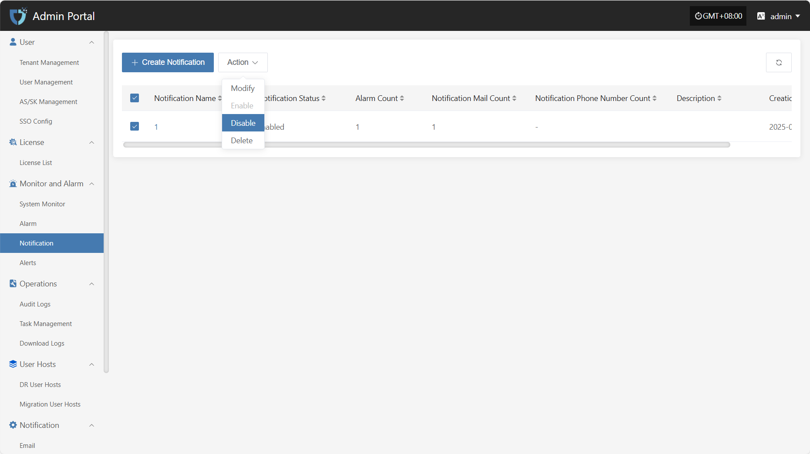
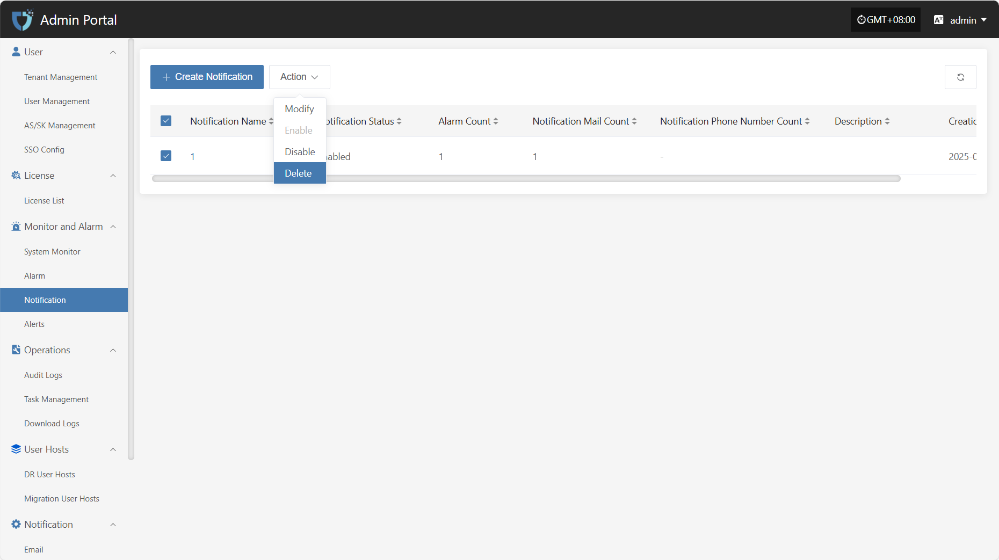

# Notification

The "Notification" module is used to define target users who receive alert notifications or system messages. By configuring notification objects, administrators can push alert information, event notifications, or other important messages to designated personnel to ensure timely response and handling.

## **Create Notification**

Click the "Create Notification" button in the upper left corner to start creating a notification object.

* Authentication Information Description

| **Setting**           | **Example Value** | **Description**                                                                                                   |
| --------------------- | ---------------- | ----------------------------------------------------------------------------------------------------------------- |
| **Notification Name** | Operations Team  | Custom name for the notification target object. It is recommended to use an identifiable field for easy management.|
| **Description**       | Responsible for system monitoring and maintenance | Briefly describe the function or responsibility of this notification object to help understand its purpose.        |
| **Status**            | Enable / Disable | Set the status of the notification object. When enabled, it will receive related notifications; when disabled, it will not receive any notifications. |
| **Alarm**             | Select alarm name| Select the alarm associated with this notification object. You can create alarms [View here](../monitor/alarm.md#configuration-example-cpu-resource-alarm) |
| **Sending Channel**   | xxx@163.com      | Set the sending method for this notification object. You can choose email notification. If no sending channel is configured, click the link to view the configuration [View here](../notification/email.html#email-1) |
| **Email**             | ops@example.com  | Configure the email address to receive notifications. Suitable for objects receiving notifications by email. Multiple addresses can be configured. |

After completing the authentication information configuration, click the "Submit" button at the bottom right of the page. The system will create the notification object and save the related settings.

## **Action**

### **Modify**

After selecting the notification object to operate in the list, click "Modify" to edit part of the authentication information.

### **Enable**

Click the "Enable" button to activate a disabled notification object.

### **Disable**

Click the "Disable" button to disable an enabled notification object.

### **Delete**

Click the "Delete" button to remove the notification object.

