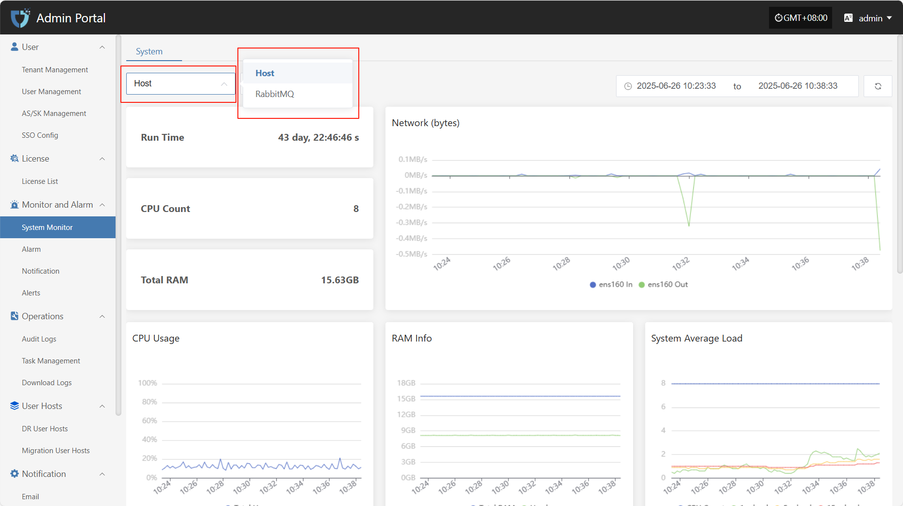
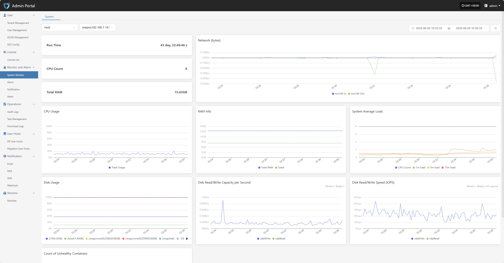

# **System Monitor**

The "System Monitor" module uses charts to display the real-time status and performance metrics of key platform components, helping administrators fully understand system health, quickly identify potential issues, and ensure stable and efficient platform operation.

Users can click the resource type dropdown list in the upper left corner to switch between monitoring information for hosts, RabbitMQ, and other resources.

## **Host**

**Host monitoring** displays the resource usage of selected hosts in real time, including key performance metrics such as CPU, memory, and disk, helping administrators keep track of system load.

* The related monitoring items are as follows

| **Metric**      | **Description**                                 |
| --------------- | ---------------------------------------------- |
| Run Time        | The total running time since the system or core component was started. |
| CPU Count       | Number of available physical/logical CPU cores in the system. |
| Total RAM       | Total available physical memory detected by the system. |
| Network (bytes) | Total amount of data sent and received by network interfaces, in bytes. |
| CPU Usage       | Current CPU usage percentage, reflecting system load. |
| RAM Info        | Detailed memory usage, including used, available, and cached memory. |
| System Average Load | Shows the average process load over the past 1, 5, and 15 minutes, reflecting overall processing capability. |
| Disk Usage      | Current disk space usage, counted by mount point, usually shown as a percentage. |
| Disk Read/Write Capacity per Second | Amount of data written to and read from disk per second, in MB/s or KB/s. |
| Disk Read/Write Speed (IOPS) | Number of disk read/write operations per second (I/O ops/sec), used to assess disk performance. |
| Count of Unhealthy Containers | Number of containers currently in abnormal or non-running states, used to monitor the health of platform containers. |

## **RabbitMQ**

**RabbitMQ monitoring** tracks metrics such as RabbitMQ name, version, and queue message count for the message queue service, ensuring stable task scheduling and message communication on the platform.

* The related monitoring items are as follows

| **Field Name**        | **Description**                           |
| --------------------- | ----------------------------------------- |
| RabbitMQ Name         | Displays the name and identifier of the monitored RabbitMQ node. |
| RabbitMQ Version      | The version number of the currently running RabbitMQ service. |
| Message Count in RabbitMQ Queues | The total number of pending messages in all queues on the current node, used to assess message backlog. |
