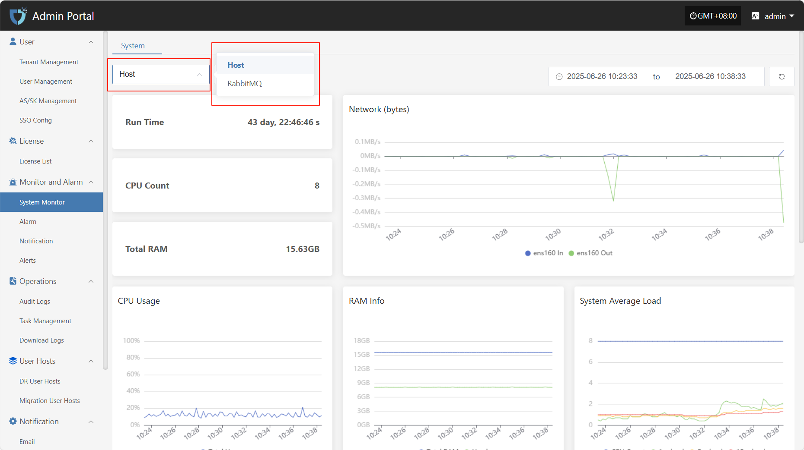
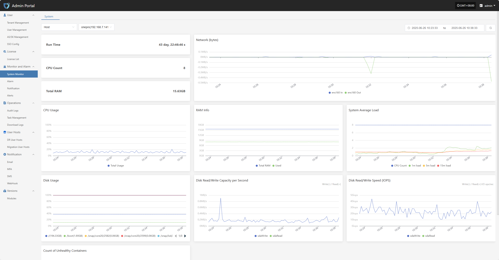
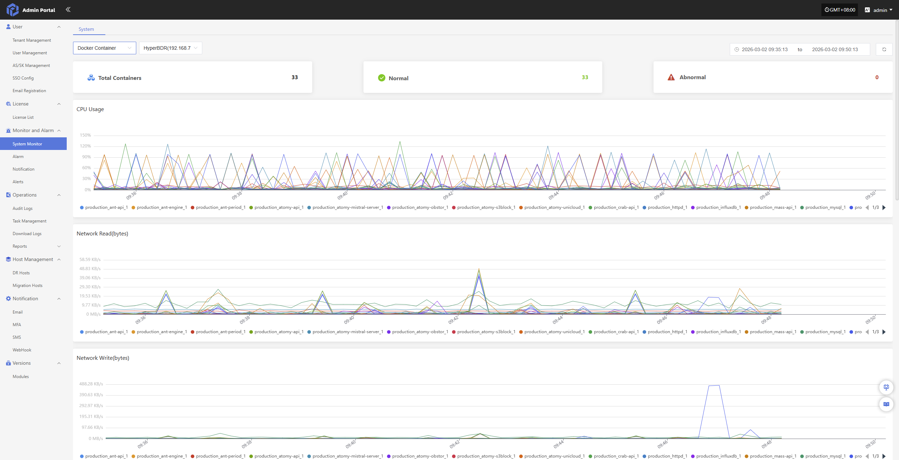
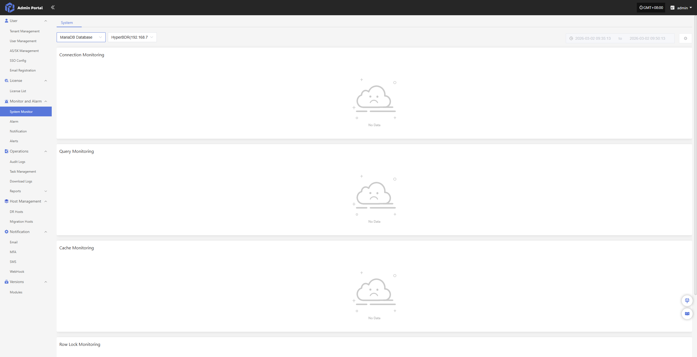

# **System Monitor**

The "System Monitor" module uses charts to display the real-time status and performance metrics of key platform components, helping administrators fully understand system health, quickly identify potential issues, and ensure stable and efficient platform operation.

Users can click the resource type dropdown list in the upper left corner to switch between monitoring information for hosts, RabbitMQ, and other resources.

## **Host**

**Host monitoring** displays the resource usage of selected hosts in real time, including key performance metrics such as CPU, memory, and disk, helping administrators keep track of system load.

* The related monitoring items are as follows

| **Metric**      | **Description**                                 |
| --------------- | ---------------------------------------------- |
| Run Time        | The total running time since the system or core component was started. |
| CPU Count       | Number of available physical/logical CPU cores in the system. |
| Total RAM       | Total available physical memory detected by the system. |
| Network (bytes) | Total amount of data sent and received by network interfaces, in bytes. |
| CPU Usage       | Current CPU usage percentage, reflecting system load. |
| RAM Info        | Detailed memory usage, including used, available, and cached memory. |
| System Average Load | Shows the average process load over the past 1, 5, and 15 minutes, reflecting overall processing capability. |
| Disk Usage      | Current disk space usage, counted by mount point, usually shown as a percentage. |
| Disk Read/Write Capacity per Second | Amount of data written to and read from disk per second, in MB/s or KB/s. |
| Disk Read/Write Speed (IOPS) | Number of disk read/write operations per second (I/O ops/sec), used to assess disk performance. |
| Count of Unhealthy Containers | Number of containers currently in abnormal or non-running states, used to monitor the health of platform containers. |

## **RabbitMQ**

**RabbitMQ monitoring** tracks metrics such as RabbitMQ name, version, and queue message count for the message queue service, ensuring stable task scheduling and message communication on the platform.

* The related monitoring items are as follows

| **Field Name**        | **Description**                           |
| --------------------- | ----------------------------------------- |
| RabbitMQ Name         | Displays the name and identifier of the monitored RabbitMQ node. |
| RabbitMQ Version      | The version number of the currently running RabbitMQ service. |
| Message Count in RabbitMQ Queues | The total number of pending messages in all queues on the current node, used to assess message backlog. |

## **Docker Container** 

The **Docker Container** monitoring page gives you real-time visibility into your containerized production environment, helping admins keep a close eye on cluster health, resource usage, and network traffic—so everything runs smoothly and efficiently.

- Relevant monitoring items are as follows:

| **Monitoring Item**   | **Description**                                                                  |
| --------------------- | -------------------------------------------------------------------------------- |
| Total Containers      | Total number of container instances currently running in the system.             |
| Normal                | Number of containers that are healthy and running normally.                      |
| Abnormal              | Number of containers in an abnormal state (e.g., stopped, failed, unresponsive). |
| CPU Usage             | Percentage of CPU resources used by the container or the system overall.         |
| Network Read (bytes)  | Total amount of data received from the network per unit of time (in bytes).      |
| Network Write (bytes) | Total amount of data sent to the network per unit of time (in bytes).            |
| RAM Info              | Current memory usage, including used and available memory.                       |
| Disk Read (iops)      | Number of disk read operations per unit of time (I/O operations per second).     |
| Disk Write (iops)     | Number of disk write operations per unit of time (I/O operations per second).    |
| Disk Read (bytes)     | Total amount of data read from disk per unit of time (in bytes).                 |
| Disk Write (bytes)    | Total amount of data written to disk per unit of time (in bytes).                |

## **MariaDB Database**

The **MariaDB Database** monitoring feature gives you real-time insights into your database server’s performance. By closely tracking key metrics like connections, query load, and system cache, it helps admins evaluate performance and make sure data access stays stable and responsive.

- Relevant monitoring items are as follows:

| **Monitoring Item**   | **Description**                                                                                                                                                    |
| --------------------- | ------------------------------------------------------------------------------------------------------------------------------------------------------------------ |
| Connection Monitoring | Tracks current and active database connections and their usage, helping identify whether connection resources are sufficient or if there are abnormal connections. |
| Query Monitoring      | Monitors database query execution, including query count, duration, and slow queries, to analyze performance bottlenecks.                                          |
| Cache Monitoring      | Monitors database cache usage, such as cache hit rate and occupancy, to evaluate cache efficiency.                                                                 |
| Row Lock Monitoring   | Tracks row-level locks, including lock waits and conflicts, to troubleshoot concurrency and transaction blocking issues.                                           |