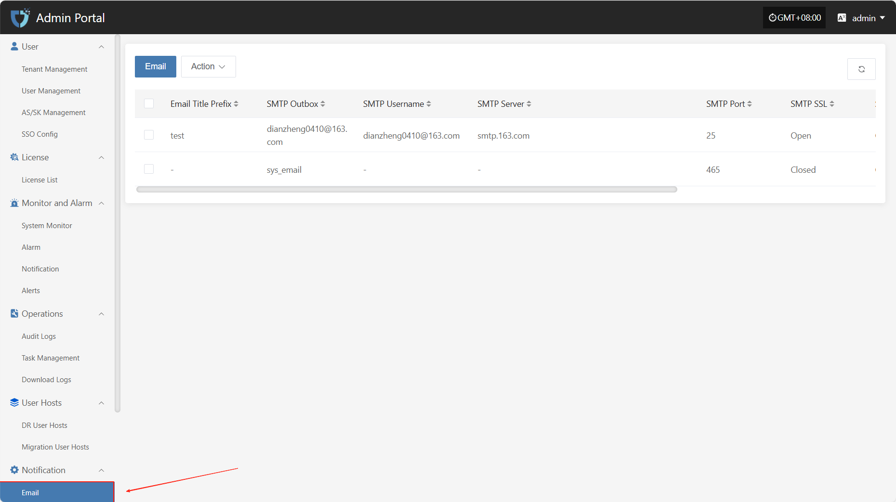
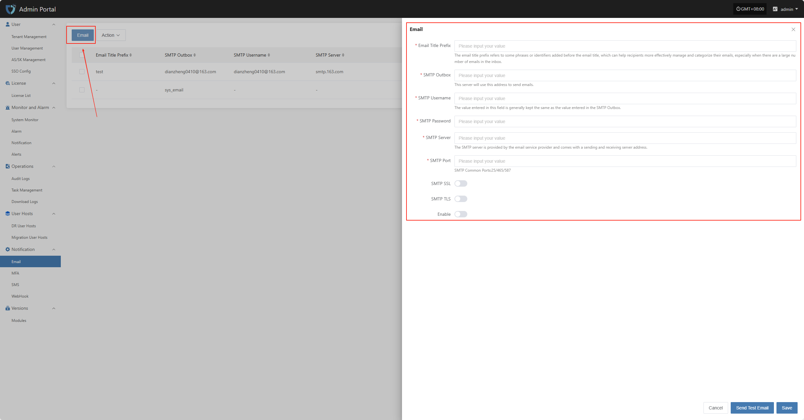
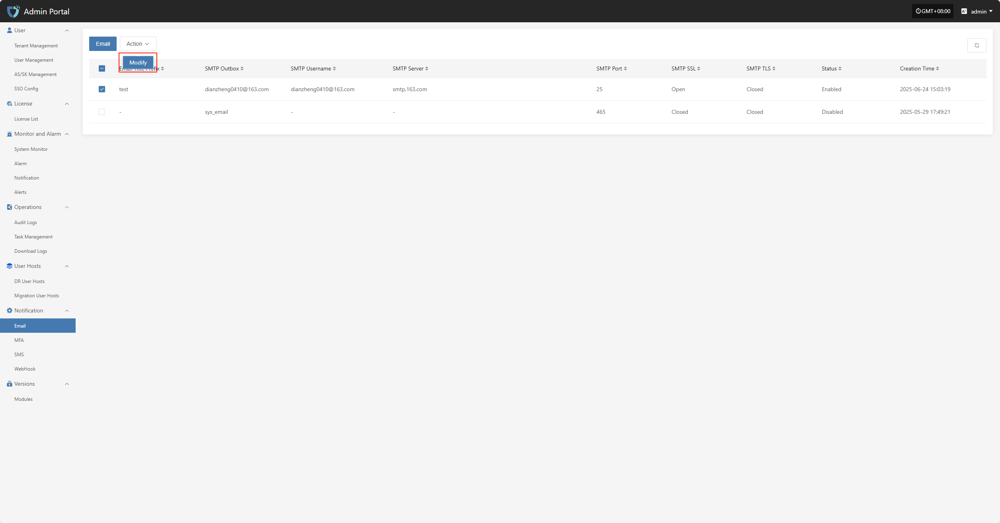

# **Email**

The "Email Configuration" module is used to set parameters related to system email notifications. By configuring the SMTP server address, port, sender email, and authentication information, the system can send email notifications for alerts, task status, system events, etc., ensuring timely and reliable notifications and helping users stay informed about system status in real time.

In the left navigation bar, click **"Notification"**, then select **"Email"** to enter the email notification settings page.

## **Email**

Click the "Email" button in the upper left corner to start setting up email authentication information.

* Authentication Information Description

| **Configuration Item**  | **Example Value**                           | **Description**                                                                            |
| -------- | --------------------------------- | --------------------------------------------------------------------------------- |
| Email Title Prefix   | HyperBDR                          | The email title prefix refers to some phrases or identifiers added before the email title, which can help recipients more effectively manage and categorize their emails, especially when there are a large number of emails in the inbox.             |
| SMTP Outbox | no-reply@oneprocloud.com        | This server will use this address to send emails.                                                           |
| SMTP Username | no-reply@oneprocloud.com        | The value entered in this field is generally kept the same as the value entered in the SMTP Outbox.                                                       |
| SMTP Password  | \*\*\*\*\*\*\*\*                  | The password required for SMTP server authentication (obtain from the email service provider).                                          |
| SMTP Server | smtp.qq.com | The SMTP server is provided by the email service provider and comes with a sending and receiving server address. |
| SMTP Port  | 465                               | The port number used for SMTP communication. Common ports include 25 (unencrypted), 465 (SSL), 587 (TLS).                                     |
| SMTP SSL | Enable                                | Whether to enable SSL encryption. If enabled, emails will be sent via SSL for improved security.                                              |
| SMTP TLS | Disable                               | Whether to enable TLS encryption. Some SMTP services require this option to be enabled.                                                        |
| Enable     | Enable                                | Whether to enable the current email configuration. If enabled, the system will use this configuration to send notification emails; if disabled, notifications will not be sent via email.                                    |

After filling in the authentication information, you can click the **"Send Test Email"** button below to verify if email sending works properly. After the test passes, click the **"Save"** button in the lower right corner to complete the email configuration.

> **Note:** After clicking **"Cancel"**, all unsaved email authentication information will be cleared. Please make sure to save before leaving the page.

## **Action**

### **Modify**

Click "Modify" to edit the authentication information.

