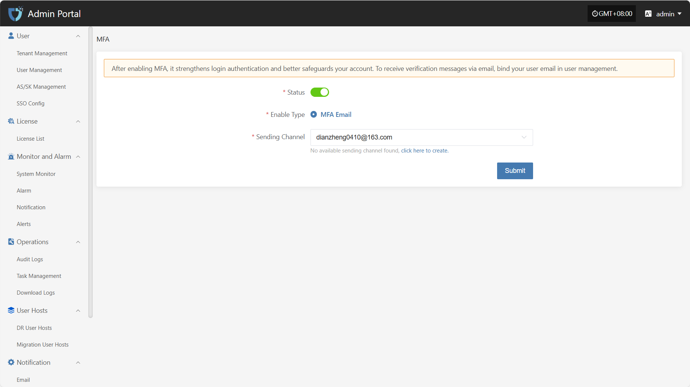

# MFA

The "MFA" module is used to enable and manage Multi-Factor Authentication, enhancing the security of system accounts. By configuring MFA, users need to enter a dynamic verification code in addition to their username and password when logging in, effectively preventing account theft or unauthorized access.

After enabling MFA, it strengthens login authentication and better safeguards your account. To receive verification messages via email, bind your user email in user management.

> **Note:** After enabling MFA, please make sure users have correctly bound their email addresses, otherwise they will not be able to log in to the system.

Click **"Notification"** in the left navigation bar, then select **"MFA"** to enter the MFA settings page.

* Configuration Instructions

| Setting        | Example Value      | Description                                                                 |
| -------------- | ----------------- | --------------------------------------------------------------------------- |
| Status         | Yes / No          | Use the button on the page to enable or disable MFA. When enabled, users must complete identity verification with an email code when logging in. |
| Enable Type    | MFA Email         | Supported verification type. The system currently supports MFA via email.   |
| Sending Channel| 163\*\*@163.com   | Specify the email account used to send verification codes. If no available channel is found, please go to the "Email Configuration" module to add and enable a sender email. |

After completing all configuration items, click the **"Submit"** button at the bottom right of the page to save the current MFA settings.
