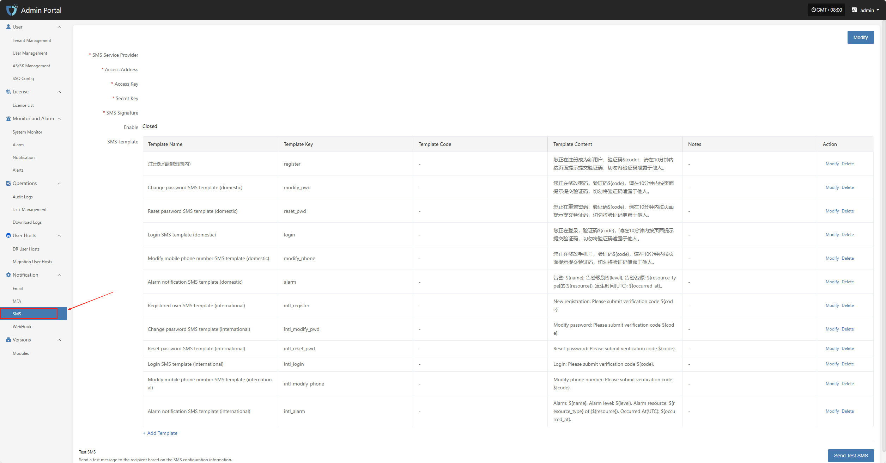
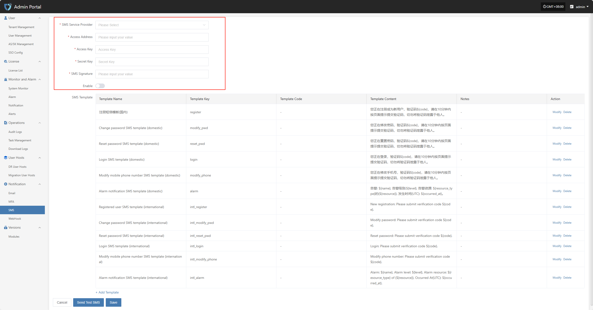
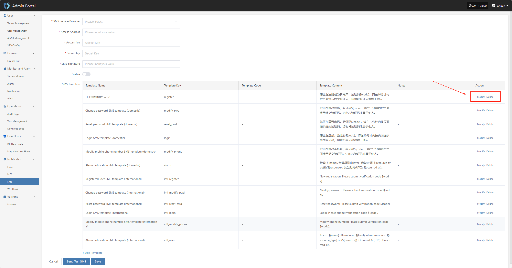
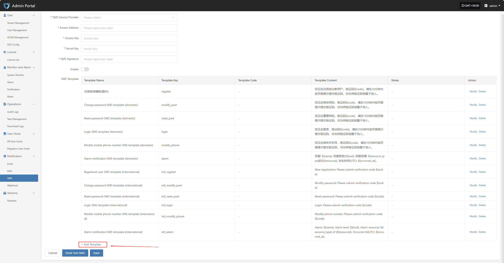

# **SMS**

The "SMS" module is used to set up the system's SMS notification sending channel. By connecting to an SMS service provider platform and configuring the required access keys, signatures, templates, and other information, the system can send SMS notifications for login verification, alert notifications, task status, and more. This feature helps users receive key system events promptly, improving system response efficiency and security.

Click **"Notification"** in the left navigation bar, then select **"SMS"** to enter the SMS notification settings page.

## **Modify**

Click the "Modify" button in the upper right corner to start setting up SMS authentication information.

* Configuration Instructions

| **Setting**    | **Example Value**                         | **Description**                                  |
| -------------- | ----------------------------------------- | ------------------------------------------------ |
| SMS Service Provider      | Alibaba Cloud                                 | Select the SMS service provider to connect with the system. Make sure you have enabled SMS service and obtained the necessary credentials from the provider. |
| Access Address       | https://dysmsapi.aliyuncs.com           | The SMS API endpoint provided by the service provider. The address may vary by provider.          |
| Access Key | AKIDEXAMPL\*\*\*\*\*\*\*\*\*\*\*\*\*    | Access Key ID for authentication, provided by the SMS service provider.    |
| Secret Key | wJalrXUtnFE\*\*\*\*\*\*\*\*\*\*\*\*\*\* | Secret Key used together with the Access Key for secure authentication. Please keep it safe.      |
| SMS Signature       | OnePro                                  | The signature registered with the SMS service platform, shown at the beginning of the SMS content.          |
| Enable       | Enable / Closed                                 | Whether to enable the current SMS configuration. When enabled, the system will send SMS notifications using this configuration. If closed, SMS will not be sent.    |

After filling in the authentication information, you can click the **"Send Test SMS"** button below to verify if SMS sending works properly. After a successful test, click the **"Save"** button at the bottom right of the page to complete the SMS configuration.

> **Note:** After clicking **"Cancel"**, all unsaved SMS authentication configuration information will be cleared. Please make sure to save before leaving the page.

### **SMS Template**

Used to configure the content template for system notification SMS. Each SMS template includes a template ID, content format, and variable parameters, which help standardize SMS notification formats and improve consistency and recognition. SMS templates must be created and approved on the SMS service provider platform before they can be used in the system.

#### **Modify/Delete**

On the template list page, click the "Modify" or "Delete" button on the right side of the corresponding template to edit or remove the SMS template.

#### **Add Template**

If the default SMS templates do not meet your business needs, you can click the "Add Template" button on the page to customize and add new SMS templates for different scenarios.

