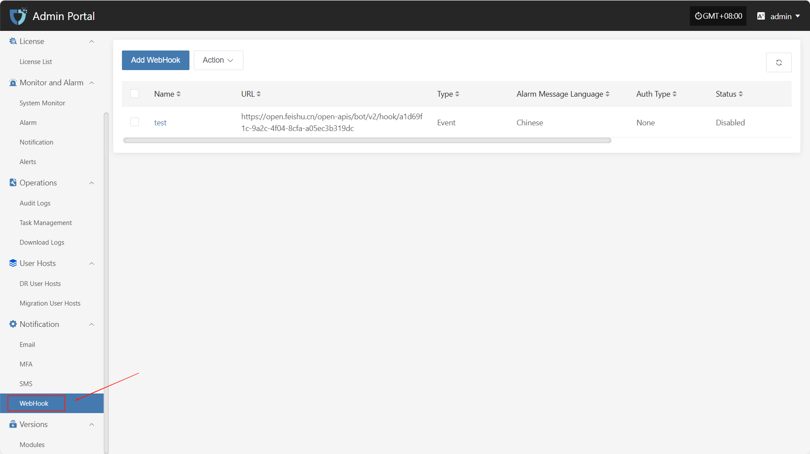
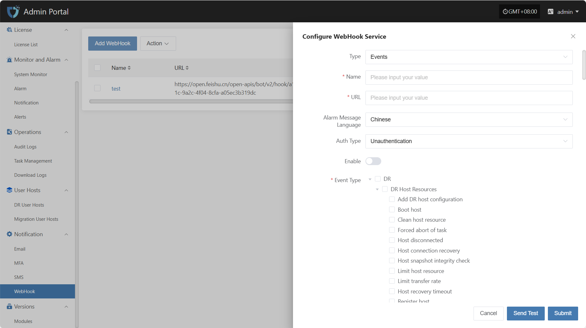
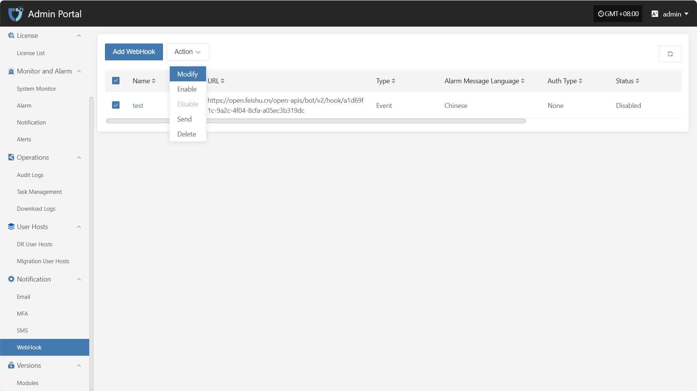
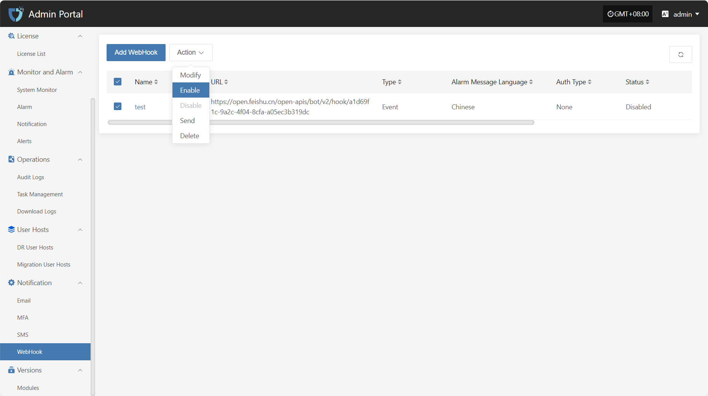
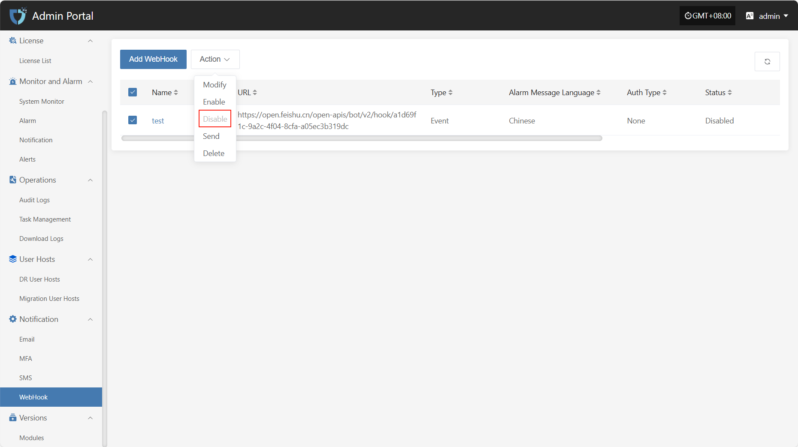
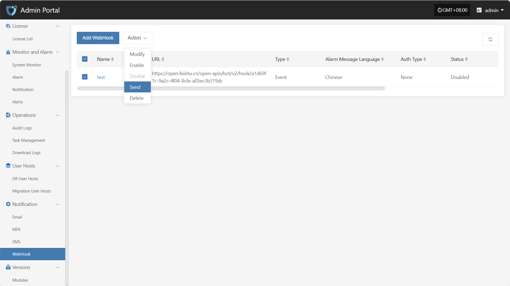
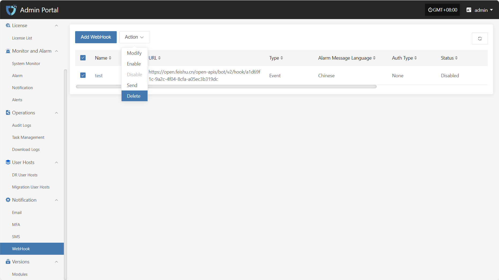

# **WebHook**

"WebHook" is used for real-time notification and data push of system events. When a specified event occurs, the system sends an HTTP request to the pre-configured URL, pushing event information to third-party services or custom applications, enabling integration and automated notifications between the system and external platforms.

Click **"Notification"** in the left navigation bar, then select **"WebHook"** to enter the WebHook notification settings page.

## Add WebHook

Click the "Add WebHook" button in the upper left corner to start setting up WebHook authentication information.

* Authentication Information Description

| **Setting** | **Example Value**                | **Description**                                  |
| ----------- | ------------------------------- | ------------------------------------------------ |
| Type        | Events / Alarms                 | The category of the Webhook, distinguishing different push purposes such as system events or alarm notifications. |
| Name        | test                            | The name used to identify this Webhook configuration for easy management and distinction. |
| URL         | https://example.com/webhook     | The target address to receive event pushes. The system will send HTTP requests to this URL. |
| Alarm Message Language  | Chinese              | The language of the push message. You can select the required language version as needed. |
| Auth Type   | Unauthentication                | Select the authentication method for the Webhook request. |
| Enable      | Enable / Disable                | Whether to enable this configuration. When enabled, the system will push notifications according to the set event types. |
| Event Type  | Host recovery timeout           | The specific event types that trigger WebHook pushes, such as host lost connection, host recovery timeout, etc. Multiple selections are supported. |

After filling in the authentication information, you can click the **"Send Test"** button below to verify if the WebHook service is working properly. After a successful test, click the **"Submit"** button at the bottom right of the page to complete the WebHook configuration.

> **Note:** After clicking **"Cancel"**, all unsaved WebHook authentication configuration information will be cleared. Please make sure to save before leaving the page.

## Action

### Modify

Click "Modify" to edit the authentication information.

### Enable

Click the "Enable" button to activate a disabled Webhook.

### Disable

Click the "Disable" button to disable an enabled Webhook.

### Send

Click the "Send" button and the system will send a test message to the configured target address to verify if the Webhook settings are correct.

### Delete

Click the "Delete" button to remove the selected configuration. This action cannot be undone, please confirm carefully.

