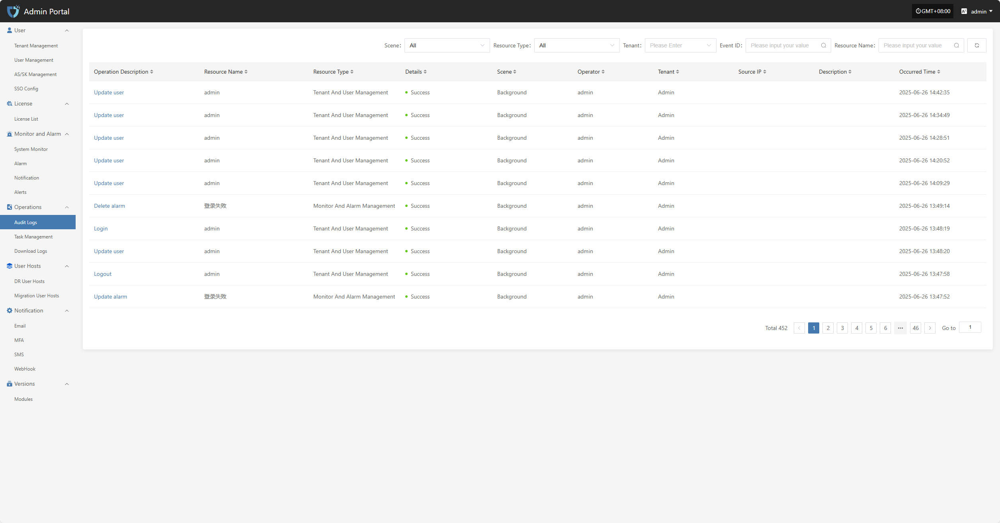
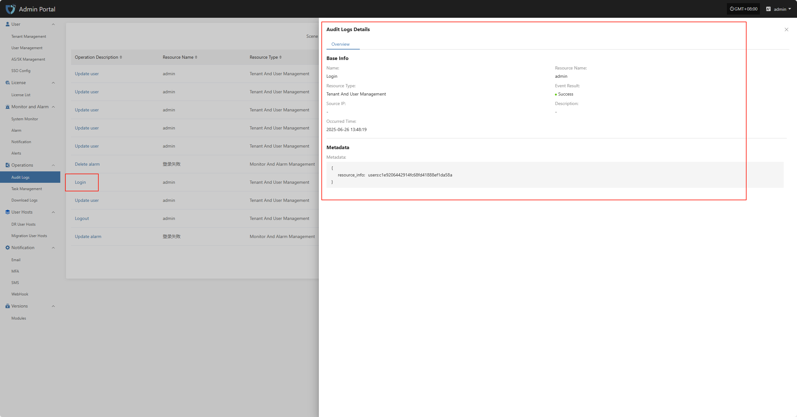

# **Audit Logs**

The "Audit Logs" module is used to record and display all important operations on the platform, providing detailed operation history. Through audit logs, administrators can track system usage, permission changes, user actions, etc., ensuring transparency and security of system operations, and making it easier for post-event review, troubleshooting, and compliance auditing.

At the top of the page, you can filter and manage audit records efficiently by scenario, resource type, tenant, and other criteria.

In the audit log list, click the "Operation Description" field of any log to view the details of that operation, including specific changes and execution parameters.

