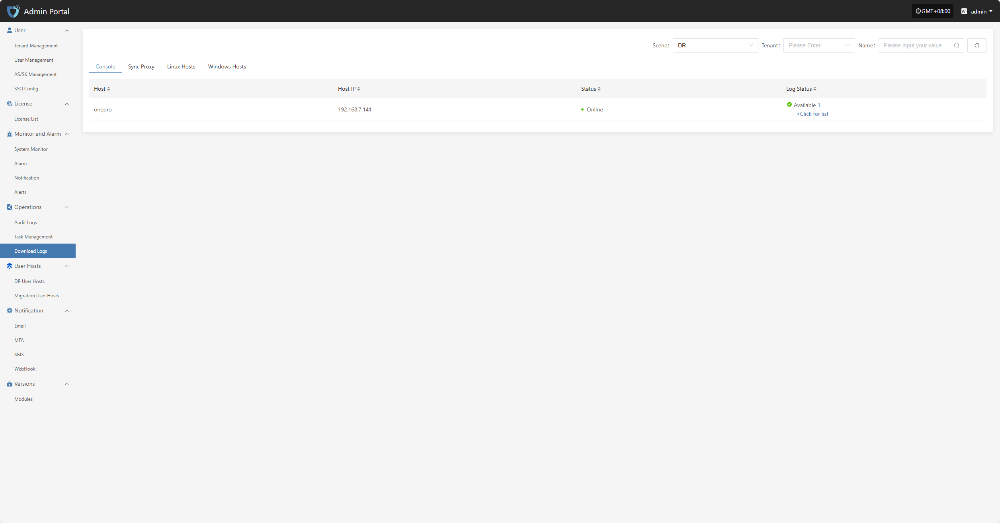
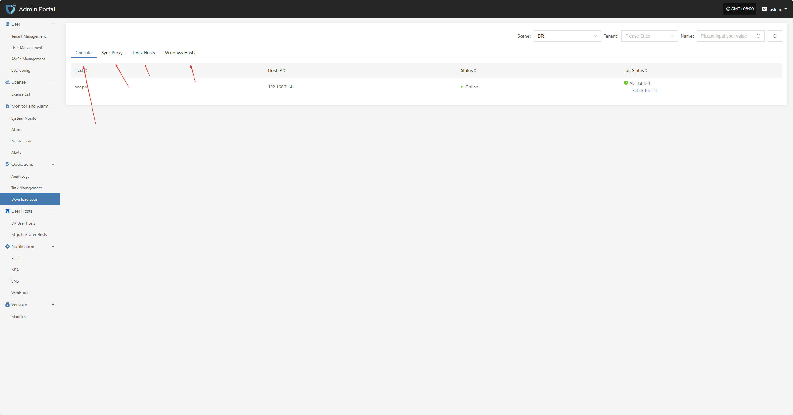
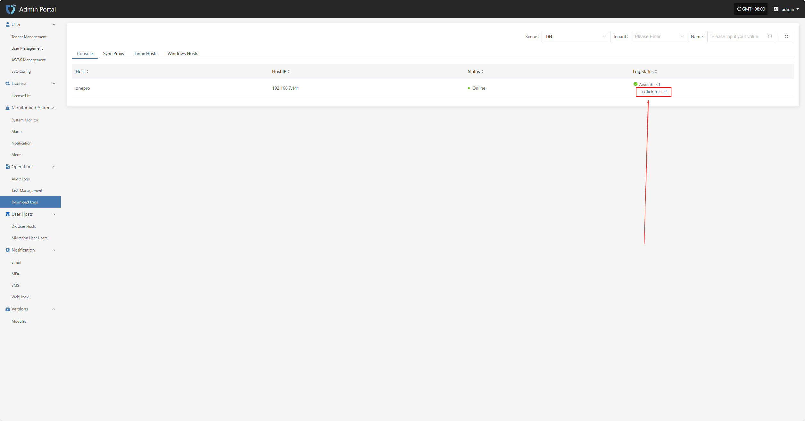
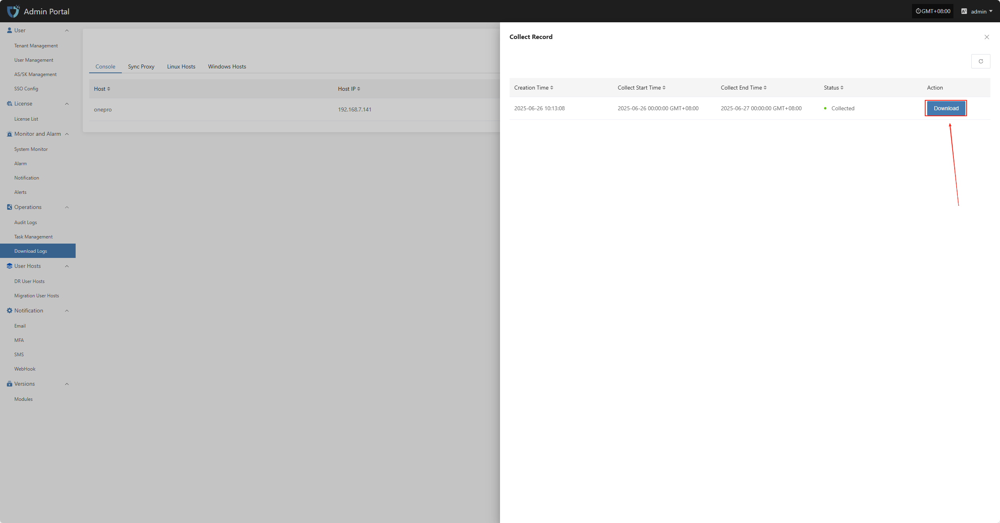

# **Download Logs**

The "Download Logs" module is used to view and manage host log information on the platform, supporting classification by host type (such as Sync Proxy, Linux host, Windows host). Users can quickly locate target hosts using the filter function, view their log status, download log files, or view log details, making troubleshooting and system auditing easier.

To make it easier to view log information for different hosts or components, the top of the page provides type tabs such as "Console", "Sync Proxy", etc. Click to switch the log list content.

## **Log Download**

Click "> Click for list" to enter the log details page, where you can view the detailed log list for the corresponding host. The system displays various log files in chronological order and supports download operations.

On the log details page, click the "Download" button for the corresponding log entry to download the log file to your local device for offline viewing and troubleshooting.

> **Note:** Log files can only be viewed or downloaded after collection is complete. If the current host has not performed log collection, please collect logs first. [View Guide](../../dr/operations/download-logs.html#collection-example-console)

