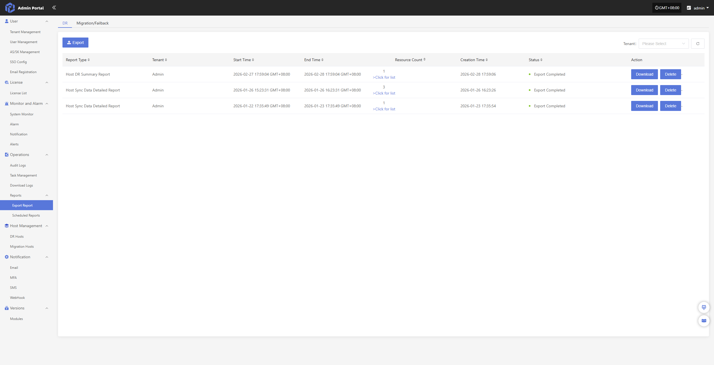
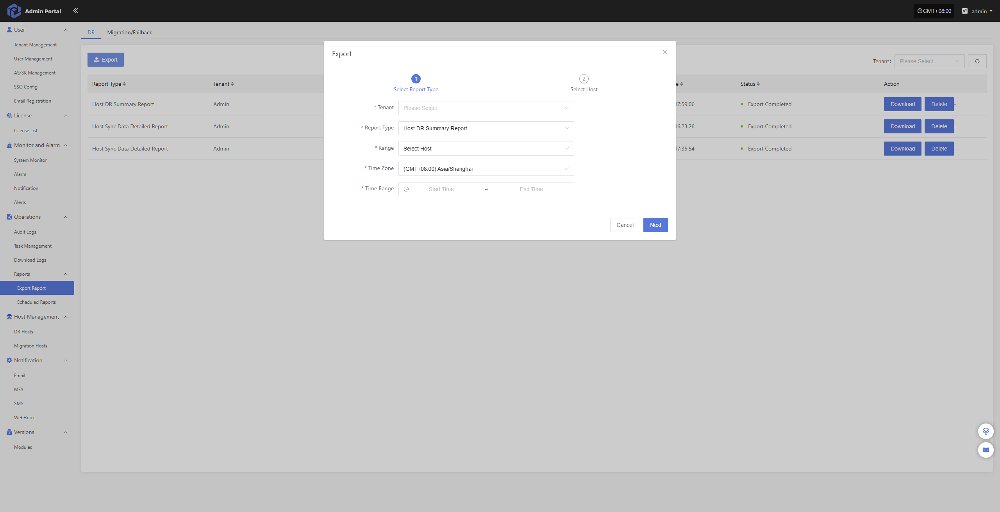
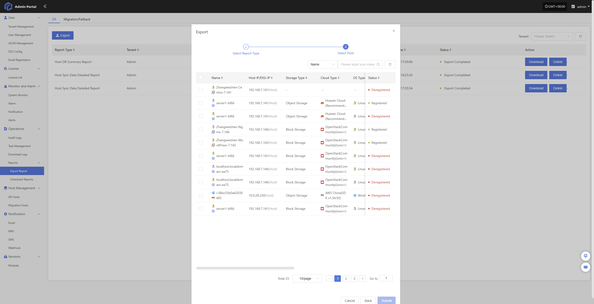
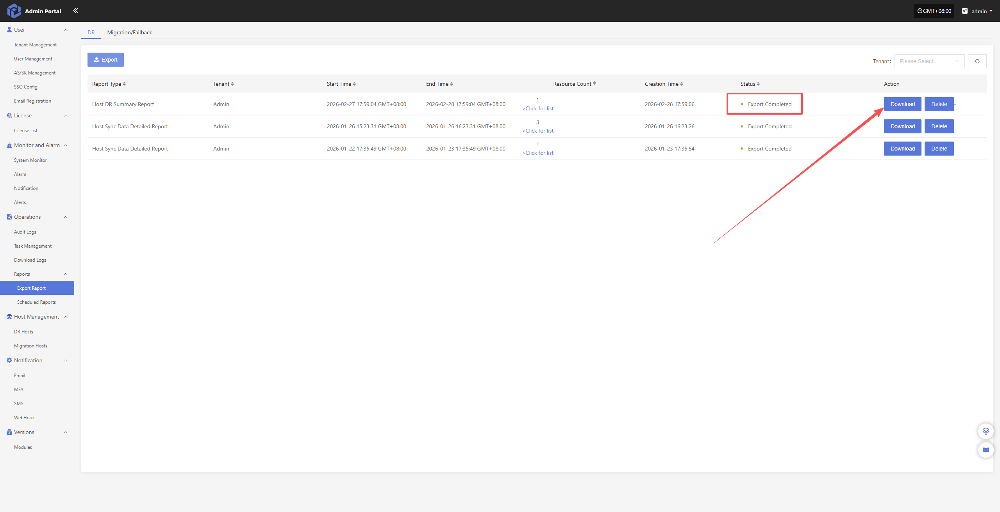
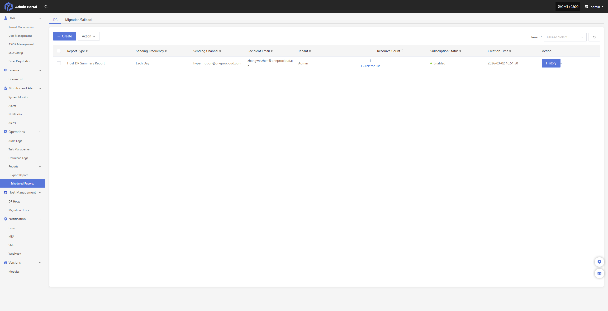
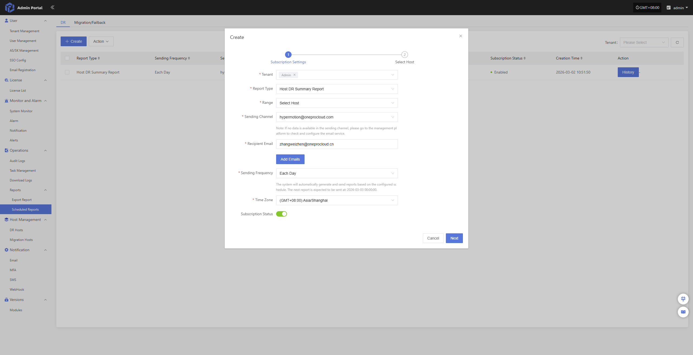
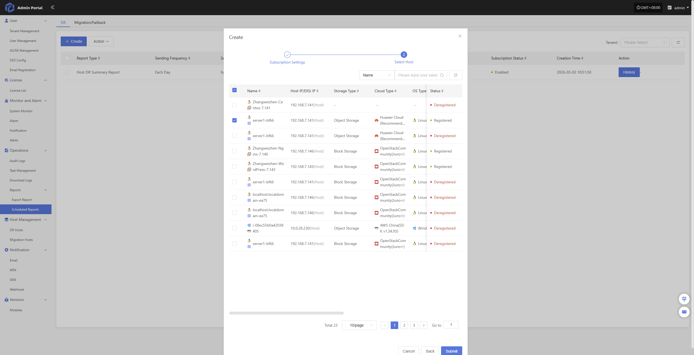
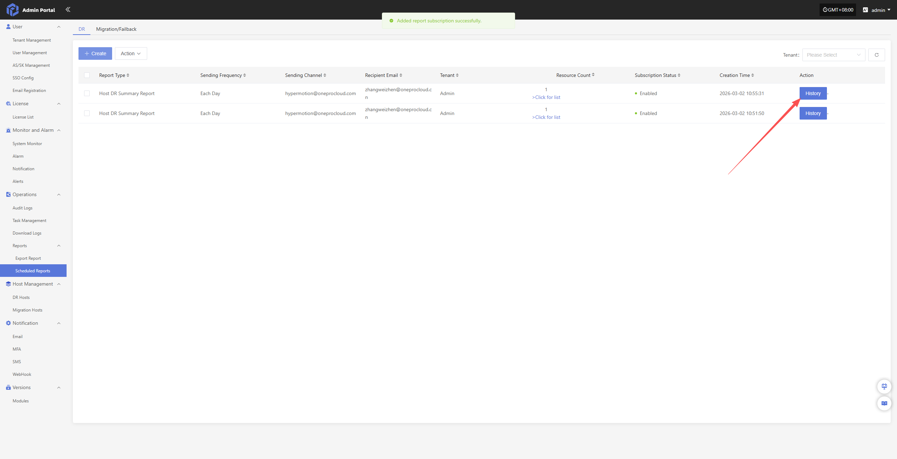

# Report Management

Users can export various system operation and management reports for all disaster recovery, failback, and migration activities under their tenants through the operations portal. This feature helps perform regular analysis and archival of platform status, supporting audit, issue tracking, and management evaluation.

## Report Export

### Supported Report Types and Descriptions

| **Report Type**      | **Description**                                          |
| ------------- | ------------------------------------------------- |
| Host DR Summary Report      | Summary of basic info for all registered and deregistered hosts under the tenant, including sync count, drill count, takeover count, system type, etc. |
| Host Sync Data Detailed Report    | Details of sync tasks for all registered and deregistered hosts under the tenant.                      |
| Host DR Drill Detailed Report    | Details of drill tasks for all registered and deregistered hosts under the tenant.                      |
| Host DR Takeover Detailed Report    | Details of takeover tasks for all registered and deregistered hosts under the tenant.                      |
| Host DR Period Summary Report (Days) | Summary of DR cycles for all registered and deregistered hosts under the tenant over a period.                                 |
| Cloud Sync Gateway Summary Report   | Basic info for all cloud sync gateways under the tenant.                               |
| Cloud Sync Gateway Detailed Report   | Detailed info for all cloud sync gateways under the tenant, down to each disk.                       |

### Export Report Descriptions

#### Host DR Summary Report

| **Field Name**                        | **Description**                                 |
| ------------------------------ | ---------------------------------------- |
| Host Name                  | Name of the host.                         |
| Host IP                    | IP address of the host for network identification and communication.                     |
| Step                       | Registration step number in the DR process.                         |
| Status                     | Current status of the task or operation, e.g. Registered.                         |
| Host Status                | Whether the host is successfully registered in the system.                    |
| Storage Type               | Type of storage, such as Block Storage or Object Storage.          |
| Cloud Type                 | Cloud platform type and version, e.g. OpenStack Community (Juno+). |
| OS Type                    | Operating system type, such as Windows or Linux.                |
| Sync Count (Succeeded)     | Number of successful data sync tasks.                           |
| Sync Count (Failed)        | Number of failed data sync tasks.                             |
| Drill Count (Succeeded)    | Number of successful drill tasks.                             |
| Drill Count (Failed)       | Number of failed drill tasks.                               |
| Takeover Count (Succeeded) | Number of successful takeover tasks.                           |
| Takeover Count (Failed)    | Number of failed takeover tasks.                             |
| Sync Size (GB)             | Total amount of synced data in GB.                        |
| Region                     | Region identifier in the cloud platform.                               |
| Zone                       | Availability zone identifier (if any).                            |
| Flavors                    | Compute spec (vCPU/memory/disk), e.g. 8 cores, 16GB RAM, 50GB disk. |
| Disk Count                 | Number of disks on the host.                                |
| Capacity (GB)              | Total disk capacity of the host in GB.                         |
| Subnet                     | Subnet name the host belongs to.                               |
| Network                    | Network name the host is connected to.                              |
| Security Group             | Name of the security group applied to the host.                          |
| Fixed IP                   | Fixed internal IP address of the host (unassigned).                      |
| Public IP                  | Public IP address of the host (unassigned).                        |

#### DR Cloud Sync Gateway Detailed Report

| **Field Name**                        | **Description**                     |
| ------------------------------ | ---------------------------- |
| Created Time               | Creation time of the gateway resource.                |
| Cloud Sync Gateway Name    | Name of the gateway for identification.          |
| Cloud Account Name         | The cloud account tied to this gateway.      |
| Block Storage Platform     | Cloud platform type, e.g. OpenStack, VMware.  |
| User Name                  | Tenant or user who created the gateway.             |
| Status                     | Current working status of the gateway (e.g. Enabled, Disabled). |
| Health Status              | Health status of the gateway, such as Normal or Abnormal.      |
| Data Transfer Protocol     | Protocol used for data transfer, e.g. TCP, iSCSI.     |
| Region                     | Cloud platform region.            |
| Zone                       | Cloud platform availability zone.             |
| Image                      | Name of the image used by the gateway.                  |
| Flavor                     | Resource configuration template (CPU/memory/disk). |
| System Disk Type           | Type of system disk, e.g. SSD, SATA.          |
| System Disk Size           | System disk capacity in GB.                |
| Backup Volume              | Name of the backup volume currently mounted or used.              |
| Max Backup Volume          | Maximum number or capacity of backup volumes supported.          |
| Volume Name                | Name of the volume currently in use.                  |
| Pool Uuid                  | Unique identifier of the storage pool where the volume is mounted.                |
| Pool Name                  | Name of the storage pool where the volume is mounted.                  |
| Total Volume Capacity (GB) | Total capacity of the current volume in GB.              |
| Usage Status               | Resource usage status, e.g. In Use or Available.         |
| Allocation Status          | Allocation status indicating whether the gateway is linked to a host.           |
| Allocation Host            | Host name to which the gateway is currently attached or bound, if allocated.       |

#### DR Cloud Sync Gateway Summary Report

| Field Name                           | Description                                  |
| ------------------------------ | ----------------------------------- |
| Created Time               | Record creation time, format YYYY/MM/DD HH:MM:SS            |
| Cloud Sync Gateway Name    | Gateway name, typically IP address or unique identifier             |
| Cloud Account Name         | Cloud account name identifying the service account                  |
| Block Storage Platform     | Block storage platform type, e.g. OpenStack, AWS          |
| User Name                  | User operating the gateway                         |
| Status                     | Current status, e.g. 'Creation Success'              |
| Health Status              | Health status, e.g. 'Online'                |
| Data Transfer Protocol     | Data transfer protocol, e.g. 'S3Block' for S3-based block storage     |
| Region                     | Cloud platform region name indicating geographic or logical region                |
| Zone                       | Availability zone, '-' if none            |
| Image                      | Name and identifier of the image, usually an OS image              |
| Flavor                     | VM spec, such as CPU, memory, and disk combination               |
| System Disk Type           | System disk type, e.g. default volume type 'DEFAULT_VOLUME_TYPE' |
| System Disk Size           | System disk size in GB                         |
| Backup Volume              | Current backup volume count                             |
| Max Backup Volume          | Maximum allowed backup volume count                          |
| Total Volume Capacity (GB) | Total capacity of all volumes in GB                       |
| Hosts Count                | Number of associated hosts                             |

#### Host DR Cycle Summary Report

| Field Name                      | Description                                 |
| ------------------------- | ---------------------------------- |
| Serial Number             | Unique serial number for the record                       |
| Period                    | Time period covered by the report                    |
| Host Name                 | Name of the host                               |
| Host IP                   | IP address of the host                             |
| Step                      | Current step or phase number                          |
| Status                    | Status such as 'Registered'              |
| Host Status               | Host status such as 'Registered'          |
| Storage Type              | Storage type such as 'Block Storage'         |
| Cloud Type                | Cloud platform type such as 'OpenStackCommunity(Juno+)' |
| OS Type                   | Operating system type such as Windows or Linux             |
| Sync Count (Succeeded)     | Number of successful syncs                             |
| Sync Count (Failed)        | Number of failed syncs                             |
| Drill Count (Succeeded)    | Number of successful drills                             |
| Drill Count (Failed)       | Number of failed drills                             |
| Takeover Count (Succeeded) | Number of successful takeovers                             |
| Takeover Count (Failed)    | Number of failed takeovers                             |
| Sync Size (GB)             | Sync data size in GB                       |
| Region                    | Cloud platform region name                            |
| Zone                      | Availability zone, '-' if none                        |
| Flavors                   | VM spec such as CPU cores, memory, and disk               |
| Disk Count                | Number of disks                               |
| Capacity (GB)              | Storage capacity in GB                         |
| Subnet                    | Subnet name                               |
| Network                   | Network name                               |
| Security Group            | Security group name                              |
| Fixed IP                  | Fixed IP address, '-' if none                    |
| Public IP                 | Public IP address, '-' if none                    |

#### Host DR Takeover Detailed Report

| Field Name           | Description                               |
| -------------- | -------------------------------- |
| Host Name      | Name of the host                             |
| Host IP        | IP address of the host                           |
| Status         | Current status, e.g. task completed or error                |
| Task Status    | Progress status of the takeover task               |
| Start Time     | Task start time                           |
| End Time       | Task end time                           |
| Execution Time | Task execution duration                           |
| Storage Type   | Storage type such as Block Storage         |
| Cloud Type     | Cloud platform type such as OpenStackCommunity(Juno+) |
| Region         | Cloud platform region name                          |
| Zone           | Availability zone, '-' if none                  |
| Flavors        | VM spec description such as CPU, memory and disk             |
| Disk Count     | Number of disks                             |
| Capacity (GB)   | Storage capacity in GB                       |
| Network        | Network name                             |
| Subnet         | Subnet name                             |
| Security Group | Security group name                            |
| Fixed IP       | Fixed IP address, '-' if none                 |
| Public IP      | Public IP address, '-' if none                 |
| Task Details   | Detailed description and results of the task execution              |

#### Host DR Drill Detailed Report

| Field Name           | Description                               |
| -------------- | -------------------------------- |
| Host Name      | Name of the host                             |
| Host IP        | IP address of the host                           |
| Status         | Current status, e.g. task completed or error                |
| Task Status    | Progress status of the drill task               |
| Start Time     | Task start time                           |
| End Time       | Task end time                           |
| Execution Time | Task execution duration                           |
| Storage Type   | Storage type such as Block Storage         |
| Cloud Type     | Cloud platform type such as OpenStackCommunity(Juno+) |
| Region         | Cloud platform region name                          |
| Zone           | Availability zone, '-' if none                  |
| Flavors        | VM spec description such as CPU, memory and disk             |
| Disk Count     | Number of disks                             |
| Capacity (GB)   | Storage capacity in GB                       |
| Network        | Network name                             |
| Subnet         | Subnet name                             |
| Security Group | Security group name                            |
| Fixed IP       | Fixed IP address, '-' if none                 |
| Public IP      | Public IP address, '-' if none                 |
| Task Details   | Detailed description and results of the task execution              |

#### Host Sync Data Detailed Report

| Field Name                      | Description                  |
| ------------------------- | ------------------- |
| Host Name                 | Name of the host                |
| Host IP                   | IP address of the host              |
| Status                    | Current status, e.g. task completed or error   |
| Task Status               | Progress status of the sync task  |
| Start Time                | Task start time              |
| End Time                  | Task end time              |
| Execution Time            | Task execution duration              |
| Capacity Size (GB)         | Sync capacity size in GB        |
| Sync Mode                 | Sync mode such as full or incremental    |
| Average Sync Rate (Mbps/s) | Average sync rate in megabits per second     |
| Synced Size (GB)           | Amount of data synced in GB      |
| Task Details              | Task details describing execution info and results |

### Report Export Example

Navigate through the left menu: Reports → Export Report → Export to start collecting reports.

Fill in the configuration fields as needed:

- Configuration Information

| **Configuration Item** | **Example** | **Description** |
|------------|------------|------------|
| Tenant | Admin | Tenant scope for report data or query. Multi-select is supported. |
| Report Type | Host Sync Data Detailed Report | Type of report to generate, distinguishing different stats dimensions or business types. |
| Range | Select Hosts | Scope of objects for report; specific hosts can be selected for export. |
| Time Zone | (GMT+08:00) Asia/Shanghai | Time zone used for displaying report data; affects time-related fields. |
| Time Range | 2026-01-29 17:55:07 ~ 2026-02-28 17:55:07 | Time interval for report statistics; can be entered manually or chosen. |

After filling, click “Next” to select hosts.

> Note: if the range is set to all hosts, no further host selection is necessary; click Confirm to start collecting the report.

Once hosts have been selected, click the “Submit” button. The system will begin data collection, and the report can be downloaded after it is generated.

## Scheduled Reports

Users can configure scheduled tasks in the operations portal to automatically collect and export reports for all DR, failback, and migration activities under their tenants and send them to configured email addresses. This feature helps perform regular analysis and archival of platform status, supporting audit, issue tracking, and management evaluation.

### Scheduled Report Configuration Example

Navigate: Reports → Scheduled Reports → Create to begin setting up the report subscription.

Fill in the required configuration:

- Configuration Information

| **Configuration Item** | **Example** | **Description** |
|------------|------------|------------|
| Tenant | Admin | Tenant scope for report data or query. Multi-select is supported. |
| Report Type | Host Sync Data Detailed Report | Type of report to generate, distinguishing different stats dimensions or business types. |
| Range | Select Hosts | Scope of objects for report; specific hosts can be selected for export. |
| Sending Channel | hypermotion@oneprocloud.com | Email channel used to send reports. If no data is available, check and configure email service in admin portal. |
| Recipient Email | zhangweizhen@onepro.cn | Target email address(es) for report delivery; one or more recipients can be entered. |
| Sending Frequency | Daily | Frequency for automatic report sending, such as daily, weekly, or monthly. |
| Time Zone | (GMT+08:00) Asia/Shanghai | Time zone used for displaying report data; affects time-related fields. |
| Subscription Status | Enabled | Indicates whether the subscription is active; enabled status triggers automatic sending at configured frequency. |

After filling, click “Next” to select hosts.

> Note: if the range is set to all hosts, no further host selection is required; click Confirm to start collecting the report

Once hosts have been selected, click the “Submit” button. The system will create a scheduled data collection task. You can check and track its progress in the history records.

