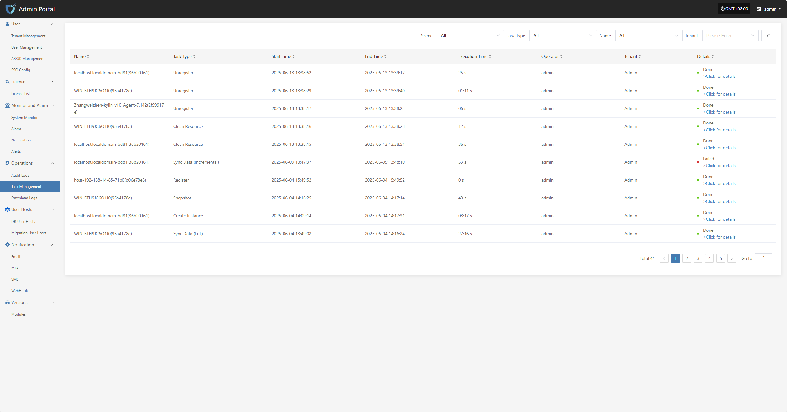
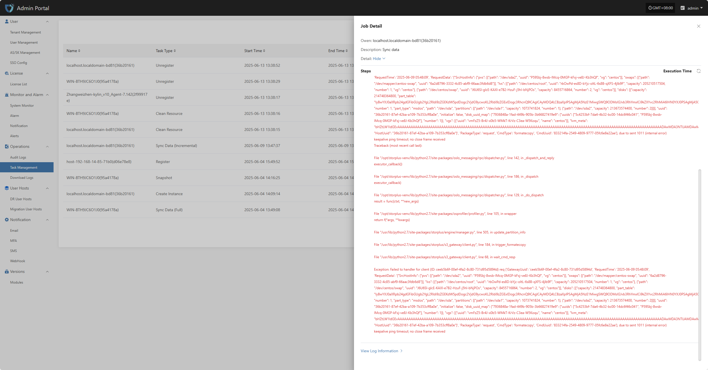

# **Task Management**

The "Task Management" module is used to centrally display the execution records and status details of various tasks on the platform, helping users understand the execution process, duration, and executor information of tasks. Users can click on a task record to view the complete execution details for troubleshooting and result confirmation.

At the top of the page, you can filter and manage task records efficiently by scenario, resource type, tenant, and other criteria.

In the task management list, users can click the "> Click for details" link in the operation result field to view the complete execution log for that task, making it easier to troubleshoot and confirm results.

