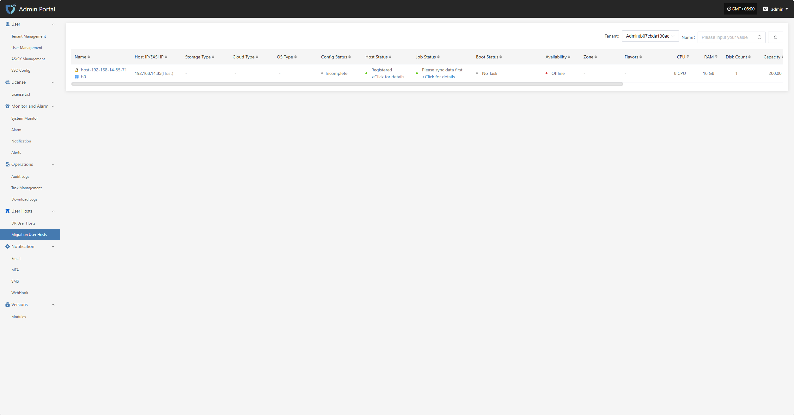
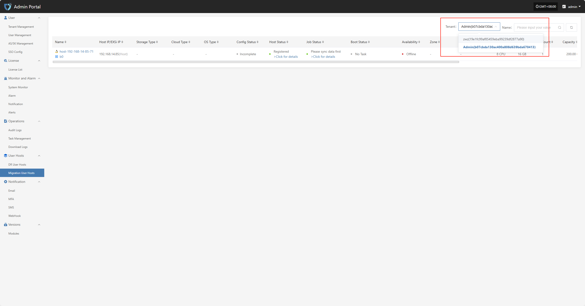

# Migration User Hosts 

The "Migration User Hosts" module displays the migration host resources for each tenant. Users can select different tenants to view their corresponding host information, making unified management and status monitoring easier.

Users can click the dropdown list next to the tenant name in the upper right corner of the page to select different tenants and view their migration host information.

Click the host name in the host list to go to the details page for that host, where you can view detailed data including basic information, running status, and resource allocation.