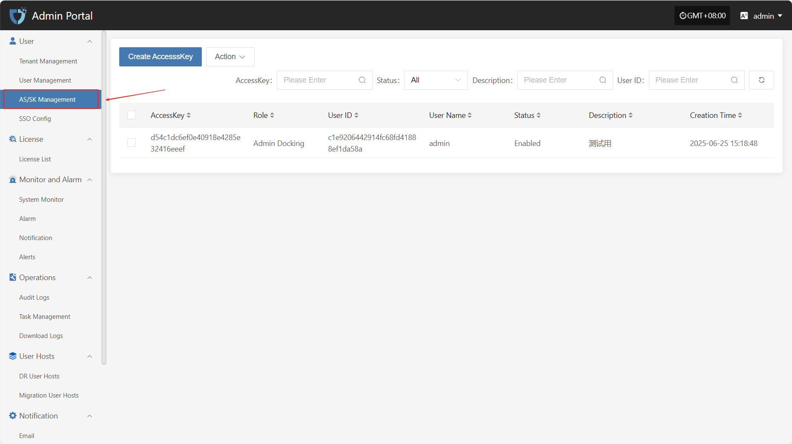
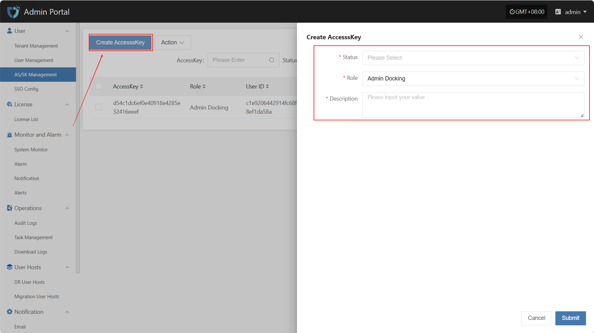
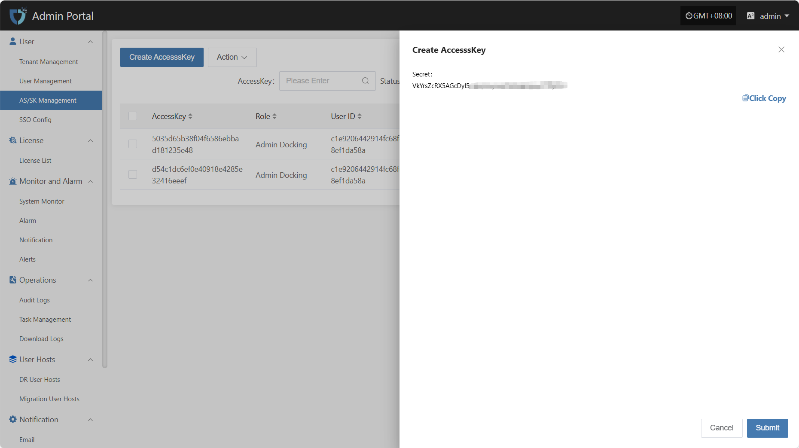
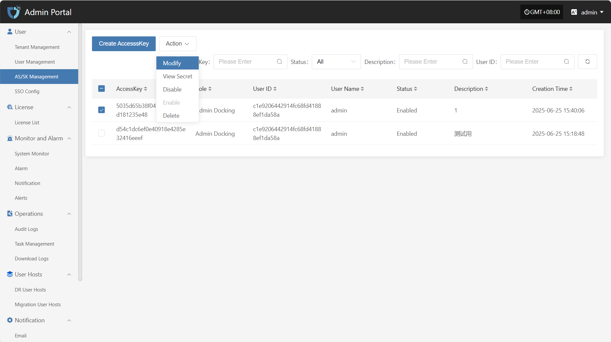
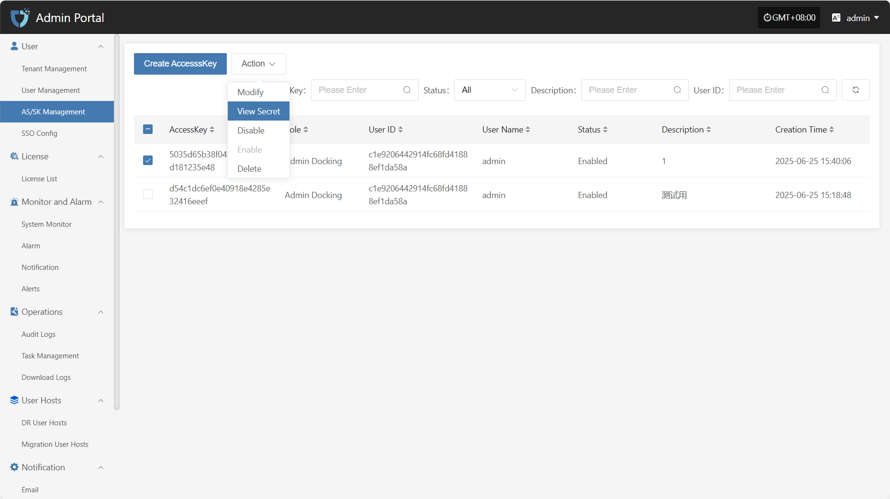
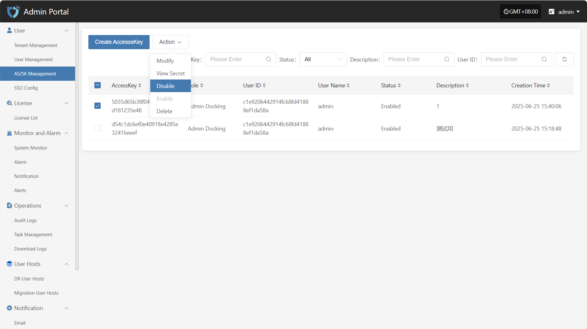
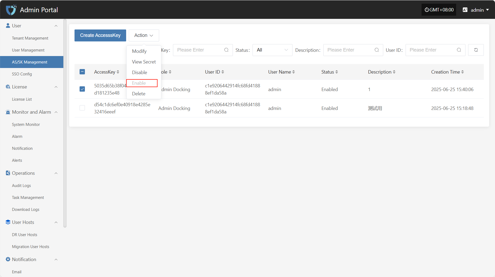
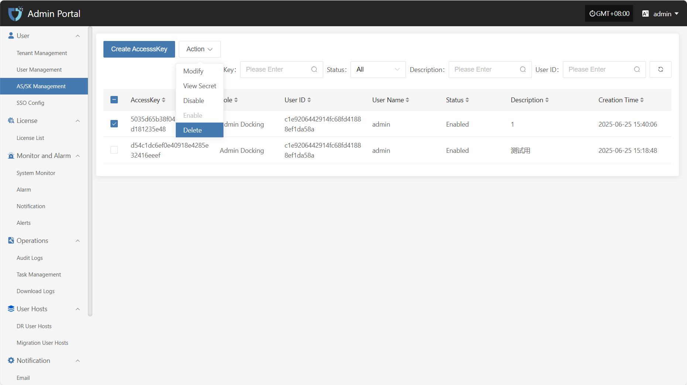

# AS/SK Management

The "AS/SK Management" module is used to generate and manage Access Keys (AK) and Secret Keys (SK) for users, supporting authentication and secure access to system interfaces. By assigning AK/SK, the system can identify and control the permissions of API users, which is essential for automation integration and third-party system connections.

You can use the search box on the right to filter by conditions.

## Create AccesssKey

Click the "Create AccesssKey" button in the upper left corner to start creating an AccesssKey.

* Authentication Information Description

| **Setting** | **Example Value** | **Description**                           |
| ----------- | ---------------- | ----------------------------------------- |
| Status      | Enable           | Indicates the current status of the key. Enable means it can be used for system access, disable means it is temporarily unavailable. |
| Role        | Admin Docking    | The role assigned to the key, used to define the permission scope of the AK/SK.      |
| Description | test ak          | A brief description of the key's purpose or background for easy identification and management.         |

After filling in all configuration information, click "Submit" to complete key creation. The Secret value will be displayed immediately after successful creation, please keep it safe.

## Action

### Modify

After selecting the AK to operate in the list, click "Modify" to edit part of the authentication information.

### View Secret

Click "View Secret" to view the Secret value again.

### Disable

Click the "Disable" button to disable an enabled AK.

### Enable

Click the "Enable" button to activate a disabled AK.

### Delete

Click the "Delete" button to remove the AK.

