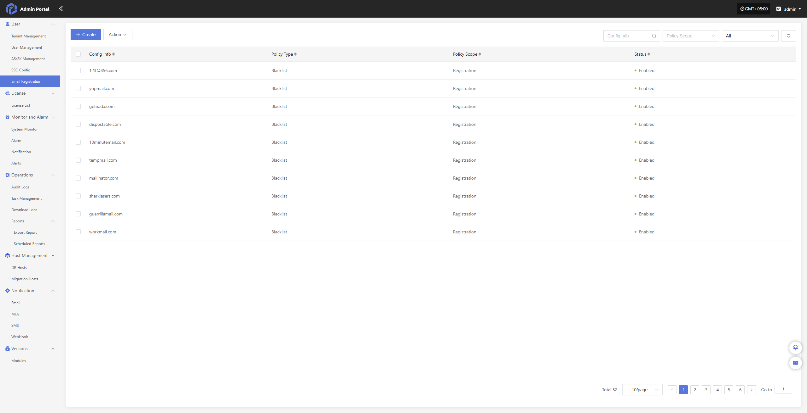
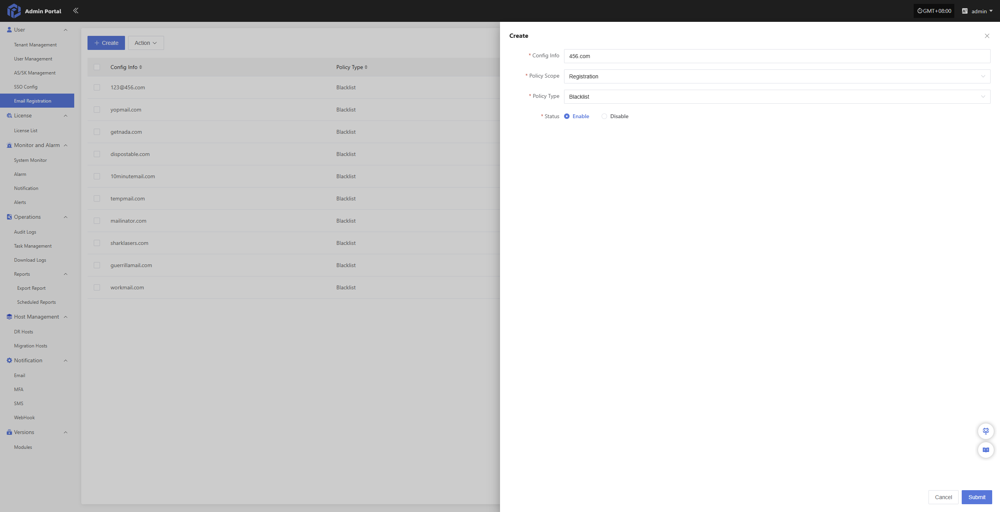

# Email Registration

This feature manages email blacklists for user registration. Administrators can add specified email addresses or domains to the blacklist, which will then be prohibited from registration.

This feature effectively restricts registration from specific sources and enhances system security and account management compliance.

> The system initially blocks 51 email addresses by default. You can adjust blocked emails as required and add new email addresses to block.

## Create

Click the 'Create' button in the upper left corner to start adding email blacklist entries

- Configuration Information

| **Configuration Item** | **Example** | **Description**                 |
| ------- | ------- | ---------------------- |
| Email/Domain     | 456.com   | Email address or domain to be restricted (e.g., entering 456.com restricts all emails under that domain)   |
| Policy Scope     | Registration   | Business scope in which the policy takes effect. For example, 'Registration' means the policy applies only to user registration behavior   |
| Policy Type      | Blacklist      | Indicates that the configured email or domain will be prohibited from use |
| Status      | Enabled      | Indicates whether the policy is currently effective. Once enabled, it takes effect immediately |

## Action

### Modify

Select the configuration to modify from the list, then click 'Modify' to edit the settings

### Enable

Click the 'Enable' button to activate the disabled email blacklist policy

### Disable

Click the 'Disable' button to deactivate the enabled email blacklist policy

### Delete

Click the 'Delete' button to remove the email blacklist policy

