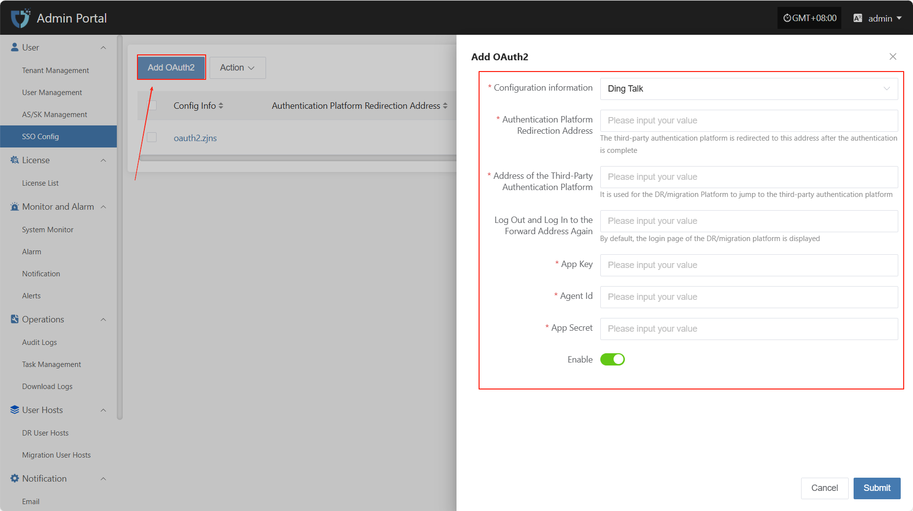
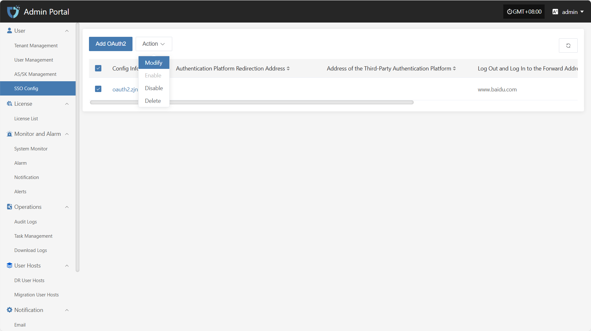
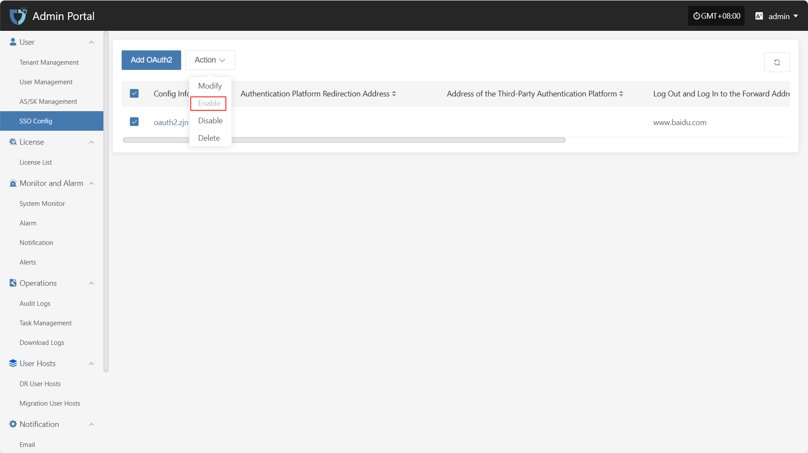
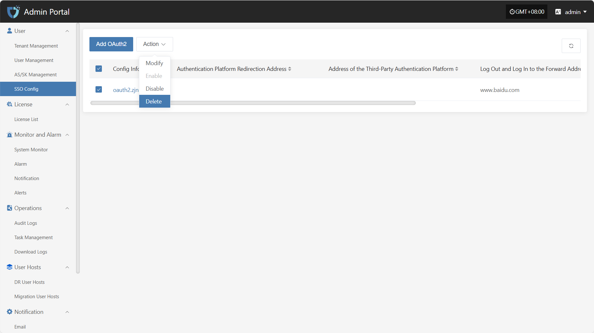

# **SSO Config**

The "SSO Config" module is used to connect to third-party identity authentication systems, enabling unified authentication and automatic login for users across multiple systems, improving system integration efficiency and user experience.

## **Add OAuth2**

Click the "Add OAuth2" button in the upper left corner to start adding SSO.

* Authentication Information Description

| **Setting**           | **Example Value**                   | **Description**                                   |
| --------------------- | ----------------------------------- | ------------------------------------------------- |
| Configuration information | DingTalk                         | Currently supports DingTalk, Zhejiang Rural Credit, and BinaryOwl |
| Authentication Platform Redirection Address | https://example.com/callback | The address to which the third-party authentication platform redirects after authentication. Must be a valid callback address registered with the platform. |
| Address of the Third-Party Authentication Platform | https://login.dingtalk.com/oauth | The entry address for OAuth2.0 authentication with DingTalk. |
| Log Out and Log In to the Forward Address Again | https://example.com/login | The default login redirect address when users revisit the system after logging out. Usually the DR/Migration platform login page. |
| App Key           | Please fill in                        | The App Key applied for on the DingTalk open platform, used to identify the third-party application. |
| Agent ID          | Please fill in                        | The Agent ID corresponding to the DingTalk application, used to specify the micro application to connect. |
| App Secret        | Please fill in                        | The secret paired with the App Key, used for signing and identity verification. Please keep it safe and avoid leakage. |
| Enable Status     | Enable / Disable                      | Controls whether the current SSO configuration is effective. |

> Note: When selecting Zhejiang Rural Credit or BinaryOwl, you only need to fill in the API Base URL and the login redirect address after logging out.

## **Action**

### **Modify**

After selecting the configuration to operate in the list, click "Modify" to edit part of the authentication information.

### **Enable**

Click the "Enable" button to activate a disabled SSO configuration.

### **Disable**

Click the "Disable" button to disable an enabled SSO configuration.

### **Delete**

Click the "Delete" button to remove the SSO configuration.

