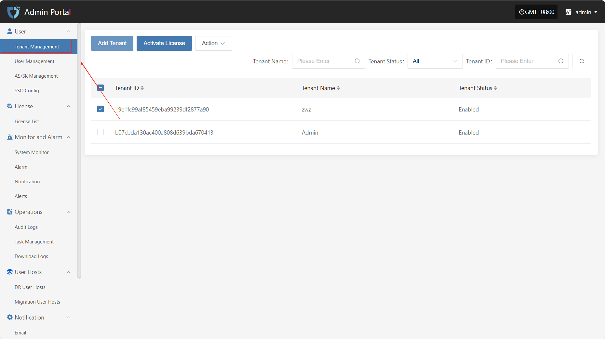
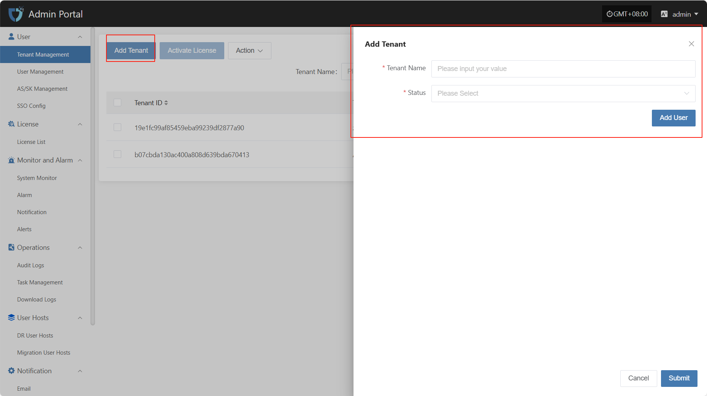
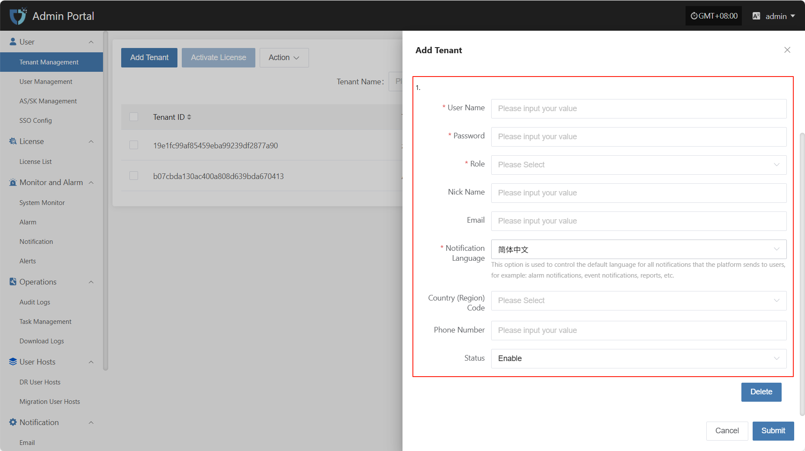
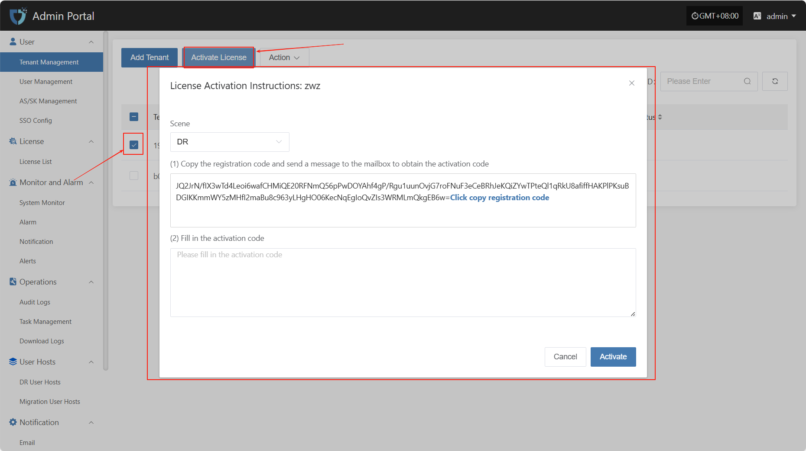
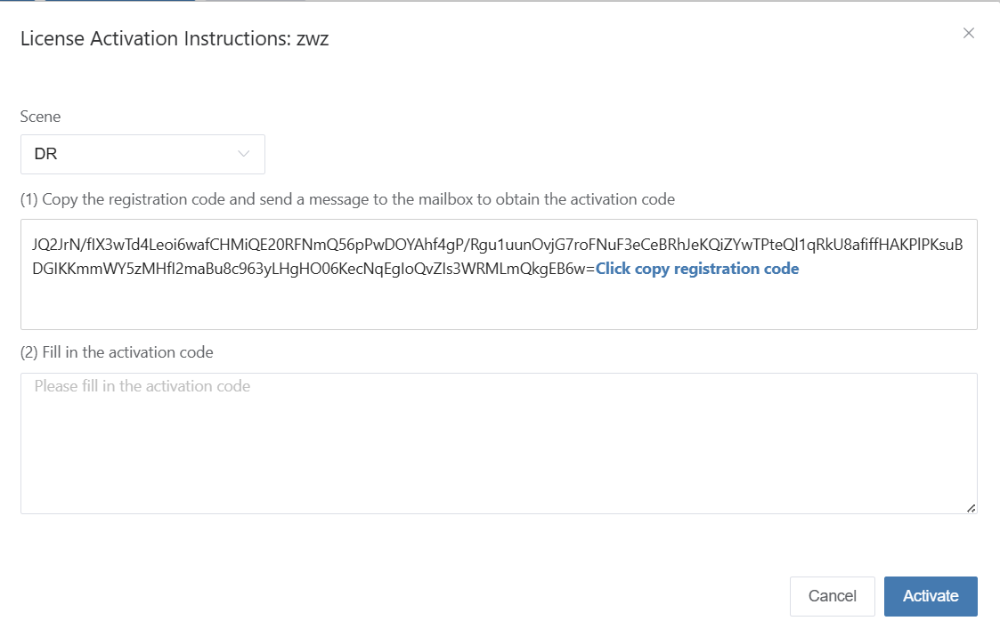
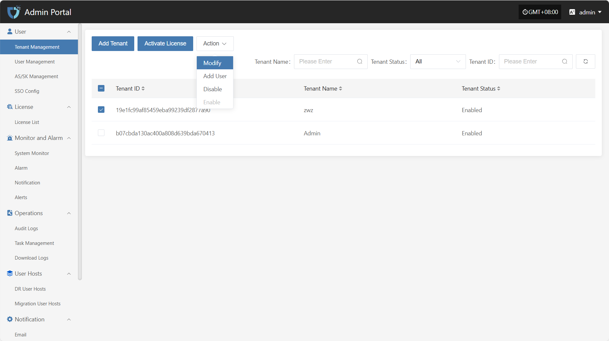
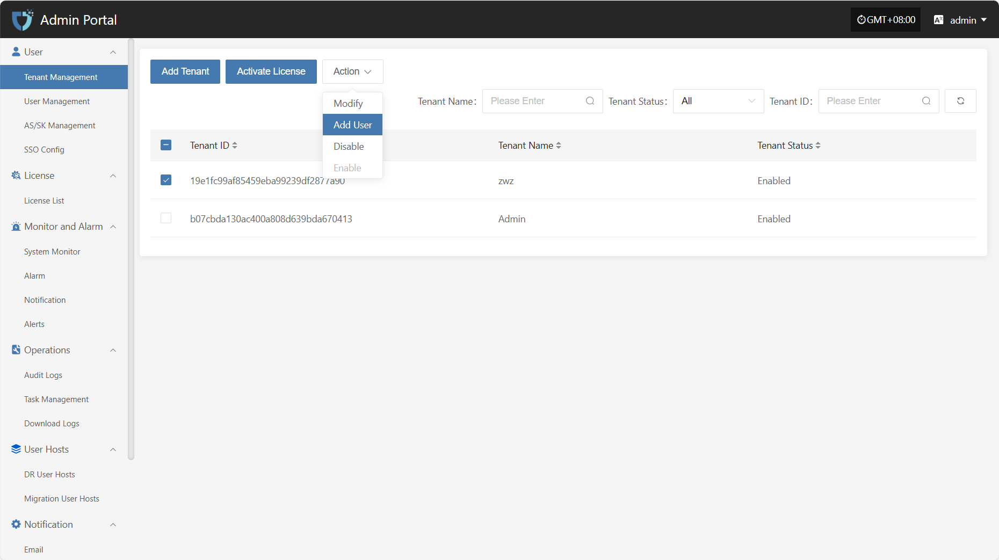
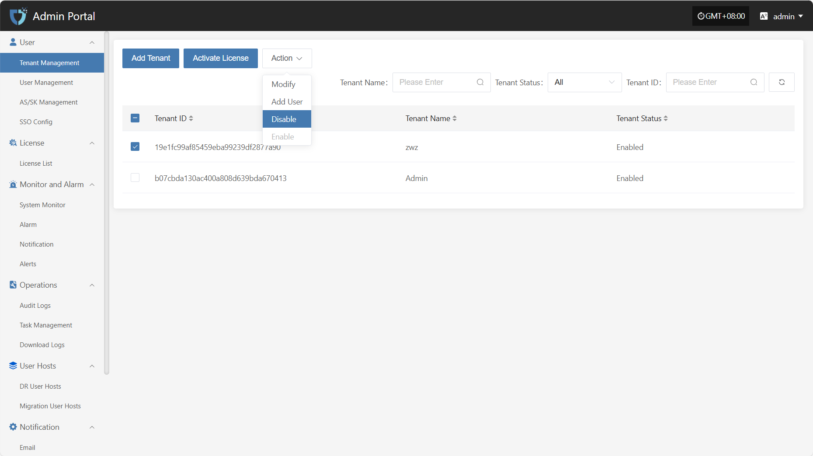
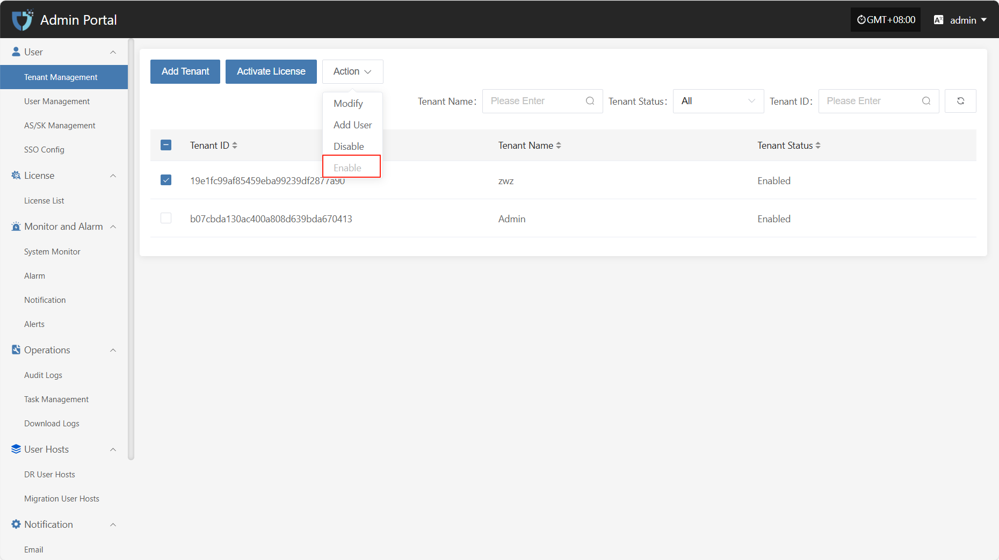

# **Tenant Management**

The "Tenant Management" module is used to centrally manage tenant information in the system. Administrators can create, edit, view, and delete tenant accounts here, allocate resources, configure permissions and isolation policies for tenants, and achieve unified scheduling and access control in a multi-tenant environment.

You can use the search box on the right to filter by tenant name, status, or tenant ID.

## Add Tenant

Click the "Add Tenant" button in the upper left corner to start creating a tenant.

* Authentication Information Description

| **Setting** | **Example Value** | **Description**                 |
| ----------- | ---------------- | ------------------------------ |
| Tenant Name | test1            | The name used to identify the tenant in the system. It should be unique.   |
| Status      | Enable           | Indicates the current status of the tenant. Can be set to enabled or disabled. |

After filling in the tenant authentication information, click "Submit" to create a new tenant. If you need to assign initial users to the tenant, you can click the "Add User" button below to complete user binding (multiple users are supported).

* Add User Description

| **Field Name**      | **Example/Default Value** | **Description**                           |
| ------------------- | ------------------------ | ----------------------------------------- |
| Username            | dame1                    | The unique username used to log in to the system. Cannot be duplicated. |
| Password            | xxxxxxxxxx               | Set the user's initial login password. It is recommended to include uppercase and lowercase letters and numbers. |
| Role                | Platform Administrator   | Assign the user's role in the platform. Different roles have different permission scopes. |
| Nick Name       | dame1                    | The name displayed for the user in the system. Can be in Chinese or English and is customizable. |
| Email          | xxx@163.com              | Used to receive notifications, verification codes, and other system information. Please enter a valid email address. |
| Notification Language | Simplified Chinese      | Controls the default language for system notifications (such as alerts and events) received by the user. |
| Country/Region Code | China        | Select the country or region for the mobile number. |
| Phone Number  | 1766932xxxx              | User's mobile number, used to receive SMS notifications and other services. |
| Status              | Enable                   | Set the user's account status. When enabled, the user can log in to the system. If disabled, access is not allowed. |

After completing the tenant information configuration, click the "OK" button at the bottom right of the page. The system will create the new tenant and save the related settings.

## Activate License

After selecting the tenant that needs to be activated from the list, click the "Activate License" button in the upper left corner of the page to enter the license activation process.

Select different scenarios to obtain the corresponding registration code according to actual usage requirements.

Click the link "Click to Apply" below to apply for the activation code online, or contact the corresponding account manager to obtain the activation code.[Click to Apply](https://hypermotion-license.oneprocloud.com/qr_code?featureCode=fqYuBYFPBsFc5+Xbg3zFi0aqvgtUJJP0dKHjhL/NeUThqvnxrzImzuEv6NkkOvnFx4JEVi9pgx7Cme4AQ7UsDvI0WM3Xk80N1busaC3kEYGmS8D5mI5e/VypZA2Jl8f1ex1fF6kHD+nHqBY+hFpe24gBkk3snedxrQq1zPU6ZlI=\&username=admin\&domain=192.168.7.141\&scene=dr\&mobile=\&FailbackFeatureCode=GoRIoJJlSorp6szdSNs9%2F85%2Frv3Jpbo8w%2F6ErZloOe9djEVGnLkEu5VQCowmdJCEdIi1l%2FS5h5Q7QQcu31ueJLH9q6vnL9HutFK6Q3pRuckA08GLEf6Ykg7GVosobLdSzPC8hMv4cJPU2eTO561tmDjlnuYNbcEFPhiT8k1Ab5U%3D\&email=dianzheng0410%40163.com\&origin_type=cn\&lang=zh)

After receiving the activation code, please enter it into the designated input box and click the "Activate" button to complete the license activation.

## Action

### Modify

Click "Modify" to edit the authentication information.

### Add User

Click the "Add User" button to add and bind a new user to the current tenant.

### Disable

Click the "Disable" button to disable a tenant that is currently enabled.

### Enable

Click the "Enable" button to activate a tenant that is currently disabled.

