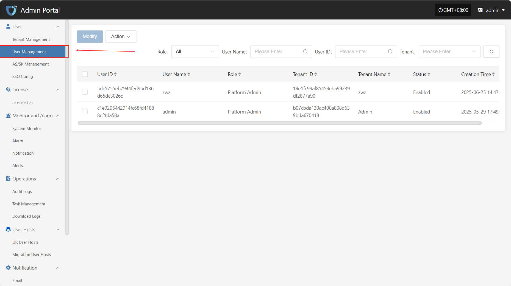
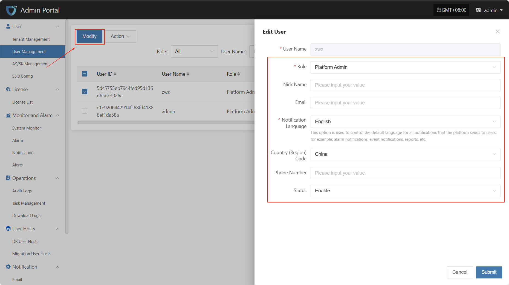
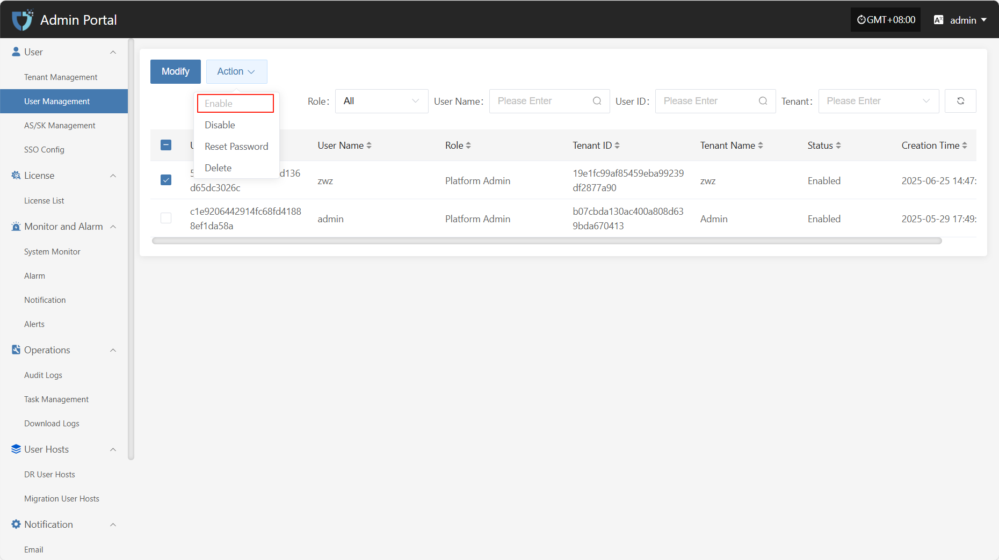
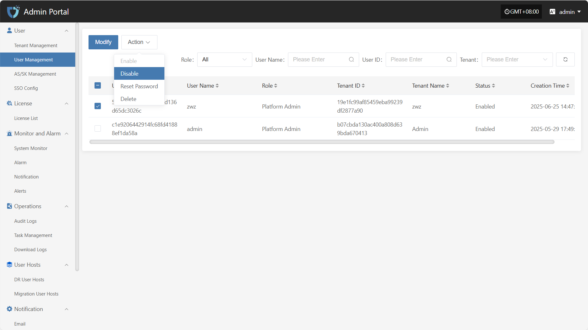
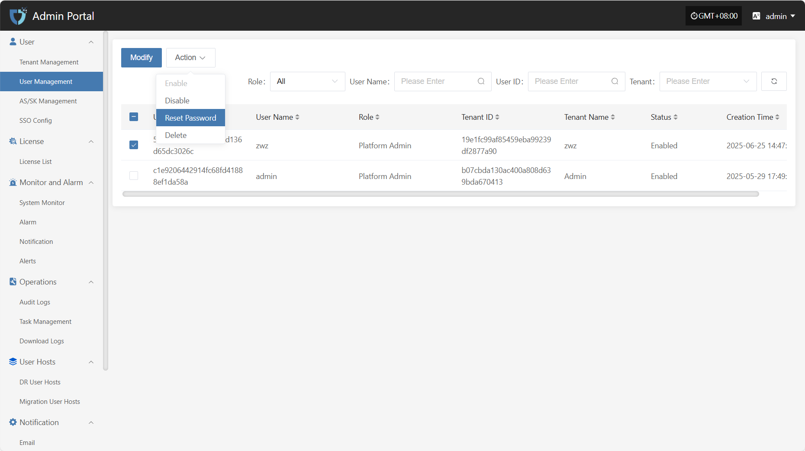
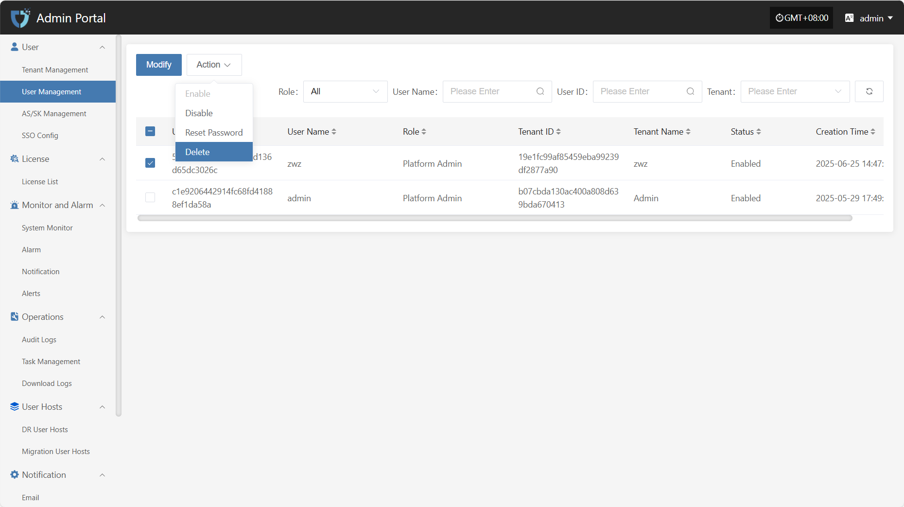

# **User Management**

The "User Management" module is used to centrally manage all user accounts in the system, including user editing, status control, and permission assignment. Through this module, administrators can centrally configure and manage users under different tenants, ensuring system security and standardized operations.

You can use the search box on the right to filter by role type, username, tenant name, or tenant ID.

## **Modify**

After selecting the user to operate in the list, click "Modify" in the upper right to edit part of the user's authentication information.

* User Authentication Information Description

| **Field Name**   | **Example/Default Value**  | **Description**                           |
| ---------------- | ------------------------- | ----------------------------------------- |
| User Name        | dame1                     | Cannot be modified                       |
| Role             | Platform Admin    | Assign the user's role in the platform. Different roles have different permission scopes. |
| Nick Name        | dame1                     | The name displayed for the user in the system. Can be in Chinese or English and is customizable. |
| Email            | xxx@163.com               | Used to receive notifications, verification codes, and other system information. Please enter a valid email address. |
| Notification Language | Chinese    | Controls the default language for system notifications (such as alerts and events) received by the user. |
| Country (Region) Code | China                 | Select the country or region for the mobile number. |
| Phone Number     | 1766932xxxx               | User's mobile number, used to receive SMS notifications and other services. |
| Status           | Enable                    | Set the user's account status. When enabled, the user can log in to the system. If disabled, access is not allowed. |

After modifying the user information, click the "Submit" button at the bottom right of the page to save the settings.

## **Action**

### **Enable**

Click the "Enable" button to activate a disabled user.

### **Disable**

Click the "Disable" button to disable an enabled user.

### **Reset Password**

Click the "Reset Password" button to reset the user's login password.

### **Delete**

Click the "Delete" button to remove the user account.

