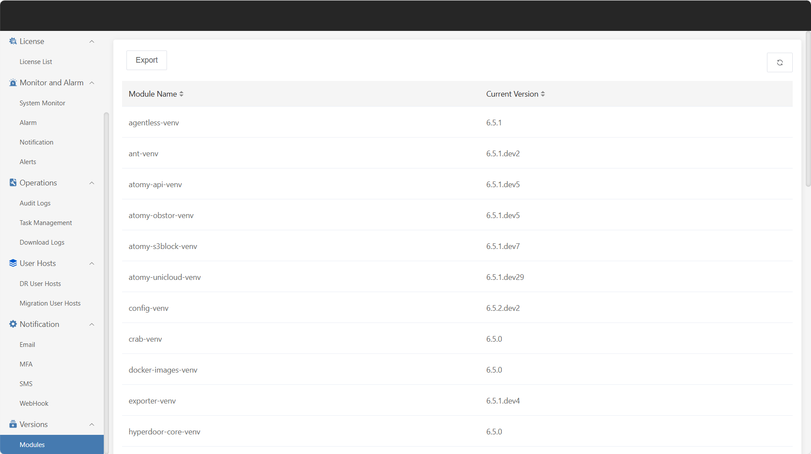

# **Modules**

"Modules" displays all functional modules in the current system that are under version management. Users can view basic information and current version status of each module here, making it easy to quickly locate and manage module updates. This list provides basic support for version control, rollback, and change review, and is an important tool for continuous optimization and stable operation of the system.

Click **"Export"** in the upper left corner of the page to generate and download the version information of the current modules.