# Calculator Manual

## Feature Overview

The Disaster Recovery (DR) Calculator is an online tool that helps users estimate the cost of DR services. It supports multiple service scenarios, cloud platforms, and configuration combinations. By filling in key parameters, the system automatically generates recommended resource specifications and a detailed cost breakdown, making it easier for users to plan before purchasing licenses.

> **Note:** All configuration details will affect the final HyperBDR license cost estimation. Please fill in the information based on your actual DR needs. For assistance, contact your account manager.

## How to Access

Visit the OnePro official documentation website: <https://docs.oneprocloud.com/zh/>

Click **“Calculator”** in the top navigation bar to enter the calculator page.

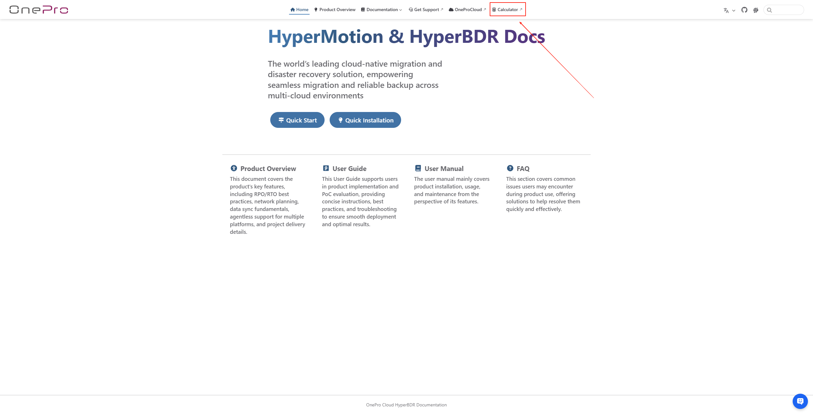

## Basic Service Configuration

Before using the DR Calculator, users need to select and provide the following key information on the page, including business scenario, target platform, account type, deployment region, and resource type.

### Service

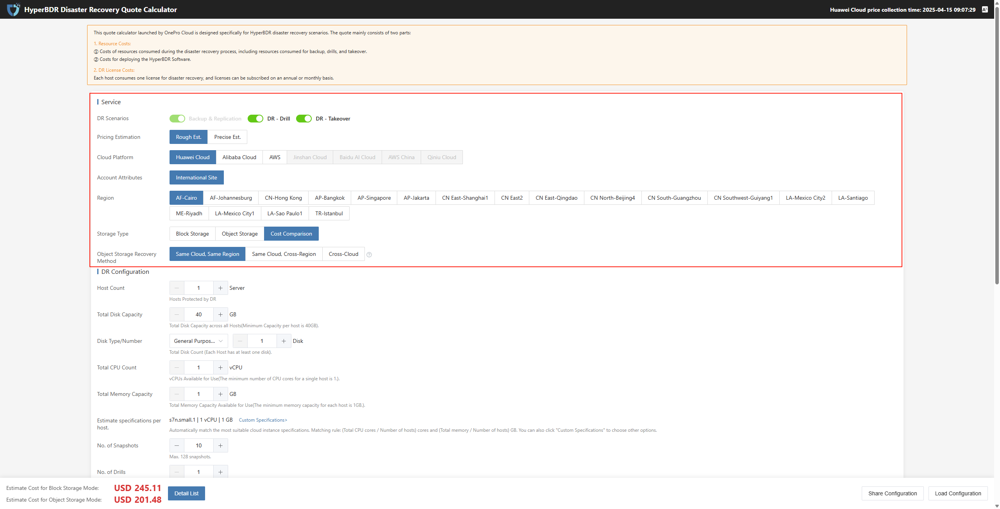

* Configuration Description

| **Configuration Item**                | **Example Value**           | **Description**                                                                                                                                      |
| ------------------------------------- | --------------------------- | ---------------------------------------------------------------------------------------------------------------------------------------------------- |
| DR Scenarios                          | Backup & Replication        | Multiple choices allowed. "Backup & Replication" is required.                                                                                       |
| Pricing Estimation                    | Rough Est.                  | More detailed configuration options will be enabled for precise estimation, used to generate accurate resource specs and cost data.                  |
| Cloud Platform                        | Huawei Cloud                | Different cloud platforms affect recommended instance types and billing methods.                                                                     |
| Account Attributes                    | International Site          | Pricing structure differs between domestic and international sites.                                                                                  |
| Region                                | AF-Cairo                    | Different regions affect resource prices.                                                                                                            |
| Storage Type                          | Block Storage               | Supports cost comparison for two types; results will be listed separately.                                                                          |
| Object Storage Recovery Method         | Same Cloud, Same Region     | Only appears when object storage is selected. **Same Cloud, Same Region** usually has free or lowest transfer cost; **Same Cloud, Cross-Region** may incur higher cross-region traffic fees; **Cross-Cloud** may incur higher public network egress fees. |

You can click to view the **applicable scenarios** and **billing differences** for different storage types (block/object storage): Learn about applicable scenarios | View billing differences.

### DR Configuration (Configuration options differ depending on the selected scenario and estimation method)

#### Rough Est.

* Configuration Description

| **Configuration Item**                  | **Example Value**                 | **Description**                                 |
| --------------------------------------- | --------------------------------- | ----------------------------------------------- |
| Host Count                             | 1                                 | Number of production hosts protected by DR      |
| Total Disk Capacity                     | 40                                | Total disk capacity of all hosts (GB)           |
| Disk Type/Number                        | General Purpose SSD / 1           | Each host has at least 1 disk; disk type depends on cloud platform |
| Total CPU Count                         | 8                                 | Total available vCPUs of all hosts              |
| Total Memory Capacity                   | 16                                | Total memory of all hosts (GB)                  |
| Estimate specifications per host.       | s7n.2xlarge.2                     | System automatically recommends instance type based on CPU and memory; click "Custom Spec" to adjust |
| No. of Snapshots                        | 10                                | Up to 128 snapshots supported                   |
| No. of Drills                           | 1                                 | Maximum number of DR drills per cycle           |
| Est. Drill Duration (Hour)              | 1                                 | Estimated duration per DR drill                 |
| No. of Takeovers                        | 1                                 | Maximum number of DR takeovers per cycle        |
| Est. Takeover Duration (Hour)           | 1                                 | Estimated duration per DR takeover              |
| Network Cost                            | Pay-As-You-Go for Data Transfer   | Pay-as-you-go by default                        |
| Est. Data Change                        | 50                                | Estimated daily data change; set based on actual workload |

#### Precise Est.

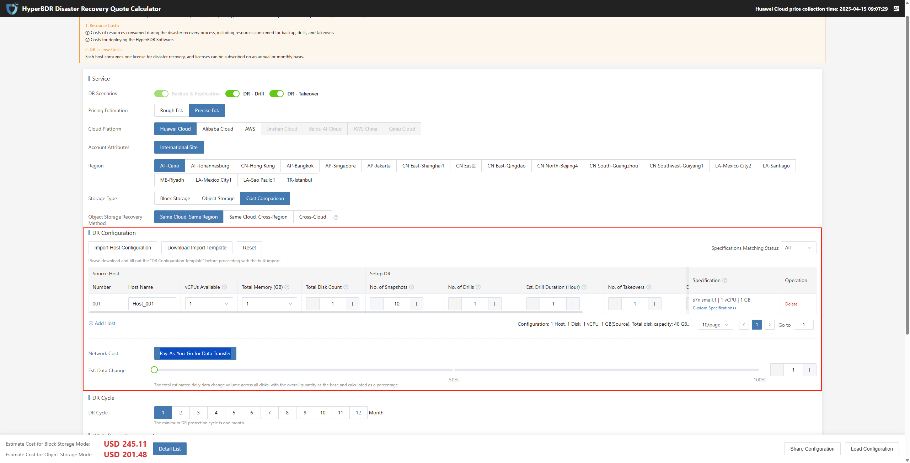

* Users can click **"Download Import Template"** on the page, fill in the host configuration, and then use **"Import Host Configuration"** to import multiple hosts at once for higher efficiency.

> Example fields include: Host name, number of disks, CPU, memory, OS type, etc.

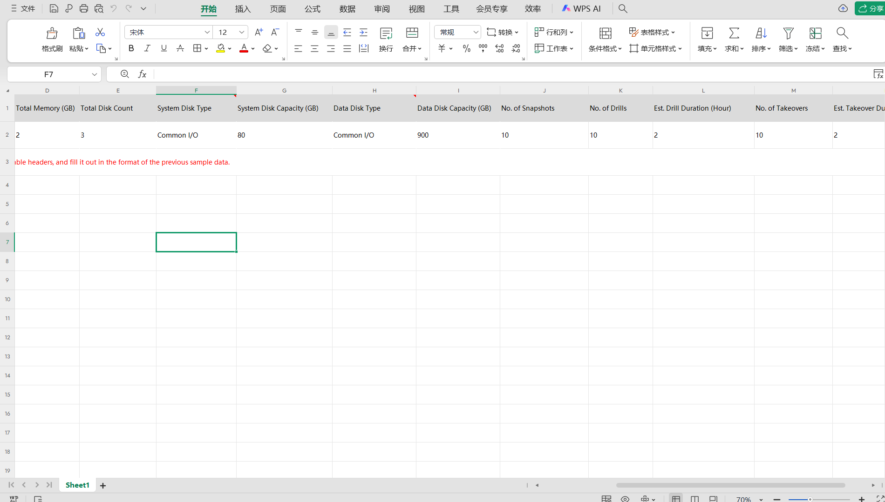

* After uploading the template, the host list on the page will be updated automatically.

After filling out and batch importing the template, the source host area on the page will automatically add the corresponding host information. If you need to make adjustments later, you can use the page action buttons to modify or delete entries.

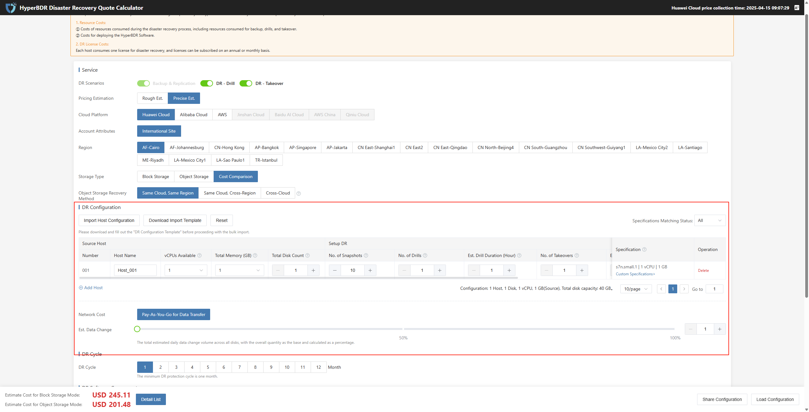

You can continue to edit or delete imported items on the page as needed.

### DR Cycle

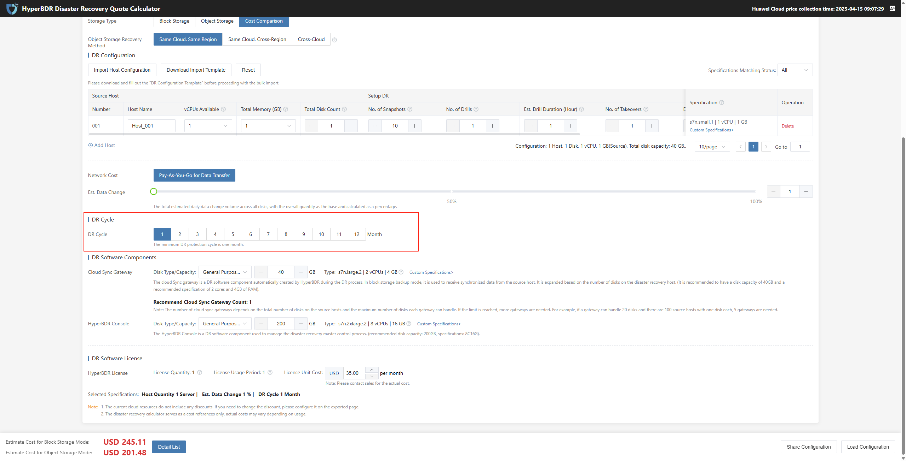

* Configuration Description

| Configuration Item | Example | Description |
| ------------------ | ------- | ----------- |
| DR Cycle           | 6       | The minimum DR cycle is one month |

### DR Software Components

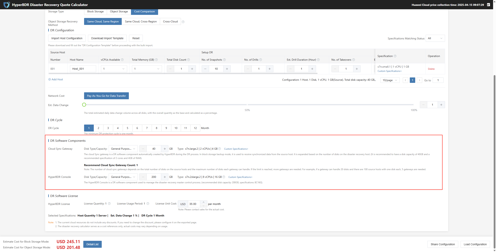

#### Cloud Sync Gateway

The cloud sync gateway is a DR software component automatically created by HyperBDR during the DR process. In block storage backup mode, it is used to receive synchronized data from source hosts.

> Note: The number of cloud sync gateways depends on the total number of disks on the source hosts and the maximum number of disks each gateway can handle. If the limit is reached, more gateways are needed. For example, if a gateway can handle 20 disks and there are 100 source hosts with one disk each, 5 gateways are needed.

| **Configuration Item**                 | **Example**               | **Specification**              | **Description**                                    |
| -------------------------------------- | ------------------------- | ------------------------------ | -------------------------------------------------- |
| **Disk Type/Capacity**                 | General Purpose SSD /  40 | s7n.large.2 \| 2 vCPUs \| 4 GB | Automatically scales based on the number of DR host disks. It is recommended that each disk be at least 40GB. Recommended instance spec: 2 vCPUs, 4GB RAM. |
| **Recommend Cloud Sync Gateway Count** | 1                         | --                             | The system will automatically calculate the recommended number of sync gateways based on the number of DR hosts. No manual configuration required. |

#### HyperBDR Console

The HyperBDR Console is a DR software component used to manage the main DR control process (recommended disk capacity: 200GB, recommended spec: 8 vCPUs, 16GB RAM)

| **Configuration Item**   | **Example**                | **Specification**                 | **Description**                                    |
| ----------------------  | -------------------------- | --------------------------------- | -------------------------------------------------- |
| **Disk Type/Capacity**  | General Purpose SSD /  200 | s7n.2xlarge.2 \| 8 vCPUs \| 16 GB | Automatically scales based on the number of DR host disks. It is recommended that each disk be at least 40GB. Recommended instance spec: 2 vCPUs, 4GB RAM. |

### DR Software License

After selecting the service scenario, configuration parameters, and DR components, the system will dynamically calculate the required resources and recommended configuration for license estimation.

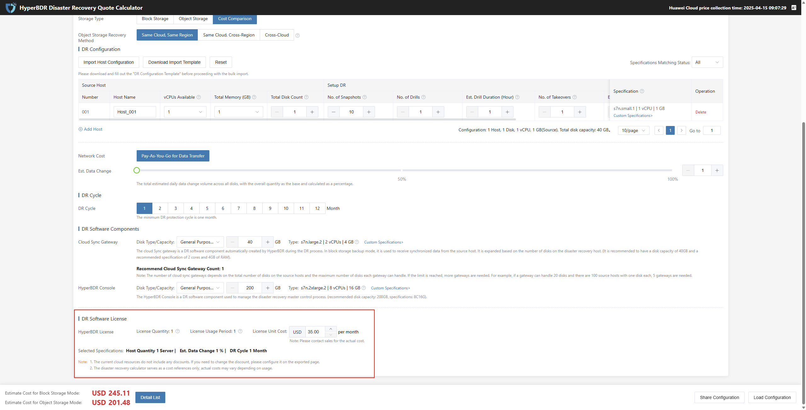

### Detail List

After completing all configuration options, the system will automatically calculate the required resources and costs. Click **“Detail List”** to expand and view the detailed quotation breakdown.

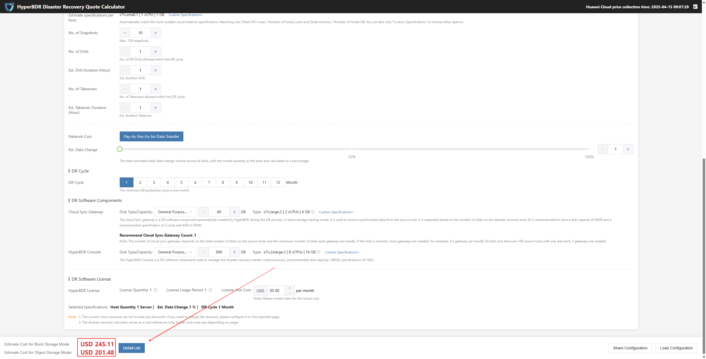

Click the top menu bar to view the detailed cost list for block storage and object storage separately, making it easy to compare the cost structure of different storage types.

#### Block Storage Mode

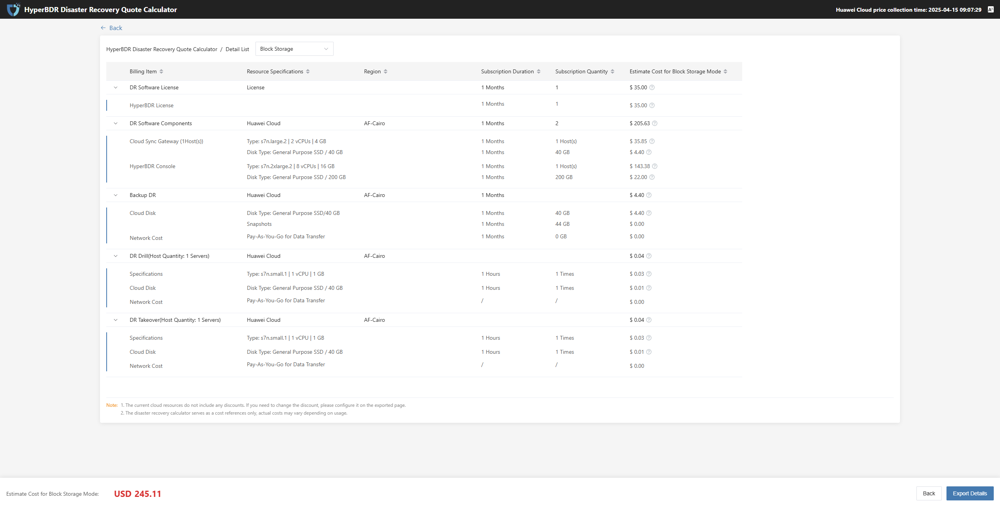

* Detailed List

| **Billing Item**                     | **Resource Specifications** | **Region** | **Subscription Duration** | **Subscription Quantity** | **Estimate Cost for Block Storage Mode** | **Description**                                                                                  |
| ------------------------------------ | --------------------------- | ---------- | ------------------------- | ------------------------- | ---------------------------------------- | ---------------------------------------------------------------------------------------------- |
| DR Software License                  | License                     | --         | 1 Month                   | 1                         | $35.00                                   | Number of authorizations × Authorization usage period × Authorization price per month per unit |
| DR Software Components               | Huawei Cloud                | AF-Cairo   | 1 Month                   | 2                         | $205.63                                  | Total price of cloud sync gateway + Total price of HyperBDR console                            |
| Backup DR                            | Huawei Cloud                | AF-Cairo   | 1 Month                   | --                        | $4.40                                    | Total price of cloud disk + Network fee                                                        |
| DR Drill(Host Quantity: 1 Server)    | Huawei Cloud                | AF-Cairo   | --                        | --                        | $0.04                                    | Total price of ECS instance + Total cost of cloud disk + Network fee                           |
| DR Takeover(Host Quantity: 1 Server) | Huawei Cloud                | AF-Cairo   | --                        | --                        | $ 0.04                                   | Total price of ECS instance + Total cost of cloud disk + Network fee                           |

#### Object Storage Mode

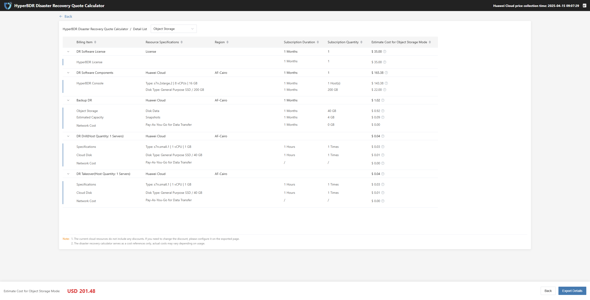

* Detailed List

| **Billing Item**                     | **Resource Specifications** | **Region** | **Subscription Duration** | **Subscription Quantity** | **Estimate Cost for Object Storage Mode** | **Description**                                                                                  |
| ------------------------------------ | --------------------------- | ---------- | ------------------------- | ------------------------- | ----------------------------------------- | ---------------------------------------------------------------------------------------------- |
| DR Software License                  | License                     | --         | 1 Month                   | 1                         | $35.00                                    | Number of authorizations × Authorization usage period × Authorization price per month per unit |
| DR Software Components               | Huawei Cloud                | AF-Cairo   | 1 Month                   | 1                         | $165.38                                   | Total price of HyperBDR console                                                                |
| Backup DR                            | Huawei Cloud                | AF-Cairo   | 1 Month                   | --                        | $1.02                                     | Estimated capacity of object storage (snapshot) fee + Network fee                              |
| DR Drill(Host Quantity: 1 Server)    | Huawei Cloud                | AF-Cairo   | --                        | --                        | $0.04                                     | Total price of ECS instance + Total cost of cloud disk + Network fee                           |
| DR Takeover(Host Quantity: 1 Server) | Huawei Cloud                | AF-Cairo   | --                        | --                        | $0.04                                     | Total price of ECS instance + Total cost of cloud disk + Network fee                           |

After clicking the "Export Details" button, the system will generate and export the complete cost breakdown for users to view and save.

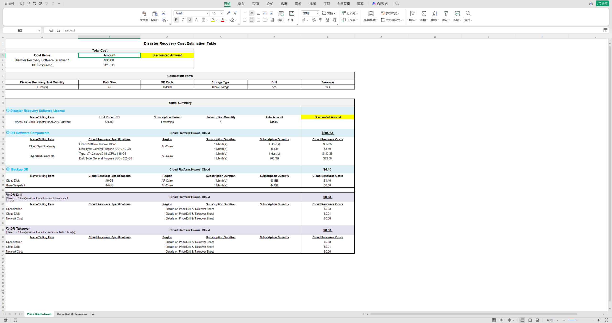

#### Cost Comparison

For example, with 20 source hosts (16 vCPUs, 64GB each), 80 disks, 6TB data, and an estimated drill duration of 10 hours, the cost comparison between block storage and object storage is as follows:

| **Item**                  | **Block Storage Cost**     | **Object Storage Cost**    | **Description**                         |
| ------------------------- | ------------------------- | ------------------------- | --------------------------------------- |
| **DR Software License**   | $4900.00 (20 units, 7 mo) | $4900.00 (20 units, 7 mo) | License cost is the same, not affected by storage type. |
| **DR Software Components**| $2284.66 (5 units, 7 mo)  | $1157.66 (1 unit, 7 mo)   | Object storage component cost is much lower due to fewer components. |
| **Backup DR**             | $4,620.00                 | $5,336.11                 | Object storage backup is slightly more expensive due to different storage and access mechanisms. |
| **DR Drill**              | $179.62 (20 hosts)        | $179.62 (20 hosts)        | Drill cost is the same; storage type has little impact. |
| **DR Takeover**           | $1,796.20                 | $1,796.20                 | Takeover cost is the same; storage type has no significant impact. |

## Frequently Asked Questions (FAQ)

**How is the cost calculated when selecting multiple service scenarios?**

> The system will combine the required configuration items and resource specifications for each scenario and summarize them into a comprehensive license requirement.

**Why are there no hosts shown after I upload the template?**

> Please check if the template format is correct or if any field names have been changed by mistake.

**What is the difference between Rough Est. and Precise Est.?**

> Rough Est. gives a rough estimate based only on the number of hosts and capacity. Precise Est. calculates network, drill, takeover, and other resources for a more accurate result.

## Notes

* It is recommended to perform DR drills and takeovers during off-peak business hours.

* If you have a large number of hosts or special requirements, please use the "Import Template" method for configuration.

* The number of DR drills and takeovers will affect the license cost. Please evaluate the usage frequency reasonably.

> This document applies to the "DR Calculator" module of OnePro HyperBDR SaaS. All examples and configuration descriptions are based on the current version interface (June 2025). Features may be adjusted in future versions.
