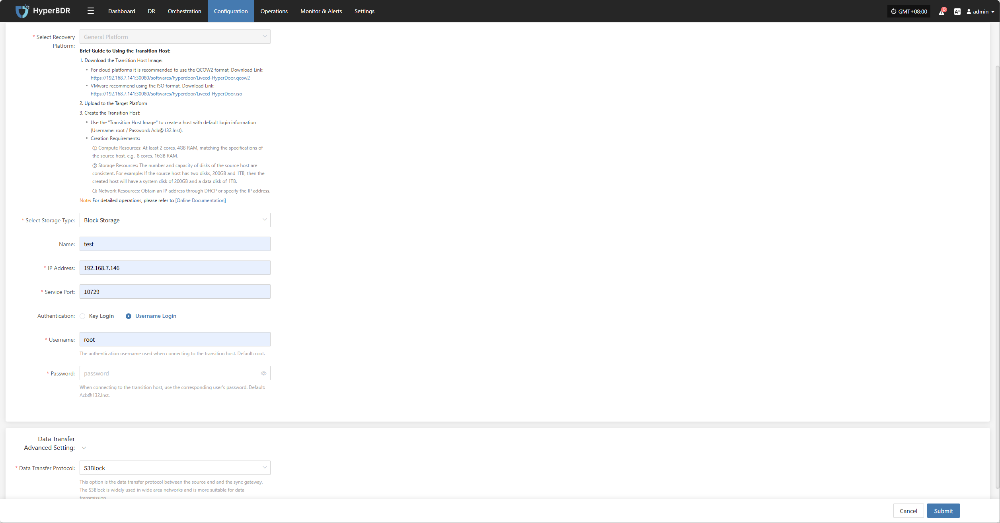
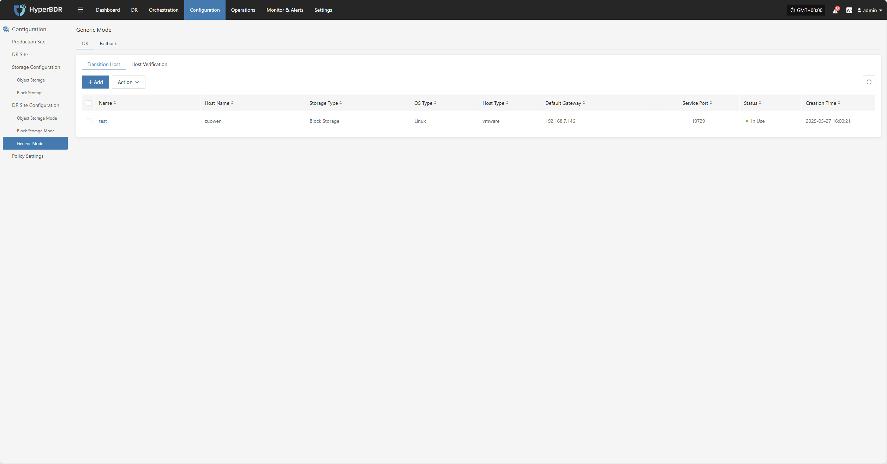
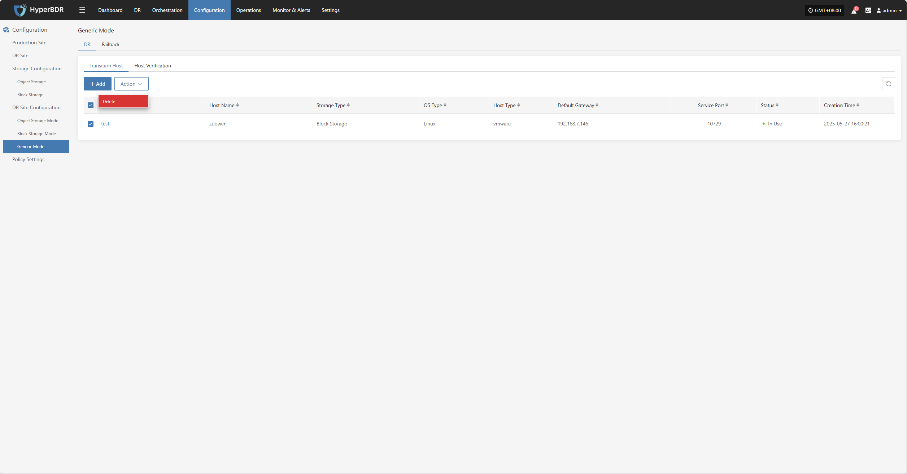
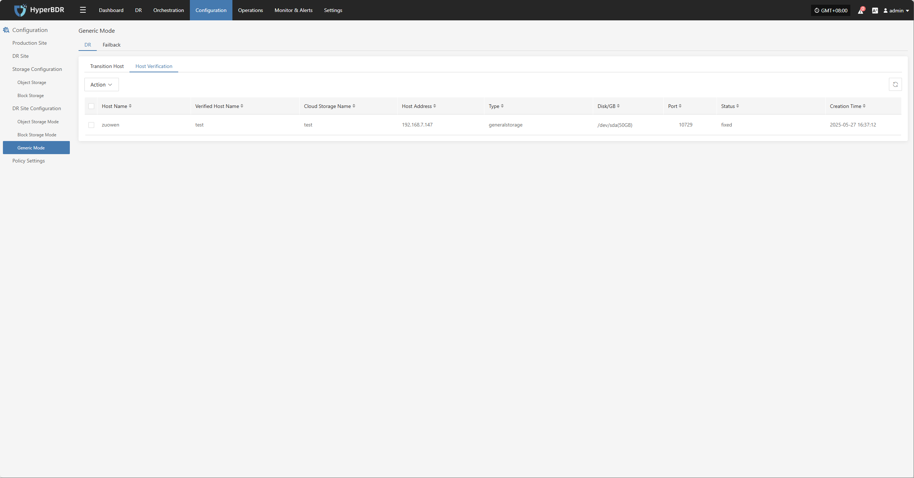
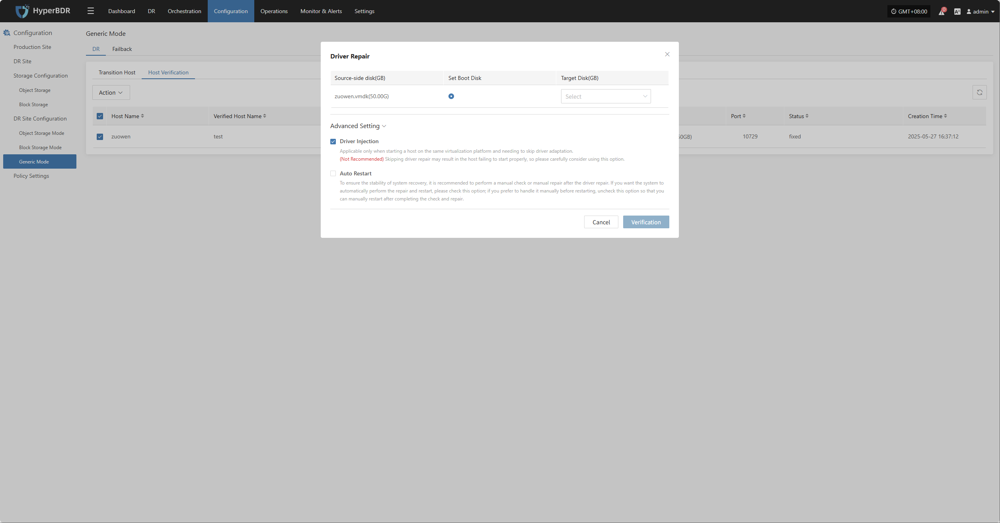
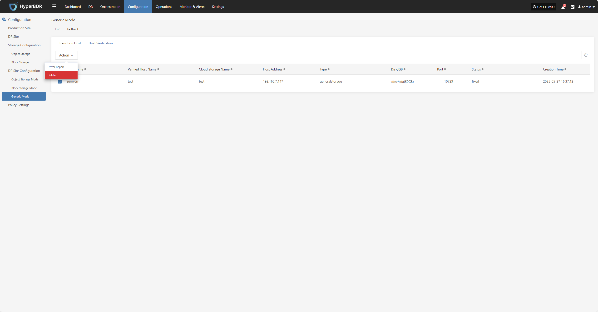

# **DR Site Configuration**

When the primary production site fails, the system can automatically or manually switch to a standby environment. To ensure business continuity and data availability during DR switch, you need to complete the DR platform configuration in advance.

The platform supports two types: DR and Failback, for different business scenarios:

* **DR**: When the source host fails or is unavailable, quickly switch business to the standby platform to ensure continuity and data safety.
* **Failback**: After DR is complete, smoothly migrate business back to the source platform to restore the system to its original state.

You can configure DR or failback strategies as needed to achieve end-to-end business continuity management.

## **Object Storage Mode**

### **Supported Cloud Platforms**

| Cloud Vendor                                 | Notes   |
|----------------------------------------------|---------|
| Alibaba Cloud                               |[Click to View](../dr-site-configuration-obs/alibaba.md)         |
| Alibaba Cloud Apsara Stack(v3.16.x)         |         |
| Alibaba Cloud Apsara Stack(v3.18.x)         |         |
| AWS China(SDK v1.34.93)                     |[Click to View](../dr-site-configuration-obs/aws.md)         |
| AWS(SDK v1.34.93)                           |         |
| ctyun JC                                    |         |
| ecloud                                      |         |
| GDS                                         |         |
| Huawei Cloud Stack Online(v23.3)            |         |
| Huawei Cloud (Recommended, SDK v3.1.86)     |[Click to View](../dr-site-configuration-obs/huawei.md)         |
| Open Telekom Cloud(SDK v3.1.86)             |         |
| OpenStack Community (Juno+)                 |         |
| Tencent Cloud                               |[Click to View](../dr-site-configuration-obs/tengxun.md)         |
| TM CAE                                      |         |
| UCloud                                      |         |
| VMware                                      |         |
| Volcengine                                  |         |
| XHERE(NeutonOs_3.x)                         |         |

## **Block Storage Mode**

> Note: For all operations in [Block Storage Mode], go to [Storage Configuration] -> [Block Storage] -> [DR].
> [👉Click to View](../configuration/storage-configuration.md#block-storage)

## **Generic Mode**

### **Transition Host**

#### **Add Transition Host**

Go to [Configuration] > [DR Site Configuration] > [Generic Mode] > [Transition Host], click [ADD] in the upper right, and fill in the required host info (name, IP, region, etc.) in the pop-up window.

After filling in the info, click "Confirm" to submit. The system will create the transition host. When the status shows "Available", the host is ready for use.

##### **Transition Host Configuration**

| Field                        | Example         | Description                                                                                                                     |
|------------------------------|----------------|---------------------------------------------------------------------------------------------------------------------------------|
| Select Recovery Platform     | General Platform | Only the **General Platform** is available. You need to download the transition host image: [reference link](https://docs.oneprocloud.com/userguide/poc/agent-pre-settings.html) |
| Select Storage Type          | Block Storage   | Storage type for backup data, supports block and object storage                            |
| Name                         | test            | Custom storage name                                                                       |
| IP Address                   | 192.168.7.146   | Target address for connecting to storage service                                           |
| Service Port                 | 10729           | Storage service port, default is 10729                                                    |
| Authentication               | Username Login  | Authentication method, currently username + password                                      |
| Username                     | root            | Username for storage connection                                                           |
| Password                     | Acb@132.Inst    | Password for storage connection, change after deployment                                  |
| Data Transfer Advanced Setting| iSCSI           | Data protocol between source and sync gateway, supports S3Block and iSCSI. Note: If storage type is object storage, this option is not available. S3Block is widely used for WAN, iSCSI is for stable network environments. |

#### **Action**

Select a host and click [Action] to delete.

##### **Delete**

Select a host, click [Action] > [Delete] to remove the transition host.

### **Host Verification**

> Only hosts that have completed the "DR > Sync > Drill" process will appear in the "Host Verification" list. Hosts that have not completed data sync will not appear here.

After starting a DR drill, related hosts will appear in this list. Wait for the verification process to complete before proceeding.

#### **More Actions**

Select a host and click [More Actions] for driver injection or delete.

##### **Driver Injection**

Select a host, click [More Actions] > [Driver Repair] to inject necessary drivers and complete host recovery.

##### **Delete**

Select a host, click [More Actions] > [Delete] to remove the host from verification.

