# **DR Site Configuration**

When the primary production site fails, the system can automatically or manually switch to a standby environment. To ensure business continuity and data availability during DR switch, you need to complete the DR platform configuration in advance.

The platform supports two types: DR and Failback, for different business scenarios:

* **DR**: When the source host fails or is unavailable, quickly switch business to the standby platform to ensure continuity and data safety.
* **Failback**: After DR is complete, smoothly migrate business back to the source platform to restore the system to its original state.

You can configure DR or failback strategies as needed to achieve end-to-end business continuity management.

## **Object Storage Mode**

### **Supported Cloud Platforms**

| Cloud Vendor                                 | Notes   |
|----------------------------------------------|---------|
| Alibaba Cloud                               |[Click to View](../dr-site-configuration-obs/alibaba.md)         |
| Alibaba Cloud Apsara Stack(v3.16.x)         |         |
| Alibaba Cloud Apsara Stack(v3.18.x)         |         |
| AWS China(SDK v1.34.93)                     |[Click to View](../dr-site-configuration-obs/aws.md)         |
| AWS(SDK v1.34.93)                           |         |
| ctyun JC                                    |         |
| ecloud                                      |         |
| GDS                                         |         |
| Huawei Cloud Stack Online(v23.3)            |         |
| Huawei Cloud (Recommended, SDK v3.1.86)     |[Click to View](../dr-site-configuration-obs/huawei.md)         |
| Open Telekom Cloud(SDK v3.1.86)             |         |
| OpenStack Community (Juno+)                 |         |
| Tencent Cloud                               |[Click to View](../dr-site-configuration-obs/tengxun.md)         |
| Tencent Cloud Enterprise                              |[Click to View](../dr-site-configuration-obs/tengxun-tce.md)         |
| TM CAE                                      |         |
| UCloud                                      |         |
| VMware                                      |         |
| Volcengine                                  |         |
| XHERE(NeutonOs_3.x)                         |         |

## **Block Storage Mode**

> Note: For all operations in [Block Storage Mode], go to [Storage Configuration] -> [Block Storage] -> [DR].
> [👉Click to View](../configuration/storage-configuration.md#block-storage)

## Generic Mode (DR)

The Generic Mode is applicable to environments that currently do not support automated migration or disaster recovery processes. In this mode, users need to manually complete some operations&#x20;

### Transition Host

#### Add Transition Host

Through 【Configuration】 > 【DR Site Configuration】 > 【DR】 > 【Transition Host】 > 【Add】, after entering the "Transition Host" page, click the 【Add】 button in the upper right corner. In the configuration window, please carefully read the notes and prepare the corresponding host according to the page prompts.&#x20;

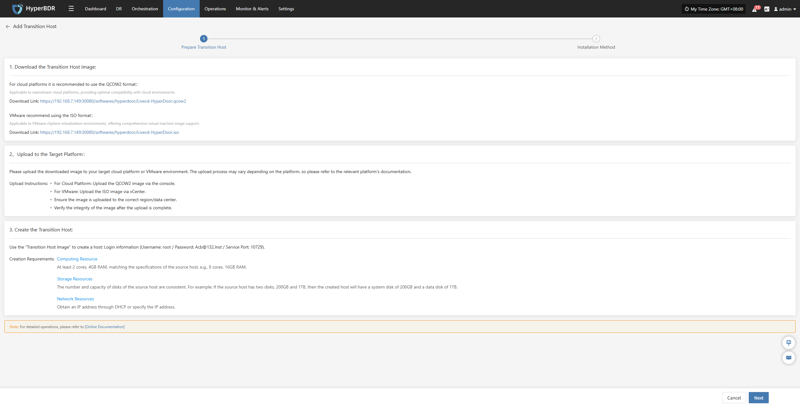

After the target Cloud Computing Platform resources are ready, click 'Next' to continue the configuration process. The system provides two installation methods, and users can choose either one according to the page prompts to complete the configuration.&#x20;

##### Installation Method 1: Console Access to Transition Host

The console can actively access the transition host network，The transition host is located on a private network or has a public IP，Data synchronization to the transition host needs to be initiated from the console.

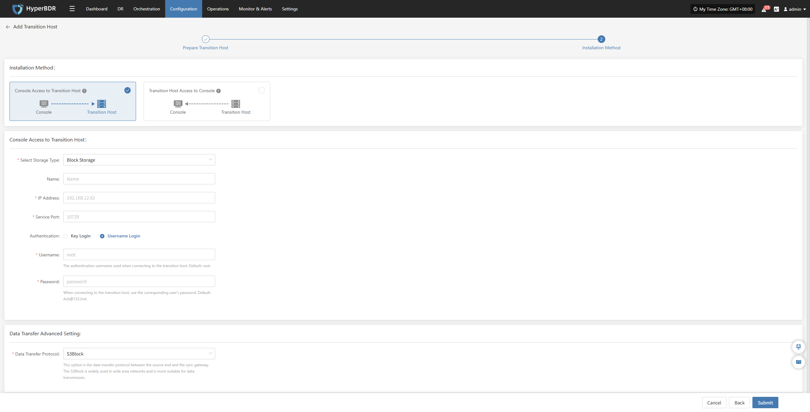

In the configuration window, select the storage method and fill in the information of the temporary transition host, such as name, IP address, service port, etc.&#x20;

* **Transition Host Configuration Instructions**

| **Configuration Item**                  | **Example Value** | **Description**                                                                                                                                                                                                                                                                                                                                                                                     |
| --------------------------------------- | ----------------- | --------------------------------------------------------------------------------------------------------------------------------------------------------------------------------------------------------------------------------------------------------------------------------------------------------------------------------------------------------------------------------------------------- |
| Storage Type                            | Block Storage     | Select the storage type for backup data writing, which supports both Block Storage and Object Storage.                                                                                                                                                                                                                                                                                              |
| Name                                    | test              | Used to identify and name the host within the HyperBDR platform.                                                                                                                                                                                                                                                                                                                                    |
| IP Address                              | 192.168.7.146     | The address of the Transition host.                                                                                                                                                                                                                                                                                                                                                                 |
| Service Port                            | 10729             | The port number that the storage service listens on, with a default value of 10729.                                                                                                                                                                                                                                                                                                                 |
| Authentication                          | Username Login    | Authentication login authentication method, currently using username + password. You can choose either key or username/password login method.                                                                                                                                                                                                                                                       |
| Username                                | root              | Store the authentication username for the connection.                                                                                                                                                                                                                                                                                                                                               |
| Password                                | Acb@132.Inst      | Store the authentication password for the connection, and it is recommended to modify the default value after deployment.                                                                                                                                                                                                                                                                           |
| Advanced Settings for Data Transmission | iSCSI             | The data transfer protocol between the source and the synchronization gateway supports S3Block and iSCSI: \  • S3Block: Suitable for wide area network environments, with high transfer efficiency; \  • iSCSI: Suitable for private network scenarios with stable network environments. \ &#x20;**&#x20;Note: This option is unavailable when the storage type is object storage.&#x20;** |

After filling in the information, click "OK", and the system will start creating the transition host. When the status shows "Available", it indicates that the addition is completed, and subsequent operations can be performed.&#x20;

##### Installation Method 2: Transition Host Access to Console

The console can actively access the transition host network，The transition host is located on a private network or has a public IP，Data synchronization to the transition host needs to be initiated from the console.

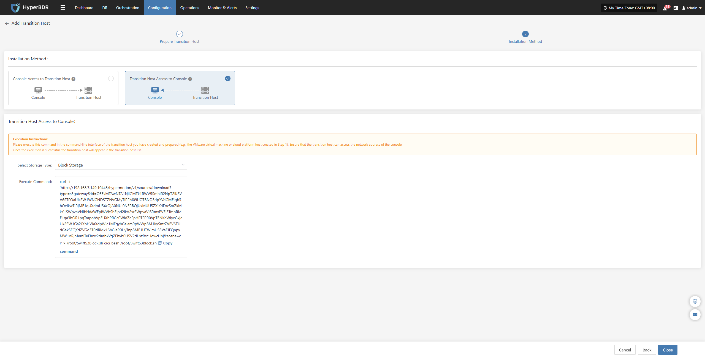

Please copy and execute this command in the command-line interface of the transition host you have created and prepared (e.g., the VMware virtual machine or Cloud Computing Platform host created in the "\<Add Transition Host" step). Ensure that the transition host can access the network address of the Console.

After the comparison of the results in the above figure is successfully executed, the transition host will appear in the transition host list.&#x20;

#### Action

After selecting the target host, click the \[Action] button on the page to perform more configurations&#x20;

##### &#x20;Data Transmission NAT

After selecting the target host, click \[Action] > \[Data Transmission NAT] to specify the external mapped IP address used for data stream synchronization.&#x20;

> Note: This function is mainly used in network environments with internal and external network isolation or NAT conversion to guide data flows to use the correct egress address, thereby ensuring the connectivity of the data transmission link between the source and destination.

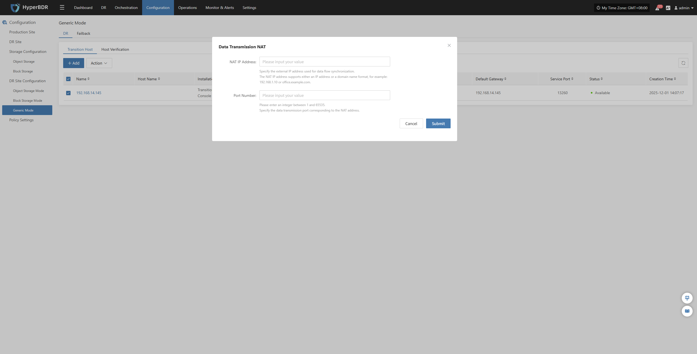

Configure the host NAT mapping address according to the network structure, complete the addition, and ensure that data traffic can be transmitted normally.

##### Delete

After selecting the target host, click \[Action] > \[Delete] to remove the transitional host.&#x20;

### Host Verification

> Only hosts that have completed the "DR > Sync > Drill" process will appear in the "Host Verification" list. Hosts that have not completed data sync will not appear here.

After starting a DR drill, related hosts will appear in this list. Wait for the verification process to complete before proceeding.

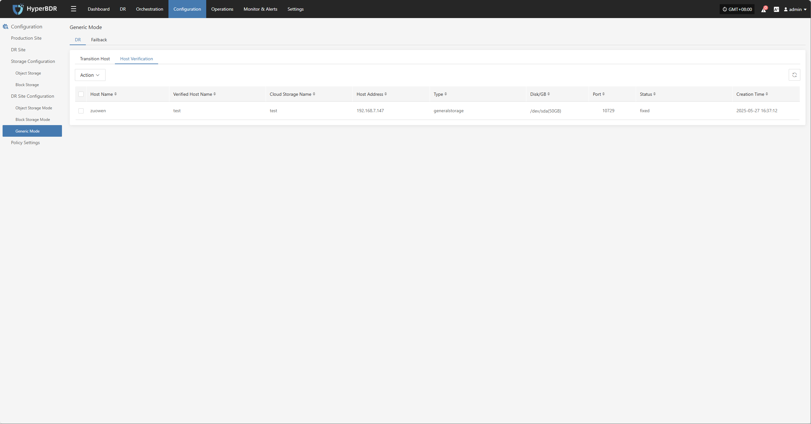

#### Action

After selecting the target host, click the \[Action] button on the page to perform driver injection and deletion operations&#x20;

##### Driver Injection

After selecting the target host, click \[Action] > \[Driver Repair] to inject the necessary drivers into the transition host and complete host recovery&#x20;

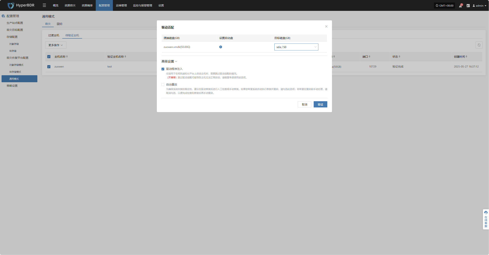

##### Delete

After selecting the target host, click \[Action] > \[Delete] to remove the host to be verified.&#x20;

## Generic Mode (Failback)

The Generic Mode is applicable to environments that currently do not support automated migration or disaster recovery processes. In this mode, users need to manually complete some operations&#x20;

### Failback Transition Host

#### Add Failback Transition Host

Through 【Configuration】 > 【DR Site Configuration】 > 【Failback】 > 【Transition Host】 > 【Add】, after entering the "Transition Host" page, click the 【Add】 button in the upper right corner. In the configuration window, please carefully read the notes and prepare the corresponding host according to the page prompts.&#x20;

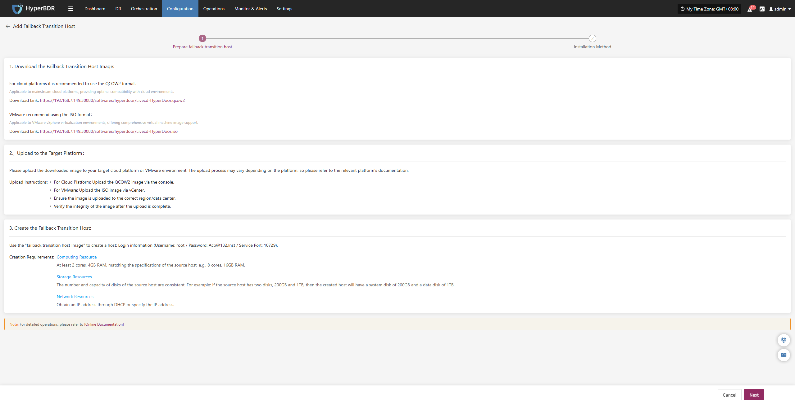

After the target Cloud Computing Platform resources are ready, click 'Next' to continue the configuration process. The system provides two installation methods, and users can choose either one according to the page prompts to complete the configuration.&#x20;

##### Installation Method 1: Console Access to Failback Transition Host

The console can actively access the transition host network，The transition host is located on a private network or has a public IP，Data synchronization to the transition host needs to be initiated from the console.

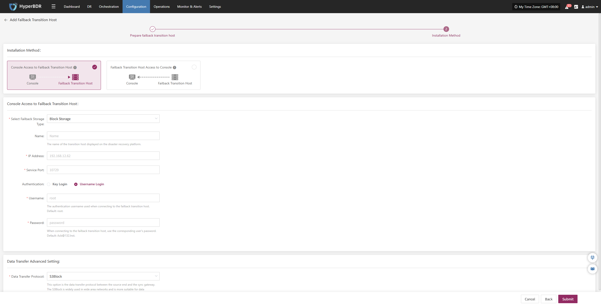

In the configuration window, select the storage method and fill in the information of the temporary transition host, such as name, IP address, service port, etc.&#x20;

* **Transition Host Configuration Instructions**

| **Configuration Item**                  | **Example Value** | **Description**                                                                                                                                                                                                                                                                                                                                                                                     |
| --------------------------------------- | ----------------- | --------------------------------------------------------------------------------------------------------------------------------------------------------------------------------------------------------------------------------------------------------------------------------------------------------------------------------------------------------------------------------------------------- |
| Storage Type                            | Block Storage     | Select the storage type for backup data writing, which supports both Block Storage and Object Storage.                                                                                                                                                                                                                                                                                              |
| Name                                    | test              | Used to identify and name the host within the HyperBDR platform.                                                                                                                                                                                                                                                                                                                                    |
| IP Address                              | 192.168.7.146     | The address of the Transition host.                                                                                                                                                                                                                                                                                                                                                                 |
| Service Port                            | 10729             | The port number that the storage service listens on, with a default value of 10729.                                                                                                                                                                                                                                                                                                                 |
| Authentication                          | Username Login    | Authentication login authentication method, currently using username + password. You can choose either key or username/password login method.                                                                                                                                                                                                                                                       |
| Username                                | root              | Store the authentication username for the connection.                                                                                                                                                                                                                                                                                                                                               |
| Password                                | Acb@132.Inst      | Store the authentication password for the connection, and it is recommended to modify the default value after deployment.                                                                                                                                                                                                                                                                           |
| Advanced Settings for Data Transmission | iSCSI             | The data transfer protocol between the source and the synchronization gateway supports S3Block and iSCSI: \  • S3Block: Suitable for wide area network environments, with high transfer efficiency; \  • iSCSI: Suitable for private network scenarios with stable network environments. \ &#x20;**&#x20;Note: This option is unavailable when the storage type is object storage.&#x20;** |

After filling in the information, click "OK", and the system will start creating the transition host. When the status shows "Available", it indicates that the addition is completed, and subsequent operations can be performed.&#x20;

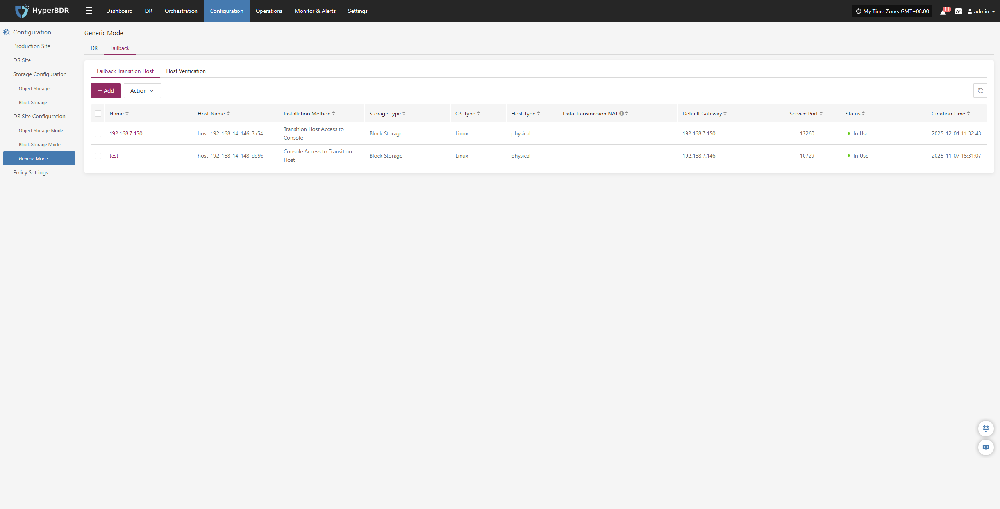

##### Installation Method 2: Transition Host Access to Console

The console can actively access the transition host network，The transition host is located on a private network or has a public IP，Data synchronization to the transition host needs to be initiated from the console.

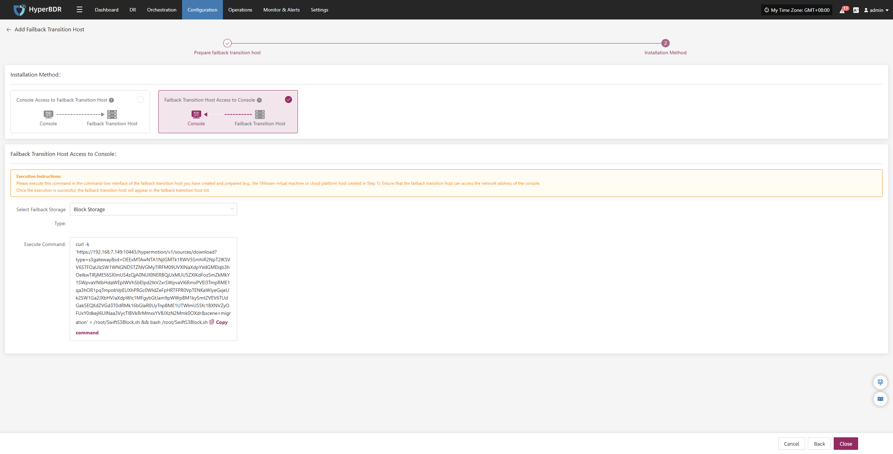

Please copy and execute this command in the command-line interface of the transition host you have created and prepared (e.g., the VMware virtual machine or Cloud Computing Platform host created in the "\<Add Transition Host" step). Ensure that the transition host can access the network address of the Console.

After the comparison of the results in the above figure is successfully executed, the transition host will appear in the transition host list.&#x20;

#### Action

After selecting the target host, click the \[Action] button on the page to perform more configurations&#x20;

##### &#x20;Data Transmission NAT

After selecting the target host, click \[Action] > \[Data Transmission NAT] to specify the external mapped IP address used for data stream synchronization.&#x20;

> Note: This function is mainly used in network environments with internal and external network isolation or NAT conversion to guide data flows to use the correct egress address, thereby ensuring the connectivity of the data transmission link between the source and destination.

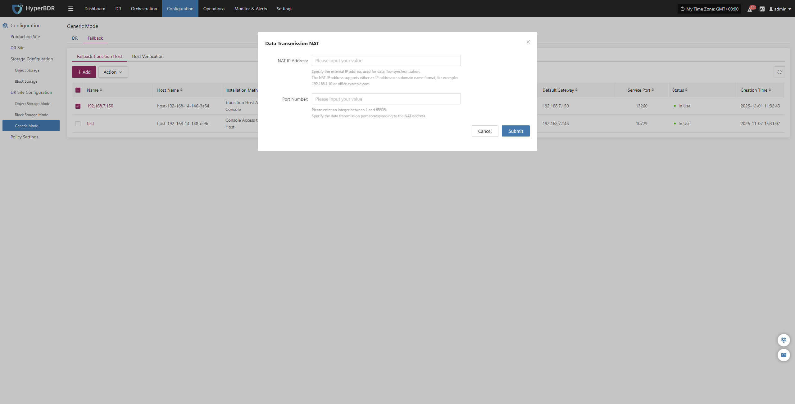

Configure the host NAT mapping address according to the network structure, complete the addition, and ensure that data traffic can be transmitted normally.

##### Delete

After selecting the target host, click \[Action] > \[Delete] to remove the transitional host.&#x20;

### Host Verification

> Only hosts that have completed the "DR > Sync > Drill" process will appear in the "Host Verification" list. Hosts that have not completed data sync will not appear here.

After starting a DR drill, related hosts will appear in this list. Wait for the verification process to complete before proceeding.

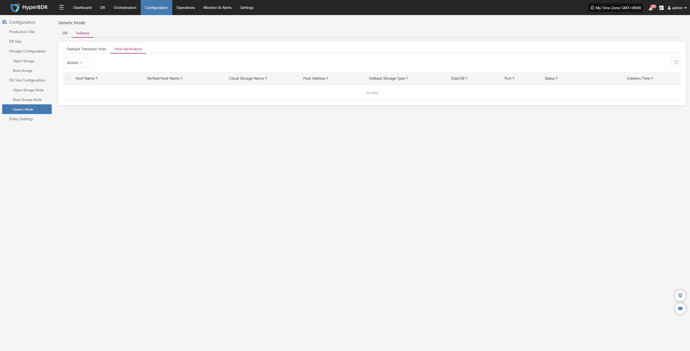

#### Action

After selecting the target host, click the \[Action] button on the page to perform driver injection and deletion operations&#x20;

##### Driver Injection

After selecting the target host, click \[Action] > \[Driver Repair] to inject the necessary drivers into the transition host and complete host recovery&#x20;

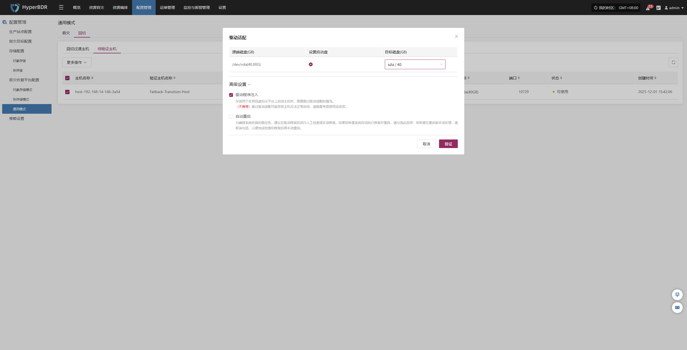

##### Delete

After selecting the target host, click \[Action] > \[Delete] to remove the host to be verified.&#x20;
