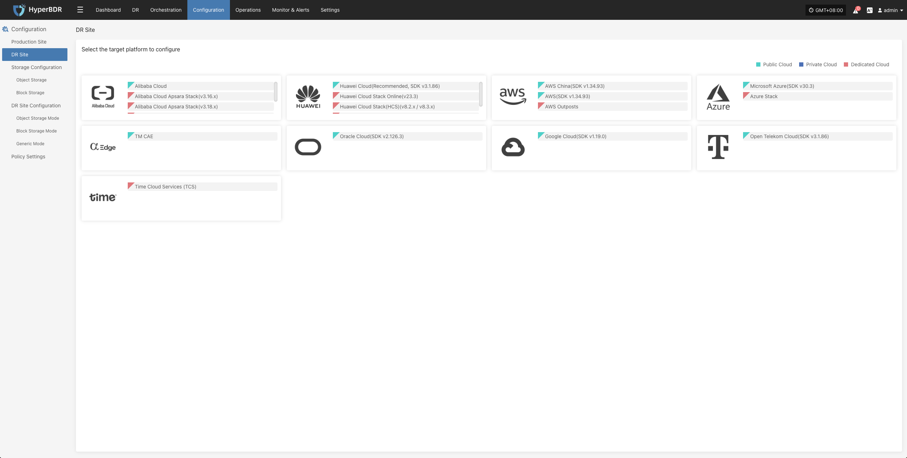

# DR Site

Click "Configuration" in the top menu bar, then "DR Site". Select the target platform to add according to the target cloud platform provider, and choose the storage type. Both "Block Storage Mode" and "Object Storage Mode" are supported.

Note: If you can choose both block storage mode and object storage mode in the pop-up storage type selection, it means that the current cloud service provider has been integrated and supports both modes. If only one can be selected, it means that only one mode has been integrated.

Please follow the prompts to enter authentication information to configure the disaster recovery target platform.

Reference for disaster recovery target configuration cloud providers:

+ [Object Storage Mode](../configuration/storage-configuration.md#object-storage)
+ [Block Storage Mode](../configuration/storage-configuration.md#block-storage)