# **Production Site**

Currently, the source production platform supports two modes: **Agent** and **Agentless**. The Agent mode is relatively universal, requiring the installation of an Agent program inside the source operating system to perform data backup. As the name suggests, Agentless mode does not require installing an agent inside the operating system to complete data backup. However, this requires the source virtualization, private cloud, or cloud platform to provide native API interfaces for external access to read the host's disk data, and the disaster recovery product needs to be adapted and developed to support this.

* Scenarios supported by Agent and Agentless

  * Agent mode is suitable for various source operating system scenarios, including physical machines, virtual machines, and cloud hosts.

  * Agentless mode supports: VMware, OpenStack + Ceph, AWS EC2, FusionCompute, and Google Cloud.

* Source operating system support matrix

  * Source Agentless operating system support list:  
        <https://oneprocloud.feishu.cn/sheets/VRqksSPEPhRTPStp3kVcItXNnyh?sheet=0MJNYC>

  * Source Agent operating system support list:  
        <https://oneprocloud.feishu.cn/sheets/VRqksSPEPhRTPStp3kVcItXNnyh?sheet=Y9fpqO>

## **VMware**

The VMware platform page on the production site is mainly used for adding, deleting, updating, and other related management operations for the VMware platform.

### **Add VMware Platform**

Click **"Production Site"** in the left navigation bar, select **VMware**, and click the **"Add"** button. Follow the steps in the pop-up window to add the platform.

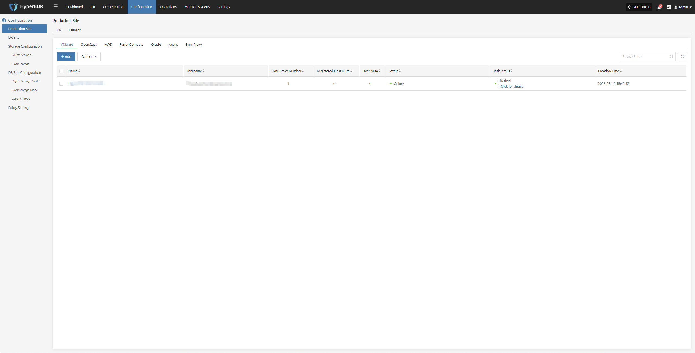

#### **Deploy Sync Proxy**

Follow the guided steps below:

* Step 1: Download the source sync proxy OVA file.

  * Click the download link on the page

  * Internet OVA download link: <https://hyperbdr-system-image-do-not-delete.obs.ap-southeast-3.myhuaweicloud.com/proxy-agent_BaseOS.ova>

* Step 2: Use the OVA file to import into the VMware cluster, deploy one or more source sync proxy virtual machines, and configure the IP address.

* Step 3: Install the source sync proxy. Log in to the newly created sync proxy VM. The default username and password are (root/Acb@132.Inst)

* Step 4: Copy and execute the sync proxy installation command.

* Network policy requirements:

|     **Source**     |     **Target**      | **Port** |           **Description**           |
|:------------------:|:-------------------:|:--------:|:------------------------------------:|
|     Sync Proxy     | HyperBDR Console    |  10443   |      Authentication port            |
|     Sync Proxy     | HyperBDR Console    |  30080   | Installation package download port  |

* Sync Proxy resource specifications:

Sync Proxy can be horizontally scaled to multiple hosts to improve backup concurrency and network bandwidth utilization. By default, a single Sync Proxy node can mount up to 50 disks for synchronization. If you need to support more, consider scaling out the number of Sync Proxy nodes.

The following are the specifications for a single Sync Proxy node (supports up to 50 disks):

Sync Proxy expansion can be performed by repeating this operation on multiple nodes. After installation, nodes will automatically register with the platform. You can manage Sync Proxy nodes and bind them to agentless production platforms as needed.

Reference steps: Sync Proxy

|     **Parameter**     |     **Specification**     |
|:---------------------:|:--------------------------:|
|       OS Version      |       Ubuntu 20.04         |
|          CPU          |            4C              |
|        Memory         |           8GB              |
|      System Disk      |           50GB             |

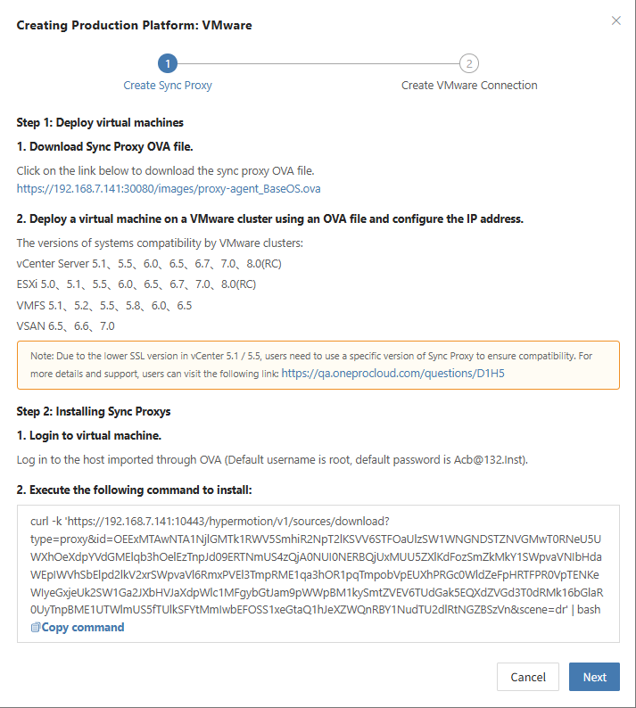

#### **Create VMware Production Platform**

1. Obtain authentication information

|     **Parameter**     |              **Example**              |                                                             **Description**                                                             |
|:---------------------:|:-------------------------------------:|:----------------------------------------------------------------------------------------------------------------------------------------:|
|    Auth Address       | https://<vCenter/ESXi Host>:443       | When adding a vCenter/ESXi link, if the source uses domain management, you need to obtain the domain and IP mapping in advance and add it to the platform for proper resolution. [Reference](https://hypermotion.yuque.com/fe338c/qzb4z6/hbgii4h7vi73hh3k#WghOa) |
|       Username        | Username for vCenter/ESXi host        | Username for connecting to vCenter or ESXi.                                                                                             |
|       Password        | Password for vCenter/ESXi host        | Password for connecting to vCenter or ESXi.                                                                                             |
|      Sync Proxy       | Sync Proxy host IP                    | After installation, you can select from the dropdown, no need to manually add the IP.                                                   |

* Network policy requirements

|    **Source**    |     **Target**     | **Port** |                                                **Description**                                                 |
|:----------------:|:------------------:|:--------:|:---------------------------------------------------------------------------------------------------------------:|
|   Sync Proxy     |   vCenter/ESXi     |   443    |                                     Authentication port                                                         |
|   Sync Proxy     |    ESXi Hosts      |   902    | Data port. If the backup VM runs on multiple ESXi hosts, you need to open port 902 on all relevant ESXi hosts for Sync Proxy access. |


* Permission requirements

HyperBDR uses VMware's CBT (Change Block Tracking) technology to achieve incremental data synchronization. CBT tracks changed blocks on virtual disks, allowing only the changed data to be transferred during backup and replication.

You need relevant VMware permissions to call the APIs. For details on permissions and account creation, refer to:

<https://docs.oneprocloud.com/zh/userguide/poc/vmware-pre-settings.html#vmware%E7%94%A8%E6%88%B7%E6%9D%83%E9%99%90%E8%A6%81%E6%B1%82>

After filling in the required authentication information, click the Confirm button to add.

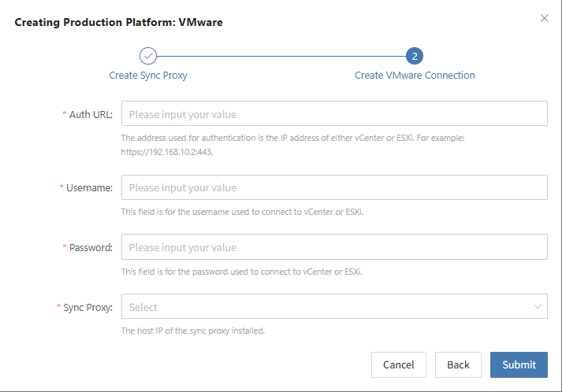

#### **Complete VMware Addition**

The VMware production platform configuration is complete. Wait until the platform status is normal and the number of cluster hosts is obtained before proceeding with subsequent steps.

Note: You can repeat the above steps to add multiple VMware clusters, or add a single ESXi host.


---

## **OpenStack**

The OpenStack page under the Production Platform section is mainly used for managing OpenStack platforms, including adding, deleting, and updating them.

### **Add OpenStack Platform**

Click **"Production Site"** in the left navigation panel, select **OpenStack**, and click the **"Add"** button. Follow the step-by-step instructions in the pop-up window to add a platform.


#### **Deploy Sync Proxy**

Follow the guided steps below:

* Step 1: Create a cloud virtual machine

You can manually create a VM using the Ubuntu 20.04 operating system. If using an OpenStack platform or other KVM-based virtualization platform, you can download and import a standard Ubuntu 20.04 QCOW2 image.

Ubuntu 20.04 QCOW2 image download link: [https://downloads.oneprocloud.com/docs_images/ubuntu-20.04-server-cloud-init-amd64.qcow2](https://downloads.oneprocloud.com/docs_images/ubuntu-20.04-server-cloud-init-amd64.qcow2)

Note: This Ubuntu 20.04 image does not have a default login password. The image includes the cloud-init service, so the cloud platform must support password injection via cloud-init. Otherwise, the image cannot be used.


* Step 2: Copy and execute the Sync Proxy installation command.

1. Network Policy Requirements

| **Source**  | **Target**       | **Port** | **Description**              |
|:-----------:|:----------------:|:--------:|:----------------------------:|
| Sync Proxy  | HyperBDR Console |  10443   | Authentication communication |
| Sync Proxy  | HyperBDR Console |  30080   | Installation package access  |


2. Sync Proxy Resource Specifications

| **Parameter** | **Specification** |
|:-------------:|:-----------------:|
| OS Version    |    Ubuntu 20.04   |
| CPU           |        4C         |
| Memory        |       8GB         |
| System Disk   |       50GB        |


#### **Create OpenStack Production Platform**

1. Obtaining OpenStack connection information

Reference: \<FAQ How to obtain OpenStack authentication information>

| **Parameter**       | **Example**                                                   | **Description**                                                  |
|:-------------------:|:-------------------------------------------------------------:|:----------------------------------------------------------------:|
| **Auth Address**    | http://192.168.10.201:5000/v3 | Typically the OpenStack Keystone public Endpoint URL.<br>Use DNS resolution if domain names are used.<br>[Reference](https://hypermotion.yuque.com/fe338c/qzb4z6/hbgii4h7vi73hh3k#WghOa) |
| **User Domain ID**  | default                                                       | Domain ID of the user connecting to OpenStack                    |
| **Username**        | Username                                                      | Username used to connect to OpenStack                            |
| **Password**        | Password                                                      | Password used to connect to OpenStack                            |
| **Project Domain ID** | default                                                     |                                                                 |
| **Project Name**    | admin                                                        | Name of the project the OpenStack user belongs to                |
| **Region Name**     | RegionOne                                                    | Region Name of the OpenStack cluster                             |
| **Sync Proxy**      | Sync Proxy Host IP                                           | After installation, selectable from dropdown without manual IP  |


* Network Policy Requirements

| **Source**     | **Target**    | **Ports**                              | **Description**                |
|:--------------:|:-------------:|:------------------------------------:|:------------------------------:|
| Sync Proxy     | OpenStack    | 5000, 35357, 9696, 8774, 8776, 9292 | OpenStack authentication ports |


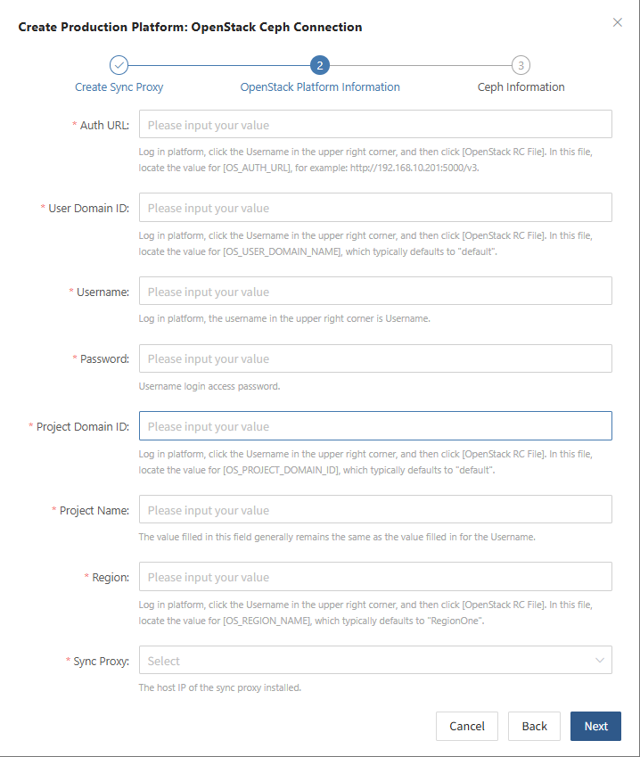

2. Obtaining Ceph Authentication Information

| **Parameter**              | **Example**                                   | **Description**                                                                                                                   |
| :------------------------: | :-------------------------------------------: | :--------------------------------------------------------------------------------------------------------------------------------: |
| **Control Node Addresses** | 10.0.0.201,10.0.0.202,10.0.0.203              | IP addresses of Ceph control nodes (e.g., 10.0.0.201). Ensure network connectivity. Use commas (`,`) to separate multiple entries. |
| **Enable CephX Auth**      | Yes                                           | + Yes <br>+ No                                                                                                                         |
| **Username**               | cinder                                        | Ceph username (e.g., cinder or admin).                                                                                            |
| **Keyring**                | AQBBY9hfBc0+AxAAzyy<br>m+6l+MeTpMlgNTbye/A==      | Ceph key value. Run `cat /etc/ceph/ceph.client.cinder.keyring` on the Ceph control node to view it.                               |
| **Storage Pool**           | volumes                                       | Name of the Ceph storage pool. **Be sure to select the pool containing the protected host's data!** Run `ceph osd ls pools` to list pools. |
| **Incremental Fetch Type** | rbd diff                                      | + `rbd diff`: Slower but accurate  + `rbd du`: Faster but less accurate                                                                               |
| **Cluster**                | ceph                                          | Default is `ceph`. To check, run `cat /usr/lib/systemd/system/ceph-mon@.service` on the control node.                             |
| **OpenStack Volume Types** | DEFAULT_VOLUME_TYPE, ssd, sata                | Run `openstack volume type list` on the OpenStack control node to view available volume types.                                    |


If there are multiple Ceph clusters, you may repeat the above process to add each one.

* Network Policy Requirements

| Source     | Target                      | Port | Description                                                               |
|:----------:|:---------------------------:|:----:|:-------------------------------------------------------------------------:|
| Sync Proxy | OpenStack Ceph Monitor Node | 6789 | Authentication port. Used for Ceph API access and backup data collection. |


#### **Complete OpenStack Addition**

Once the OpenStack production platform configuration is completed and the platform status becomes "Healthy", and the number of cluster hosts has been retrieved, you may proceed to the next steps.

Note: You may repeat the above steps to add multiple OpenStack clusters.

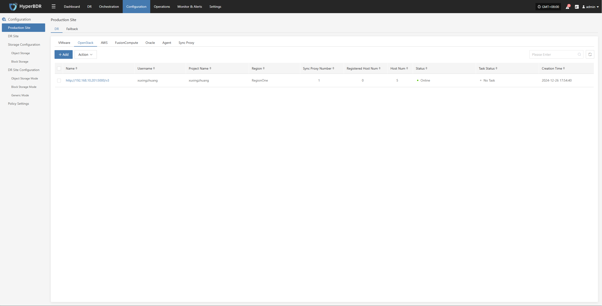

---

## **AWS**

The AWS production platform page primarily provides functions for adding, deleting, and updating AWS platforms.

### **Add AWS Platform**

Navigate to **"Production Site"** from the left sidebar, select **AWS**, and click the **"Add"** button. Follow the steps in the pop-up dialog to complete the configuration.

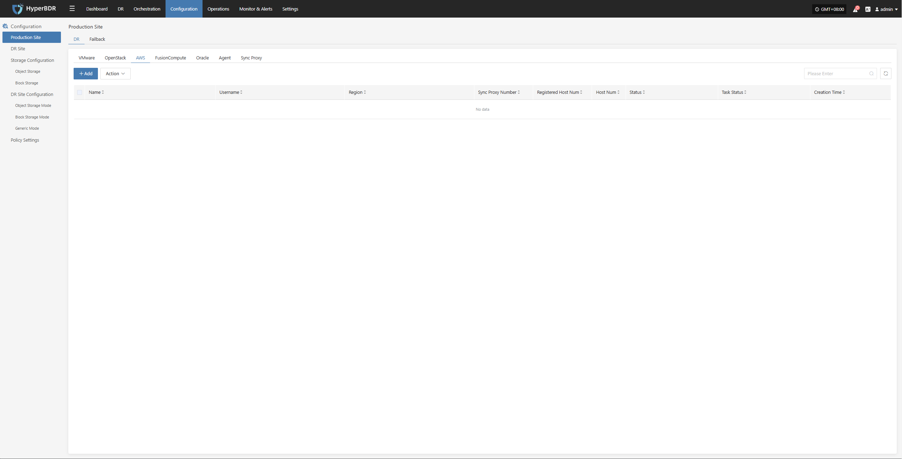

#### **Deploy Sync Proxy**

Follow the step-by-step guide to perform the following operations:

* **Step 1: Create a Cloud Host**

On the AWS platform, create a new cloud host using the native **AWS EC2 Ubuntu 20.04** image to deploy the Sync Proxy.

* **Step 2: Copy and Execute the Sync Proxy Installation Command**

1. **Network Policy Requirements**

| **Source**   | **Target**         | **Port(s)** | **Description**                   |
|:------------:|:------------------:|:-----------:|:---------------------------------:|
| Sync Proxy   | HyperBDR Console   | 10443       | Authentication communication      |
| Sync Proxy   | HyperBDR Console   | 30080       | Access port for package download  |


2. **Recommended Sync Proxy Specifications**

| **Parameter** | **Specification** |
|:-------------:|:-----------------:|
| OS Version    | Ubuntu 20.04      |
| CPU           | 4C                |
| Memory        | 8GB               |
| System Disk   | 50GB              |

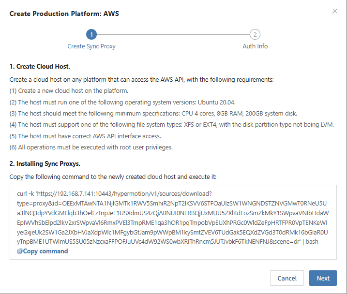

#### **Create AWS Production Platform**

1. AWS Connection Information

> Reference Document: \<FAQ - How to obtain AWS authentication information>

| Parameter             | Example                  | Description                                                                                                                                                                                            |
|:---------------------:|:------------------------:|:------------------------------------------------------------------------------------------------------------------------------------------------------------------------------------------------------:|
| Access Key ID         | `AWS Access Key ID`      | The key used to access AWS APIs with full permissions for the account.<br/>Log in to the AWS Console → Click your username at the top right corner → Select "Security Credentials" → Choose "Users".     |
| Access Key Secret     | `AWS Access Secret Key`  | The secret key paired with the Access Key ID, granting full permissions to access AWS APIs.<br/>Same access path as above.                                                                             |
| Region                | ap-southeast-1           | The region where the target machine is located. Defaults to auto-detection, refresh to select manually. For manual input, refer to the AWS regional endpoints documentation:<br/>[AWS Regional Endpoints](https://docs.aws.amazon.com/general/latest/gr/rande.html) |
| Source Sync Proxy     | `192.168.7.26`           | IP address of the host where the sync proxy is installed.                                                                                                                                              |
| Advanced Settings + Name | `Custom Name`           | Custom name for the production platform. You may set it manually or keep the default, which is automatically generated based on region, platform, and timestamp.                                     |

- **Network Policy Requirements**

| **Source** |     **Target**     | **Port** | **Description**                                                                                                                                                                                                                                                                                                                                                                                                                                   |
| :--------: | :----------------: | :------: | :------------------------------------------------------------------------------------------------------------------------------------------------------------------------------------------------------------------------------------------------------------------------------------------------------------------------------------------------------------------------------------------------------------------------------------------------ |
| Sync Proxy | AWS EC2<br>AWS EBS |    443   | Port used for authentication communication with AWS services.<br><br>Ensure access to AWS EC2 and EBS service addresses:<br>+ If accessing via **public network**, the EC2 instance must have a **public IP** and a proper **public access policy** configured.<br>+ If accessing via **private network**, confirm that the EC2 instance supports **VPC Endpoint** services and can resolve and access EC2 and EBS services via **internal DNS**. |

- **Permission Requirements**

When using AWS Direct APIs for data backup, the account must have the required permissions. For permission setup and account creation, refer to:

[https://docs.oneprocloud.com/userguide/poc/aws-pre-settings.html#aws-iam-preparation](https://docs.oneprocloud.com/userguide/poc/aws-pre-settings.html#aws-iam-preparation)

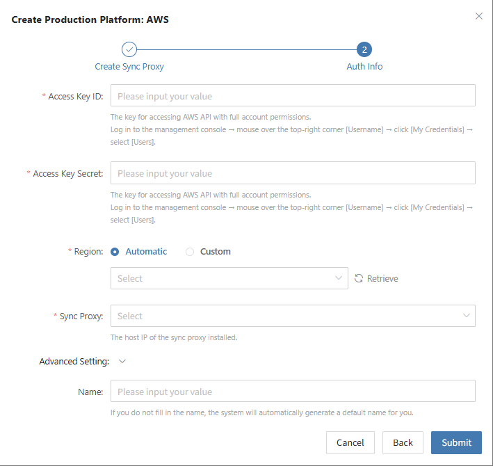

#### **Complete AWS Platform Addition**

Once the AWS production platform configuration is complete, wait for the platform status to become **"Normal"**, and for the EC2 instance list to be successfully fetched. After that, you may proceed with additional steps.

> **Note:** You can repeat the above steps to add multiple AWS regions.

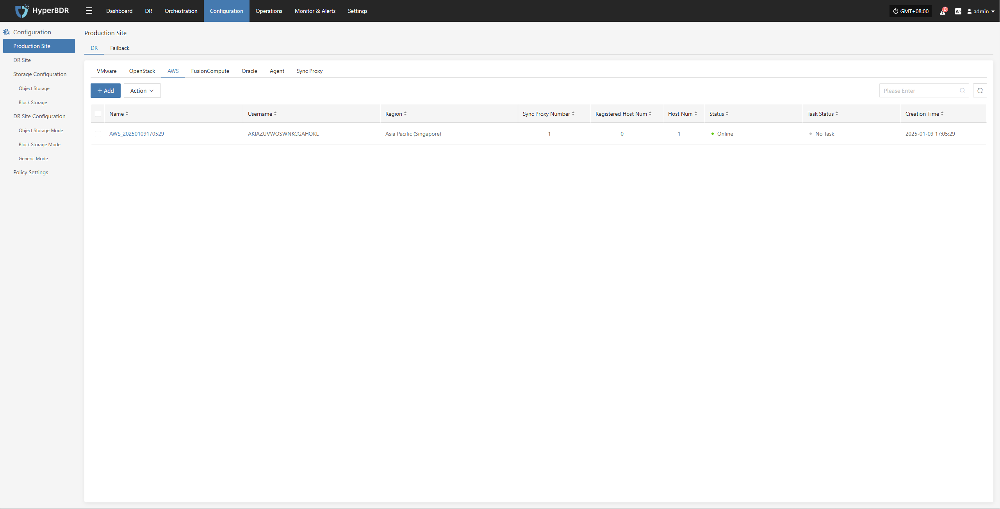

---

## **Source Agent**

1. When the source (protected) end is a physical machine or a single virtual machine of various types (such as KVM/Xen/Hyper-V, etc.), relevant configuration is required.

2. In this scenario, the **Agent** disaster recovery method needs to be used.

3. Different operating systems (Windows, Linux) require different **Agent**.

Agent operating system support matrix: <https://oneprocloud.feishu.cn/sheets/VRqksSPEPhRTPStp3kVcItXNnyh?sheet=Y9fpqO>

4. Prerequisites

   * There is a host to be protected (x86 physical machine/KVM/Xen/Hyper-V, etc.)
   * Host username/password has been obtained (for backup)
   * HyperBDR disaster recovery tool has been installed and logged in
   * Network policies have been configured to allow the source host to access **HyperBDR** and **Cloud Sync Gateway**
   * For Windows hosts running security software, please add the Windows Agent program to the whitelist or stop the security software in advance

5. Network policy requirements

| **Source**           | **Target**                | **Port** | **Description**                                                                                             |
|:--------------------:|:-------------------------:|:--------:|:----------------------------------------------------------------------------------------------------------|
| Windows/Linux Host   | HyperBDR Console          | 10443    | Authentication communication port                                                                          |
| Windows/Linux Host   | HyperBDR Console          | 30080    | Installation package download port                                                                         |
| Windows/Linux Host   | Cloud Sync Gateway        | 3260     | Data sync port (iSCSI protocol) <br>+ For block storage iSCSI protocol                                     |
| Windows/Linux Host   | Cloud Sync Gateway        | 443      | Data sync port (HTTPS protocol) <br>+ For block storage HTTPS protocol                                     |
| Windows/Linux Host   | Object Storage Services   | 443      | Data sync port (object storage HTTPS/HTTP protocol) <br>+ For object storage mode <br>Note: If the target object storage uses a domain name during data sync, you need to add DNS or static hosts resolution in advance |


### **Linux Agent**

#### **Install Linux Agent**

Click "Configuration Management" in the top menu bar, then click "Production Site" in the left navigation bar, select "Source Agent", and click "Copy Command" to get the Linux Agent installation command.


Log in to the source Linux Host, paste and execute the command in the terminal.


Wait for the command to finish executing. When the installation is successful, you can check the registered host on the platform.


#### **Uninstall Linux Agent**

Before uninstalling the Agent, make sure that the Linux host has been deregistered from the HyperBDR platform.

* Log in to the source Linux operating system

* Execute the uninstall command

```plaintext
bash /var/lib/egisplus-agent/uninstall_agent.sh
```

Wait for the script to finish executing. If "Uninstall successful" is displayed, it means the Linux Agent has been successfully uninstalled from the source host.


### **Windows Agent**

#### **Install Windows Agent**

Click "Configuration Management" in the top menu bar, then click "Production Site" in the left navigation bar, click "Source Agent", and download the Windows Agent installation package according to the source operating system version by clicking the "Download Now" button.


1. Log in to the source Windows host

2. Upload the downloaded Windows Agent installation package

Windows Agent installation package: **windows-agent.zip**

3. Extract the Windows Agent installer

Extract the windows-agent.zip file as administrator

* Extract the directory files

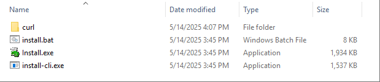

4. Run the installer

Run install.exe in the extracted directory as administrator

Right-click the Install.exe program and select "Run as administrator"


In the pop-up installer window, select "Install >" to start the installation.


In the pop-up prompt, make sure there is no security software running before installation. If security software is running, it may block the installation and operation of the Windows Agent program, or even identify it as a virus or illegal software and delete it, causing installation failure.

If you have security software running, please add the Windows Agent program to the whitelist before running the installer again.

Due to the diversity of security software, please consult the relevant security vendor or your organization's security administrator for specific whitelist configuration methods.

For reference on adding to the whitelist for some security software: <https://docs.oneprocloud.com/userguide/faq/faq.html#configuration-of-antivirus-software-on-windows-agent-source-host>

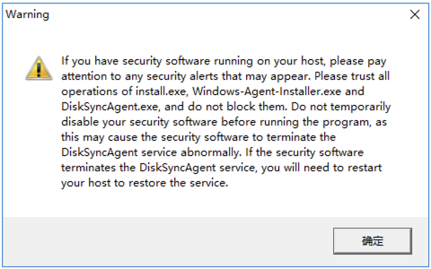

If you have completed the above security settings, click OK to continue the installation.

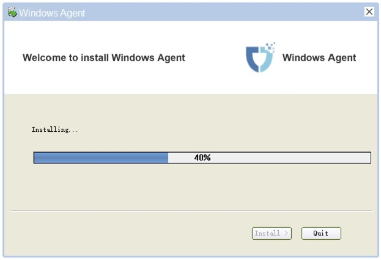

Wait for the installer to finish. When prompted that the installation is complete, you can click "Yes" to start the Windows Agent service.

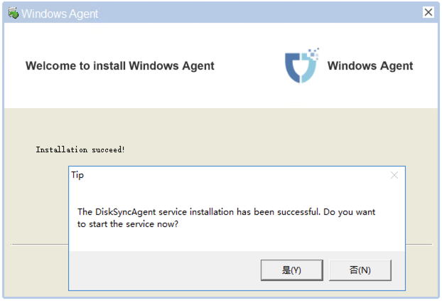

#### **Start Windows Agent**

On the Windows Agent service startup page, first click "Precheck" in the lower left corner to perform a pre-check before starting the service.

The pre-check mainly verifies the Windows Agent runtime environment and internal dependencies of the host system. After all pre-checks pass, you can proceed to start the Windows Agent.

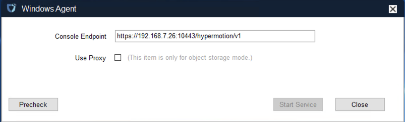

* Precheck item description

| **Check Item** | **Check Description**                                                                                                                                                                                                    | **Explanation**                                                                                                                                                        | **Failure Solution** |
| -------------- | ------------------------------------------------------------------------------------------------------------------------------------------------------------------------------------------------------------------------ | ---------------------------------------------------------------------------------------------------------------------------------------------------------------------- | -------------------- |
| (1/9)          | Check whether there is permission to start Windows services and query the status of Windows services.                                                                                                                    | Check if there is permission to start Windows services and query their status.                                                                                         |                      |
| (2/9)          | Check whether the display language under the system user can support English.                                                                                                                                            | Check if the display language under the system user supports English.                                                                                                  |                      |
| (3/9)          | Check whether there is any security software blocking the creation and deletion of VSS shadows using the `vssadmin` command.                                                                                             | Check if any security software blocks creation and deletion of VSS shadows via the `vssadmin` command.                                                                 |                      |
| (4/9)          | Check whether there is any security software blocking the installation and startup of Windows Agent.                                                                                                                     | Check if any security software blocks installation and startup of the Windows Agent.                                                                                   |                      |
| (5/9)          | Check whether the volume file system and volume free space meet the synchronization requirements.                                                                                                                        | Check if the volume file system and free space meet synchronization requirements.                                                                                      |                      |
| (6/9)          | Check whether there are unsupported volume types. (RAID-5, Mirror, Stripe, and Spanned volume types are not supported)                                                                                                   | Check if unsupported volume types exist (RAID-5, Mirror, Stripe, and Spanned volumes are not supported).                                                               |                      |
| (7/9)          | Check whether the patch KB4474419 has been installed. (This patch must be installed if the operating system is Windows 2008 or Windows 2008 R2)                                                                          | Check if patch KB4474419 is installed (required for Windows 2008 or 2008 R2).                                                                                          |                      |
| (8/9)          | Check whether there are VSS shadows created by third-party software on the current host. (It is recommended to delete the created VSS snapshots and stop other software from using VSS to create and delete VSS shadows) | Check if VSS shadows created by third-party software exist. It is recommended to delete these snapshots and prevent other software from creating/deleting VSS shadows. |                      |
| (9/9)          | Check whether there are Windows backup schedules. (The execution time of such schedules may lead to synchronization failure. It is recommended to disable them.)                                                         | Check if Windows backup schedules exist. These schedules may cause sync failure; disabling them is recommended.                                                        |                      |

According to the results of the precheck, handle any issues as prompted. Once all checks have passed, you can click "OK".


At this point, you can click the "Start Services" button to start the Windows Agent service.


Based on the warning messages, check again for any running security software. You must trust the Windows Agent program to avoid startup failures or data synchronization failures.

If everything is confirmed to be normal, you can click "OK" to complete the startup of the Windows Agent service.


If there are no other prompts, the Windows Agent has started successfully.

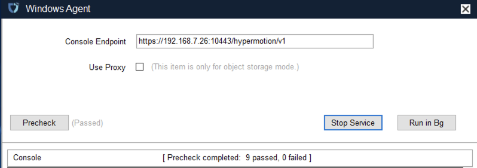

Log in to the HyperBDR console to check the registration status and proceed with subsequent steps.

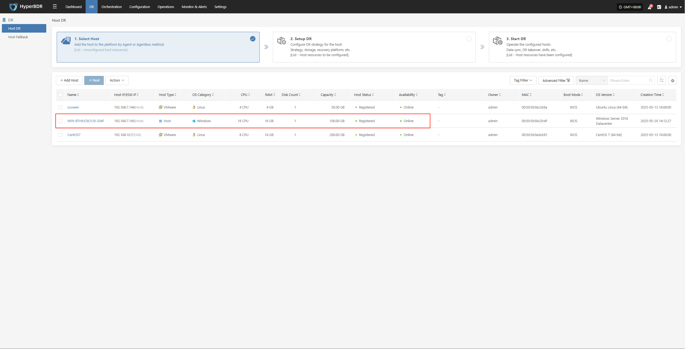

#### **Uninstall Windows Agent**

Since uninstalling the Windows Agent follows the standard Windows software uninstallation process, here we demonstrate the steps using one version as an example. For other Windows versions, refer to similar steps.

Click the Windows icon in the lower left corner and select "Control Panel".

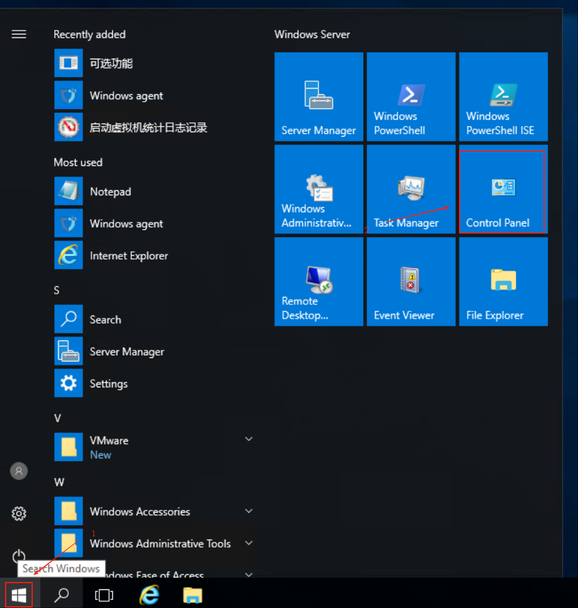

In the pop-up page, find "Programs" and click "Uninstall a program".

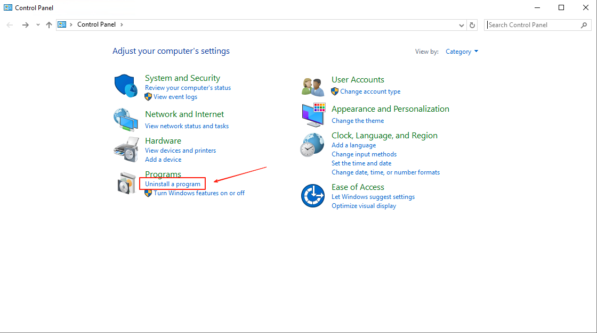

Find Windows_Agent version number, published by OneProCloud, right-click and select "Uninstall/Change (U)".

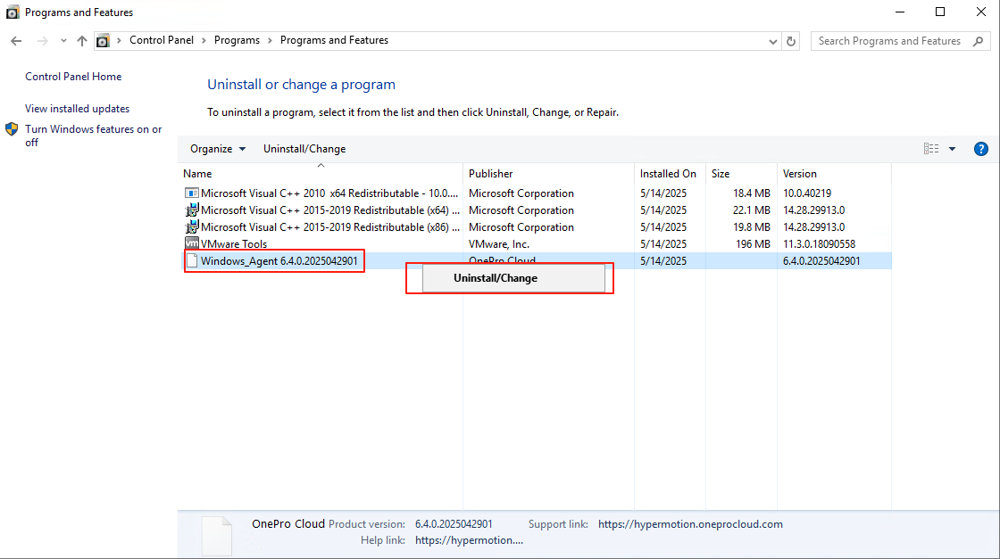

In the pop-up uninstall dialog, click "Yes" to confirm uninstallation.


Wait for the uninstaller to finish, then click OK to complete the uninstallation of the Windows Agent program.


---

## **Source Sync Proxy**

### **Technical Principle Description**

Mainly used in scenarios where the source production platform is VMware, OpenStack + Ceph, or AWS. The core function of this component is to deploy an agentless sync program, which performs data backup by calling the interfaces of the source production platform. The Source Sync Proxy is responsible for obtaining data from the source platform and efficiently transferring backup data to the target disaster recovery site over the local network.

It is recommended to deploy the Sync Proxy on the source production platform side, using the internal network for close-range interface calls to avoid security and reliability issues caused by long-distance network calls. During backup, the Sync Proxy acts as a proxy node for outbound backup data from the source.

* **Internal:** The Sync Proxy only needs to access the management and storage networks of the source VMware, OpenStack + Ceph, or AWS platform to call interfaces and obtain data.

* **External:** The Sync Proxy only needs to open network access to the target disaster recovery platform, avoiding direct exposure of the source production platform's network structure.

This architecture is flexible, secure, and reliable, and is suitable for various production platform scenarios.


Multiple Sync Proxy nodes can be deployed. One Sync Proxy can be bound to one or more source production platforms, and multiple Sync Proxies can also be bound to a single source production platform.

When multiple Sync Proxies are bound to one source production platform, it means that multiple Sync Proxy nodes will be used to call the source production site for data backup. The backend will balance the load of the Sync Proxy nodes through internal algorithms to ensure concurrency during business backup.

The Source Sync Proxy is mainly used for management operations of agentless sync proxies on the source production side, including basic settings, binding, unbinding, and deletion.

### **Settings**

Select the Source Sync Proxy that has been added to the platform, click the "Actions" button, and select "Settings" to configure the relevant parameters of the Sync Proxy node.


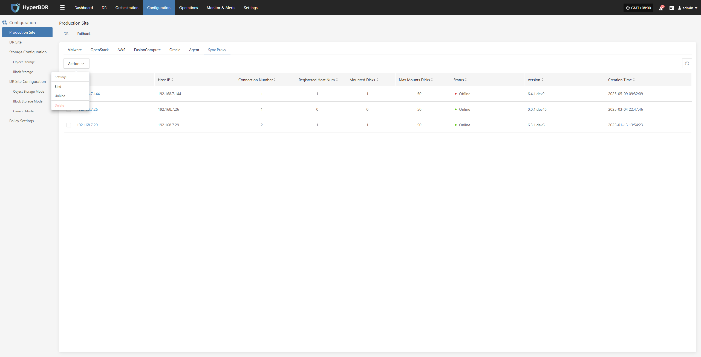

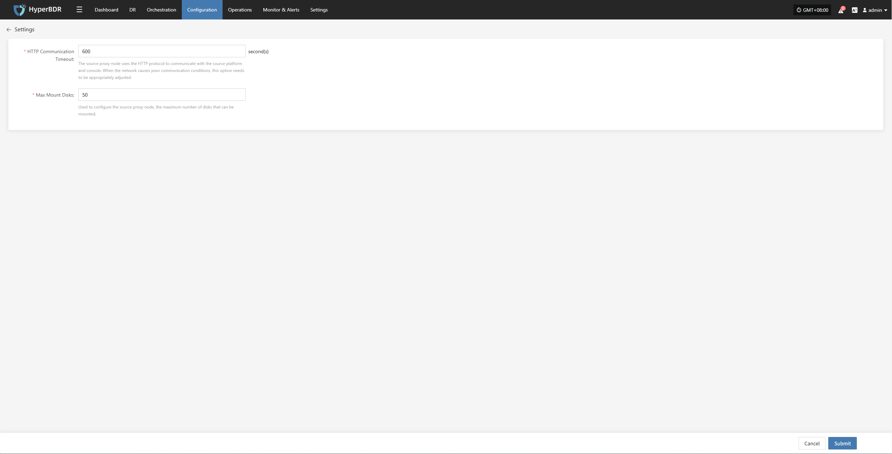

* Description of configuration parameters

| **Parameter**           | **Default** | **Description**                                                                                                                                                                                                                   |
| ----------------------- | ----------- | --------------------------------------------------------------------------------------------------------------------------------------------------------------------------------------------------------------------------------- |
| **HTTP Communication Timeout** | 600       | This setting means: when the source proxy node communicates with the source production platform and console via HTTP, if there is no response for more than 600s, the program will interrupt the connection and mark it as failed. If the network environment is poor, you can increase this value to allow more retry time. |
| **Maximum Number of Mounted Disks** | 50        | This setting configures the maximum number of disks that can be mounted by the source proxy node.<br>By default, a Sync Proxy can mount up to 50 cloud disks for data synchronization. If you need more, you should scale out the number of Sync Proxy nodes.<br>You can also increase the CPU and memory of the Sync Proxy node and modify this parameter, but it is recommended not to exceed 150. |

### **Bind**

Select the Source Sync Proxy that has been added to the platform, click the "Actions" button, and select "Bind". Choose an already added source production site to bind. After successful binding, this Sync Proxy will act as a node to call the bound source production site for data backup.
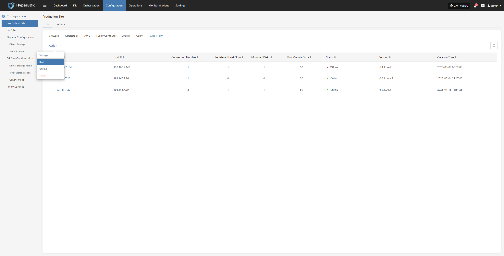
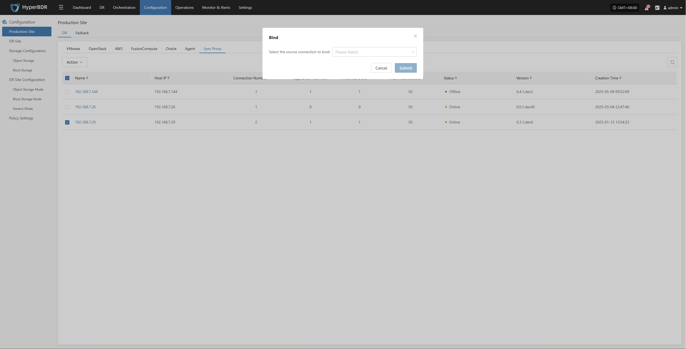

Note:

* One Sync Proxy node can be bound to one or more source production sites.
* Multiple Sync Proxy nodes can be bound to one source production site.

When multiple Sync Proxy nodes are bound to one source production site, it means that multiple Sync Proxy nodes will be used to call the source production site for data backup. The backend will balance the load of the Sync Proxy nodes through internal algorithms to ensure concurrency during business backup.

Attention:

Currently, multiple Sync Proxy nodes do not support failover. They only provide horizontal scaling for concurrent backup capability. If one Sync Proxy node fails, the backup tasks assigned to that node will fail and will not automatically transfer to other nodes. You need to manually recover from the failure.

### **Unbind**

Select the Source Sync Proxy that has been added to the platform, click the "Actions" button, and select "Unbind". Choose a bound source production site to unbind, and click "OK".


Note:

Before unbinding, make sure that there are no backup tasks bound to the current Sync Proxy node. Only then can you unbind. After successful unbinding, this Sync Proxy can be deleted or continue to be bound to other source production sites for service.

### **Delete**

Select the Source Sync Proxy that has been added to the platform, click the "Actions" button, and select "Delete". Make sure that the current Sync Proxy node is not bound to any source production site. If there are bound source production sites, the delete button will be disabled. You need to "Unbind" first, and after successful unbinding, you can proceed with deletion.

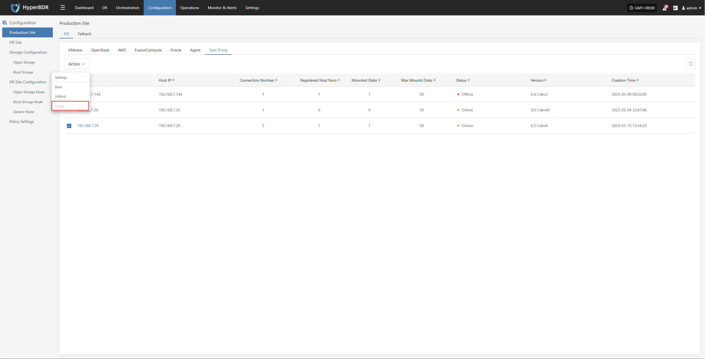

---