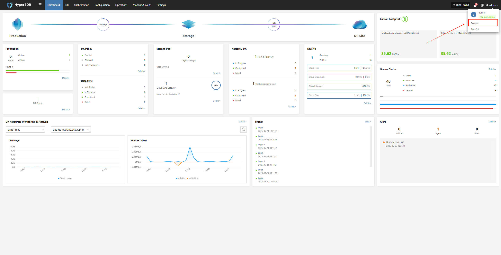
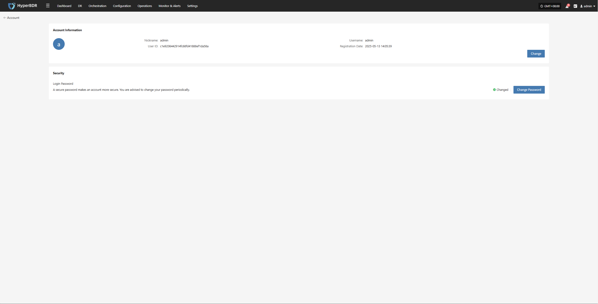
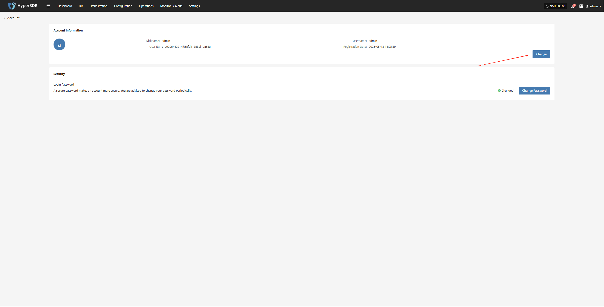
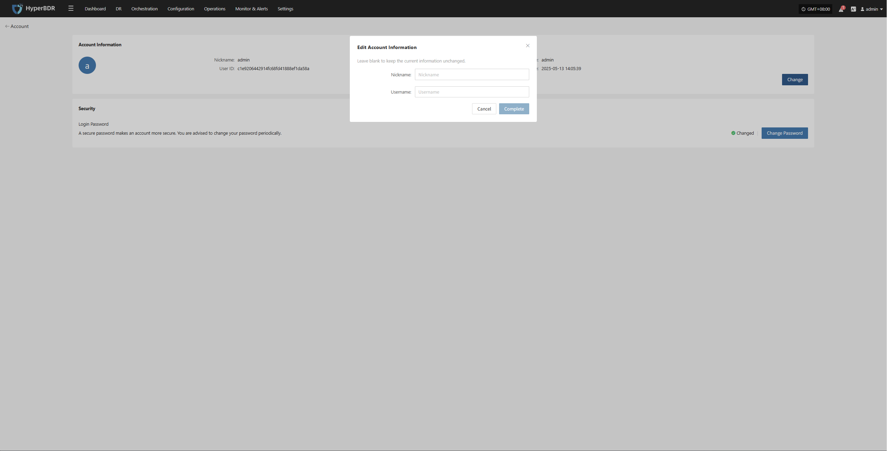
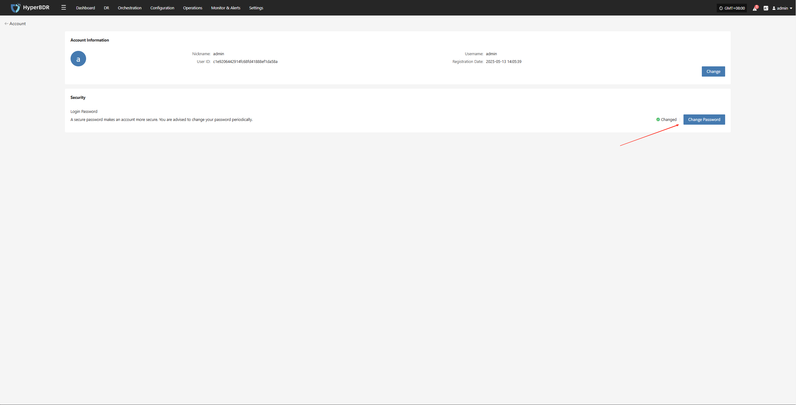

# Profile

Our system provides comprehensive account management features, allowing you to easily view, update, and manage your account details while ensuring security.

### **Account**

After logging in, click your username at the top right corner and select "Account" from the dropdown menu to view your account details.

The basic information page displays the following account details:

- **Nickname:** admin
- **Username:** admin
- **User ID:** c1e9206442914-XXXXXXXXXXXXX
- **Registration Date:** 2025-05-13 14:05:39

**Security:**

- **Login Password:** Set

> Tip: Using a strong password significantly improves your account security. We recommend updating your password regularly.

### **Change Account Information**

Your account information includes basic details such as username and registration time. If you need to update certain information, please follow the system instructions.

On the "Account" page, click the "Edit" button to modify your username and nickname.

- **Nickname:** Used for display purposes only and does not affect login.
- **Username:** The unique identifier for logging into the system. After changing it, please use the new username for future logins.

> Note: After changing your username, make sure to remember your new login name to avoid access issues. The login account for the Operations Management Platform will also be updated accordingly.

### **Change Password**

To keep your account secure, we recommend changing your password regularly, especially using a strong and unique password.

On the "Account" page, click the "Change Password" button to start the password update process.

> Note: Your new password must be 8-20 characters long, contain both uppercase and lowercase letters and numbers, and may include special characters (except spaces). After changing your password, please remember it to avoid login issues. The password for the Operations Management Platform will also be updated.

#### **Password Management Tips**

- Change your password regularly, especially if you suspect your account security may be compromised.
- Avoid using the same password across multiple platforms. Use complex and unique passwords to enhance your account security.

