# Alibaba Cloud

## **Add Block Storage**

From the top navigation bar, select **"Configuration" → "Storage Configuration" → "Block Storage"** to enter the block storage page. Click the "Add" button in the upper right corner to add a new block storage configuration.

### **Add Platform Account**

Select "Alibaba Cloud" from the block storage platform dropdown list. Fill in the following authentication information according to your actual environment:

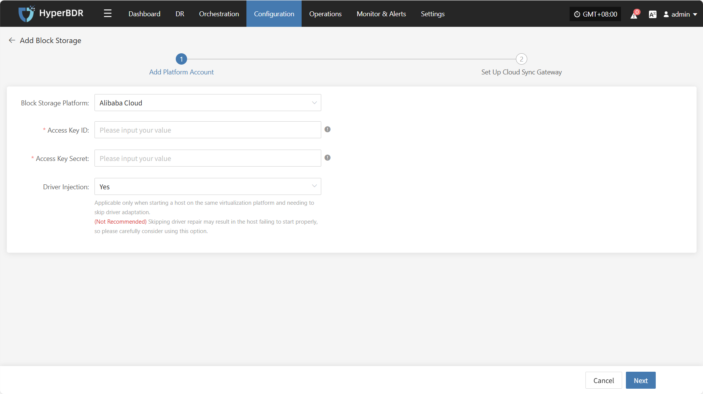

* **Add Platform Account Description**

| **Field**           | **Example Value**                          | **Description**                                                                  |
| ----------------- | -------------------------------- | ----------------------------------------------------------------------- |
| Block Storage Platform             | Alibaba Cloud                              | Find and select Alibaba Cloud from the dropdown list.                                                          |
| Access Key ID     | HPUAAG0B2•••••••••••••••         | The key for accessing Alibaba Cloud API, with full account permissions. Log in to the management console → top right personal info → [Accesskey Management].                  |
| Access Key Secret | •••••••••••••••••••••••••••••••• | The key for accessing Alibaba Cloud API, with full account permissions. Log in to the management console → top right personal info → [Accesskey Management].                  |
| Driver Injection            | Yes / No                            | Only applicable when starting hosts on the same virtualization platform. Skip driver adaptation only if necessary. (Not recommended) Skipping driver adaptation may cause the host to fail to start properly. Please use this option with caution. |

After adding the platform account, click **"Next"** to start **"Set Up Cloud Sync Gateway"**.

### **Set Up Cloud Sync Gateway**

For the Cloud Sync Gateway, configure the region, subnet, etc., to ensure stable and efficient operation in the target environment.

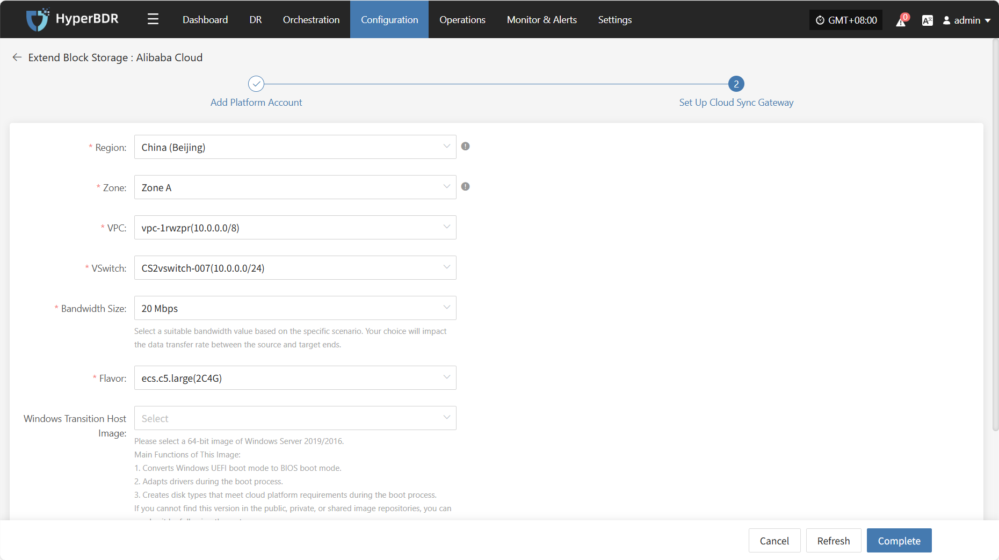

* **Cloud Sync Gateway Setup Description**

| **Field**             | **Example Value**                                      | **Description**                                                                                                                                                                                                                      |
| ------------------ | ------------------------------------------ | --------------------------------------------------------------------------------------------------------------------------------------------------------------------------------------------------------------------------- |
| Region             | China (Beijing)                             | Please select the region where the cloud sync gateway will be installed.                                                                                                                                                                                                            |
| Zone               | Zone A                                      | Select the available zone in the chosen region from the dropdown list.                                                                                                                                                                                                        |
| VPC                | vpc-1lgooc (10.0.0.0/12)                    | Select the VPC to which the cloud sync gateway belongs from the dropdown list, based on your actual environment.                                                                                                                                                                                                |
| VSwitch            | vswitch-1u7yiu (10.0.0.0/16)                | Select the subnet in the chosen available zone from the dropdown list, based on your actual environment.                                                                                                                                                                                                  |
| Bandwidth Size     | 20 Mbps                                     | Choose the appropriate bandwidth value according to your needs. Your choice will affect the data transfer rate from the source to the target.                                                                                                                                                                                      |
| Flavor             | ecs.c5.large(2C4G)                          | Select the appropriate cloud sync gateway specification.                                                                                                                                                                                                                  |
| Windows Transition Host Image | Windows Server 2019 Datacenter Edition 64-bit Chinese (Recommended) | Main Functions of This Image: 1. Converts Windows UEFI boot mode to BIOS boot mode. 2. Adapts drivers during the boot process. 3. Creates disk types that meet cloud platform requirements during the boot process. If you cannot find this version in the public, private, or shared image repositories, you can resolve it by following these steps: 1. Upload to the Private Image Repository: Upload the image file to object storage and then import it from object storage into the private image repository. 2. Obtain a Shared Image: If another account in the same region has the mentioned Windows version, you can request them to share it with you for use. |

* **Data Transfer Advanced Setting**

| **Field**             | **Options**                   | **Description**                                                                                 |
|-----------------------|------------------------------|------------------------------------------------------------------------------------------------|
| Data Transfer Protocol| S3Block / iSCSI (Not Recommended) | The protocol for data transfer between the source and the sync gateway. S3Block is widely used for WAN and is more suitable for data transfer. iSCSI is for storage networks and suitable for stable network environments. |

After completing the cloud sync gateway setup, click **"Finish"**. The system will automatically create the cloud sync gateway and transition host image.

### **View Details**

During the creation process, click "View List" to see the detailed list of created cloud sync gateways.

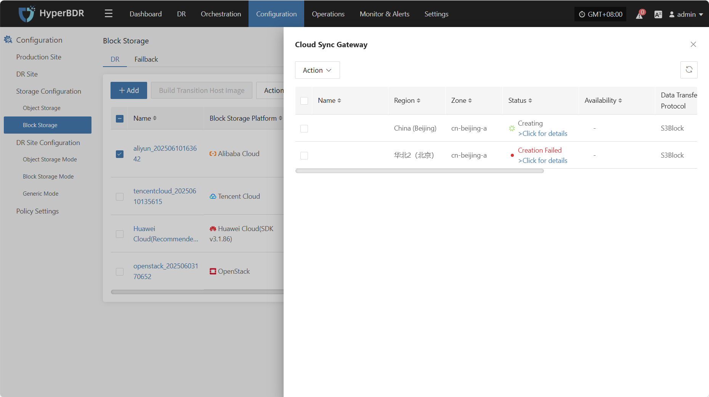

Select the corresponding host and click "View Details" to see detailed logs generated during the task creation process. This helps you quickly understand the execution status and troubleshoot issues.

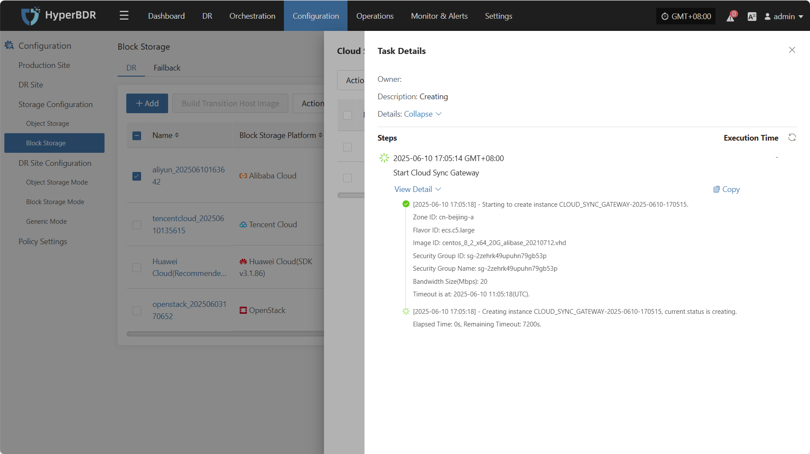

## **Action**

### **Modify**

Click "Extend" to modify the authentication information.

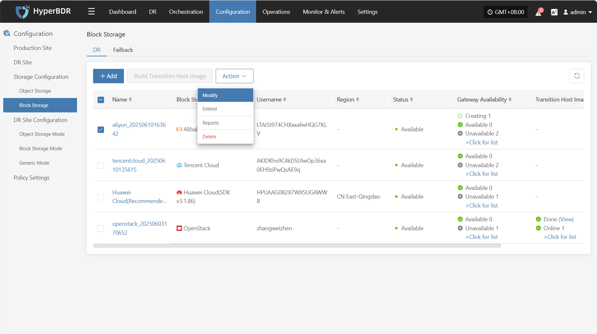

### **Extend**

Click "Extend" to modify or edit the cloud sync gateway.

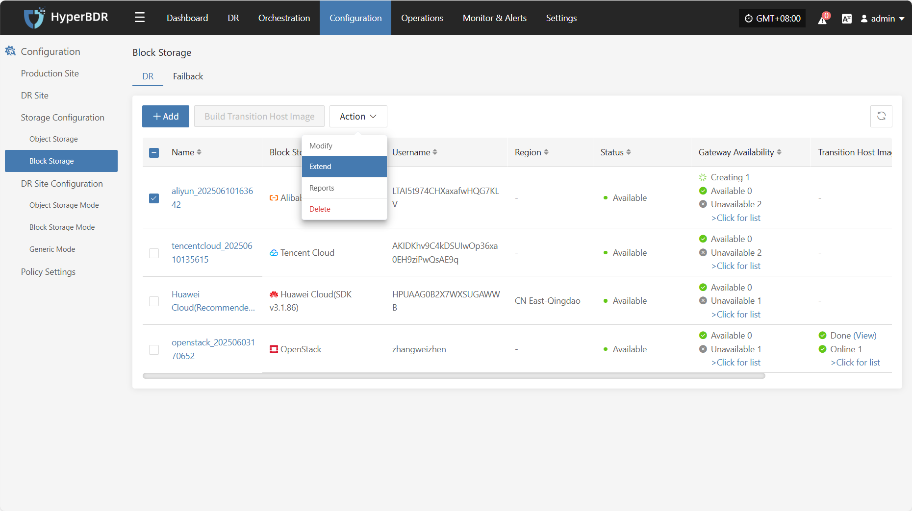

### **Report**

Click "Export Report" to export the corresponding cloud sync gateway report information.

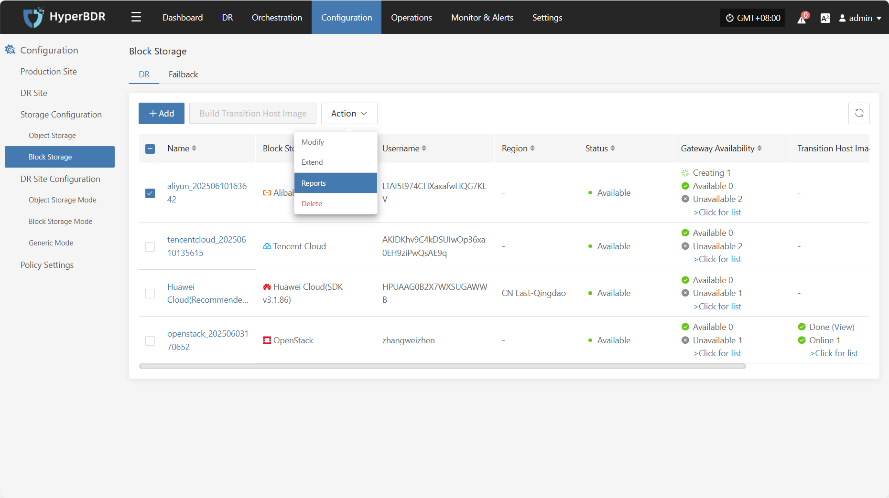

Select the report type, collection range, time zone, and time range, then click Next. You can select the hosts for which you want to export the report.

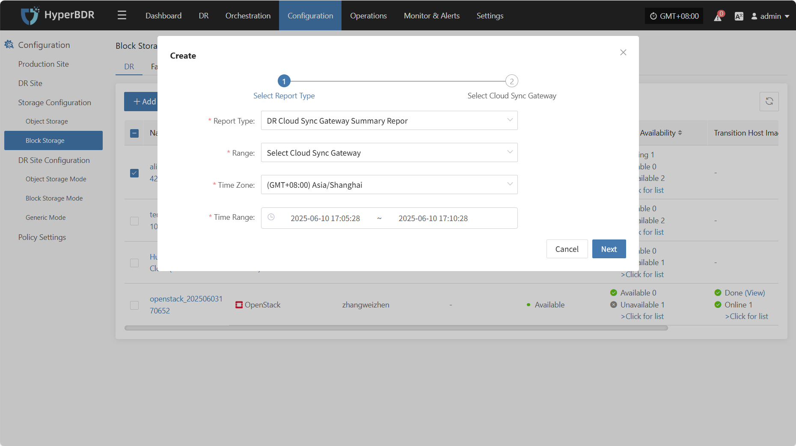

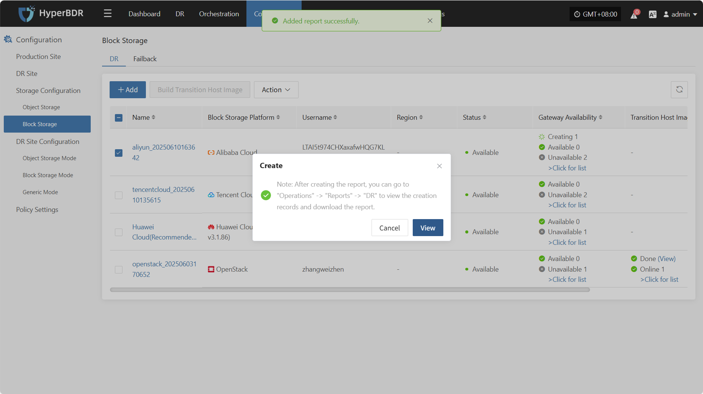

### **Delete**

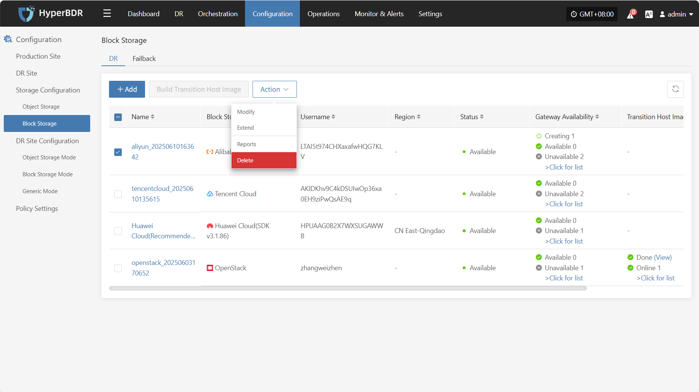

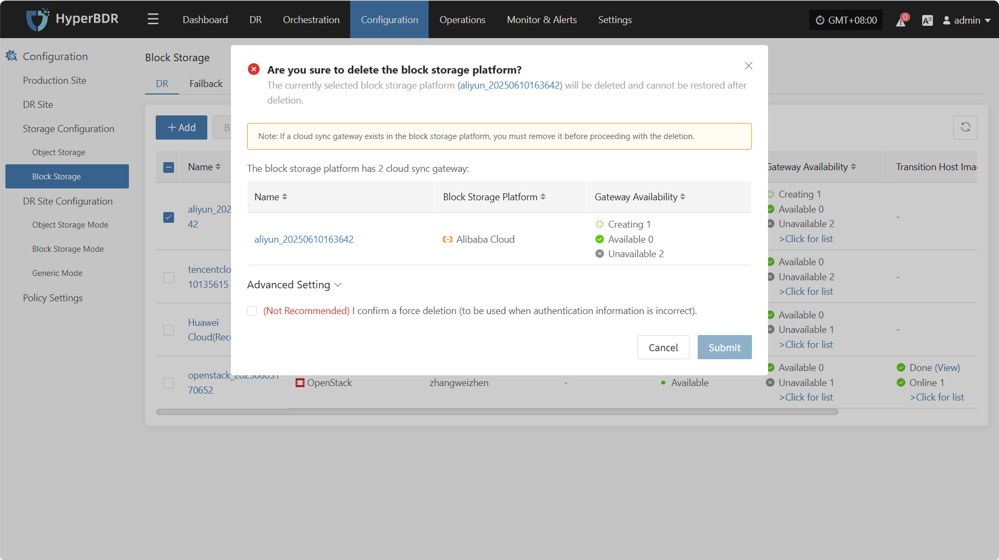

