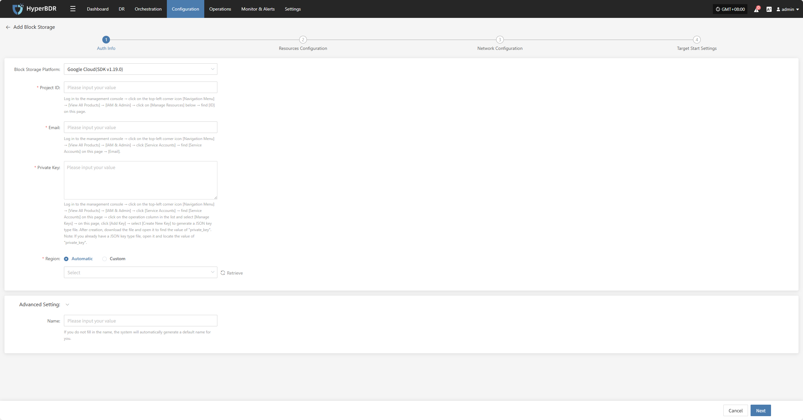
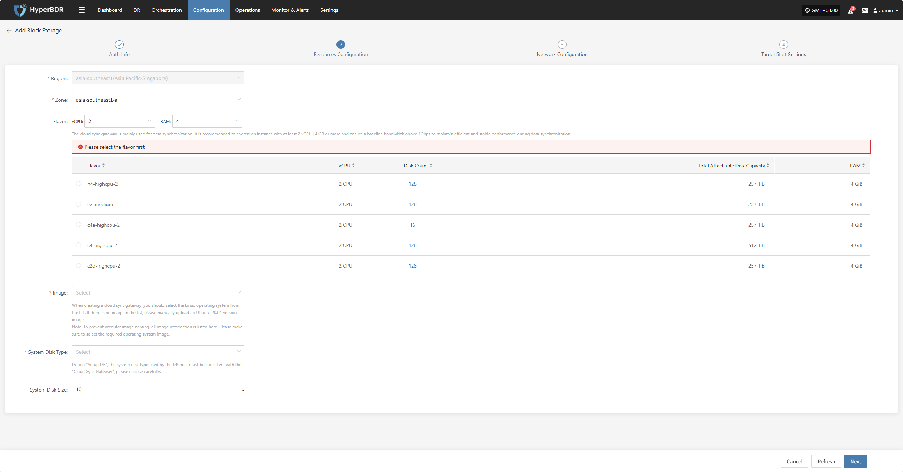
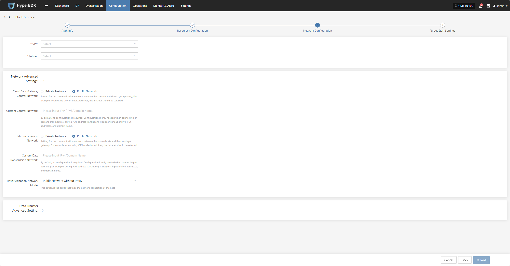
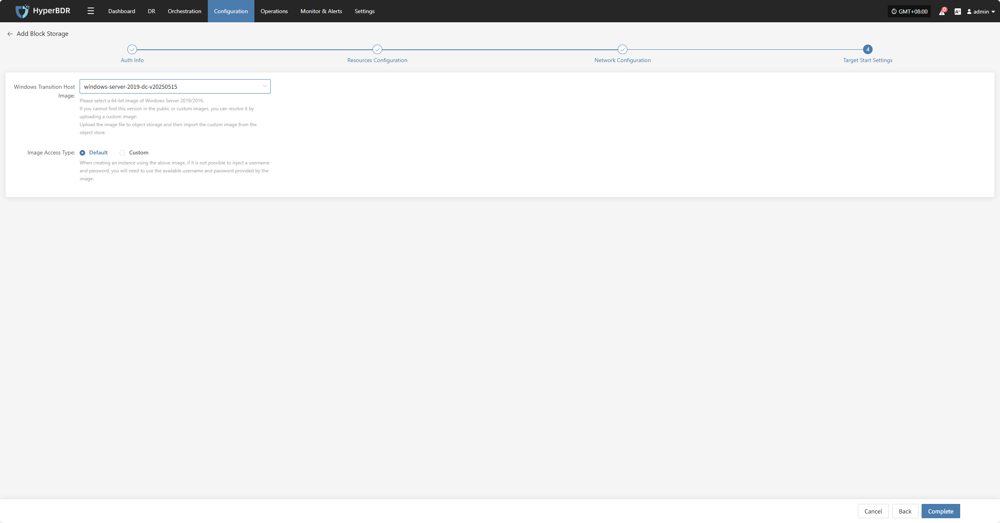
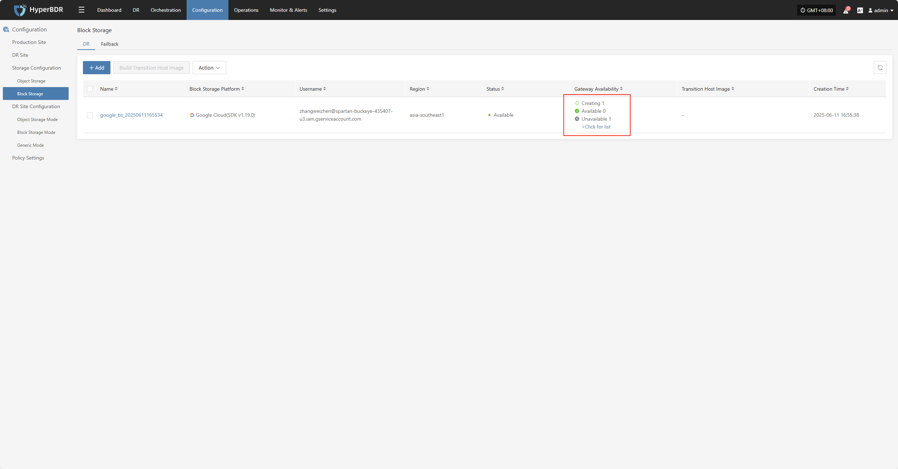
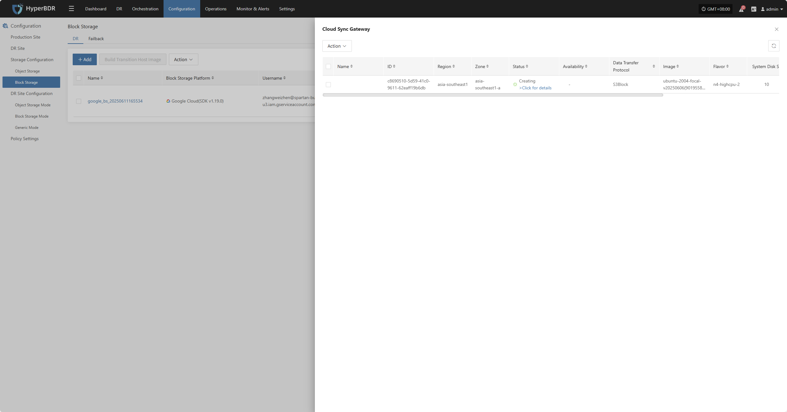
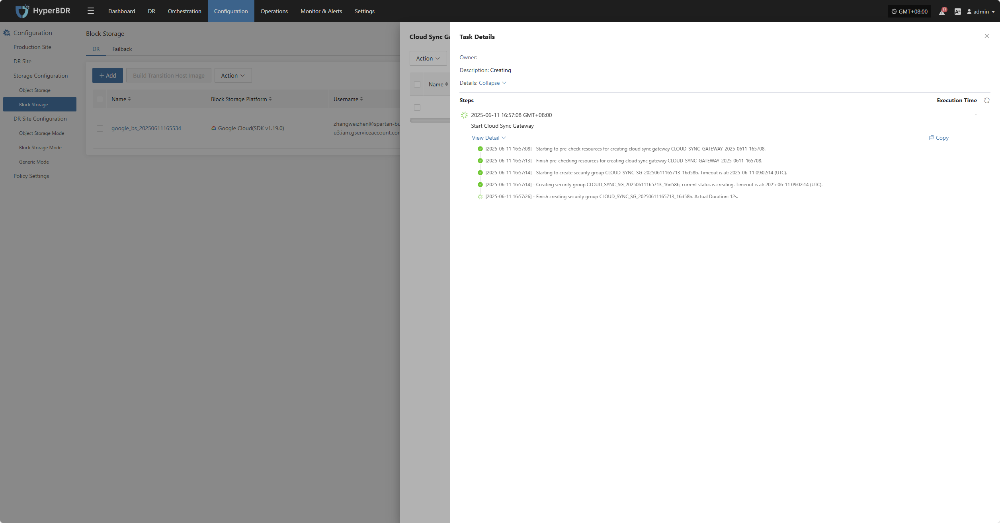

# **Google Cloud(sDK v1.19.0)**

## **Add Block Storage**

From the top navigation bar, select **"Configuration" → "Storage Configuration" → "Block Storage"** to enter the block storage page. Click the "Add" button in the upper right corner to add a new block storage configuration.

### **Auth Info**

Select "Google cloud(sDK v1.19.0)" from the block storage platform dropdown list. Fill in the following authentication information according to your actual environment:

> If you're unsure how to obtain the relevant information, you can click 'Click to View' below for detailed instructions: 
> [👉 Click to View](../../faq/faq.html#_1-project-id)

* Auth Info Description

| **Configuration Item**      | **Example Value**                | **Description**                                                                                                                                                                                                                                                                                                                                                                                                     |
|-----------------------|-------------------------------|--------------------------------------------------------------------------------------------------------------------------------------------------------------------------------------------------------------------------------------------------------------------------------------------------------------------------------------------------------------------------------------------------------------|
| Block Storage Platform | Google Cloud(SDK v1.19.0)      | Find and select Google Cloud(SDK v1.19.0) from the dropdown list.                                                                                                                                                                                                                                                                                                                                                            |
| Project ID             | HPUAAG0B2•••••••••••••••        | Log in to the management console → click the top-left [Navigation Menu] → [View All Products] → [IAM & Admin] → click [Manage Resources] below → find [ID] on this page.                                                                                                                                                                                                                   |
| Email                  | •••••••••••••••••••••••••••••••• | Log in to the management console → click the top-left [Navigation Menu] → [View All Products] → [IAM & Admin] → click [Service Accounts] → find [Service Accounts] on this page → [Email].                                                                                                                                                                                                    |
| Private Key            | Subject to actual situation      | Log in to the management console → click the top-left [Navigation Menu] → [View All Products] → [IAM & Admin] → click [Service Accounts] → find [Service Accounts] on this page → click the operation column in the list and select [Manage Keys] → on this page, click [Add Key] → select [Create New Key] to generate a JSON key type file.  After creation, download the file and open it to find the value of `"private_key"`.  **Note:** If you already have a JSON key type file, open it and locate the value of `"private_key"`. |
| Region                 | Automatic / Custom              | When the mode is set to automatic, click the "Refresh" button to get the latest region information. You can select the corresponding Google Cloud region from the dropdown list.                                                                                                                                                                                                                                                                             |

* Advanced Setting Description

| **Configuration Item** | **Example Value** | **Description**                    |
| ------- | ------- | ------------------------- |
| Name      | test    | If you do not enter a name, the system will automatically generate a default name for you. |

### **Resources Configuration**

Allocate computing and storage resources for the cloud sync gateway to ensure its stable and efficient operation in the target environment.

* Resource Configuration Description

| **Configuration Item**   | **Example Value**                                      | **Description**                                                                                                                                                                                                                          |
|--------------------------|--------------------------------------------------------|------------------------------------------------------------------------------------------------------------------------------------------------------------------------------------------------------------------------------------------|
| Region                   | asia-southeast1 (Singapore, APAC)                      | Please select the region where the cloud sync gateway will be installed.                                                                                                                                                                |
| Zone                     | asia-southeast1-a                                      | You can select the available zone in the corresponding region from the dropdown list.                                                                                                                                                    |
| Flavor                   | Select vCPU and memory as needed from the dropdown list. After selection, the following example specifications will be refreshed automatically. Subject to actual situation. | The cloud sync gateway is mainly used for data synchronization. It is recommended to select an instance with at least 2 vCPU / 4 GB or more, and ensure the baseline bandwidth is higher than 1 Gbps to guarantee synchronization efficiency and stable performance when receiving and managing data synchronization. |
| Image                    | Select the corresponding Linux host image from the dropdown list | When creating a cloud sync gateway, you should select the Linux operating system from the list. If there is no image in the list, please manually upload an Ubuntu 20.04 version image. **Note**: To prevent irregular image naming, all image information is listed here. Please make sure to select the required operating system image. |
| System Disk Type         | Balanced Hyperdisk                                     | Subject to actual situation.                                                                                                                                                                                                             |
| System Disk Size         | User-defined (depending on instance requirements)      | Select an appropriate size based on the sync gateway workload. The default is 10G, recommended size is 50G.                                                                                                                           |

After resource configuration is complete, click **"Next"** to proceed to **"Network Configuration"**

### **Network Configuration**

Allocate network resources for the cloud sync gateway to ensure its stable and efficient operation in the target environment.

* Network Configuration Description

| **Configuration Item** | **Example Value**                                                 | **Description**                       |
| ------- | ------------------------------------------------------- | ---------------------------- |
| VPC    | project-vpc (xxx.xxx.xxx.xxx/xx)                        | Select the private network to which the cloud sync gateway belongs from the dropdown list. Subject to actual situation. |
| Subnet      | project-subnet-public1-cn-north-1a (xxx.xxx.xxx.xxx/xx) | Select the subnet in the available zone from the dropdown list. Subject to actual situation.    |

* Network Advanced Settings

| **Configuration Item**                         | **Example Value**                                                                                                                                       | **Description**                                                                                                                                           |
|----------------------------------|------------------------------------------------------------------------------------------------------------------------------------------------|--------------------------------------------------------------------------------------------------------------------------------------------------|
| Cloud Sync Gateway Control Network | Private Network / Public Network                                                                                                                | Setting for the communication network between the console and cloud sync gateway. For example, when using VPN or dedicated lines, select the private network. |
| Custom Control Network            | Enter IPv4/IPv6/domain name                                                                                                                             | No configuration is required by default. Only configure as needed (for example, when performing NAT address translation). Supports input of IPv4, IPv6 addresses, and domain names.                                |
| Data Transmission Network         | Private Network / Public Network                                                                                                                | Setting for the communication network between the source hosts and the cloud sync gateway. For example, when using VPN or dedicated lines, select the private network. |
| Custom Data Transmission Network  | Enter IPv4/IPv6/domain name                                                                                                                             | By default, no configuration is required. Configure only as needed (for example, during NAT address translation). Supports input of IPv4 addresses and domain names. |
| Driver Adaption Network Mode      | Public Network without Proxy Private Network without Proxy Public Network with Cloud Sync Gateway Proxy Private Network with Cloud Sync Gateway Proxy | This option is for the driver that fixes the network connection of the host.                                                                          |

* Data Transfer Advanced Setting

| **Configuration Item**               | **Optional Value**                                 | **Description**                                                                                                                                                                      |
|------------------------|--------------------------------------------|-----------------------------------------------------------------------------------------------------------------------------------------------------------------------------|
| Data Transfer Protocol | S3Block / iSCSI (to be deprecated, not recommended)           | This option is the data transfer protocol between the source and the sync gateway. S3Block is widely used in wide area networks and is more suitable for data transmission. The iSCSI protocol is used for storage networks and is suitable for scenarios where the network environment is stable. |

After network configuration is complete, click **"Next"** to proceed to **"Target Start Settings"**

### **Target Start Settings**

Configure the key parameters required for the target to start during recovery or drill, ensuring resources can be taken over and run smoothly.

* Target Start Settings Description

| **Configuration Item**                   | **Example Value**                                          | **Description**                                                                                                                                                                        |
|----------------------------|----------------------------------------------------|-------------------------------------------------------------------------------------------------------------------------------------------------------------------------------|
| Windows Transition Host Image | Windows Server-2019-English-Full-Base-2025.05.15   | Please select a 64-bit image of Windows Server 2019/2016. If you cannot find this version in the public or custom images, you can resolve it by uploading a custom image: Upload the image file to object storage and then import the custom image from the object store. |
| Image Access Type                  | Default / Custom                                       | When creating an instance using the above image, if it is not possible to inject a username and password, you will need to use the available username and password provided by the image. |

After completing the target start settings, click **"Complete"**, and the system will automatically create the cloud sync gateway and transition host image.

### **View Details**

During the creation process, click ">Click for list" to view the detailed list of created cloud sync gateways.

Select the corresponding host and click ">Click for details" to view detailed logs generated during the task creation process, which helps you quickly understand the execution status and troubleshoot issues.

<!-- @include: ./huawei.md{108-150} -->