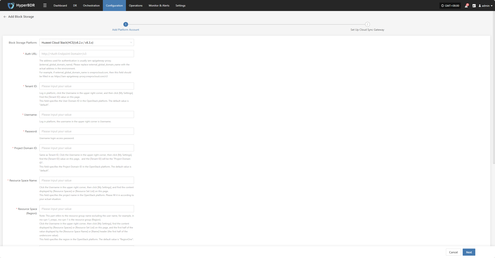
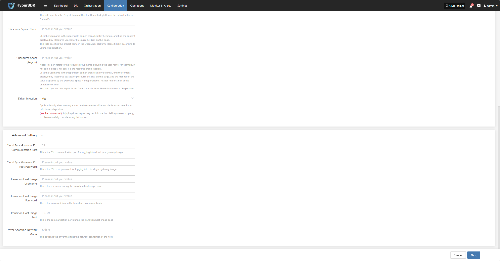
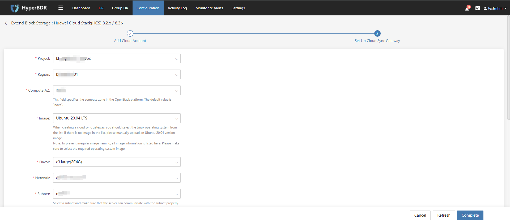
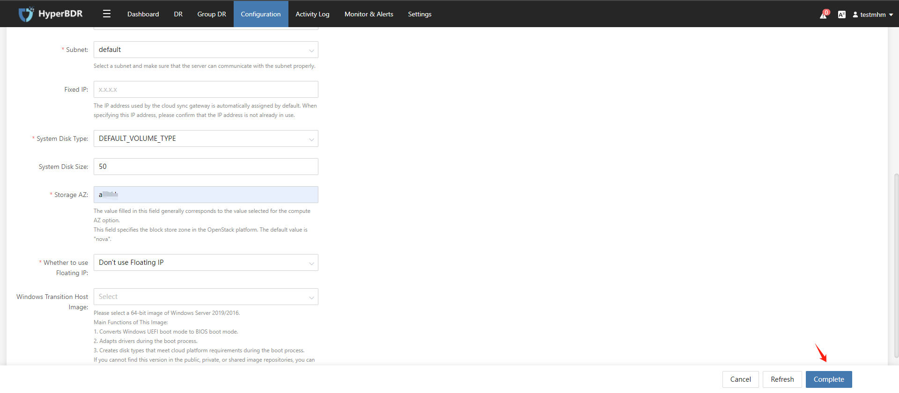
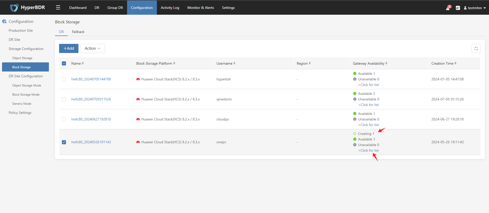

# **Huawei Cloud Stack(HCS)(v8.2.x/v8.3.x)**

## **Add Block Storage**

From the top navigation bar, select **"Configuration" → "Storage Configuration" → "Block Storage"** to enter the block storage page. Click the "Add" button in the upper right corner to add a new block storage configuration.

### **Add Platform Account**

Select "Huawei Cloud Stack(HCS)(v8.2.x/v8.3.x)" from the block storage platform dropdown list, and fill in the following platform authentication information according to the actual situation of the block storage to be connected:

> If you are not sure how to obtain the relevant information, you can click "Click to view" below for detailed instructions. 
> [👉 Click to view](../../faq/faq.md#how-to-obtain-huawei-cloud-hcs-8-x-platform-credentials-information)

* Description of authentication information

| **Configuration Item**     | **Example Value**                                         | **Description**                                                                                                                                           | **Remarks (For reference, similar fields in OpenStack platform)**         |
| ------------- | ------------------------------------------------- | ------------------------------------------------------------------------------------------------------------------------------------------------ | ----------------------------------------------------- |
| Block Storage Platform       | Huawei Cloud Stack(HCS)(v8.2.x/v8.3.x)                  | Select "Huawei Cloud Stack(HCS)(v8.2.x/v8.3.x)" from the dropdown list.                                                                                                          | --                                                    |
| Auth URL        | https://iam-apigateway-proxy.oneprocloud.com/v3 | The address used for authentication is usually iam-apigateway-proxy.{external_global_domain_name}.   Please replace external_global_domain_name with the actual address in the environment.   For example, if external_global_domain_name is oneprocloud.com, then this field should be filled in as: https://iam-apigateway-proxy.oneprocloud.com/v3 | --                                                    |
| Tenant ID        | HPUAAG0B2•••••••••••••••                        | Log in platform, click the Username in the upper right corner, and then click [My Settings],   Find the [Tenant ID] value on this page.                                                                                                            | This field specifies the User Domain ID in the OpenStack platform. The default value is "default". |
| Username         | zhangweizhen                                    | Log in platform, the username in the upper right corner is Username.                                                                                                                                        | --                                                    |
| Password          | 125••••••••                                     | Username login access password.                                                                                                                                      | --                                                    |
| Project Domain ID | default                                         | Same as Tenant ID,   Click the Username in the upper right corner, then click [My Settings],   find the [Tenant ID] value on this page，  and the [Tenant ID] will be the "Project Domain ID".                                                                                                | This field specifies the Project Domain ID in the OpenStack platform. The default value is "default". |
| Resource Space Name       | zhangweizhen                                    | Click the Username in the upper right corner, then click [My Settings],   and find the content displayed by [Resource Spaces] or [Resource Set List] on this page.                                                                                                        | This field specifies the project name in the OpenStack platform. Please fill it in according to your actual situation. |
| Resource Space (Region) | RegionOne                                       | Note: This part refers to the resource group name excluding the user name,   for example, in mx-cpn-1_onepc, mx-cpn-1 is the resource group (Region).   Click the Username in the upper right corner, then click [My Settings],   find the content displayed by [Resource Spaces] or [Resource Set List] on this page,   and the first half of the value displayed by the [Resource Space Name] or [Name] header (the first half of the underscore value).                                                                                         | This field specifies the region in the OpenStack platform. The default value is "RegionOne".        |
| Driver Injection      | Yes / No                                           | Applicable only when starting a host on the same virtualization platform and needing to skip driver adaptation.   (Not Recommended) Skipping driver repair may result in the host failing to start properly,   so please carefully consider using this option.                                                                               | --                                                    |

* Advanced settings description

| **Configuration Item**                            | **Example Value**                    | **Description**                                                                                       |
|--------------------------------------|-------------------------------|------------------------------------------------------------------------------------------------|
| Cloud Sync Gateway SSH Communication Port | 22                            | This is the SSH communication port for logging into cloud sync gateway image.                 |
| Cloud Sync Gateway SSH root Password     | Please enter information                    | This is the SSH root password for logging into cloud sync gateway image.                      |
| Transition Host Image Username           | Please enter information                    | This is the username during the transition host image boot.                                   |
| Transition Host Image Password           | Please enter information                    | This is the password during the transition host image boot.   If left blank, the default password is `Acb@132.Inst` |
| Transition Host Image Port               | 10729                         | This is the communication port during the transition host image boot.   If left blank, the default port is `10729` |
| Driver Adaption Network Mode             | Public Network without Proxy | This option is the driver that fixes the network connection of the host.                      |

After filling in the authentication information, click **"Next"** to start **"Set Up Cloud Sync Gateway"**.

### **Set Up Cloud Sync Gateway**

Configure region, subnet, etc. for the cloud sync gateway to ensure stable and efficient operation in the target environment.

* Description of Set Up Cloud Sync Gateway

| **Configuration Item**                   | **Example Value**                                                 | **Description**                                                                                                                                                                                                                                                                                          |
|----------------------------|-----------------------------------------------------------|---------------------------------------------------------------------------------------------------------------------------------------------------------------------------------------------------------------------------------------------------------------------------------------------------|
| Project                    | kl-**********                                              | Current project name, fill in as needed.                                                                                                                                                                                                                                                          |
| Region                     | kl-**********                                              | Please select the region where the cloud sync gateway will be installed.                                                                                                                                                                                                                          |
| Compute AZ                 | az-**********                                              | This field specifies the compute zone in the OpenStack platform.   The default value is "nova".                                                                                                                                                                                                 |
| lmage                      | Ubuntu-24.04                                               | When creating a cloud sync gateway, select a Linux OS image.   If Ubuntu 24.04 is not available in the dropdown, you can manually upload:   1. Upload the image file to object storage;   2. Import from object storage as a custom image.   **Note**: To avoid irregular image naming, all image information is listed here.   Please make sure to select the required OS image. |
| Flavor                     | 4u-8g(4C8G)                                                | The cloud sync gateway is mainly used for data synchronization.   It is recommended to select an instance with at least 4 vCPU and 8 GB memory,   and ensure the bandwidth is above 1Gbps for efficient and stable data synchronization.                                                    |
| Network                    | project-vpc (xxx.xxx.xxx.xxx/xx)                           | Select the private network for the cloud sync gateway from the dropdown list.   Only networks in the same region are displayed.   Please refer to the actual situation.                                                                                                                      |
| Subnet                     | project-subnet-public1-cn-north-1a (xxx.xxx.xxx.xxx/xx)   | Please select a subnet and ensure the server can communicate with it.   Please refer to the actual situation.                                                                                                                                                                                   |
| Fixed lP                   | x.x.x.x                                                   | The IP address used by the cloud sync gateway.   Default is auto-assigned.   If specifying, make sure the IP is not occupied.                                                                                                                                                               |
| System Disk Type           | DEFAULT VOLUME TYPE_DEFAULT                               | Select the system disk type from the dropdown list,   subject to the actual platform configuration.                                                                                                                                                                                             |
| System Disk Size           | 50                                                        | Select the system disk size based on the workload.   Default is 50G, recommended is also 50G.                                                                                                                                                                                                  |
| Storage AZ                 | nova                                                      | The value filled in this field generally corresponds to the value selected for the computeAZ option.   This field specifies the block store zone in the OpenStack platform.   The default value is "nova".                                                                                  |
| Whether to use Floating lP | Do not use Floating IP                                         | Whether to enable Floating IP:   • Auto-create: The system will call the API to automatically assign a Floating IP in the selected region;   • Manual selection: Select an existing Floating IP address from the dropdown list.                                                              |
| Windows Transition Host lmage | Windows Server 2019-XXXXXXXXXX                           | This image is mainly used for:   1. Converting Windows UEFI boot to BIOS;   2. Driver adaptation during boot;   3. Creating disk types that meet cloud platform requirements.   If this version is not found in public, private, or shared images, you can:   • Upload the image to object storage and import as a private image;   • If another account in the same region has this image, you can request them to share it. |

After the cloud sync gateway is set up, click **"Complete"**, and the system will automatically start creating the cloud sync gateway and transition host image.

### **View Details**

During the creation process, click "Click to view list" to view the detailed list of created cloud sync gateways.

Select the corresponding host and click "Click to view details" to view detailed logs generated during the task creation process, which helps you quickly understand the execution status and troubleshoot issues.

<!-- @include: ./huawei.md#snippet -->