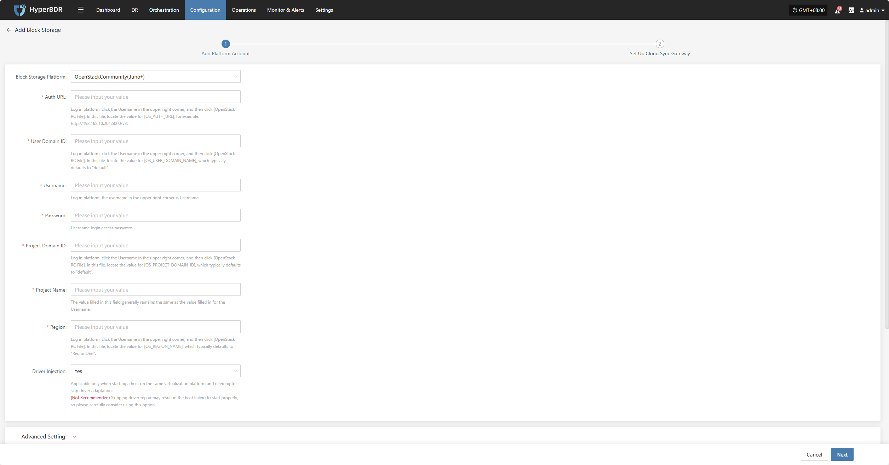
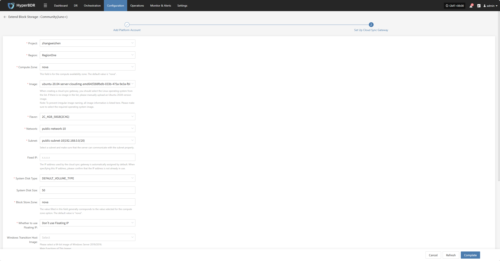
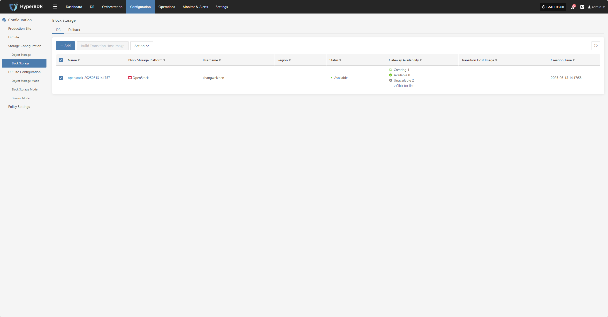
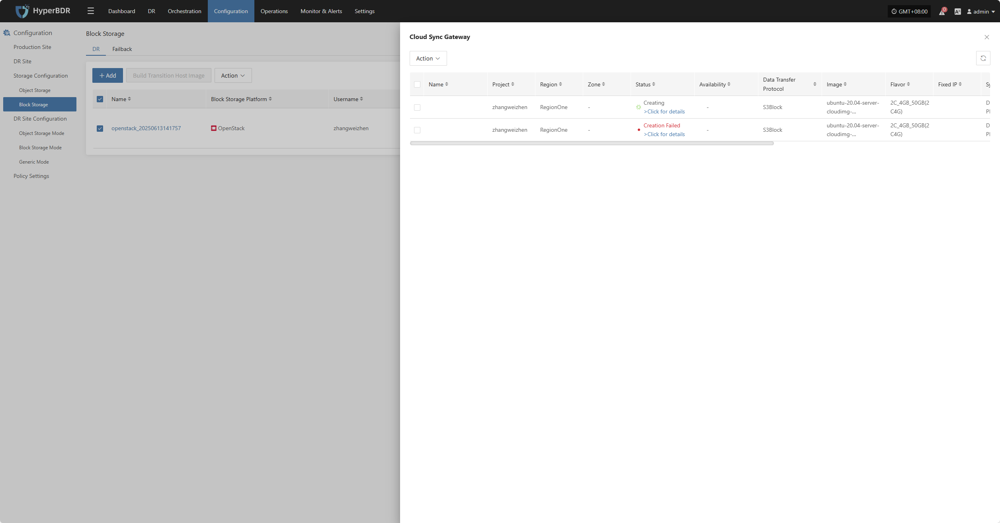
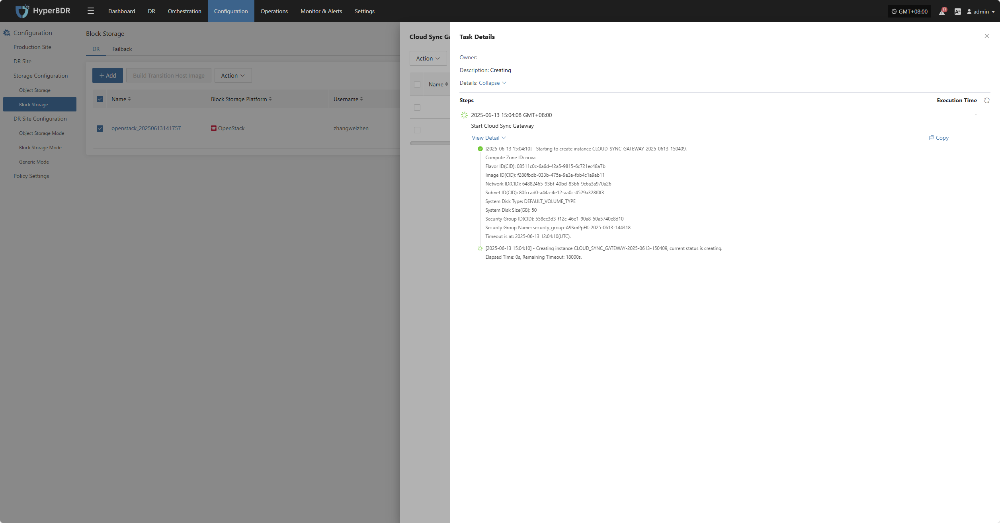

# **OpenStackCommunity(Juno+)**

## **Add Block Storage**

From the top navigation bar, select **"Configuration" → "Storage Configuration" → "Block Storage"** to enter the block storage page. Click the "Add" button in the upper right corner to add a new block storage configuration.

### **Add Platform Account**

Select "OpenStackCommunity(Juno+)" from the block storage platform dropdown list. Fill in the following platform authentication information according to your actual block storage environment:

> If you're unsure how to obtain the relevant information, you can click 'Click to View' below for detailed instructions: 
> [👉 Click to View](https://qa.oneprocloud.com/questions/D1n6)

* Platform Account Description

| **Configuration Item**         | **Example Value**                | **Description**                                                                                                 |
|-------------------------------|----------------------------------|----------------------------------------------------------------------------------------------------------------|
| Block Storage Platform         | OpenStackCommunity(Juno+)        | Find and select OpenStackCommunity(Juno+) from the dropdown list.                                               |
| Auth URL                      | http://192.168.10.201:5000/v3    | Log in to the platform, click the Username in the upper right corner, then click [OpenStack RC File]. In this file, locate the value for [OS_AUTH_URL], for example: http://192.168.10.201:5000/v3. |
| User Domain ID                 | default                          | Log in to the platform, click the Username in the upper right corner, then click [OpenStack RC File]. In this file, locate the value for [OS_USER_DOMAIN_NAME], which typically defaults to "default". |
| Username                       | zhangweizhen                     | The username in the upper right corner after logging in.                                                        |
| Password                       | **********                       | The login password for the username.                                                                            |
| Project Domain ID              | default                          | Log in to the platform, click the Username in the upper right corner, then click [OpenStack RC File]. In this file, locate the value for [OS_PROJECT_DOMAIN_ID], which typically defaults to "default". |
| Project Name                   | zhangweizhen                     | The value filled in this field is usually the same as the Username.                                             |
| Region                         | RegionOne                        | Log in to the platform, click the Username in the upper right corner, then click [OpenStack RC File]. In this file, locate the value for [OS_REGION_NAME], which typically defaults to "RegionOne". |
| Driver Injection               | Yes / No                         | Only applicable when starting a host on the same virtualization platform and you need to skip driver adaptation. (Not recommended) Skipping driver adaptation may cause the host to fail to start properly. Please use this option with caution. |

* Advanced Setting Description

| **Configuration Item**                  | **Example Value**                                                                                                                      | **Description**                                                                                 |
|-----------------------------------------|----------------------------------------------------------------------------------------------------------------------------------------|-------------------------------------------------------------------------------------------------|
| Cloud Sync Gateway SSH Communication Port | 22                                                                                                                                     | SSH port for logging into the cloud sync gateway image. Default is `22` if left blank.           |
| Cloud Sync Gateway SSH root Password    | Please input your value                                                                                                                | SSH root password for logging into the cloud sync gateway image. Default is `Acb@132.Inst` if left blank. |
| Transition Host Image Username          | Please input your value                                                                                                                | Username for the transition host image. Default is `root` if left blank.                        |
| Transition Host Image Password          | Please input your value                                                                                                                | Password for the transition host image. Default is `Acb@132.Inst` if left blank.                |
| Transition Host Image Port              | 10729                                                                                                                                  | Communication port for the transition host image. Default is `10729` if left blank.             |
| Driver Adaption Network Mode            | Public Network without Proxy Private Network without Proxy Public Network with Cloud Sync Gateway Proxy Private Network with Cloud Sync Gateway Proxy | Network connection mode for driver adaptation host.                                              |

After filling in the authentication information, click **"Next"** to start **"Set Up Cloud Sync Gateway"**

### **Set Up Cloud Sync Gateway**

Configure region, subnet, etc. for the cloud sync gateway to ensure stable and efficient operation in the target environment.

* Cloud Sync Gateway Configuration Description

| **Configuration Item**         | **Example Value**                                         | **Description**                                                                                                                                                                                                                                 |
|-------------------------------|----------------------------------------------------------|---------------------------------------------------------------------------------------------------------------------------------------------------------------------------------------------------------|
| Project                       | zhangweizhen                                             | Current project name, fill in as needed.                                                                                                                          |
| Region                        | RegionOne                                                | The region where the resource is located, usually "RegionOne" by default, subject to platform settings.                                                           |
| Compute Zone                   | nova                                                     | Cloud compute availability zone, default is "nova", subject to the actual platform.                                         |
| Image                         | ubuntu-20.04-XXXXXXXXXXXXX                               | When creating a cloud sync gateway, select a Linux OS image. If Ubuntu 20.04 is not available in the dropdown, you can manually upload: 1. Upload the image file to object storage; 2. Import from object storage as a custom image. **Note:** To avoid irregular image naming, all image information is listed here. Please make sure to select the required OS image. |
| Flavor                        | 2C\_4GB 50GB(2C4G)                                       | The cloud sync gateway is mainly used for data synchronization. It is recommended to select an instance with at least 2 vCPU and 4 GB memory, and ensure the bandwidth is above 1Gbps for efficient and stable data synchronization. |
| Network                       | project-vpc (xxx.xxx.xxx.xxx/xx)                         | Select the private network for the cloud sync gateway from the dropdown list. Only networks in the same region are displayed. Please refer to the actual situation. |
| Subnet                        | project-subnet-public1-cn-north-1a (xxx.xxx.xxx.xxx/xx)  | Please select a subnet and ensure the server can communicate with it. Please refer to the actual situation.                                                       |
| Fixed IP                      | x.x.x.x                                                  | The IP address used by the cloud sync gateway. Default is auto-assigned. If specifying, make sure the IP is not occupied.                                         |
| System Disk Type               | DEFAULT VOLUME TYPE_DEFAULT                              | Select the system disk type from the dropdown list, subject to the actual platform configuration.                           |
| System Disk Size               | 50                                                       | Select the system disk size based on the workload. Default is 50G, recommended is also 50G.                                 |
| Block Store Zone               | nova                                                     | Block storage zone, usually the same as the compute zone. Default is "nova".                                                |
| Whether to use Floating IP     | Don't use Floating IP                                    | Whether to enable Floating IP: • Auto-create: The system will call the API to automatically assign a Floating IP in the selected region; • Manual selection: Select an existing Floating IP address from the dropdown list. |
| Windows Transition Host Image  | WINSRV\_2019\_xxxxxxxx                                  | **This image is mainly used for:** 1. Converting Windows UEFI boot to BIOS; 2. Driver adaptation during boot; 3. Creating disk types that meet cloud platform requirements. If this version is not found in public, private, or shared images, you can: • Upload the image to object storage and import as a private image; • If another account in the same region has this image, you can request them to share it. |
| Boot Type                     | Boot From Volume / Boot From Image                        | It is recommended to use volume booting to shorten the startup time. If platform limitations prevent the use of volume booting, you can use image booting instead. |

* Network Advanced Settings Description

| **Configuration Item**                | **Example Value**                    | **Description**                                                                                 |
|---------------------------------------|--------------------------------------|-------------------------------------------------------------------------------------------------|
| Cloud Sync Gateway Control Network    | Private Network / Public Network     | Setting for the communication network between the console and cloud sync gateway. For example, when using VPN or dedicated lines, the intranet should be selected. |
| Custom Control Network                | Please input IPv4/IPv6/Domain Name  | By default, no configuration is required. Only configure when needed (e.g., NAT address translation). Supports IPv4, IPv6, and domain names. |
| Data Transmission Network             | Private Network / Public Network     | Setting for the communication network between the source and the cloud sync gateway. For example, when using VPN or dedicated lines, the intranet should be selected. |
| Custom Data Transmission Network      | Please input IPv4/IPv6/Domain Name  | By default, no configuration is required. Only configure when needed (e.g., NAT address translation). Supports IPv4, IPv6, and domain names. |

* Data Transfer Advanced Setting Description

| **Configuration Item**      | **Optional Values**                | **Description**                                                                                  |
|----------------------------|------------------------------------|--------------------------------------------------------------------------------------------------|
| Data Transfer Protocol      | S3Block / iSCSI (Not Recommended)  | The data transfer protocol between the source and the sync gateway. S3Block is widely used in WAN and is more suitable for data transfer. iSCSI is used for storage networks and is suitable for stable network environments. |

After configuring the cloud sync gateway, click **"Complete"**. The system will automatically create the cloud sync gateway and transition host image.

### **View Details**

During creation, click "View List" to see the detailed list of created cloud sync gateways.

Select the corresponding host and click "View Details" to see detailed logs generated during the task creation process, which helps you quickly understand the execution status and troubleshoot issues.

<!-- @include: ./huawei.md{108-150} -->