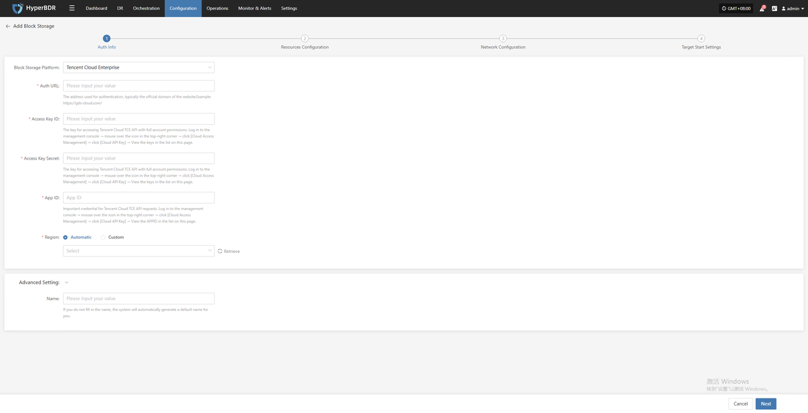
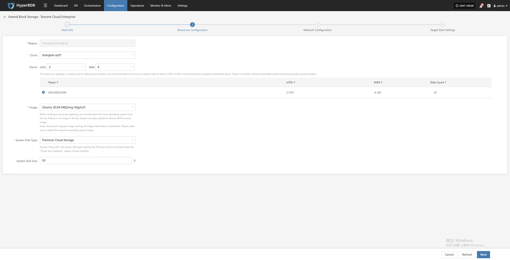
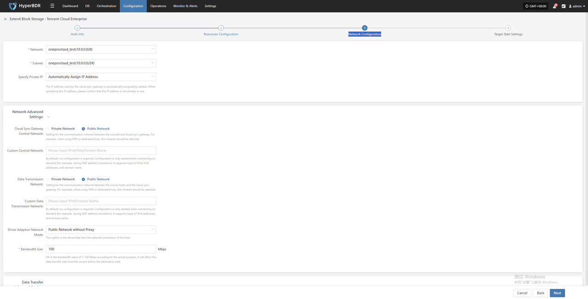
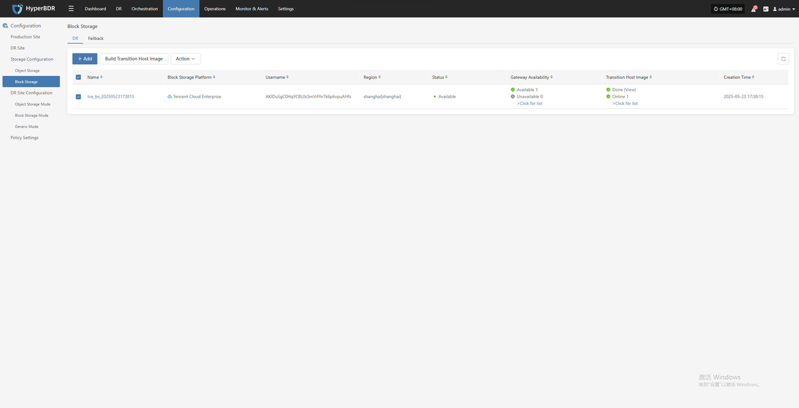
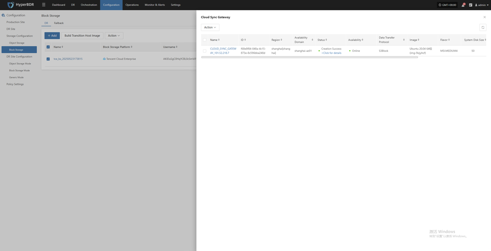
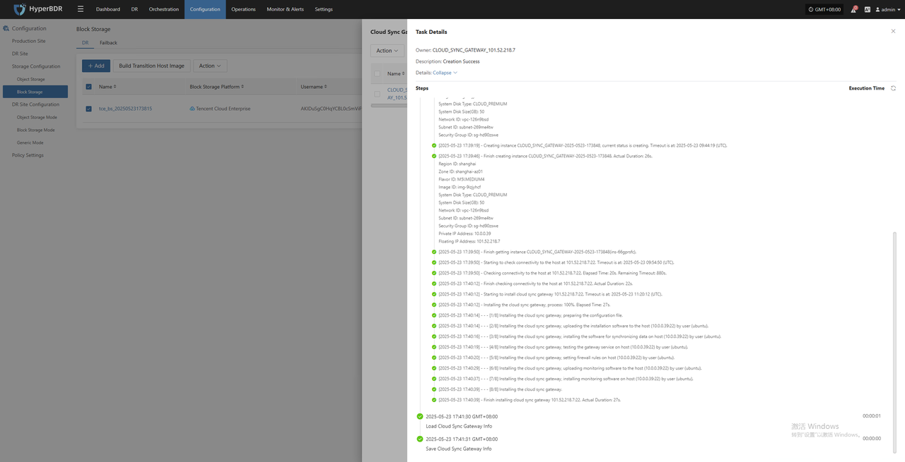

# Tencent Cloud Enterprise

## **Add Block Storage**

From the top navigation bar, select **"Configuration" → "Storage Configuration" → "Block Storage"** to enter the block storage page. Click the "Add" button in the upper right corner to add a new block storage configuration.

### Auth Info

In the block storage platform, select "Tencent Cloud Enterprise" from the dropdown list. Fill in the following authentication information according to your actual situation:

* Auth Info Description

| **Configuration Item**    | **Example**                        | **Description**                                                                                                                                                                                                                                                          |
| ---------------------- | -------------------------------- | ----------------------------------------------------------------------------------------------------------------------------------------------------------------------------------------------------------------------------------------------------------------------- |
| Block Storage Platform | Tencent Cloud Enterprise         | Find and select Tencent Cloud Enterprise from the dropdown list.                                                                                                                                                                 |
| Auth URL               | https://gds-cloud.com/           | The address used for authentication, typically the official domain of the website.                                                                                                                                               |
| Access Key ID          | HPUAAG0B2•••••••••••••••         | The key for accessing Tencent Cloud TCE API with full account permissions. Log in to the management console → mouse over the icon in the top-right corner → click \[Cloud Access Management] → click \[Cloud API Key] → View the keys in the list on this page. |
| Access Key Secret      | •••••••••••••••••••••••••••••••• | The key for accessing Tencent Cloud TCE API with full account permissions. Log in to the management console → mouse over the icon in the top-right corner → click \[Cloud Access Management] → click \[Cloud API Key] → View the keys in the list on this page. |
| App ID                 | 125••••••••                      | Important credential for Tencent Cloud TCE API requests. Log in to the management console → mouse over the icon in the top-right corner → click \[Cloud Access Management] → click \[Cloud API Key] → View the APPID in the list on this page.                  |
| Region                 | Automatic / Custom               | When set to automatic, click the "Retrieve" button to get the latest region information. You can select the corresponding Tencent Cloud Enterprise region from the dropdown list.                                               |
| Advanced Setting       | Custom Name                      | If you do not fill in the name, the system will automatically generate a default name for you.                                                                                                                                   |

After filling in the authentication information, click **"Next"** to proceed to **Resources Configuration**.

### Resources Configuration

Allocate compute and storage resources for the cloud sync gateway to ensure stable and efficient operation in the target environment.

* Resources Configuration Description

| **Configuration Item** | **Example**                                  | **Description**                                                                                                                                                                                                                                                                                                                                 |
|------------------------|----------------------------------------------|---------------------------------------------------------------------------------------------------------------------------------------------------------------------------------------------------------------------------------------------------------------------------------------------------------------------------------------------------|
| Region                 | shanghai\[shanghai]                          | Please select the region where the cloud sync gateway will be deployed.                                                                                                                                                                                                                                  |
| Zone                   | shanghai-az01                                | Select the availability zone in the selected region from the dropdown list.                                                                                                                                                                                                                              |
| Flavor                 | Select vCPU and memory as needed from the dropdown list.   After selection, the example specifications below will be refreshed automatically. | The cloud sync gateway is mainly used for data synchronization.   It is recommended to choose an instance with at least 4 vCPU \| 8 GB or more   and ensure a baseline bandwidth above 1Gbps   to maintain efficient and stable performance during data synchronization. |
| Image                  | Select the corresponding Linux image from the dropdown list. | When creating a cloud sync gateway, you should select the Linux operating system from the list.   If there is no image in the list, please manually upload an Ubuntu 24.04 version image.   **Note**: To prevent irregular image naming, all image information is listed here.   Please make sure to select the required operating system image. |
| System Disk Type       | Premium Cloud Storage                        | Please refer to the actual situation.                                                                                                                                                                                                                                                                     |
| System Disk Size       | User-defined (as required by the instance)   | Choose an appropriate size based on the workload of the sync gateway.   The default is 50G, and 50G is recommended.                                                                                                                                                                                    |

After resource configuration is complete, click **"Next"** to proceed to **Network Configuration**.

### Network Configuration

Allocate network resources for the cloud sync gateway to ensure stable and efficient operation in the target environment.

* Network Configuration Description

| **Configuration Item**    | **Example**                                                 | **Description**                                                                                                                                                                         |
| ------------------------- | ------------------------------------------------------- | -------------------------------------------------------------------------------------------------------------------------------------------------------------------------------------- |
| Network                   | project-vpc (xxx.xxx.xxx.xxx/xx)                        | Select the VPC to which the cloud sync gateway belongs from the dropdown list.                                                                                                         |
| Subnet                    | project-subnet-public1-cn-north-1a (xxx.xxx.xxx.xxx/xx) | Select the subnet in the selected availability zone from the dropdown list.                                                                                                            |
| Specify Private IP        | Select automatic or manual assignment from the dropdown list. | The IP address used by the cloud sync gateway is automatically assigned by default. When specifying this IP address, please confirm that the IP address is not already in use.         |

* Network Advanced Settings Description

| **Configuration Item**                  | **Example**                                                                                                                                            | **Description**                                                                                                                                                                                                      |
| --------------------------------------- | -------------------------------------------------------------------------------------------------------------------------------------------------- | -------------------------------------------------------------------------------------------------------------------------------------------------------------------------------------------------------------------- |
| Cloud Sync Gateway Control Network      | Private Network / Public Network                                                                                                                   | Setting for the communication network between the console and cloud sync gateway. For example, when using VPN or dedicated lines, select the private network.                                                        |
| Custom Control Network                  | Please input IPv4/IPv6/Domain Name                                                                                                                 | By default, no configuration is required. Configure only when needed (for example, during NAT address translation). Supports IPv4, IPv6 addresses, and domain names.                                                 |
| Data Transmission Network               | Private Network / Public Network                                                                                                                   | Setting for the communication network between the console and cloud sync gateway. For example, when using VPN or dedicated lines, select the private network.                                                        |
| Custom Data Transmission Network        | Please input IPv4/IPv6/Domain Name                                                                                                                 | By default, no configuration is required. Configure only when needed (for example, during NAT address translation). Supports IPv4, IPv6 addresses, and domain names.                                                 |
| Driver Adaption Network Mode            | Public Network without Proxy / Private Network without Proxy / Public Network with Cloud Sync Gateway Proxy / Private Network with Cloud Sync Gateway Proxy | This option is for fixing the network connection of the host.                                                                                                                  |
| Bandwidth Size                          | 100                                                                                                                                                | Fill in the bandwidth value of 1-100 Mbps according to the actual scenario. This will affect the data transfer rate from the source to the destination.                                                              |

* Data Transfer Advanced Setting Description

| **Configuration Item**      | **Optional Value**                    | **Description**                                                                                                                                                                                                                                            |
|-----------------------------|----------------------------------------|------------------------------------------------------------------------------------------------------------------------------------------------------------------------------------------------------------------------------------------------------------|
| Data Transfer Protocol      | S3Block / iSCSI (Not Recommended)     | This option is the data transfer protocol between the source and the sync gateway.   S3Block is widely used in WAN environments and is more suitable for data transfer.   The iSCSI protocol is used for storage networks and is suitable for stable network environments. |

After network configuration is complete, click **"Next"** to proceed to **Target Start Settings**.

### Target Start Settings

Configure the key parameters required for starting the target during recovery or drill, ensuring resources can take over and run smoothly.

* Target Start Settings Description

| **Configuration Item**              | **Example**                       | **Description**                                                                                                                                                                                                                                                                                                                                                                                                                                                                                                                                                                                                                                                                                                                                                               |
|------------------------------------|-----------------------------------|-------------------------------------------------------------------------------------------------------------------------------------------------------------------------------------------------------------------------------------------------------------------------------------------------------------------------------------------------------------------------------------------------------------------------------------------------------------------------------------------------------------------------------------------------------------------------------------------------------------------------------------------------------------------------------------------------------------------------------------------------------------------------------|
| Linux Transition Host Image         | Automatic upload                  | This image is used for disaster recovery drill and recovery.   If the cloud platform does not support uploading custom images, users need to manually upload and select images and download images manually.                                                                                                                                                                                                                                                                                                                                                                                                                                                                                                                       |
| Windows Transition Host Image       | Windows Server-2019-XXXXXXXXXXXXX | Please select a 64-bit image of Windows Server 2019/2016.   Main functions of this image:   1. Converts Windows UEFI boot mode to BIOS boot mode.   2. Adapts drivers during the boot process.   3. Creates disk types that meet cloud platform requirements during the boot process.   If you cannot find this version in the public, private, or shared image repositories, you can resolve it by following these steps:   1. Upload to the Private Image Repository: Upload the image file to object storage and then import it from object storage into the private image repository.   2. Obtain a Shared Image: If another account in the same region has the mentioned Windows version, you can request them to share it with you for use. |

After completing the target start settings, click **"Complete"**. The system will automatically create the cloud sync gateway and transition host image.

### View Details

During the creation process, click "Click for list" to view the detailed list of created cloud sync gateways.

Select the corresponding host and click "Click for details" to view detailed logs generated during the task creation process, which helps you quickly understand the execution status and troubleshoot issues.

<!-- @include: ./huawei.md#snippet -->