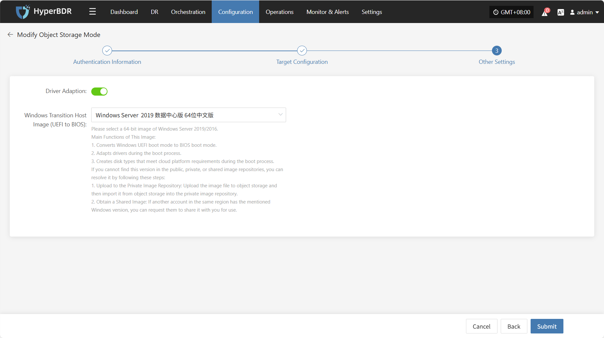
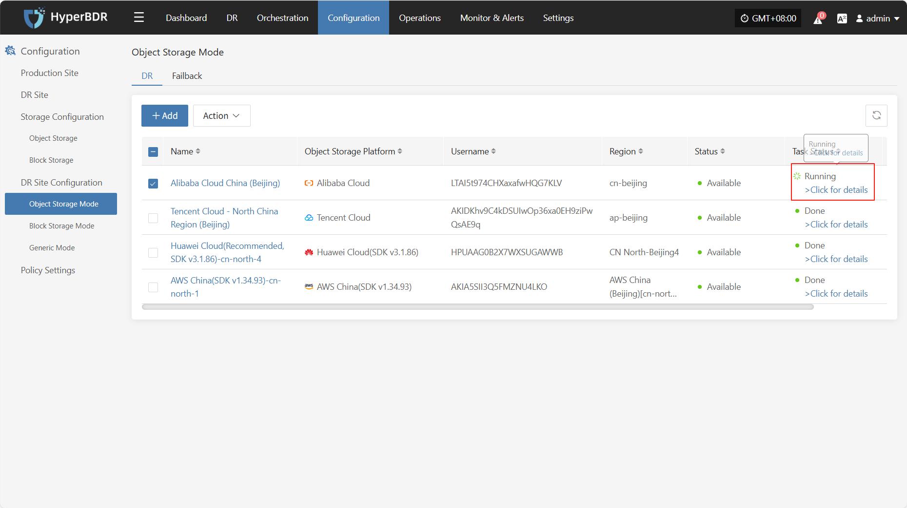
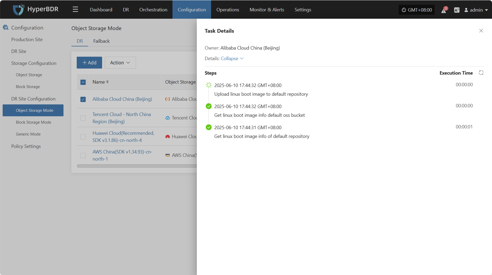
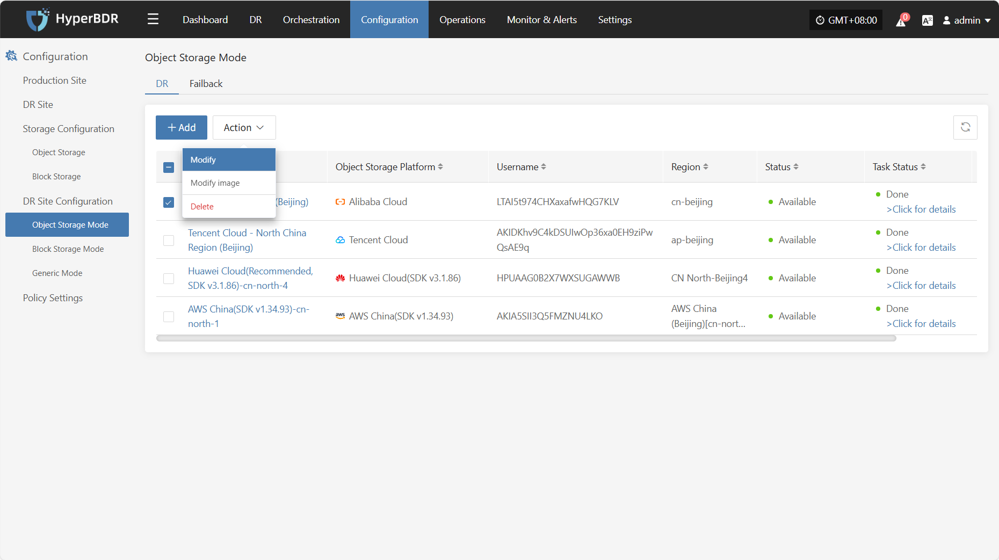
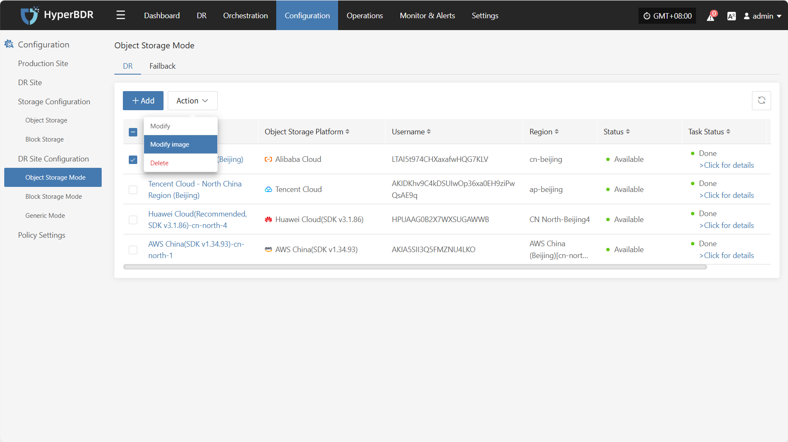
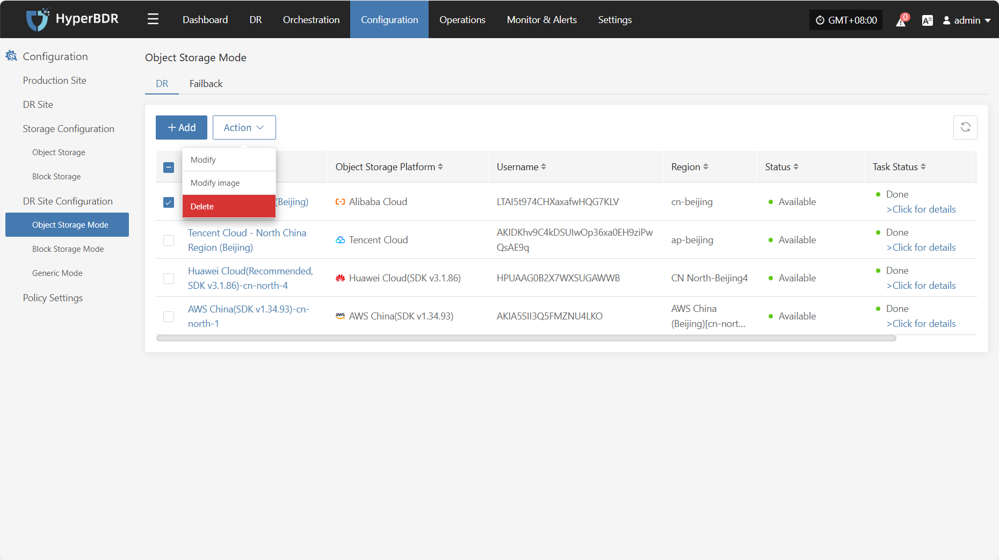

# Alibaba Cloud

## **Add Object Storage**

From the top navigation bar, select **"Configuration" → "DR Site Configuration" → "Object Storage"** to enter the object storage page. Click the "Add" button to add a new object storage configuration.

### **Authentication Information**

In the recovery platform dropdown, select "Tencent Cloud". Fill in the following authentication information based on your actual situation:

* **Authentication Information Description**

| **Configuration Item**             | **Example Value**                        | **Description**                                                                                                                                           |
|------------------------|----------------------------------|----------------------------------------------------------------------------------------------------------------------------------------------------|
| Select Recovery Platform | Alibaba Cloud                    | Find and select Alibaba Cloud from the dropdown list.                                                                                                               |
| Access Key ID          | HPUAAG0B2•••••••••••••••         | The key for accessing Alibaba Cloud API with full account permissions. Log in to the management console - Personal Information (top-right corner) - Access [KeyManagement]. |
| Access Key Secret      | •••••••••••••••••••••••••••••••• | The key for accessing Alibaba Cloud API with full account permissions. Log in to the management console - Personal Information (top-right corner) - Access [KeyManagement]. |

After filling in the authentication information, click **"Next"** to proceed to **"Target Configuration"**.

### **Target Configuration**

* **Target Configuration Description**

| **Configuration Item**                         | **Example Value**                      | **Description**                                                                                                                                                                                                                                                                                                                                                                                     |
|----------------------------------|--------------------------------|--------------------------------------------------------------------------------------------------------------------------------------------------------------------------------------------------------------------------------------------------------------------------------------------------------------------------------------------------------------------------------------------|
| Region                           | North China 2 (Beijing)                   | In the public cloud, it is recommended to select the same location as the object storage to avoid extra downstream traffic charges.                                                                                                                                                                                                                                           |
| Linux Transition Host Image      | Auto Upload                    | This image is used for disaster recovery drill and recovery. If the cloud platform cannot support uploading custom images, users need to manually upload and select images and download images manually.                                                                                                                                                                                    |
| Windows Transition Host Image    | Auto Upload                    | This image is used for disaster recovery drill and recovery. If the cloud platform cannot support uploading custom images, users need to manually upload and select images and download images manually.                                                                                                                                                                                    |
| Linux UEFI Transition Host Image | Auto Upload                    | This image is used for disaster recovery drill and recovery. If the cloud platform cannot support uploading custom images, users need to manually upload and select images and download images manually.                                                                                                                                                                                    |
| Windows UEFI Transition Host Image | Auto Upload                  | This image is used for disaster recovery drill and recovery. If the cloud platform cannot support uploading custom images, users need to manually upload and select images and download images manually.                                                                                                                                                                                    |
| Console to Transition Host Network | Private Network / Public Network | This option is mainly used for: 1. Creating the transition host image during the initialization process. The network used for communication between the console and the transition host during image creation. 2. Configuring the communication network between the DR console and the transition host during the startup process.  **Configuration Suggestion:** ① In a private cloud, if the DR console can directly communicate with the VM's own address, select the private network for communication. ② In a public cloud, if there is no dedicated line, select the public network for communication. |
| Name                             | Alibaba Cloud China (Beijing)  | If you do not enter an ID, it will be generated automatically.                                                                                                                                                                                                                                                                                                                                 |

After completing the target configuration, click **"Next"** to proceed to **"Other Settings"**.

### **Other Settings**

* Other Settings Description

| **Item**                                   | **Example**                                       | **Description**                                                                                                                                                                                                                                                                                                                                                                  |
|---------------------------------------------|---------------------------------------------------|-----------------------------------------------------------------------------------------------------------------------------------------------------------------------------------------------------------------------------------------------------------------------------------------------------------------------------------------------------------------------------------|
| Windows Transition Host Image (UEFI to BIOS)| Windows Server-2019-English-Full-Base-2025.05.15  | Please select a 64-bit Windows Server 2019/2016 image.  **Main Functions:** 1. Convert Windows UEFI boot mode to BIOS boot mode. 2. Adapt drivers during the boot process. 3. Create disk types that meet cloud platform requirements.  **How to get the image:** 1. Upload to Private Image Repository: Upload the image file to object storage, then import it. 2. Obtain a Shared Image: Request a shared image from another account in the same region. |

After completing the other settings, click **"Submit"**. The system will automatically create the transition host image.

### **View Details**

During the creation process, click "Click for details" to view detailed logs, which helps you quickly understand the execution status and troubleshoot issues.

## **Action**

### **Modify**

Click "Modify" to edit authentication information, target configuration, and other settings.

### **Modify Image**

Click "Modify Image" to rebuild the transition host image.

> Note: If you select the "Auto Upload" option, clicking the "OK" button will first delete the previously automatically uploaded image and then automatically upload a new one.

### **Delete**

