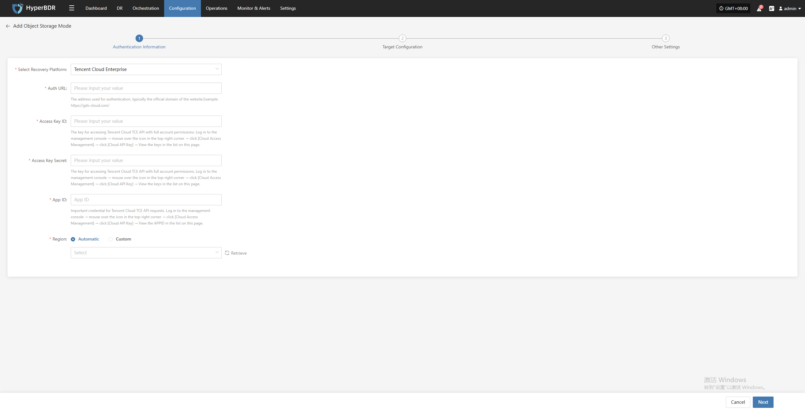
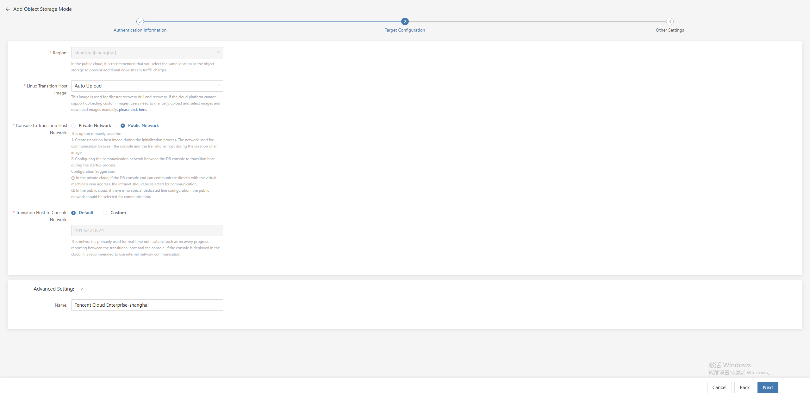

# Tencent Cloud Enterprise

## **Add Object Storage**

From the top navigation bar, select **"Configuration" → "DR Site Configuration" → "Object Storage"** to enter the object storage page. Click the "Add" button to add a new object storage configuration.

### Authentication Information

In the recovery platform, select "Tencent Cloud Enterprise" from the dropdown list. Fill in the following authentication information according to your actual situation:

* Authentication Information Description

| **Configuration Item**      | **Example**                        | **Description**                                                                                                                                                                                                                                                          |
| --------------------------- | ---------------------------------- | ------------------------------------------------------------------------------------------------------------------------------------------------------------------------------------------------------------------------------------------------------------------------ |
| Select Recovery Platform    | Tencent Cloud Enterprise           | Find and select Tencent Cloud Enterprise from the dropdown list.                                                                                                                                                                  |
| Auth URL                    | https://gds-cloud.com/             | The address used for authentication, typically the official domain of the website.                                                                                                                                                |
| Access Key ID               | HPUAAG0B2•••••••••••••••           | The key for accessing Tencent Cloud TCE API with full account permissions. Log in to the management console → mouse over the icon in the top-right corner → click \[Cloud Access Management] → click \[Cloud API Key] → View the keys in the list on this page. |
| Access Key Secret           | ••••••••••••••••••••••••••••••••   | The key for accessing Tencent Cloud TCE API with full account permissions. Log in to the management console → mouse over the icon in the top-right corner → click \[Cloud Access Management] → click \[Cloud API Key] → View the keys in the list on this page. |
| App ID                      | 125••••••••                        | Important credential for Tencent Cloud TCE API requests. Log in to the management console → mouse over the icon in the top-right corner → click \[Cloud Access Management] → click \[Cloud API Key] → View the APPID in the list on this page.                  |
| Region                      | Automatic / Custom                 | When set to automatic, click the "Retrieve" button to get the latest region information. You can select the corresponding Tencent Cloud Enterprise region from the dropdown list.                                                |

After filling in the authentication information, click **"Next"** to proceed to **Target Configuration**.

### Target Configuration

* Target Configuration Description

| **Configuration Item**                | **Example**                          | **Description**                                                                                                                                                                                                                                                                                                                                                                                                                                                                                                                                                                                                                                                                                     |
| -------------------------------------- | ------------------------------------ | --------------------------------------------------------------------------------------------------------------------------------------------------------------------------------------------------------------------------------------------------------------------------------------------------------------------------------------------------------------------------------------------------------------------------------------------------------------------------------------------------------------------------------------------------------------------------------------------------------------------------------------------------------------------------------------------------- |
| Region                                | North China 2 (Beijing)              | Select the appropriate region from the dropdown list. In the public cloud, it is recommended to select the same location as the object storage to avoid additional downstream traffic charges.                                                                                                                                                                                                                                                                                                                                                                                                                                                             |
| Linux Transition Host Image            | Auto Upload                          | This image is used for disaster recovery drill and recovery. If the cloud platform does not support uploading custom images, users need to manually upload and select images and download images manually.                                                                                                                                                                                                                                                                                                                                                                                                                                                  |
| Console to Transition Host Network     | Private Network / Public Network     | This option is mainly used for:  
1. Creating the transition host image during the initialization process. It is the network used for communication between the console and the transition host during image creation.  
2. Configuring the communication network between the DR console and the transition host during the startup process.  
Configuration suggestion:  
① In private cloud, if the DR console can communicate directly with the VM's own address, select the private network.  
② In public cloud, if there is no dedicated line, select the public network. |
| Transition Host to Console Network     | Default / Custom                     | This network is mainly used for real-time notifications such as recovery progress reporting between the transition host and the console. If the console is deployed in the cloud, it is recommended to use internal network communication.                                                                                                                                                                                                                                                                                                                                                                           |
| Advanced Setting                      | TCE-shanghai                         | If you do not enter an ID, it will be generated automatically.                                                                                                                                                                                                                                                                                                                                                                                                                                                                                                                                                                                              |

After target configuration is complete, click **"Next"** to proceed to **Other Settings**.

<!-- @include: ./huawei.md#snippet -->
