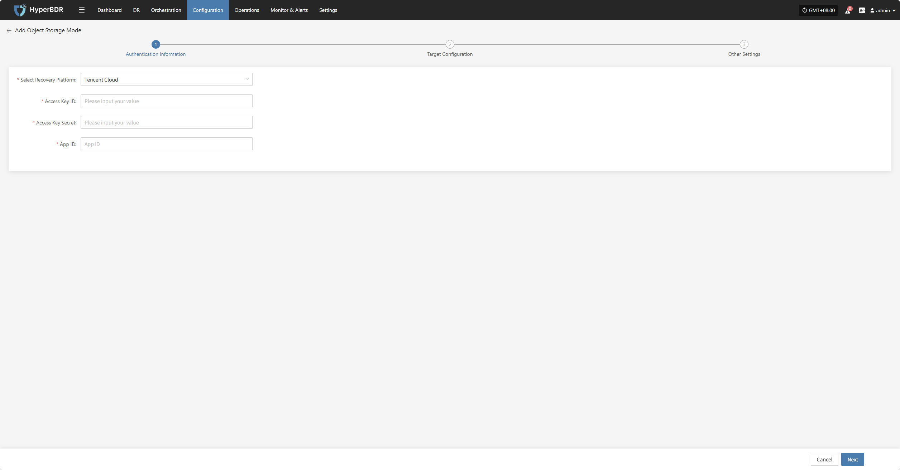
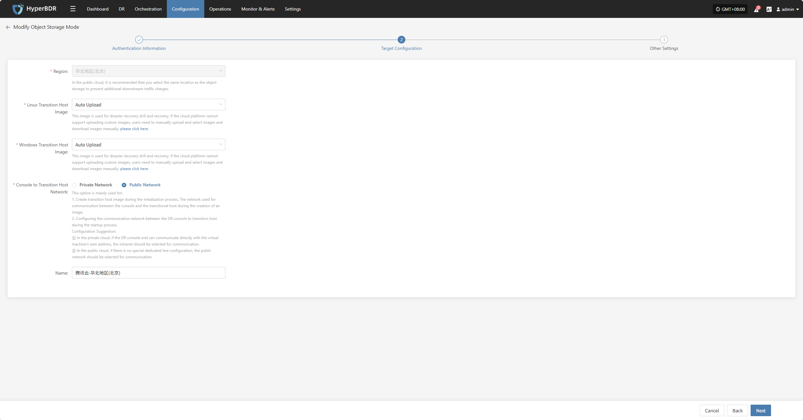
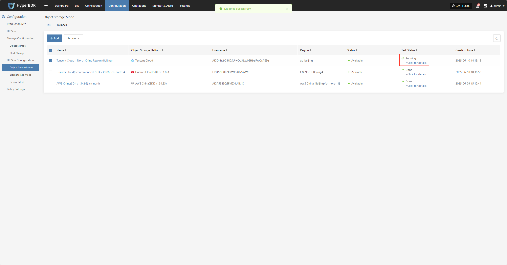
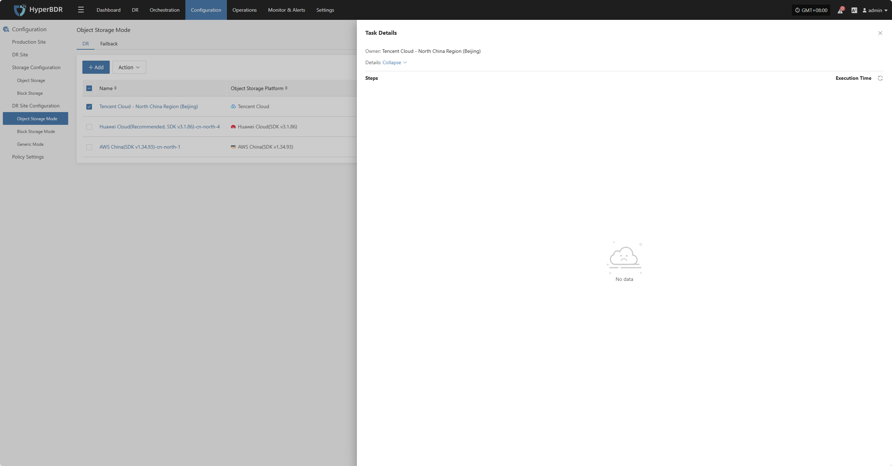
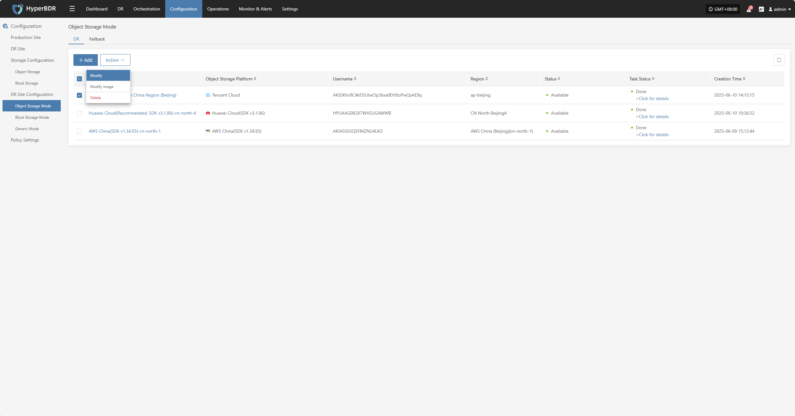
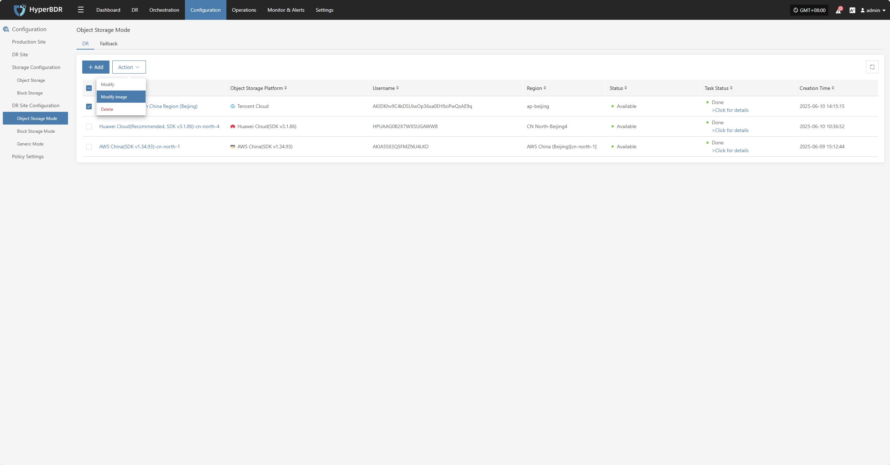
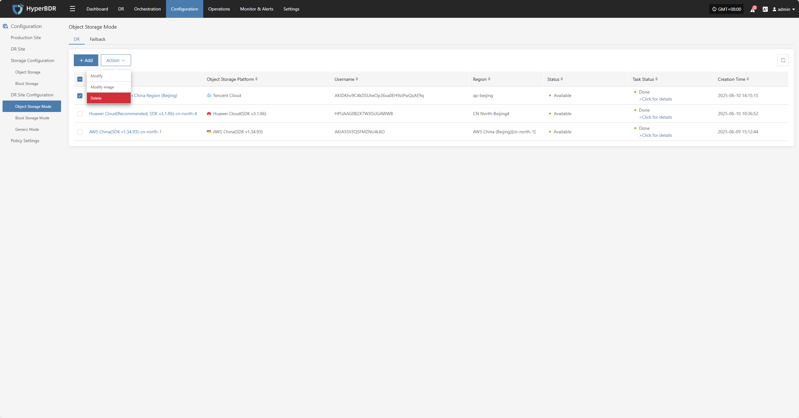
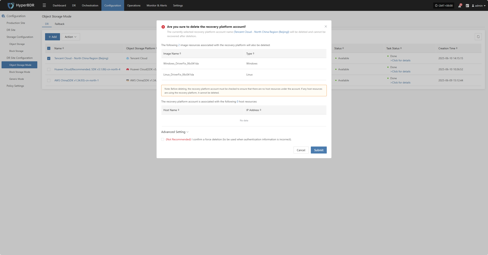

# **Tencent Cloud**

## **Add Object Storage**

From the top navigation bar, select **"Configuration" → "DR Site Configuration" → "Object Storage"** to enter the object storage page. Click the "Add" button to add a new object storage configuration.

### **Authentication Information**

In the recovery platform dropdown, select "Tencent Cloud". Fill in the following authentication information based on your actual situation:

* **Authentication Information Description**

| **Configuration Item**  | **Example Value**                | **Description**                                                                                                                                                              |
|-------------------------|----------------------------------|------------------------------------------------------------------------------------------------------------------------------------------------------------------------------|
| Select Recovery Platform | Tencent Cloud                   | Select **Tencent Cloud** from the dropdown list.                                                                                                                              |
| Access Key ID           | HPUAAG0B2•••••••••••••••         | This is the key used to access the Tencent Cloud API with full account permissions. Navigate to: **Management Console → Personal Info (top-right) → Access Management → API Key Management**. |
| Access Key Secret       | •••••••••••••••••••••••••••••••• | This is the secret key used to access the Tencent Cloud API with full account permissions. Navigate to: **Management Console → Personal Info → Access Management → API Key Management**.        |
| App ID                  | 125••••••••                      | A required credential for Tencent Cloud API requests. Navigate to: **Management Console → Personal Info → Account Information → Basic Information → APP ID**.                                   |

After filling in the authentication information, click **"Next"** to proceed to **"Target Configuration"**.

### **Target Configuration**

* **Target Configuration Description**

| **Configuration Item**           | **Example Value**                           | **Description**                                                                                                                                                                                                                              |
|----------------------------------|---------------------------------------------|----------------------------------------------------------------------------------------------------------------------------------------------------------------------------------------------------------------------------------------------|
| Region                           | North China - Beijing 4                     | In the public cloud, it is recommended to select the same region as the object storage to avoid additional downstream traffic charges.                                                                                                       |
| Linux Transition Host Image      | Auto Upload                                 | This image is used for disaster recovery drills and recovery operations. If the cloud platform does not support uploading custom images, users must manually upload, select, and download the image.                                          |
| Windows Transition Host Image    | Auto Upload                                 | This image is used for disaster recovery drills and recovery operations. If the cloud platform does not support uploading custom images, users must manually upload, select, and download the image.                                          |
| Console to Transition Host Network | Private Network / Public Network            | This option is used for the communication between the console and the transition host: 1. During initialization, it is used to create the transition host image. 2. During startup, it configures communication with the transition host. **Recommendations:** ① In private clouds, if the DR console can directly communicate with the VM's internal IP, select the private network. ② In public clouds, if there is no dedicated line, select the public network. |
| Name                             | Tencent Cloud - North China Region (Beijing) | If no ID is entered, the system will automatically generate one.                                                                                                                                                                              |

### **Other Settings**

* **Other Settings Description**

| **Item**                                   | **Example**                                       | **Description**                                                                                                                                                                                                                                                                                                                                                                  |
|---------------------------------------------|---------------------------------------------------|-----------------------------------------------------------------------------------------------------------------------------------------------------------------------------------------------------------------------------------------------------------------------------------------------------------------------------------------------------------------------------------|
| Windows Transition Host Image (UEFI to BIOS)| Windows Server-2019-English-Full-Base-2025.05.15  | Please select a 64-bit Windows Server 2019/2016 image.  **Main Functions:** 1. Convert Windows UEFI boot mode to BIOS boot mode. 2. Adapt drivers during the boot process. 3. Create disk types that meet cloud platform requirements.  **How to get the image:** 1. Upload to Private Image Repository: Upload the image file to object storage, then import it. 2. Obtain a Shared Image: Request a shared image from another account in the same region. |

After completing the other settings, click **"Submit"**. The system will automatically create the transition host image.

### **View Details**

During the creation process, click "Click for details" to view detailed logs, which helps you quickly understand the execution status and troubleshoot issues.

## **Action**

### **Modify**

Click "Modify" to edit authentication information, target configuration, and other settings.

### **Modify Image**

Click "Modify Image" to rebuild the transition host image.

> Note: If selecting the "Auto Upload" option, clicking the "OK" button will first delete the previously automatically uploaded image and then automatically upload a new one.

### **Delete**

