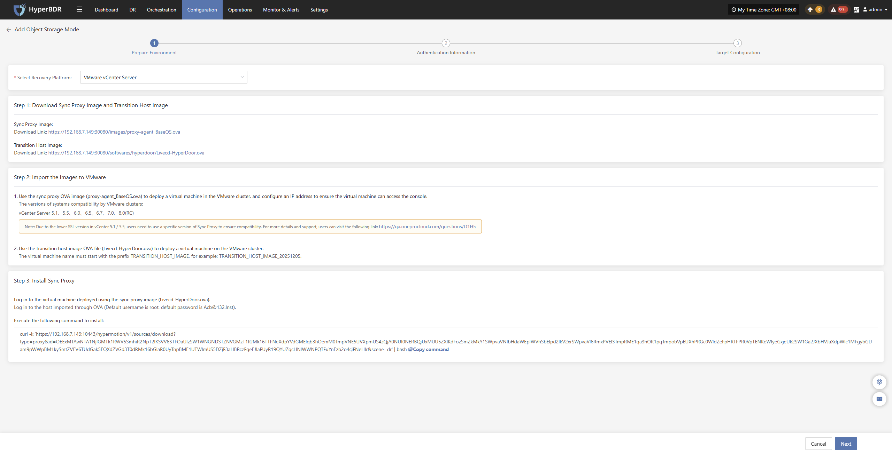
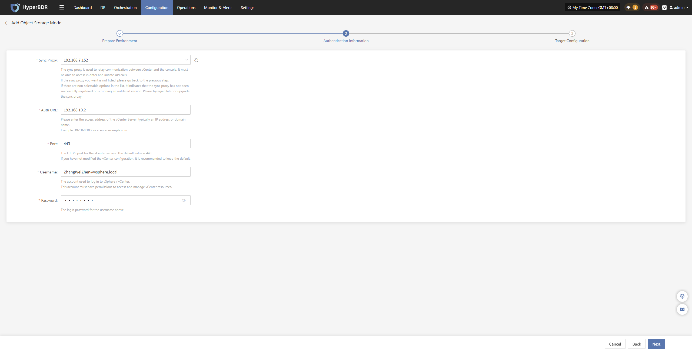
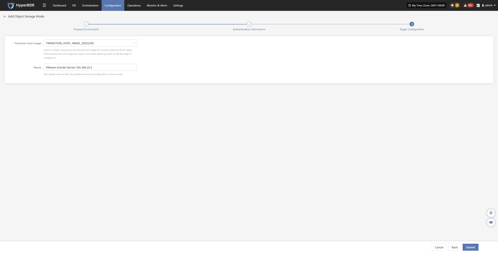
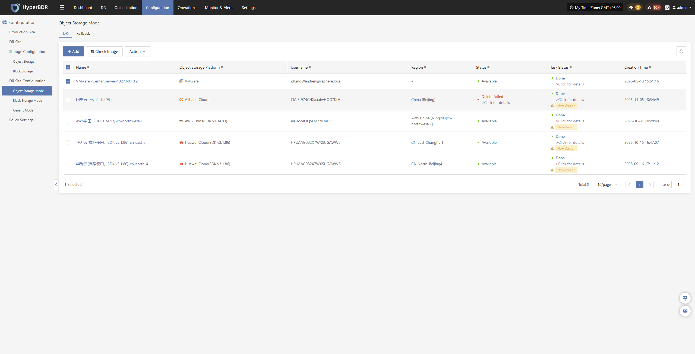
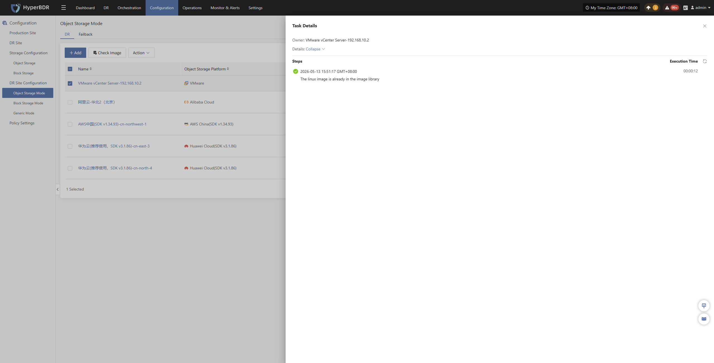
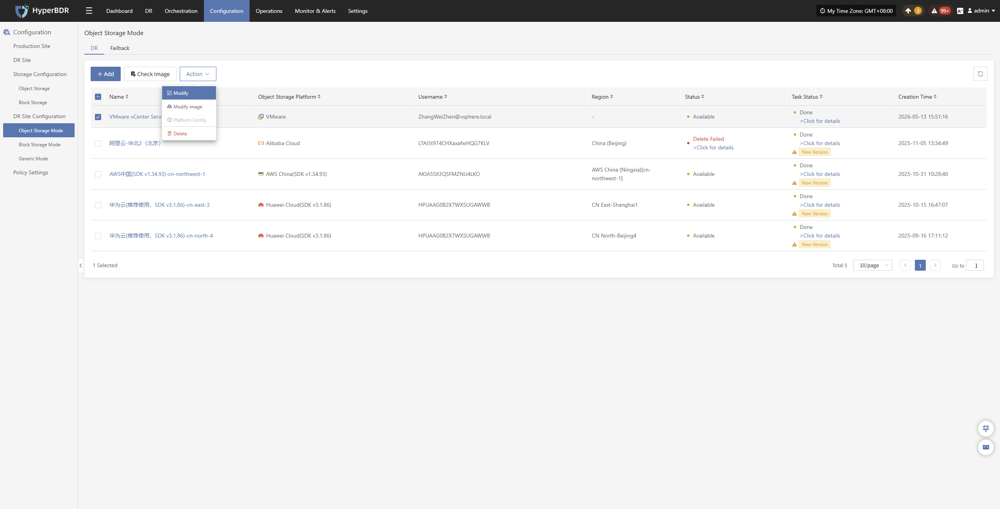
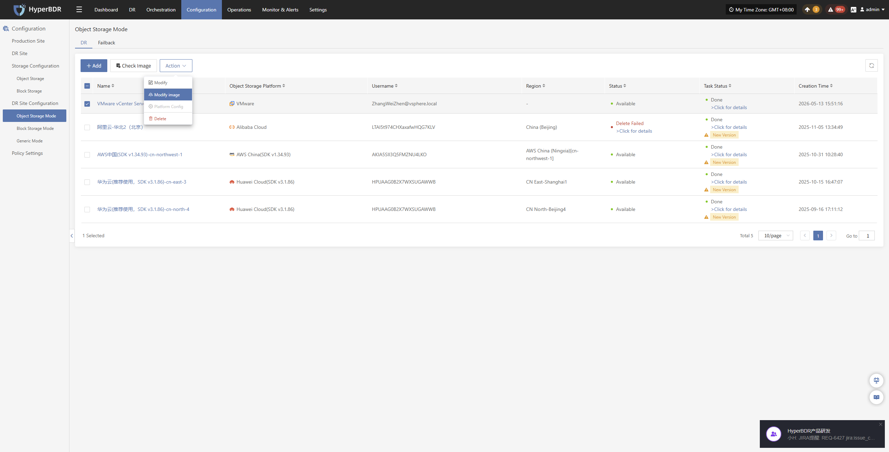
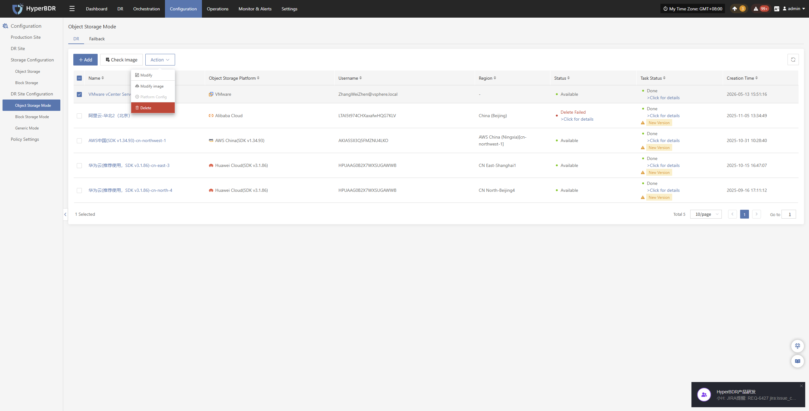
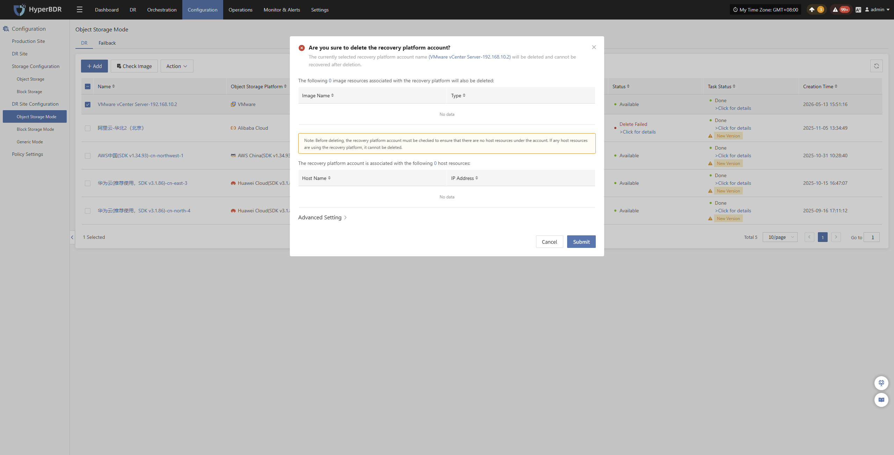

# VMware vCenter Server

## **Add Object Storage**

From the top navigation bar, select **"Configuration" → "DR Site Configuration" → "Object Storage"** to enter the object storage page. Click the "Add" button to add a new object storage configuration.

### **Prepare Environment**

In the recovery platform dropdown, select "VMware vCenter Server", and prepare the relevant environment according to the page prompts:

- **Prepare Environment Description**
    - Step 1:
        - Obtain the required host image resources according to the page guidance.

    - Step 2:
        - Use the sync proxy image OVA file (proxy-agent_BaseOS.ova) to deploy a virtual machine in the VMware cluster, and configure an IP address for it, ensuring the virtual machine can access the console.
        - Use the transition host image OVA file (Livecd-HyperDoor.ova) to deploy a virtual machine on the VMware cluster.
        > The virtual machine name must start with TRANSITION_HOST_IMAGE as a prefix, for example: TRANSITION_HOST_IMAGE_20251205.
    - Step 3:
        - Log in to the virtual machine deployed by the sync proxy image (Livecd-HyperDoor.ova).
        > Log in to the virtual machine deployed via the OVA template (default username is root, default password is Acb@132.Inst).
        - Copy the installation command provided on the page and execute it on the host.

After preparation, click **"Next"** to start filling in **"Authentication Information"**

### **Authentication Information**

After preparation, fill in the following platform Authentication Information according to the actual situation:

- **Authentication Information**

| Configuration Item | Example Value | Description |
|---|---|---|
| Sync Proxy | 192.168.7.152 | The sync proxy server address configured in the first step, used to establish sync communication with the platform. |
| Auth URL | 192.168.10.2 | Platform login address, used for user authentication and login. |
| Port | 443 | Access port for the platform login service, default uses HTTPS 443 port. |
| Username | ZhangWeiZhen@vsphere.local | Platform login account, needs corresponding access and management permissions. |
| Password | •••••••• | Password corresponding to the platform login account. |

After filling in the authentication information, click **"Next"** to proceed to **"Target Configuration"**

### **Target Configuration**

* **Target Configuration Description**

| Configuration Item | Example Value | Description |
|---|---|---|
| Transition Host Image | TRANSITION_HOST_IMAGE_20251205 | Image resource used to create transition hosts, needs to be created in advance on the VMware platform using the OVA template. |
| Name | VMware vCenter Server-192.168.10.2 | Name displayed in the HyperBDR list, recommended to name according to platform type and IP address for easy identification and management. |

After target configuration, click **"Submit"**, the system will start creating the target storage platform information. When the task status shows completed, it can be used normally.

### **Click for details**

During creation, click ">Click for details" to view detailed logs generated during the task creation process, facilitating quick understanding of execution status and troubleshooting.

## **Action**

### **Modify**

Click "Modify" to edit authentication information and target configuration.

### **Modify image**

Click "Modify image" to rebuild the transition host image.

> Note: If you select the [Auto Upload] option, after clicking the [Confirm] button, the previously auto-uploaded image will be deleted first, then a new image will be auto-uploaded.

### **Platform Config**

Click "Platform Config" to modify some startup information of the target platform, supporting custom creation timeout times for hosts, disks, snapshots, and images, to adapt to resource creation time requirements in different environments.

Note: This feature is currently unavailable for VMware platform.

### **Delete**

