# **Host DR**

Resource Disaster Recovery is the main workflow guide page for HyperBDR disaster recovery. All DR operations are completed on this page, including both forward host DR and host failback processes.

The host DR process consists of three main steps: Select Host, Setup DR, and Start DR. You can follow these three steps to complete the full cycle from host disaster recovery to DR drill/takeover.

Click the top "DR" navigation bar, then click the left "Host DR" navigation bar to perform the main host DR workflow.

## **Operation Process**

| **Step**           | **Description**                                                                                      |
| ------------------ | --------------------------------------------------------------------------------------------------- |
| Preparation        | Register HyperBDR user and add HyperBDR product license                                             |
| Step 1 Select Host | Click the top **"DR"** navigation bar, click the left **"Host DR"**, then click **"Select Host"** to start the host selection step |
| Step 2 Setup DR    | Click the top **"DR"** navigation bar, click the left **"Host DR"**, then click **"Setup DR"** to start the DR configuration step |
| Step 3 Start DR    | Click the top **"DR"** navigation bar, click the left **"Host DR"**, then click **"Start DR"** to start the DR process step         |

## **Preparation**

### **Register HyperBDR User**

Before adding DR hosts, you need to register or add a DR account. You can use the default admin account created during installation to log in to the platform, or create a new DR account. The platform supports multi-tenant mode.

TODO:

(Create a new DR account)

If you already have an account, please skip this step.

### **Add HyperBDR Product License**

After the DR product is installed, you need to add a DR product license. You can contact your project manager or send an email to <support@oneprocloud.com> to apply for a valid license.

TODO:

[License application guidance steps](../../poc/failback-hyperbdr-pre-settings.md#apply-for-hyperbdr-failback-license)

If you have already added a license, please skip this step.

### **Complete Production Site Configuration**

This step is for agentless mode on the source production platform, including five types: VMware, OpenStack, AWS, FusionCompute, and Oracle.

* [Add VMware production site](../configuration/production-site.md#add-vmware-platform)
* [Add OpenStack production site](../configuration/production-site.md#add-openstack-platform)
* [Add AWS production site](../configuration/production-site.md#add-aws-platform)
* [Add FusionCompute production site](../configuration/production-site.md#add-fusioncompute-platform)
* [Add Oracle production site](../configuration/production-site.md#add-oracle-platform)   

If your source is in **Agent** or you have already completed the **production site configuration**, please skip this step.

### **Complete Disaster Recovery Target Configuration**

This step applies when the disaster recovery (DR) target platform has already been automated and integrated. You need to complete the **DR target configuration** in advance.

If you have not configured it yet, please first go to **(Disaster Recovery Target Platform Configuration)** to add a DR recovery platform.

If you are using object storage mode, you can skip this step.

### **Network Policy Activation**

When performing **Select Host, DR Configuration, and Start DR** steps, you must activate network access from the source production platform to the HyperBDR DR console and the DR target. This ensures the source production platform can be properly added, registered, and can synchronize data. Without this, adding hosts will fail.

* (Network architecture and policies for agentless mode)

* (Network architecture and policies for agent-based mode)

### **Plan VPC, Subnets, and Other Network Resources for the DR Target Platform**

During **DR configuration**, you need to assign target resources for the backup hosts. This requires selecting pre-planned VPCs, subnets, security groups, and other network settings. If these resources have not been created and planned ahead, subsequent steps cannot proceed.

You must ensure there is at least one usable VPC, subnet, and security group under the DR target cloud account.

This step is applicable for DR targets using automated block storage mode or object storage automated recovery mode. Other common methods can ignore this step.

## **Select Host**

Log in to the console, click the top **"DR"** navigation bar, then click **"Host DR"** on the left sidebar. Next, click the **"Select Host"** menu, and click the **"Add Host"** button to add production hosts for disaster recovery.

On the add host page, you can select the production platform type: source side agentless mode or source side agent mode.

| **Production Platform Type** | **Supported Resources**                         | **Description**                                                                                                                                                                                                                                                      |
|:----------------------------:|:----------------------------------------------:|:--------------------------------------------------------------------------------------------------------------------------------------------------------------------------------------------------------------------------------------------------------------------:|
| Agentless          | VMware OpenStack AWS FusionCompute Oracle | When the production source platform is VMware, OpenStack, AWS, FusionCompute, or Oracle, backup can be performed in agentless mode.                                                                                                                                  |
| Agent        | Linux Windows                               | Agent program for the production source, applicable to all source Linux and Windows hosts, provided the operating system is within the supported range. Operating System Support Matrix (Agentless): [View Here](https://oneprocloud.feishu.cn/sheets/VRqksSPEPhRTPStp3kVcItXNnyh?sheet=0MJNYC) Operating System Support Matrix (Agent): [View Here](https://oneprocloud.feishu.cn/sheets/VRqksSPEPhRTPStp3kVcItXNnyh?sheet=Y9fpqO) |

### **Agentless**

The source-side agentless mode supports five types of production platforms: VMware, OpenStack, AWS, FusionCompute, and Oracle.

Agentless mode requires deploying one or more Sync Proxy agents on the source side. The Sync Proxy agents centrally connect and call the source production API interfaces to obtain data, so prior network planning and configuration is necessary.

* VMware Platform Sync Proxy VM Creation

You can directly download the OVA template and import it into VMware to create a Sync Proxy VM for use.

OVA download link: [Download Here](https://hyperbdr-system-image-do-not-delete.obs.ap-southeast-3.myhuaweicloud.com/proxy-agent_BaseOS.ova)

* Sync Proxy VM Creation for Other Platforms

For other platforms, you can create a virtual machine with Ubuntu 20.04 OS. For OpenStack or other KVM virtualization platforms, you can download the standard Ubuntu 20.04 QCOW image and import it for use.

QCOW image download link: [Download Here](https://downloads.oneprocloud.com/docs_images/ubuntu-20.04-server-cloud-init-amd64.qcow2)

> Note: This Ubuntu 20.04 image has no default login password. It includes the cloud-init service inside the image, so the cloud platform you import it into must support password injection via cloud-init, otherwise this image cannot be used.

* Prerequisites

| Production Platform | Prerequisites                                             | Documentation                                                                                                               |
| :-----------------: | :-------------------------------------------------------: | :-------------------------------------------------------------------------------------------------------------------------: |
| VMware              | Complete the deployment and installation of the Sync Proxy agent, then add the source VMware production platform.         | [Add VMware Production Platform](../configuration/production-site.md#add-vmware-platform)         |
| OpenStack           | Complete the deployment and installation of the Sync Proxy agent, then add the source OpenStack Ceph production platform.  | [Add OpenStack Production Platform](../configuration/production-site.md#add-openstack-platform) |
| AWS                 | Complete the deployment and installation of the Sync Proxy agent, then add the source AWS production platform.             | [Add AWS Production Platform](../configuration/production-site.md#add-aws-platform)   |
| FusionCompute       | Complete the deployment and installation of the Sync Proxy agent, then add the source FusionCompute production platform.   | [Add FusionCompute Production Platform](../configuration/production-site.md#add-fusioncompute-platform)                                                                                   |
| Oracle              | Complete the deployment and installation of the Sync Proxy agent, then add the source Oracle production platform.          | [Add Oracle Production Platform](../configuration/production-site.md#add-oracle-platform)                                                                                             |

#### **VMware**

Click the **"Select Host"** menu, then click the **"Add Host"** button to add a host. Choose the production platform type, select **"Agentless"**, and select **"VMware"** platform. In the production platform, choose the already added VMware platform link, then click **"Next"** to proceed to select the VMware hosts for disaster recovery.

If you have not added a production platform yet, you can click the **"Add New"** button to add a new VMware production platform. Refer to the steps here: [Add VMware Platform](../configuration/production-site.md#add-vmware-platform)

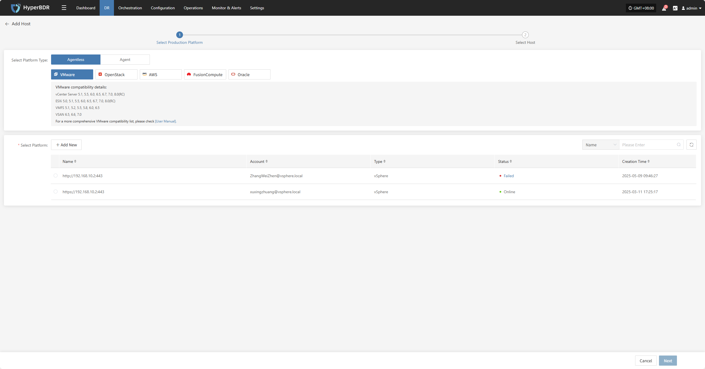

From the current VMware platform, check the virtual machines that need disaster recovery backup. You can flip pages to manually select in batches, or use the search function to find hosts by name or system type for backup.

When selecting backup hosts, you can refer to the number of host disks and source synchronization agent information. Currently, the number of source synchronization agents, maximum mounted disks, mounted disks, and remaining mountable disks can be seen. This information helps you expand the specs and quantity of source synchronization agents to support large-scale backups.

You can view a list of all virtual machines including their operating system, number of disks, total disk capacity, support for synchronization, and incremental backup support.

The **"Reload Virtual Machines"** feature allows you to reload any new hosts that do not appear in the list after being created on the platform. Click the **"Reload Virtual Machines"** button to refresh the list.

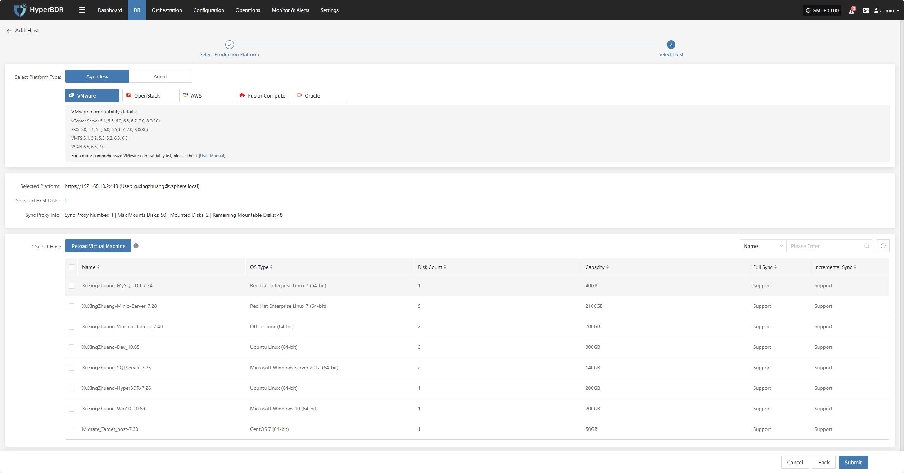

After selecting the virtual machines, click the **"Submit"** button to add the backup virtual machines to the platform.

Once added, you can check the virtual machines to be backed up, then click the **"Submit"** button to move the backup hosts to the second step for further disaster recovery configuration.

#### **OpenStack**

Click the **"Select Host"** menu, then click the **"Add Host"** button to add a host. Choose the production platform type, select **"Agentless"**, and select the **"OpenStack"** platform. In the production platform section, choose the already added OpenStack platform link, then click **"Next"** to proceed to select the OpenStack hosts for disaster recovery.

If you have not added a production platform yet, you can click the **"Add New"** button to add a new OpenStack production platform. Refer to the steps here: [Add OpenStack Production Platform](../configuration/production-site.md#add-openstack-platform)

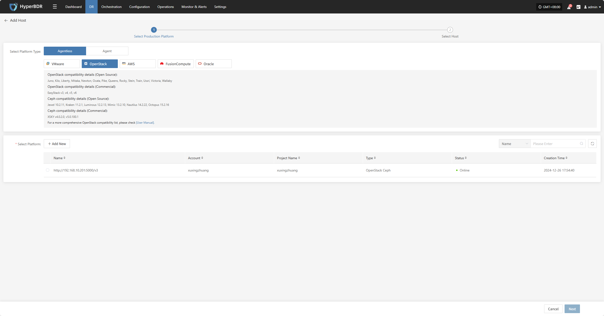

From the current OpenStack platform, check the virtual machines that need disaster recovery backup. You can flip pages to manually select in batches, or use the search function to find hosts by name or system type for backup.

When selecting backup hosts, you can refer to the number of host disks and source synchronization agent information. Currently, the number of source synchronization agents, maximum mounted disks, mounted disks, and remaining mountable disks can be seen. This information helps you expand the specs and quantity of source synchronization agents to support large-scale backups.

You can view a list of all virtual machines including their system type, number of disks, total disk capacity, support for synchronization, and incremental backup support.

The **"Reload Virtual Machines"** feature allows you to reload any new hosts that do not appear in the list after being created on the platform. Click the **"Reload Virtual Machines"** button to refresh the list.

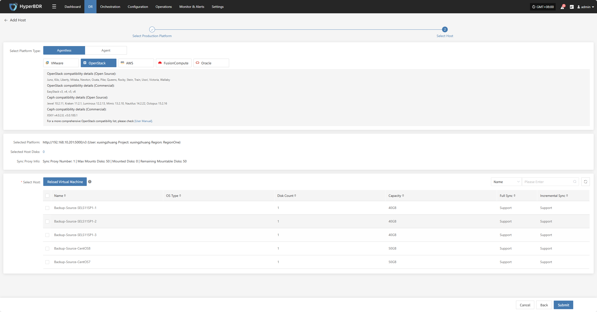

After selecting the virtual machines, click the **"Submit"** button to add the backup virtual machines to the platform.

Once added, you can check the virtual machines to be backed up, then click the **"Submit"** button to move the backup hosts to the second step for further disaster recovery configuration.

#### **AWS**

Click the **"Select Host"** menu, then click the **"+ Add Host"** button to add a host. Choose the production platform type, select **"Agentless"**, and select the **"AWS"** platform. In the production platform section, choose the already added AWS platform link, then click **"Next"** to proceed to select the AWS hosts for disaster recovery.

If you have not added a production platform yet, you can click the **"Add New"** button to add a new AWS production platform. Refer to the steps here: [Add AWS Production Platform](../configuration/production-site.md#add-aws-platform)

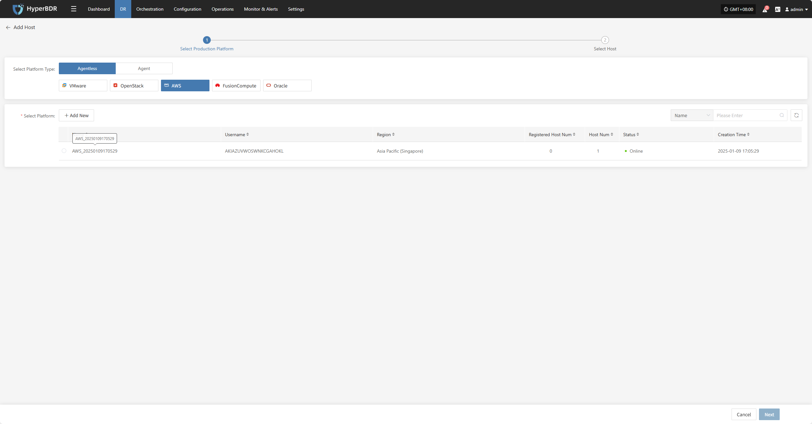

From the current AWS platform, check the virtual machines that need disaster recovery backup. You can flip pages to manually select in batches, or use the search function to find hosts by name or system type for backup.

When selecting backup hosts, you can refer to the number of host disks and source synchronization agent information. Currently, the number of source synchronization agents, maximum mounted disks, mounted disks, and remaining mountable disks can be seen. This information helps you expand the specs and quantity of [source synchronization agents](https://hypermotion.yuque.com/fe338c/qzb4z6/hbgii4h7vi73hh3k#k0D0X) to support large-scale backups.

You can view a list of all virtual machines including their operating system, number of disks, total disk capacity, support for synchronization, and incremental backup support.

The **"Reload Virtual Machines"** feature allows you to reload any new hosts that do not appear in the list after being created on the platform. Click the **"Reload Virtual Machines"** button to refresh the list.

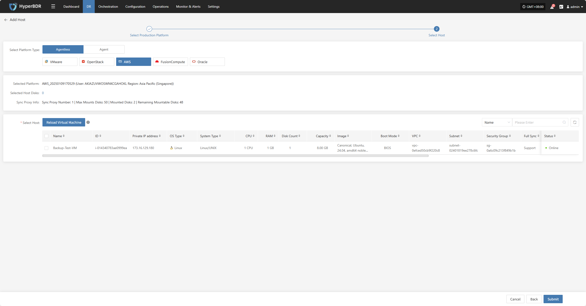

After selecting the virtual machines, click the **"Submit"** button to add the backup virtual machines to the platform.

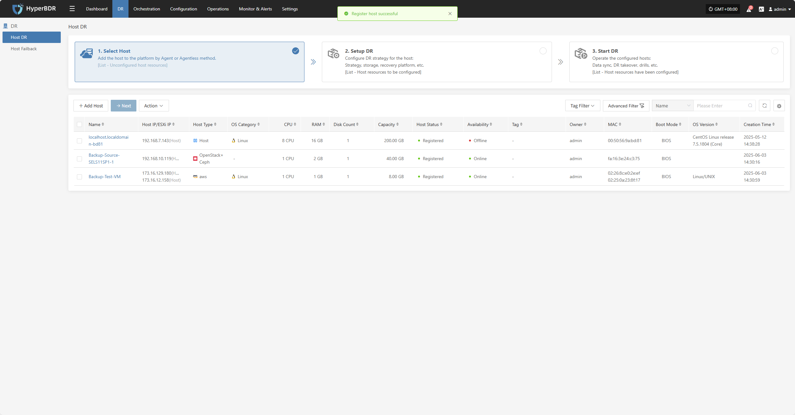

Once added, you can check the virtual machines to be backed up, then click the **"Submit"** button to move the backup hosts to the second step for further disaster recovery configuration.

#### **FusionCompute**

Click the **"Select Host"** menu, then click the **"+ Add Host"** button to add a host.  
Select the production platform type, choose **"Agentless"**, and select the **"FusionCompute"** platform.  
In the production platform list, select the already added FusionCompute platform link, then click **"Next"** to proceed to the list of FusionCompute disaster recovery hosts.

If you have not added a production platform, click the **"Add New"** button to add a new FusionCompute production platform. Refer to the guide: [Add FusionCompute Production Platform](../configuration/production-site.md#add-fusioncompute-platform)

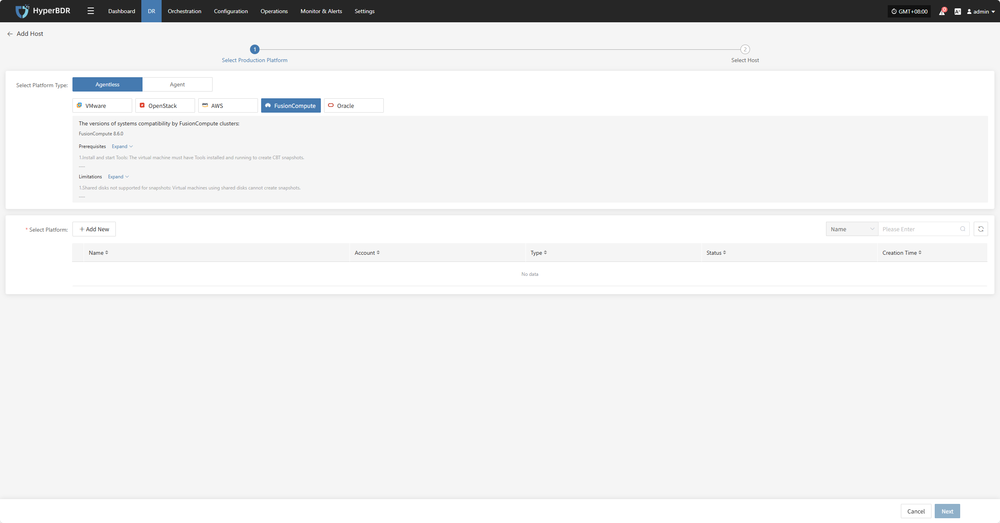

Select the virtual machines to be backed up from the current FusionCompute platform. You can select them manually page by page or use the search function to find hosts by name or operating system.

When selecting backup hosts, refer to the host disk count and source sync agent information. The current number of sync agents, maximum mountable disks, mounted disks, and remaining mountable disks are displayed. You can scale the specifications and quantity of source sync agents anytime to support large-scale backups.

The list shows all virtual machines including operating system, disk count, total disk capacity, and support for sync and incremental backup.

The **"Reload Virtual Machines"** function: if newly created hosts on the platform do not appear in the list, click the **"Reload Virtual Machines"** button to refresh the list.

#### Oracle

Click the **"Select Host"** menu, then click the **"Add Host"** button to add a host.  
Select the production platform type, choose **"Agentless"**, and select the **"Oracle"** platform.  
In the production platform list, select the already added Oracle platform link, then click **"Next"** to proceed to the Oracle disaster recovery host list.

If you have not added a production platform, click the **"Add New"** button to add a new Oracle production platform. Refer to the guide: [Add Oracle Production Platform](../configuration/production-site.md#add-oracle-platform)

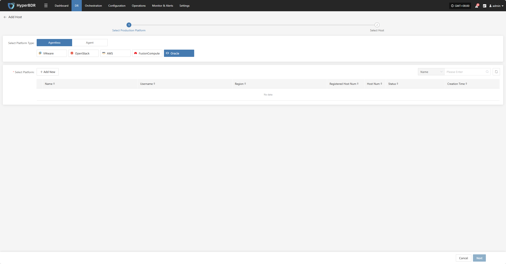

Select the virtual machines to be backed up from the current Oracle platform. You can select them manually page by page or use the search function to find hosts by name or operating system.

When selecting backup hosts, refer to the host disk count and source sync agent information. The current number of sync agents, maximum mountable disks, mounted disks, and remaining mountable disks are displayed. You can scale the specifications and quantity of source sync agents anytime to support large-scale backups.

The list shows all virtual machines including operating system, disk count, total disk capacity, and support for sync and incremental backup.

The **"Reload Virtual Machines"** function: if newly created hosts on the platform do not appear in the list, click the **"Reload Virtual Machines"** button to refresh the list.

### **Agent**

#### **Linux**

Click the **"Select Host"** menu, then click the **"Add Host"** button to add a host.  
Select the production platform type, choose **"Agent"**, and select the **"Linux"** platform.  
Refer to the Linux host compatibility details to choose which hosts are supported for disaster recovery.

Click the installation command below and run it on the source Linux host terminal to complete adding the Linux backup host.

For detailed installation steps, refer to: (Install Linux Agent)

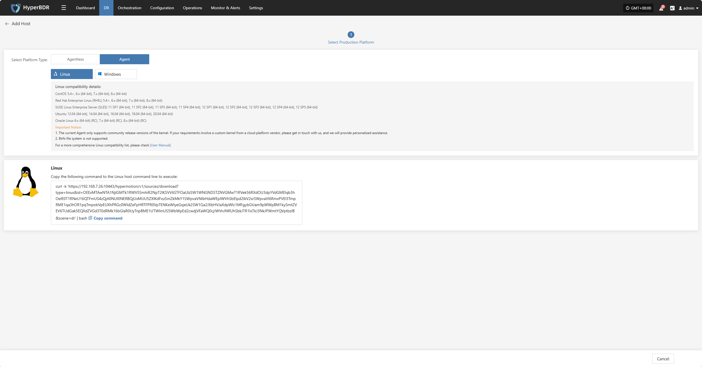

After installation completes, the source host will automatically register to the platform. You can check the status of the registered host.

#### **Windows**

Click the **"Select Host"** menu, then click the **"Add Host"** button to add a host.  
Select the production platform type, choose **"Agent"**, and select the **"Windows"** platform.  
Refer to the Windows host compatibility details to determine if the host supports disaster recovery.

Click **"Download Now"** according to the operating system version to download the Windows Agent installation package, then upload the package to the Windows host for installation.

For detailed installation steps, refer to: (Install Windows Agent)

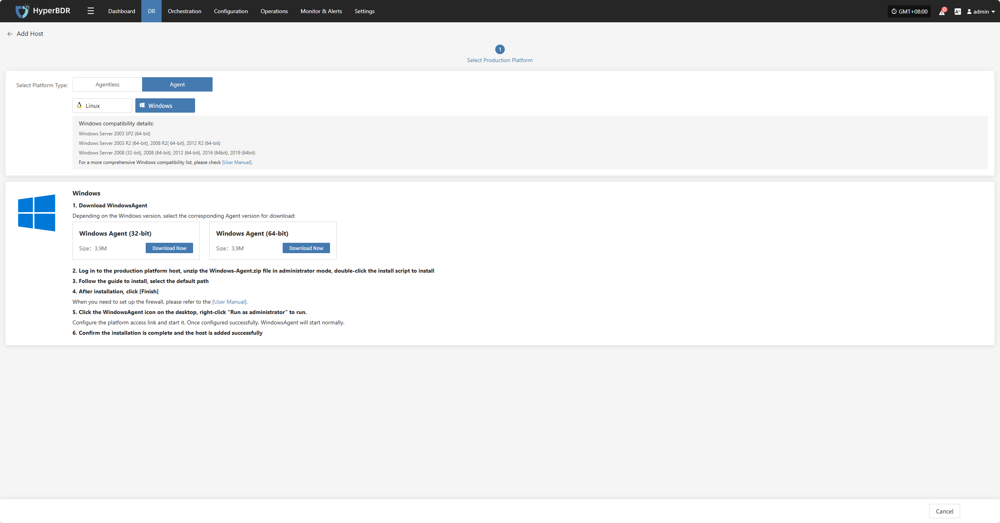

After installation completes, the source host will automatically register to the platform. You can check the status of the registered host.

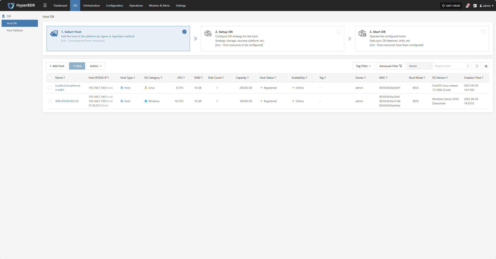

### **Action**

#### **Source Sync Settings**

Source-side parameter configuration for backup hosts.

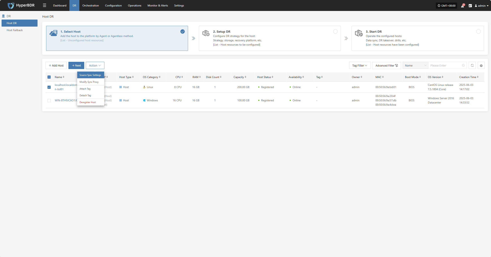

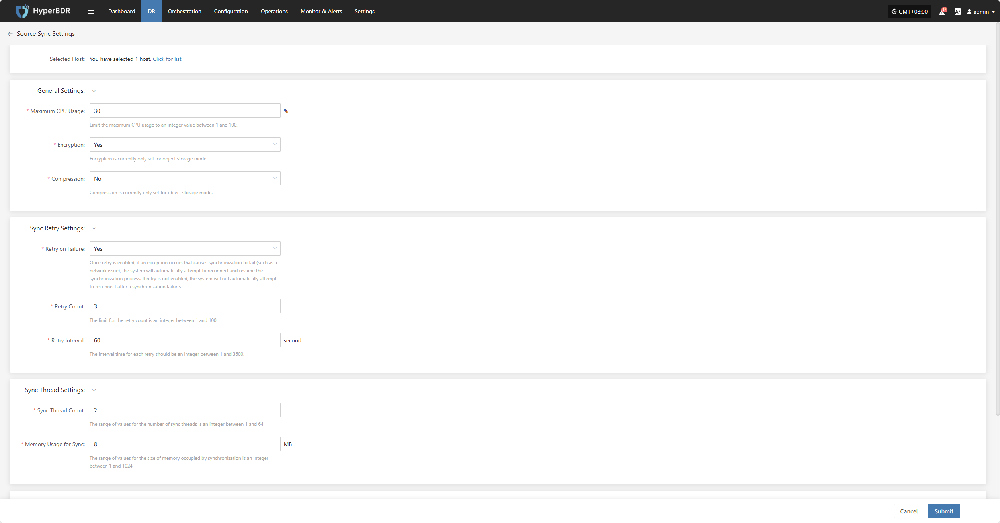

##### **General Settings**

| Parameter           | Setting     | Description                                                                                      |
| ------------------- | ----------- | ------------------------------------------------------------------------------------------------ |
| Maximum CPU Usage   | 1–100       | Specifies the percentage of system CPU resources the source host can use during backup. Setting this too low may reduce backup efficiency. |
| Encryption          | Yes No   | Applies only to object storage mode. Note: Enabling this will consume more CPU for encryption. |
| Compression         | Yes No   | Applies only to object storage mode. Note: Enabling this will consume more CPU for compression. |

##### **Sync Thread Settings**

| Parameter                         | Setting                  | Description                                                                                                                                                                                                                                                                                                                                                                                                                                                                                       |
|----------------------------------|--------------------------|---------------------------------------------------------------------------------------------------------------------------------------------------------------------------------------------------------------------------------------------------------------------------------------------------------------------------------------------------------------------------------------------------------------------------------------------------------------------------------------------------|
| VMware Quiesce Snapshot           | Yes / No                 | Quiesce snapshot is only effective for VMware hosts with VMware-tools installed.                                                                                                                                                                                                                                                                                                                                                                                                                |
| Reading Thread                   | Automatic Adaptation / Custom | Sets the number of reading threads for a single host. Automatic adaptation adjusts the thread count based on the Sync Proxy's resource configuration and the number of disks on the host to be synchronized, within a range of 1 to 10 threads. For specific needs, use the custom option (an integer between 1 and 100). It is recommended to keep the thread count within 30. If the network environment is 10 Gigabit Ethernet or higher, increasing the Sync Proxy's CPU and memory (e.g., 8 cores, 16GB or more) before setting the thread count to 50 or 100 can improve synchronization performance. |
| Writing Thread                   | Automatic Adaptation / Custom | Sets the number of writing threads for a single host. Automatic adaptation adjusts the thread count based on the Sync Proxy's resource configuration and the number of disks on the host to be synchronized, within a range of 1 to 10 threads. For specific needs, use the custom option (an integer between 1 and 100). It is recommended to keep the thread count within 30. If the network environment is 10 Gigabit Ethernet or higher, increasing the Sync Proxy's CPU and memory (e.g., 8 cores, 16GB or more) before setting the thread count to 50 or 100 can improve synchronization performance.   |
| Concurrent Multi-Disk Read and Write | Yes / No                | Indicates whether all disks on the synchronized host are synchronized concurrently.                                                                                                                                                                                                                                                                                                                                                                                                               |

##### **Sync Retry Settings**

| Parameter        | Setting | Description                                                                                                  |
|------------------|---------|--------------------------------------------------------------------------------------------------------------|
| Retry on Failure | Yes / No | When enabled, the system will automatically attempt to reconnect and resume synchronization if an exception (e.g., network error) causes synchronization failure. If disabled, the system will not retry after a failure. |
| Retry Count      | 1-100   | Sets the maximum number of retry attempts.                                                                  |
| Retry Interval   | 1-3600  | The wait time in seconds between each retry attempt.                                                        |

#### **Modify Sync Proxy**

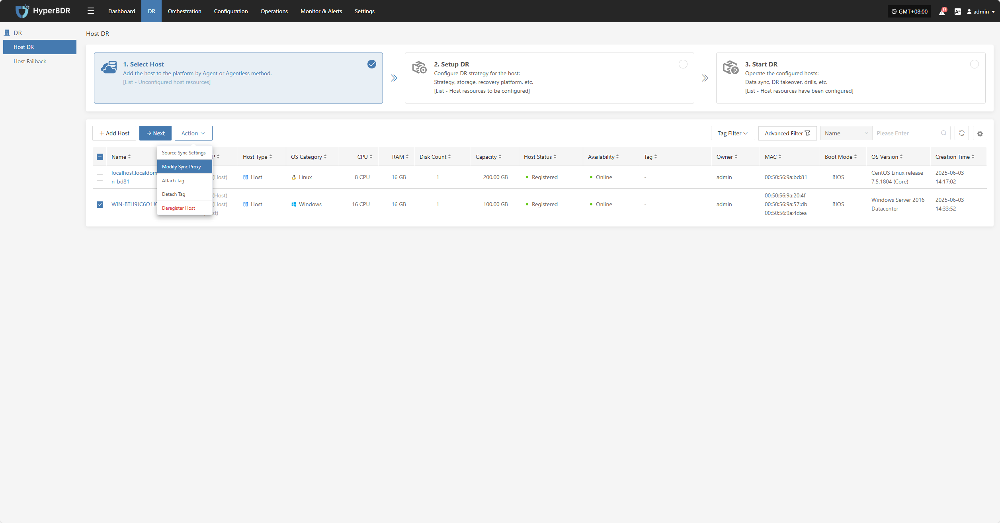

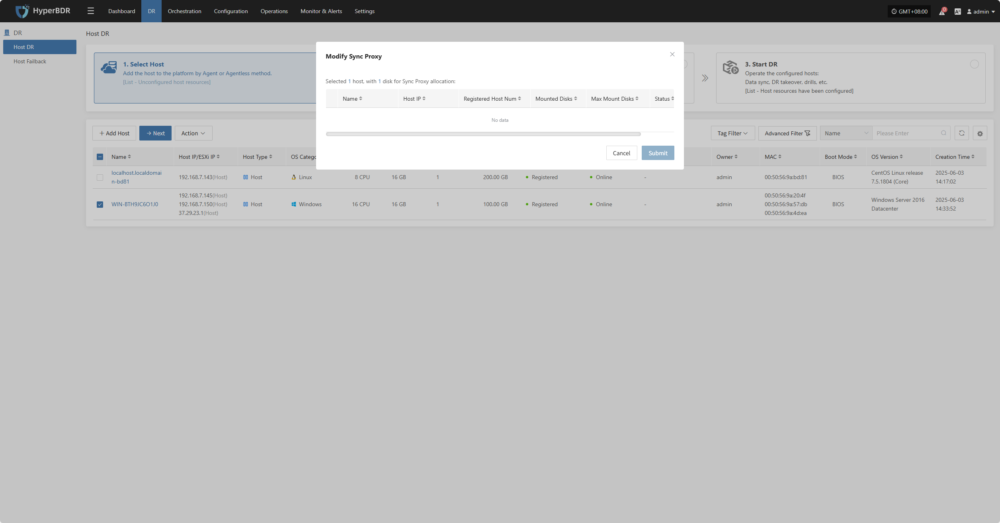

#### **Attach Tag**

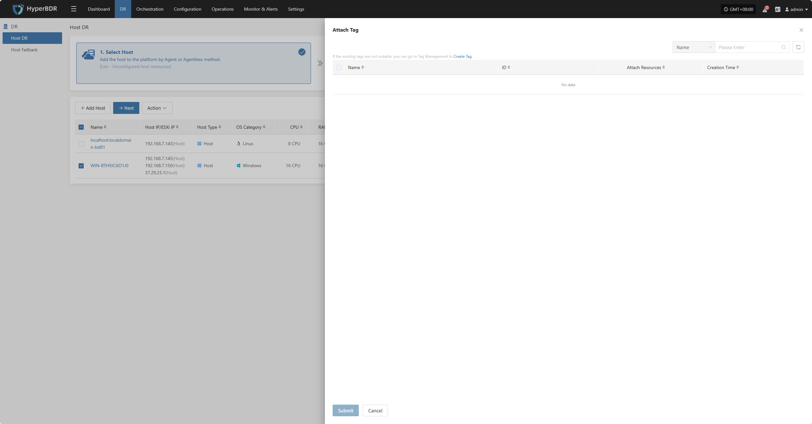

#### **Detach Tag**

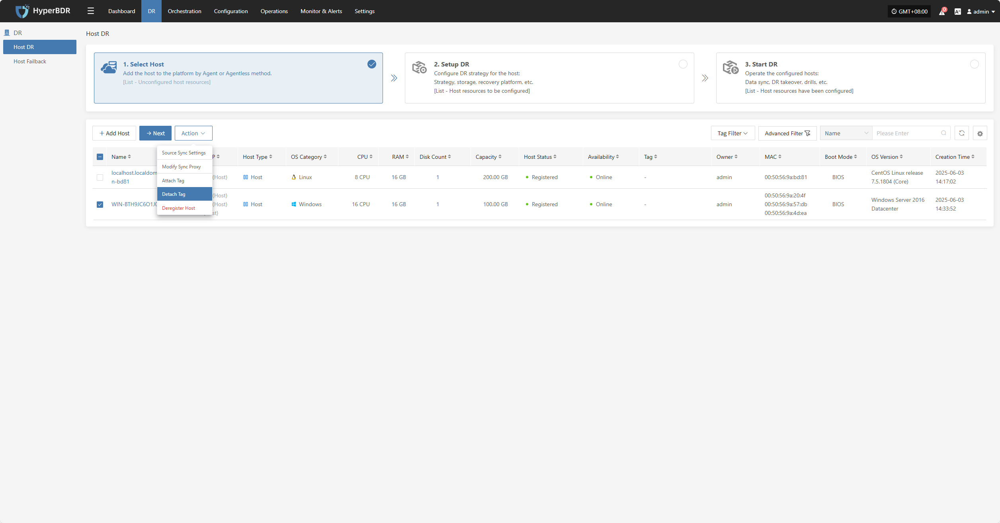

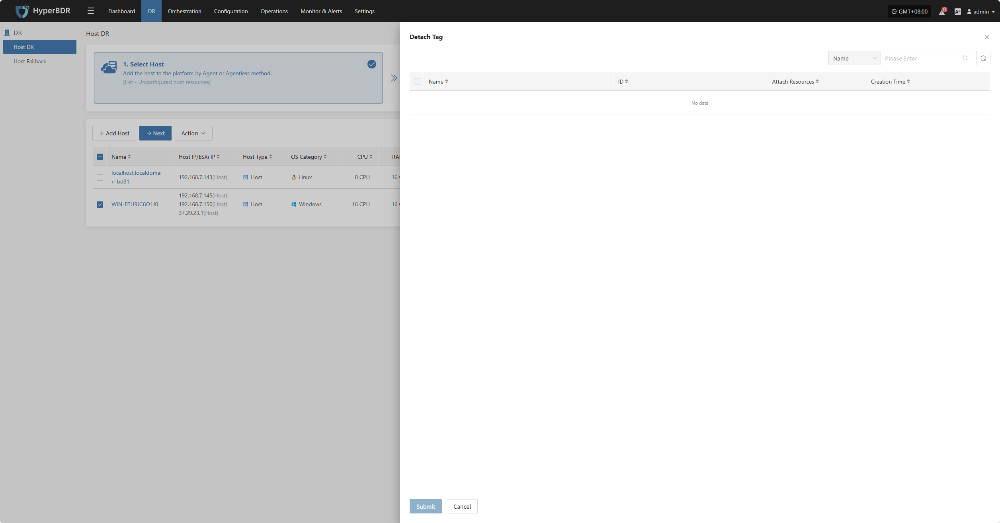

#### **Deregister Host**

Deregister the backup host from the disaster recovery management platform.

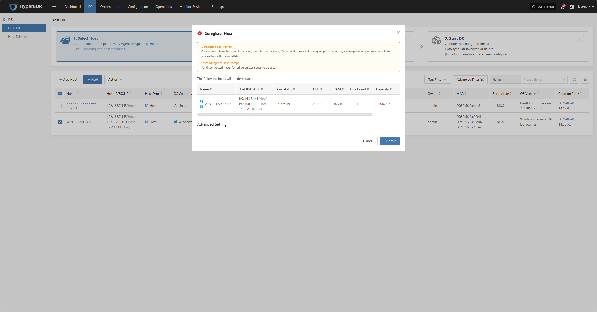

## **Setup DR**

Log in to the console, click the top **"DR"** navigation bar, then click **"Host DR"** on the left. Click the **"Setup DR"** menu, select one or multiple hosts, and click the **"Setup DR"** button to configure disaster recovery.

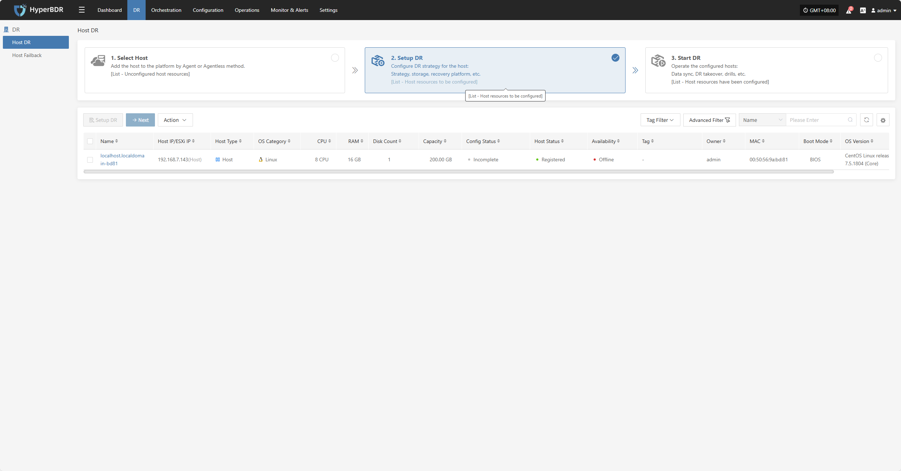

### **Block Storage**

Select the storage type as "Block Storage," and follow the selected information to complete the block storage step configuration and finish the disaster recovery setup.

#### **Specify DR Platform**

Specify the backup host to use the "Block Storage" type for backup, and select the configuration parameter information.

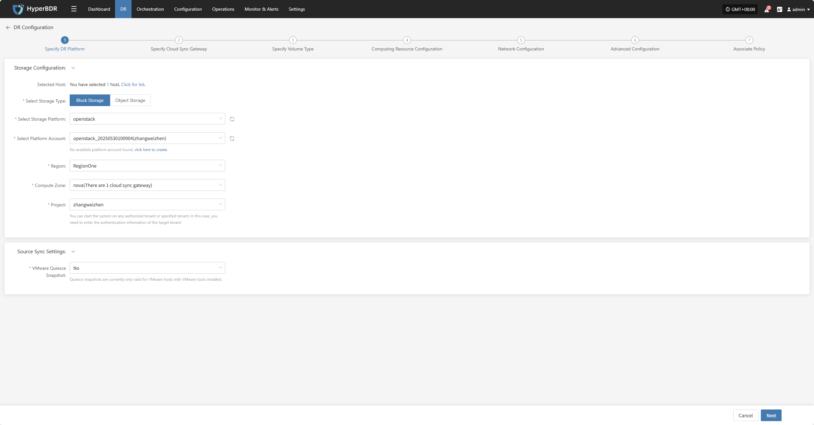

##### **Storage Configuration**

| Parameter               | Configuration      | Description                                                                                      |
| ----------------------- | ------------------ | ------------------------------------------------------------------------------------------------ |
| Select Storage Type     | **Block Storage**  | Prerequisite: Block storage must be pre-configured; select the configured block storage for DR backup |
| Select Storage Platform | (Supported Storage Types) | Fill in the corresponding cloud vendor authentication information according to the actual situation. See details below for supported storage types |

##### **Source Sync Settings**

| Parameter               | Configuration | Description                                             |
| ----------------------- | ------------- | ------------------------------------------------------- |
| VMware Quiesce Snapshot | Yes/No        | Quiesce snapshot currently only effective for VMware hosts with VMware-tools installed. |

##### **Supported Storage Types**

Before proceeding with the configuration, please complete the block storage setup. If you haven't added it yet, click the button below to go to the block storage configuration page.

[👉Click to View Block Storage Configuration](../configuration/storage-configuration.md#block-storage)

After completing the block storage setup, you can select the corresponding block storage platform from the dropdown list,After completing **Specify DR Platform**, click **"Next"** to start **Specify Cloud Sync Gateway**.

#### **Specify Cloud Sync Gateway**

Select the virtual machines that require disaster recovery backup from the current DR platform, assign the corresponding disaster recovery host disks, and complete the configuration of the sync gateway for the respective cloud platform.

> Note: The cloud sync gateway will be automatically created when adding the DR platform configuration, no manual configuration is needed. For details, refer to: (Storage Configuration -- Block Storage Configuration -- Find your corresponding cloud vendor configuration method (not available yet))

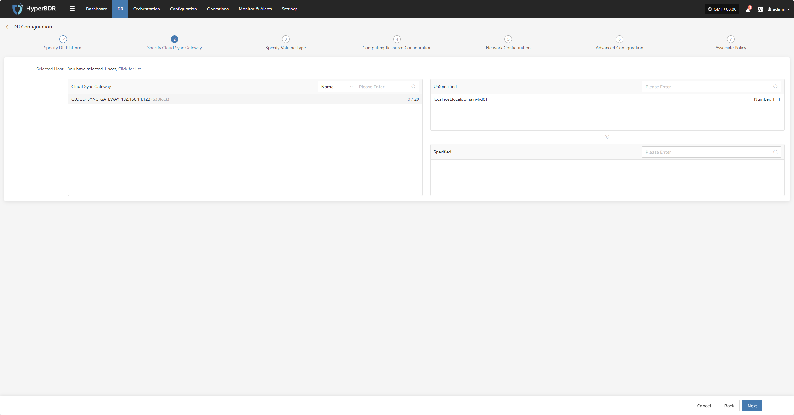

Click the **"+"** next to the corresponding disaster recovery host to assign the DR host.

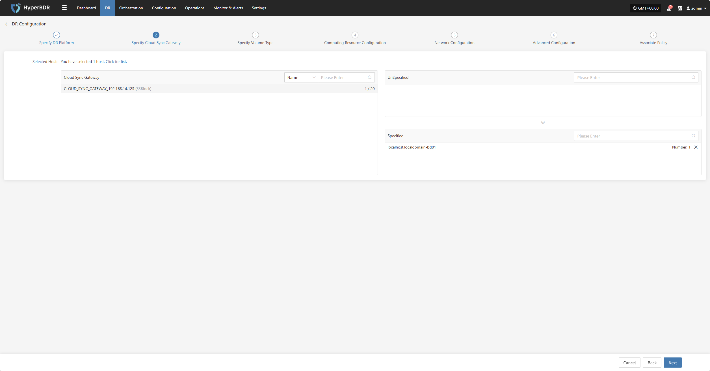

After completing **Specify Cloud Sync Gateway**, click **"Next"** to start **Specify Volume Type**.

#### **Specify Volume Type**

Users need to assign the disk type (volume type) on the recovery target cloud platform for each disk of the selected virtual machines, ensuring correct mapping of target resources during disaster recovery.

Set and select the disk types for the virtual machines requiring disaster recovery backup.

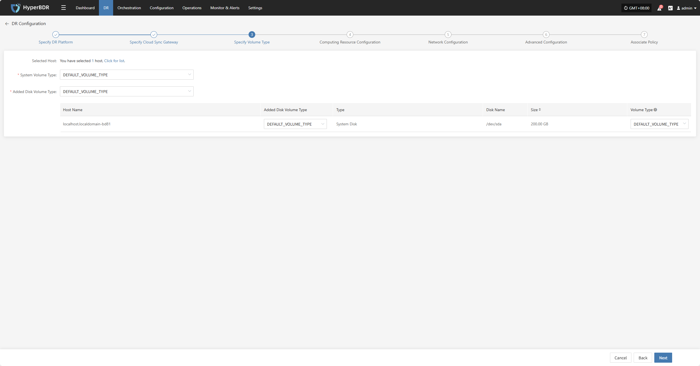

You may choose different types of system volumes from the dropdown list, based on the selected cloud vendor：

| Item                      | Description                                         | 
| ------------------------- | ------------------------------------------------- |
| **_DEFAULT_**             | Default setting automatically selected by the system, suitable for various scenarios |
| **DEFAULT_VOLUME_TYPE**   | Default storage type used by the system in the storage device |

After completing **Specify Volume Type**, click **"Next"** to start **Computing Resource Configuration**.

#### **Computing Resource Configuration**

You need to configure computing resource parameters for the disaster recovery hosts, including CPU, operating system type, etc., to ensure the recovered virtual machines can run properly in the target environment.

Select the virtual machines requiring disaster recovery backup. You can manually select in batches by paging through, configure CPU, operating system type, etc., or use the page buttons for batch configuration. After choosing the appropriate target boot mode, complete the setup.

> Note: When the source host uses UEFI boot mode, you can select BIOS or UEFI to boot the system disk. Disks larger than 2TB cannot use BIOS boot mode.

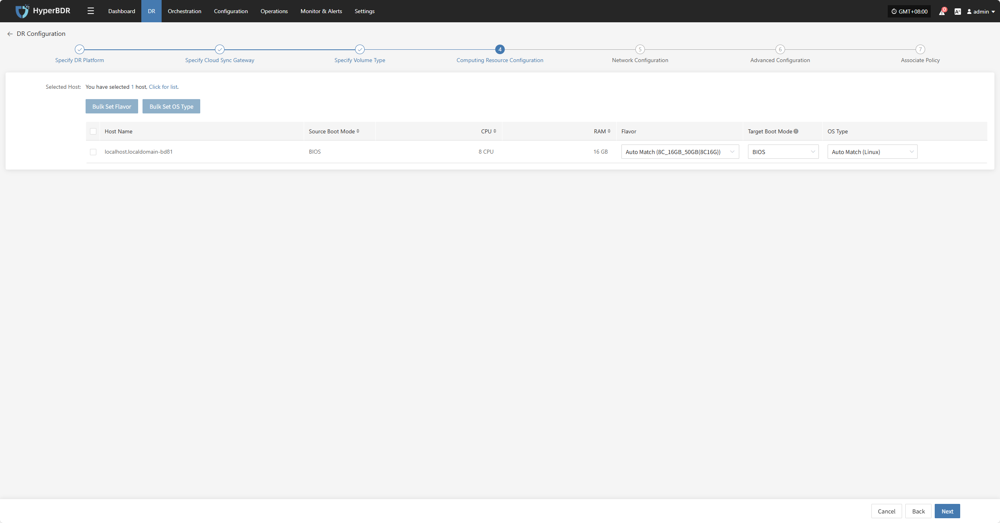

If there is a preset template matching the resource type, the system will auto-match; otherwise, manual selection is required.

##### **Bulk Set Flavor**

Select the required hosts, then click the **"Bulk Set Flavor"** button on the page to start batch configuration of host specifications.

> Note: The currently selected hosts will be set uniformly. If unsure, please reselect.

In the popup dialog, select and confirm according to the preset configuration.

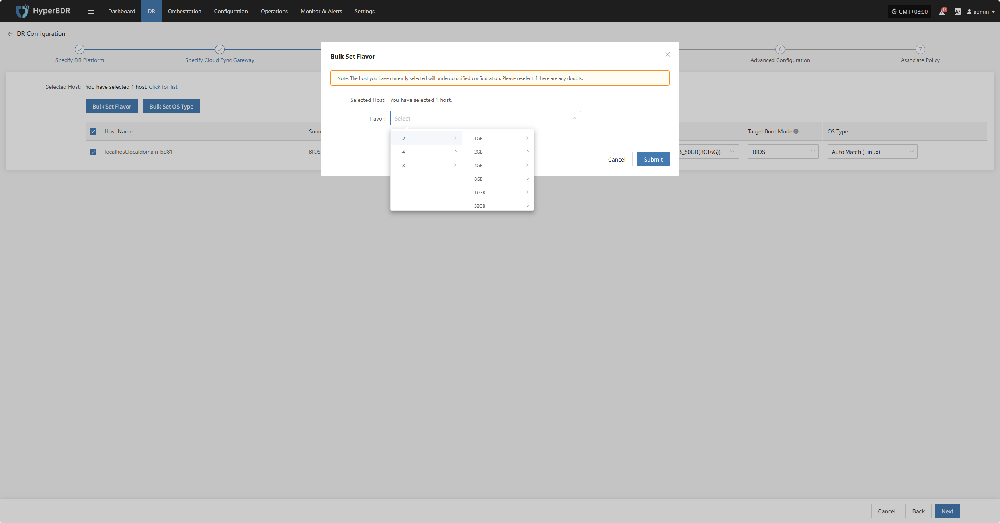

##### **Bulk Set OS Type**

Select the required hosts, then click the **"Bulk Set OS Type"** button on the page to start batch configuration of host operating system types.

> Note: The currently selected hosts will be set uniformly. If unsure, please reselect.

In the popup dialog, choose your host operating system type.

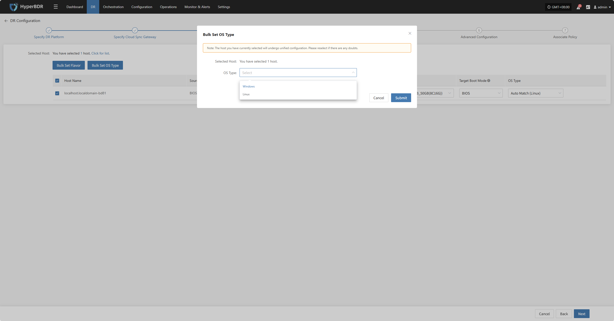

After completing **Computing Resource Configuration**, click **"Next"** to start **Network Configuration**.

#### **Network Configuration**

You need to configure the target network environment for the disaster recovery hosts, including private IP, public IP, security groups, MAC address, and other key parameters to ensure proper communication and access on the target platform.

The system supports both IPv4 and IPv6 networks. Please select the corresponding network and subnet types according to the deployment requirements of the DR hosts.

After selection, configure related parameters such as private IP, public IP, security groups, MAC address, etc., based on actual needs.

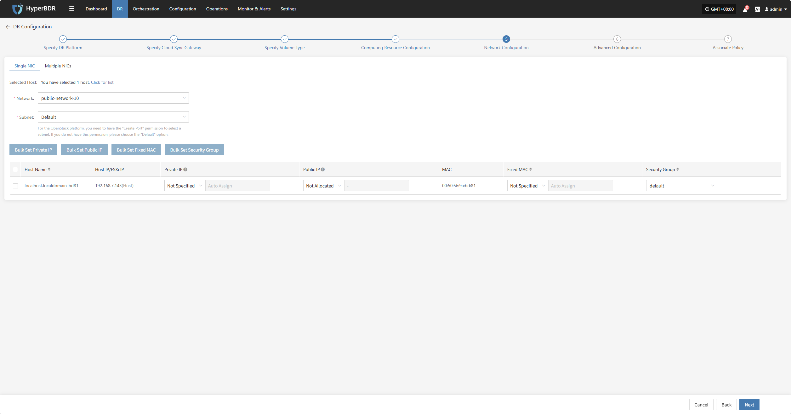

##### **IP Setting Rules**

| Parameter  | Options                               | Description                                                                                                                                            |
| ---------- | ------------------------------------ | ------------------------------------------------------------------------------------------------------------------------------------------------------ |
| Private IP | Original IP / Specified IP / Not Specified | Original IP: system auto-recognizes NIC and assigns source host IP via DHCP. Specified IP: manually enter IP (same subnet as target subnet, immutable), system assigns via DHCP. Not Specified: system uses DHCP to auto-Allocate lP randomly. **Note: If DHCP is unavailable, system cannot auto-configure IP.** |
| Public IP  | Not Specified / Allocate lP / Request lP **(subject to actual cloud vendor)** | Not Specified: host without elastic public IP cannot access the internet, used only in private networks or clusters. Allocate lP: assign an existing elastic public IP to the host. Request lP: automatically assign an elastic public IP with dedicated bandwidth to each host. |
| Security Group | (According to target network configuration) | Multiple security group options based on target network configuration; subject to actual conditions.                                                   |
|Fixed MAC | Original MAC / Fixed MAC / Not Specified | Note: MAC address modification is not supported when using cloud services.                                                                             |

##### **Single NIC**

| Parameter | Configuration            | Description                                                      |
| --------- | ------------------------ | ---------------------------------------------------------------- |
| Network   | Target DR network name   | Specify the target network connected to the DR host for recovery communication. |
| Subnet    | Target associated subnet | Specify the subnet within the target network through which the DR host connects. |

**Bulk Set Private IP**

Select the desired hosts and click the **“Bulk Set Private IP”** button on the page to start batch setting private IPs.

In the pop-up dialog, choose your private IP allocation type.

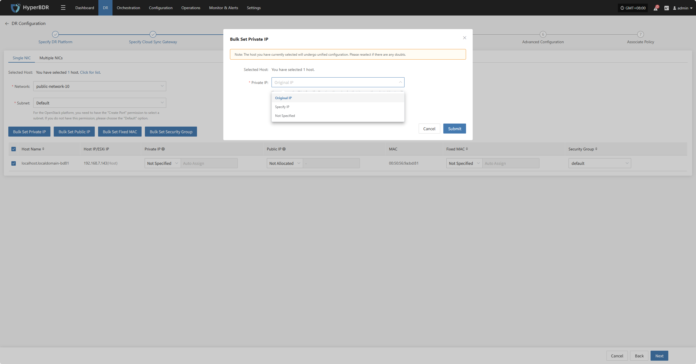

**Bulk Set Public IP**

Select the desired hosts and click the **“Bulk Set Public IP”** button on the page to start batch setting public IPs.

In the pop-up dialog, choose your public IP allocation type.

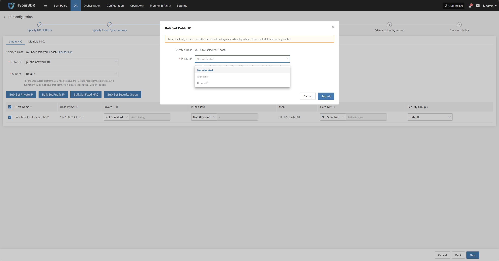

**Bulk Set Fixed MAC**

Select the desired hosts and click the **“Bulk Set Fixed MAC”** button on the page to start batch setting MAC addresses.

In the pop-up dialog, choose your MAC address allocation type.

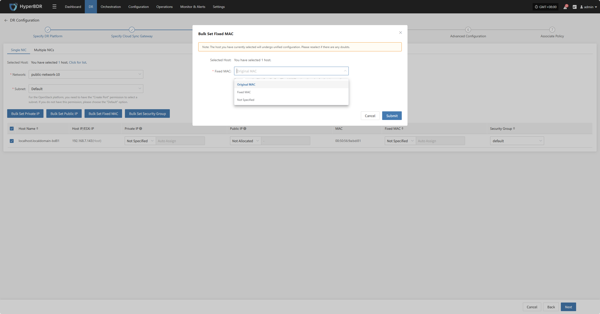

**Bulk Set Security Group**

Select the desired hosts and click the **“Bulk Set Security Group”** button on the page to start batch setting security groups.

In the pop-up dialog, select your security group.

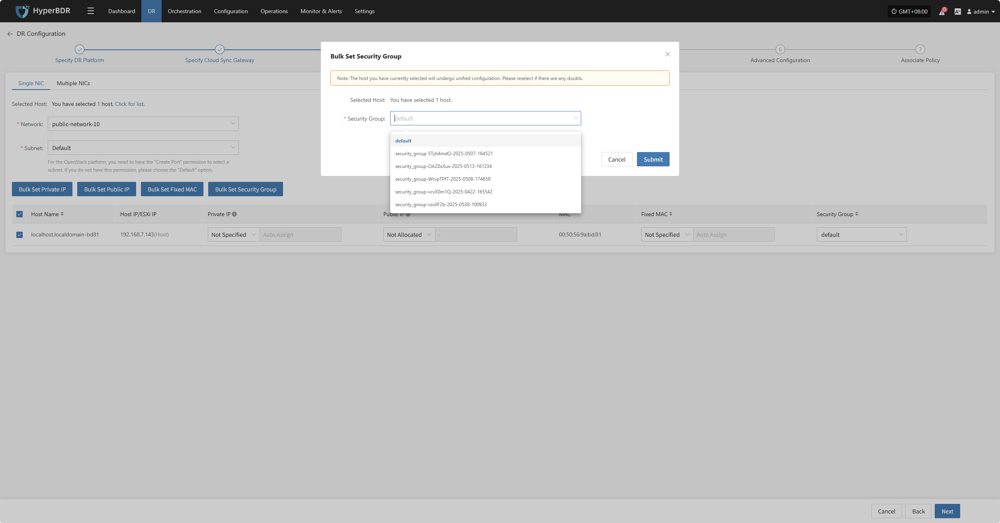

##### **Multiple NlCs**

When a host has multiple network interface cards (NICs) that require specific configurations, you can use the multi-NIC mode for binding.

> Due to cloud platform limitations, the maximum number of target NICs is 5. The first NIC is designated as the primary by default and cannot be deleted.

**+ Add NIC**

After selecting the host, click the "+ Add NIC" button on the page to add a new NIC, ensuring it corresponds to the source NIC.

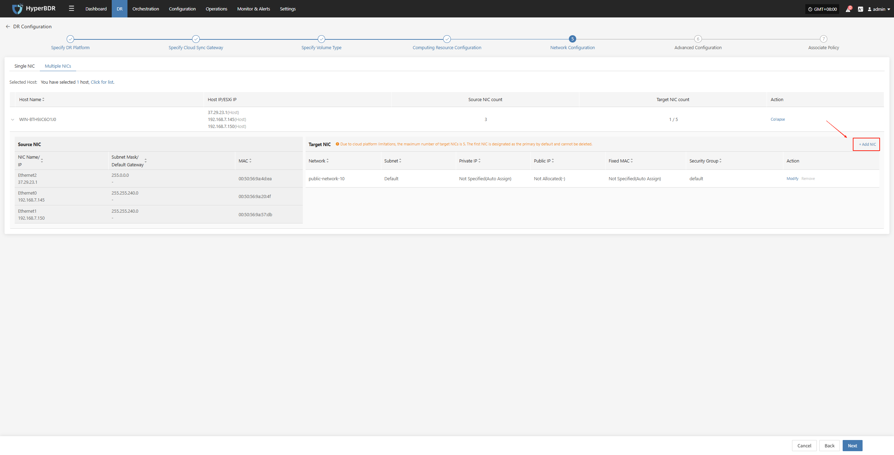

**Modify**

After selecting the corresponding NIC, you can configure settings such as network, subnet, private IP, public IP, specified MAC address, and security group for each NIC individually based on actual requirements.

**Network Configuration** complete, click **“Next”** to start **Advanced Configuration.**

#### **Advanced Configuration**

This section supports user-defined script execution and driver adaptation settings, to meet personalized needs and hardware compatibility tuning in complex environments (the script section can be left blank).

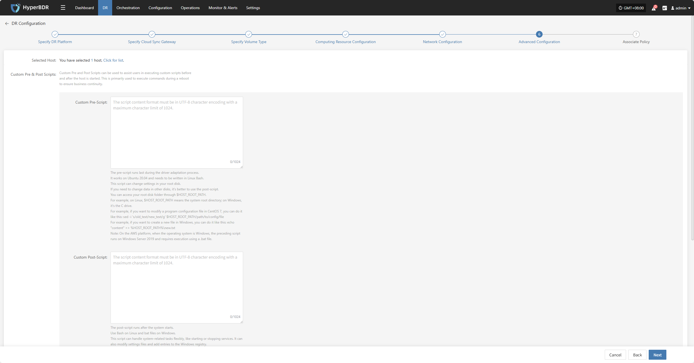

##### **Custom Pre & Post Scripts**

Custom Pre and Post Scripts can be used to assist users in executing custom scripts before and after the host is started. This is primarily used to execute commands during a reboot to ensure business continuity.

**Custom Pre-Script:**

>The pre-script runs last during the driver adaptation process.
>It works on Ubuntu 20.04 and needs to be written in Linux Bash.
>This script can change settings in your root disk.
>If you need to change data in other disks, it's better to use the post-script.
>You can access your root disk folder through $HOST_ROOT_PATH.
>For example, on Linux, $HOST_ROOT_PATH means the system root directory; on Windows, it's the C drive.
>For example, if you want to modify a program configuration file in CentOS 7, you can do it like this: sed -i 's/old_text/new_text/g' $HOST_ROOT_PATH/path/to/config/file
>For example, if you want to create a new file in Windows, you can do it like this: echo "content" >> %HOST_ROOT_PATH%\new.txt
>Note: On the AWS platform, when the operating system is Windows, the preceding script runs on Windows Server 2019 and requires execution using a .bat file.

**Custom Post-Script:**

>The post-script runs after the system starts.
>Use Bash on Linux and bat files on Windows.
>This script can handle system-related tasks flexibly, like starting or stopping services. It can also modify settings files and add entries to the Windows registry.

**Driver Adaptation Settings**

| Parameter        | Option                  | Description                                                                                                                                                                                                          |
| ---------------- | ----------------------- | -------------------------------------------------------------------------------------------------------------------------------------------------------------------------------------------------------------------- |
| Driver Injection | Enable Driver Injection | Only applicable when starting the host on the same virtualization platform, skipping driver adaptation. (Not recommended) Skipping driver adaptation may cause the host to fail to start properly, use with caution. |
| Disk Driver      |                         | When the number of disks on the started host exceeds 20, virtio-scsi type must be selected.                                                                                                                          |

After completing **Advanced Configuration**, click **"Next"** to prompt: **`Before starting policy configuration, hosts already configured will automatically enter "Start Disaster Recovery".`** Then begin associating policies.

#### **Associate Policy**

> Note: This is an optional configuration. Not selecting it will not affect the normal execution of the disaster recovery operation. Policy association can also be completed later through xx.

Associating policies allows flexible control over host backup, recovery, and failover behaviors.

Before using association policies, you need to create the corresponding policies. If no policies exist in the system, selection is unavailable. Policy creation reference: (link)

Policies can be configured for individual hosts or batch-associated for multiple hosts via the page.

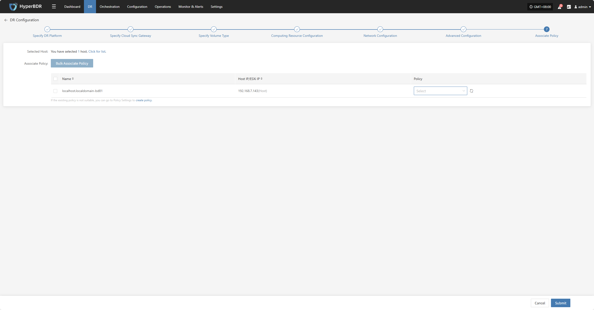

##### **Bulk Associate Policy**

Select the desired hosts and click the **"Batch Associate Policy"** button on the page to start batch association.

In the pop-up dialog, select your policy to associate

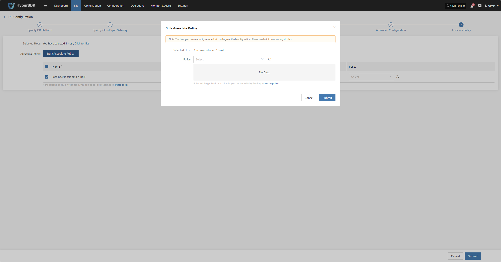

After **Associating Policy**, click **"Confirm"**, Before configuring the policy, the pre-configured hosts will automatically enter the "Start DR" phase.

### **Object Storage**

Select "Object Storage" as the storage type, then configure the block storage steps according to the selected information to complete the disaster recovery setup.

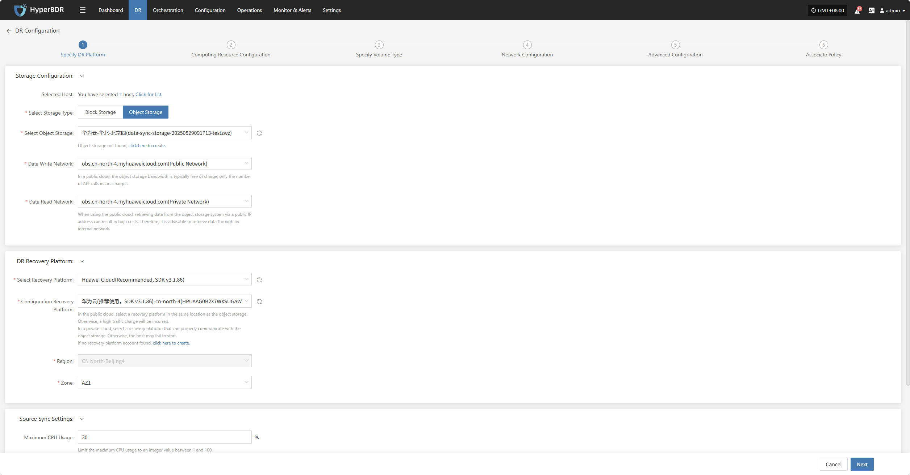

#### **Specify DR Platform**

Assign the backup host to use the "Object Storage" type for backup and select the configuration parameters.

##### **Supported Storage Types**

[Click to View Object Storage Configuration](../configuration/storage-configuration.md#object-storage)

##### **Storage Configuration**

> Prerequisite: Object Storage must be configured in advance. Refer to (select your cloud provider from the table) for adding object storage.

| Parameter             | Configuration                   | Description                                                                     |
| --------------------- | ------------------------------- | ------------------------------------------------------------------------------- |
| Select Storage Type   | Object Storage                  | Choose to use an already configured object storage for disaster recovery backup |
| Select Object Storage | Added Object Storage            | Object storage configuration must be completed first                            |
| Data Write Network    | Selected Object Storage Network | Network used for writing backup data into object storage                        |
| Data Read Network     | Selected Object Storage Network | Network used for reading data from object storage                               |

##### **DR Recovery Platform**

> Prerequisite: The disaster recovery platform must be configured in advance. Refer to the object storage addition method: (Select your cloud provider from the table)

| Parameter                   | Configuration                  | Description                           |
| --------------------------- | ------------------------------ | ------------------------------------- |
| Select Recovery Platform    | (Supported storage types)      | Based on actual configured parameters |
| Configure Recovery Platform | Configured cloud provider info | Based on actual configured parameters |
| Region         | Configured cloud provider info | Cannot be changed                     |
| Zone           | Configured cloud provider info |                                       |

##### **Source Synchronization Settings**

| Parameter              | Configuration | Description                                                                                                 |
| ---------------------- | ------------- | ----------------------------------------------------------------------------------------------------------- |
| Maximum CPU Usage          | 1-100         | Configure the max CPU usage on the source host during backup. Setting too low may reduce backup efficiency. |
| Encryption             | Yes No              | Applies only to object storage mode. Note: Enabling will consume more CPU for encryption.                   |
| Compression            | Yes No              | Applies only to object storage mode. Note: Enabling will consume more CPU for compression.                  |
| VMware Silent Snapshot | Yes No              | Silent snapshot currently effective only on VMware hosts with VMware-tools installed.                       |

After selecting the storage platform configuration, click **“Next”** to start **Computing Resource Configuration**.

#### **Computing Resource Configuration**

You need to configure computing resource parameters for the recovered hosts, including CPU and operating system type, to ensure the restored virtual machines can run normally in the target environment.

Select the virtual machines to be disaster backed up. You can manually select in batches by paging through, configure CPU, OS type, or use the page buttons for batch settings. After choosing the suitable boot method, complete the configuration.

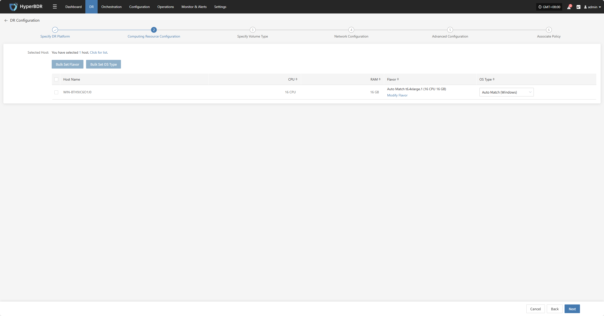

If a preset template with matching resource types exists, the system will auto-match; otherwise, manual selection is required.

##### **Bulk Set Flavor**

Select the desired hosts, then click the **“Bulk Set Flavor”** button on the page to start batch configuring host specifications.

> Note: The currently selected hosts will be set uniformly. Please reselect if there is any doubt.

In the popup dialog, select and confirm based on the preset configuration information.

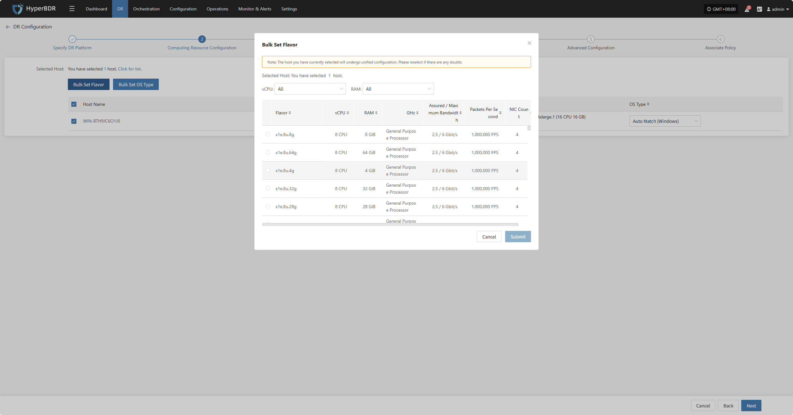

##### **Bulk Set OS Type**

Select the desired hosts, then click the **“Bulk Set OS Type”** button on the page to start batch configuring host system types.

> Note: The currently selected hosts will be set uniformly. Please reselect if there is any doubt.

In the popup dialog, select your host operating system type.

After completing **Computing Resource Configuration**, click **“Next”** to start **Specify Volume Type**.

#### **Specify Volume Type**

Users need to specify the disk type (volume type) on the target cloud platform for each disk of the selected virtual machines to ensure correct resource mapping during disaster recovery.

Set the disk type for the virtual machine disks to be disaster backed up.

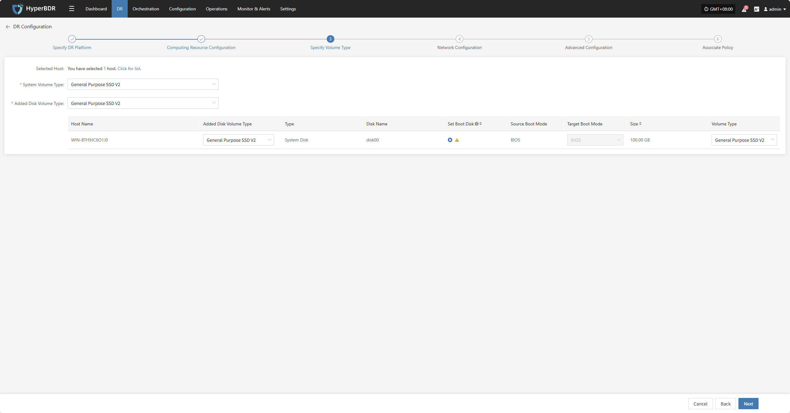

You can select the system volume type from the dropdown list. Actual options depend on cloud provider support. Below is a sample configuration for reference:

| Parameter              | Description                                                                                                                            |
| ---------------------- | -------------------------------------------------------------------------------------------------------------------------------------- |
| General Purpose SSD V2 | Suitable for most general scenarios, offering good performance and cost-effectiveness, recommended as the default choice.              |
| Extreme SSD              | Provides extremely high random read/write performance, suitable for core applications with very high storage performance requirements. |
| General Purpose SSD    | Balanced performance and cost, suitable for small to medium databases, application servers, and similar workloads.                     |
| High I/O                | Offers higher IOPS and throughput, suitable for medium to high-load databases or business systems.                                     |
| Ultra-high I/O          | Provides ultra-high IOPS and very low latency, ideal for critical workloads such as financial trading systems and large databases.     |

After specifying the **Volume Type**, click **“Next”** to start **Network Configuration**.

#### **Network Configuration**

You need to configure the target network environment for the recovered hosts, including private IP, public IP, security groups, MAC address, and other key parameters, to ensure normal communication and access on the target platform.

The system supports both IPv4 and IPv6 network environments. Please select the appropriate network and subnet types according to the disaster recovery host deployment requirements.

After selection, configure related parameters such as private IP, public IP, security groups, and MAC address based on actual needs.

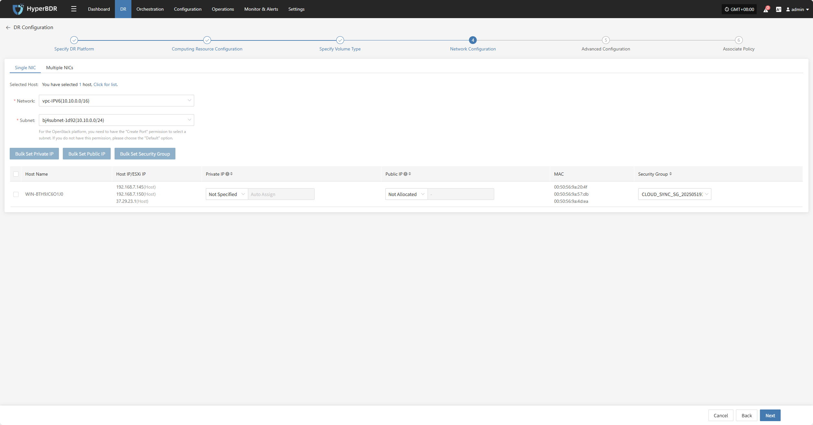

* Configuration Description

| Parameter | Configuration                                | Description                                                                                                               |
| --------- | -------------------------------------------- | ------------------------------------------------------------------------------------------------------------------------- |
| Network   | Disaster recovery target network name        | Specifies the target network the disaster recovery host connects to, used for network communication during data recovery. |
| Subnet    | Associated subnet name in the target network | Specifies the subnet within the target network, through which the disaster recovery host connects.                        |

##### **IP Configuration Rules**

| Parameter      | Configuration Options                     | Description                                                                                                                                                                                                                                                                                                                                                                                                                                      |
| -------------- | ----------------------------------------- | ------------------------------------------------------------------------------------------------------------------------------------------------------------------------------------------------------------------------------------------------------------------------------------------------------------------------------------------------------------------------------------------------------------------------------------------------ |
| Private IP     | Original IP / Specified IP / None         | **Original IP**: The system automatically identifies the NIC and assigns the source host IP via DHCP.  **Specified IP**: You must manually enter an IP address (must match the subnet segment and cannot be changed); the system assigns it via DHCP.  **None**: The system assigns a random IP via DHCP based on the target network.  **Note**: If DHCP is unavailable, the system will not be able to configure the IP automatically. |
| Public IP      | Original IP / Specified IP / Apply for IP | Same as above.                                                                                                                                                                                                                                                                                                                                                                                                                                   |
| Security Group | (Depends on target network configuration) | Multiple options are available based on the target network's configuration; refer to actual settings.                                                                                                                                                                                                                                                                                                                                            |

**Bulk Set Private IP**

Select the desired hosts, then click the **“Bulk Set Private IP”** button on the page to start batch configuration.

In the pop-up dialog box, choose your private IP allocation type.

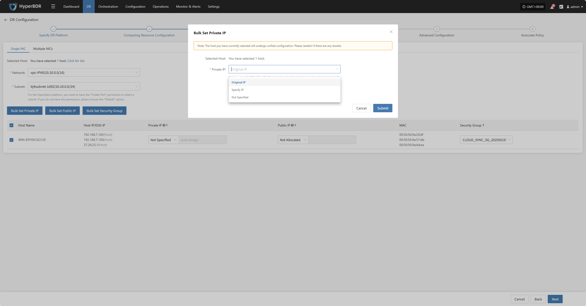

**Bulk Set Public IP**

Select the desired hosts, then click the **“Bulk Set Public IP”** button on the page to start batch configuration.

In the pop-up dialog box, choose your public IP allocation type.

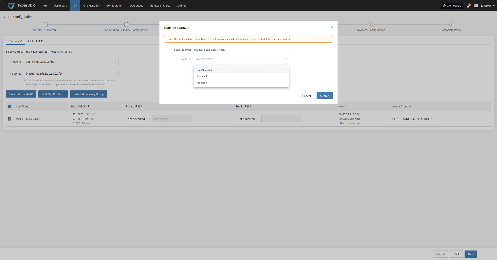

**Bulk Set Security Group**

Select the desired hosts, then click the **“Bulk Set Security Group”** button on the page to start batch configuration.

In the pop-up dialog box, choose your security group.

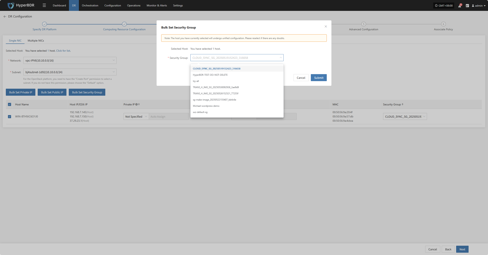

Once **Network Configuration** is complete, click **“Next”** to proceed to **Advanced Configuration**.

#### **Advanced Configuration**

This section supports user-defined script execution and driver adaptation settings, allowing for personalized adjustments and hardware compatibility tuning in complex environments. (The script field can be left blank.)

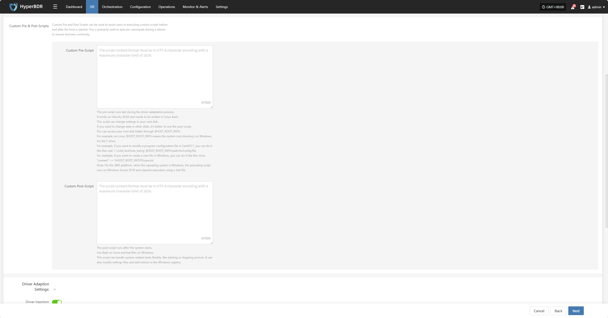

##### **Custom Pre & Post Scripts**

Custom Pre and Post Scripts can be used to assist users in executing custom scripts before and after the host is started. This is primarily used to execute commands during a reboot to ensure business continuity.

**Custom Pre-Script**

>The pre-script runs last during the driver adaptation process.
>It works on Ubuntu 20.04 and needs to be written in Linux Bash.
>This script can change settings in your root disk.
>If you need to change data in other disks, it's better to use the post-script.
>You can access your root disk folder through $HOST_ROOT_PATH.
>For example, on Linux, $HOST_ROOT_PATH means the system root directory; on Windows, it's the C drive.
>For example, if you want to modify a program configuration file in CentOS 7, you can do it like this: sed -i 's/old_text/new_text/g' $HOST_ROOT_PATH/path/to/config/file
>For example, if you want to create a new file in Windows, you can do it like this: echo "content" >> %HOST_ROOT_PATH%\new.txt
>Note: On the AWS platform, when the operating system is Windows, the preceding script runs on Windows Server 2019 and requires execution using a .bat file.

**Custom Post-Script**

>The post-script runs after the system starts.
>Use Bash on Linux and bat files on Windows.
>This script can handle system-related tasks flexibly, like starting or stopping services. It can also modify settings files and add entries to the Windows registry.

**Driver Adaptation Settings**

| Parameter        | Configuration Option    | Description                                                                                                                                                                                        |
| ---------------- | ----------------------- | -------------------------------------------------------------------------------------------------------------------------------------------------------------------------------------------------- |
| Driver Injection | Enable Driver Injection | Applicable only when starting the host on the same virtualization platform. Skipping driver adaptation is **not recommended** as it may cause the host to fail to boot properly. Use with caution. |

After completing **Advanced Configuration**, click **“Next”**. The system will then prompt:
**`Before configuring policies, already configured hosts will automatically enter the "Start Disaster Recovery" process.`**
Proceed to **Associate Policy**.

#### **Associate Policy**

> **Note:** This step is optional. Skipping it will not affect the current disaster recovery process. You may complete policy association later via \[specific method or page].

By associating policies, you can flexibly control host behaviors such as **backup**, **recovery**, and **failover**.

Before using this feature, ensure relevant policies have already been created. If no policy exists in the system, none will be available for selection. Refer to \[link] for policy creation guidelines.

Policies can be associated with individual hosts or applied in bulk using the batch operation feature on the interface.

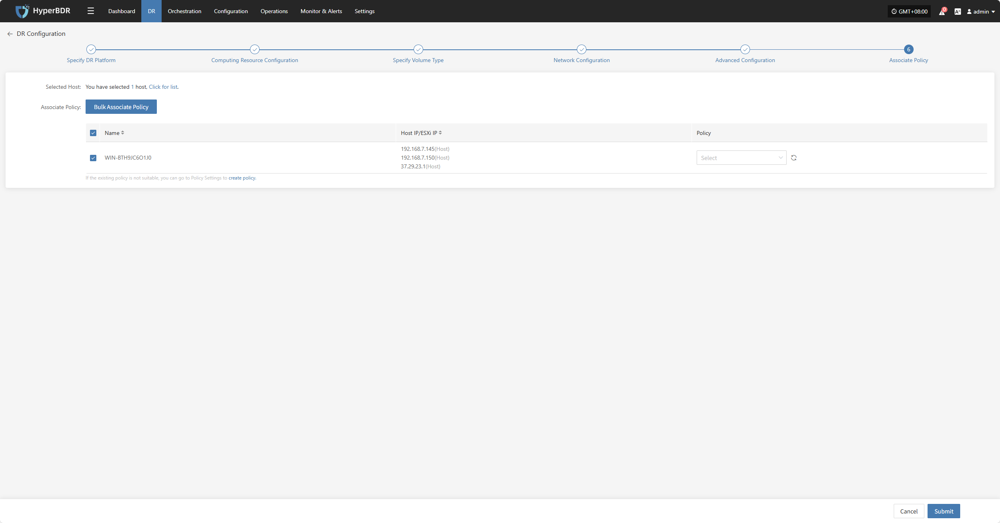

##### **Bulk Associate Policy**

Select the desired hosts and click the **“Bulk Associate Policy”** button to begin batch configuration.

In the pop-up dialog box, select your policy to associate.

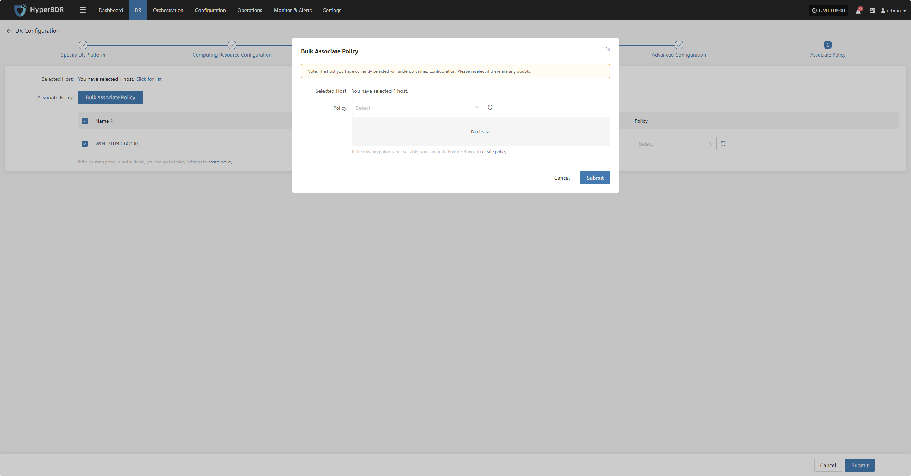

After completing **Policy Association**, click **"Confirm"**. The backup host will proceed to Step 3 to continue with the **"Start DR"** operation.

## **Start DR**

Log in to the console, click the top navigation **"Disaster Recovery"**, then click **"Host DR"** on the left panel. Click **"Start DR"**, select one or multiple hosts, and click **"Sync Now"** to initiate the disaster recovery process.

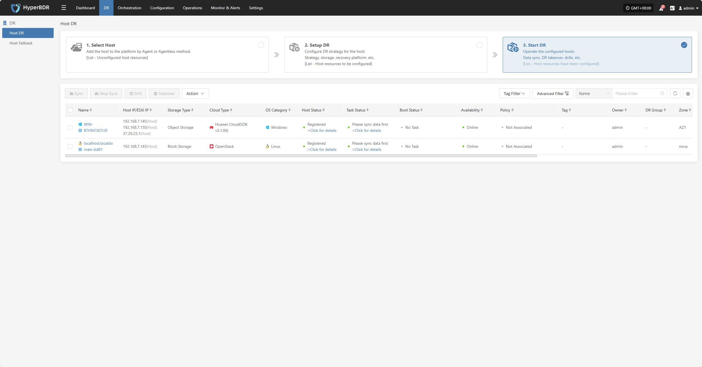

> Note: Data must be synced before proceeding to the next steps.

### **Sync**

After selecting the hosts for disaster recovery, click **"Sync Now"** on the page to start the initial full data sync.

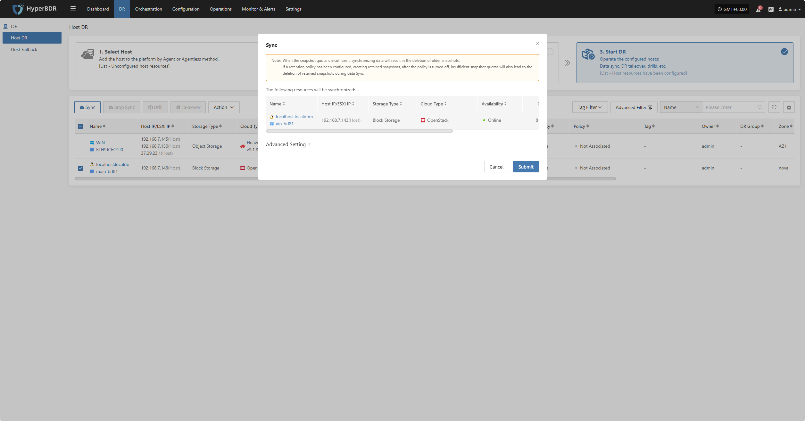

Click **"Confirm"** to begin syncing.

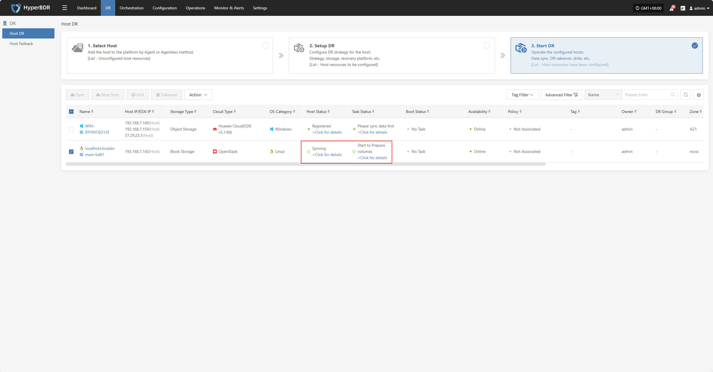
Wait for the sync process to complete before proceeding to the next operation.

#### **Click for details**

##### **Host Status**

In the Host Status bar, click the "Click for details" button to view detailed host information, including running status, sync progress, and more.

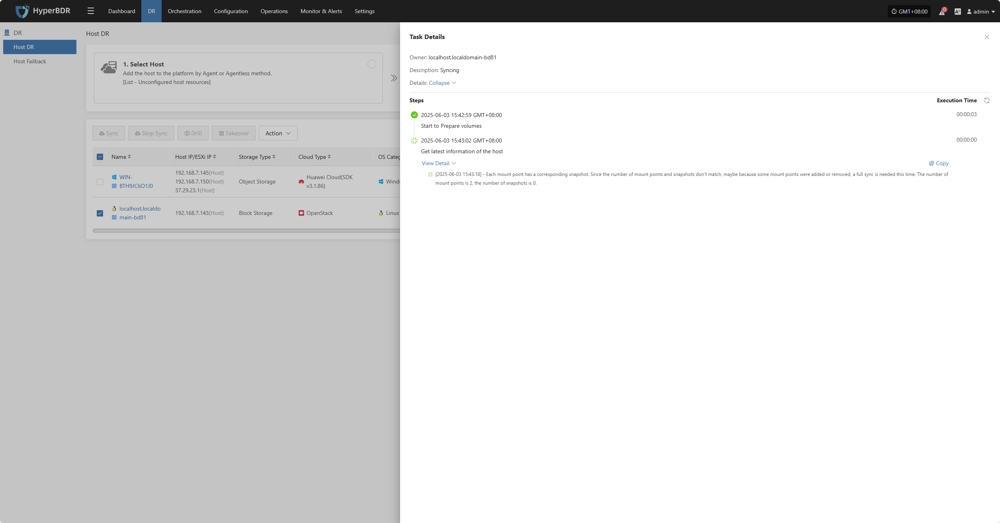

##### **Task Status**

In the Task Status bar, click the "Click for details" button to view task details, including runtime information and sync progress.

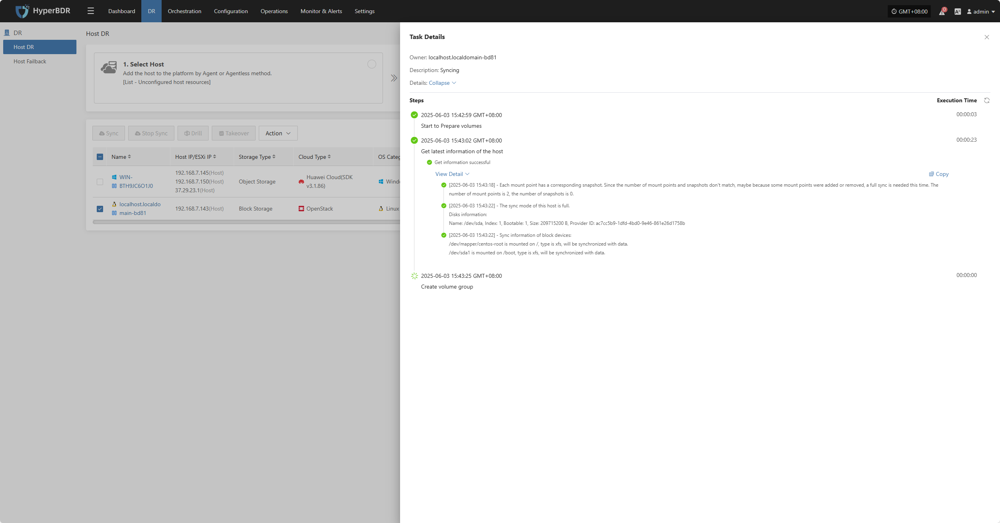

### **Stop Sync**

During syncing, after the volume is prepared, you can click the “Stop Sync” button on the page to cancel the sync process.

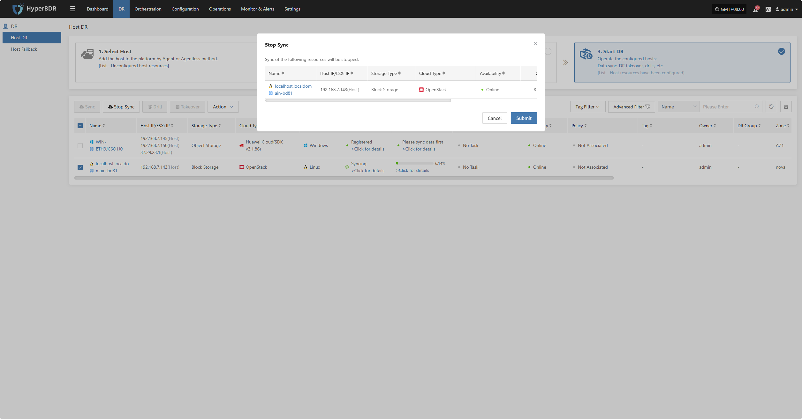

Hosts not in syncing state or already completed sync do not support the stop sync operation.

### **Drill**

Select the disaster recovery host, click “Drill”, choose a recovery point, and restore the DR host to the target environment with one click.

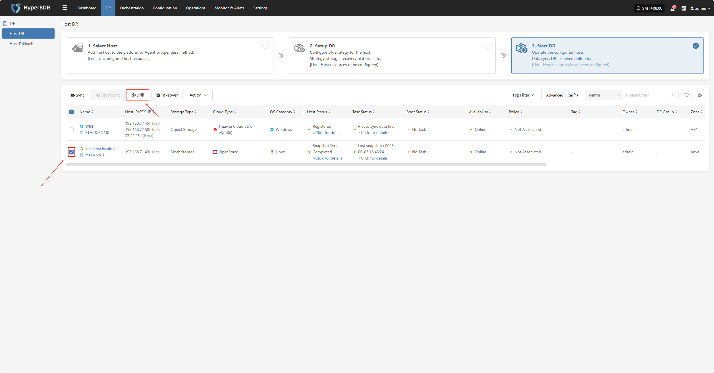

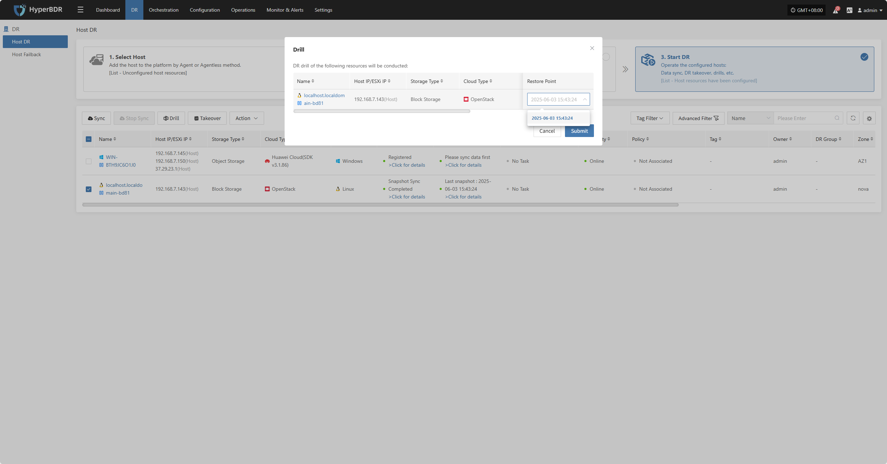

The system will automatically create or start the target instance according to the pre-configured resource orchestration (compute, storage, network, etc.). Once the instance is started, you can log in to the target platform to verify configurations and perform service testing.

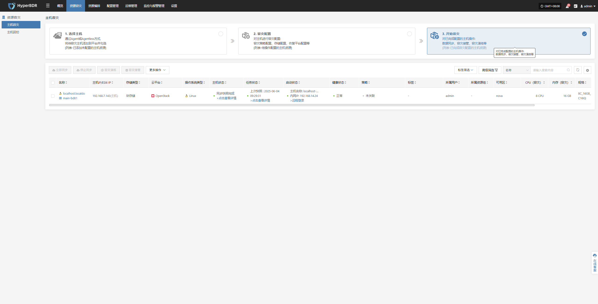

After recovery is complete, check whether application services, databases, and load balancing are functioning normally.

### **Takeover**

Select the **"Takeover"** function for the business host, choose the recovery snapshot point as needed, and click Confirm.

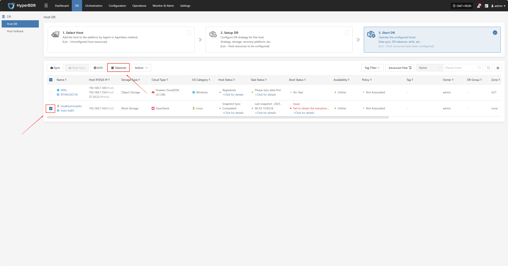

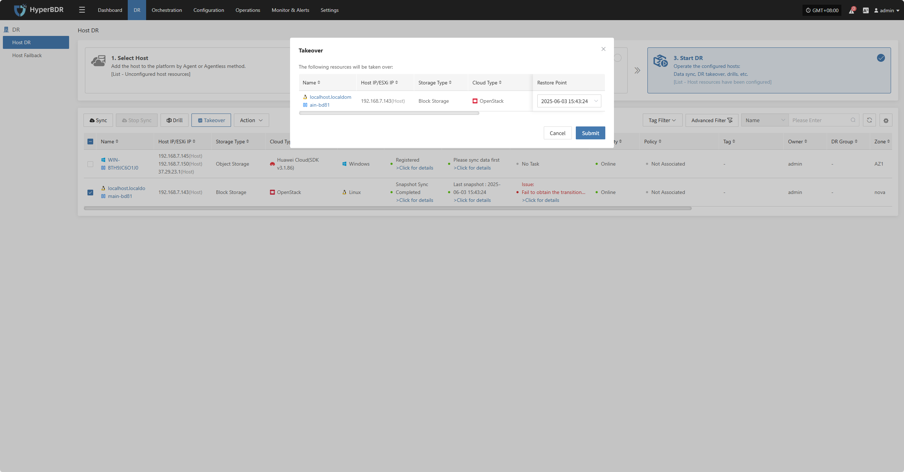

The system will automatically create or start the target instance based on the pre-configured resource orchestration (compute, storage, network, etc.). Once the instance has started, you can log in to the target platform to verify the configuration and take over business operations.

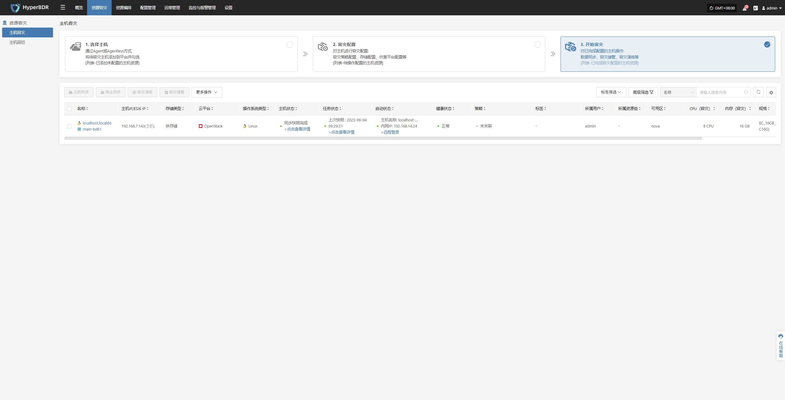

At this point, the disaster recovery process for the host is complete. After services are started, check whether the database version, application service configurations, and dependent services (e.g., cache, message queues) are functioning properly.

### **Action**

Click **"Actions"** to modify a host that has already been configured.

#### **Specify DR Platform**

> Note: Hosts that have completed data synchronization cannot be modified.

Click **"Specify DR Platform"** to modify the DR platform. For details, refer to:

Block Storage: [Click to View](#specify-dr-platform)

Object Storage: [Click to View](#specify-dr-platform-1)

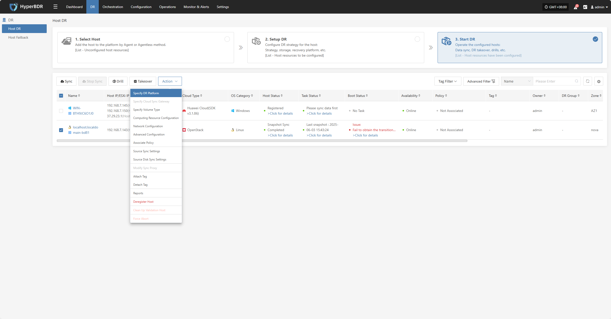

#### **Specify Cloud Sync Gateway**

> Note: Hosts that have completed data synchronization cannot be modified.

Click **"Specify Cloud Sync Gateway"** to modify the DR platform. For details, refer to:

Block Storage: [Click to View](#specify-cloud-sync-gateway)

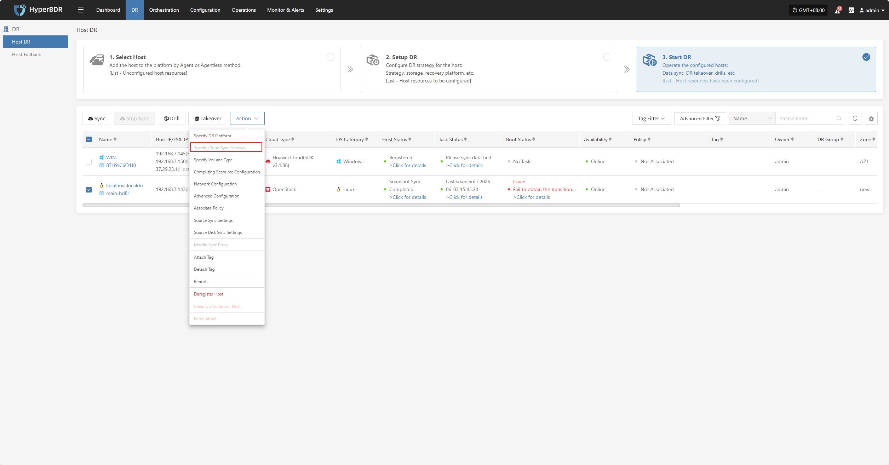

#### **Specify Volume Type**

> Note: Hosts that have completed data synchronization cannot be modified.

Click **"Specify Volume Type"** to modify the DR platform. For details, refer to:

Block Storage: [Click to View](#specify-volume-type)

Object Storage: [Click to View](#specify-volume-type-1)

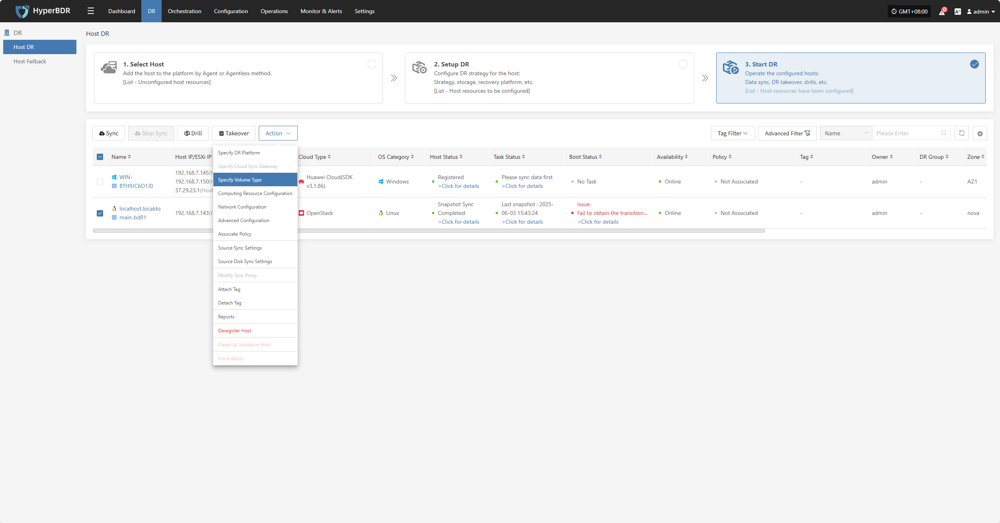

#### **Computing Resource Configuration**

> Note: Hosts that have completed data synchronization cannot be modified.

Click **"Computing Resource Configuration"** to modify the DR platform. For details, refer to:

Block Storage: [Click to View](#computing-resource-configuration)

Object Storage: [Click to View](#computing-resource-configuration-1)

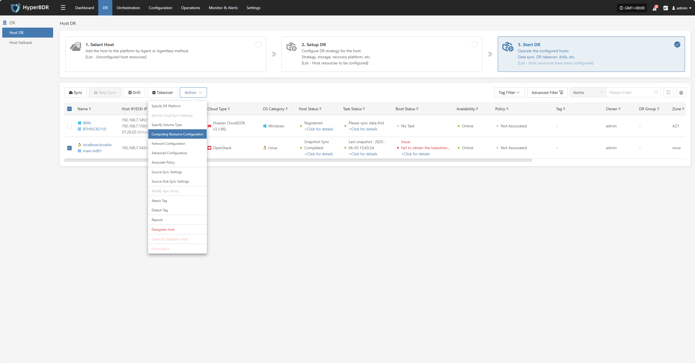

#### **Network Configuration**

> Note: Hosts that have completed data synchronization cannot be modified.

Click **"Network Configuration"** to modify the DR platform. For details, refer to:

Block Storage: [Click to View](#network-configuration)

Object Storage: [Click to View](#network-configuration-1)

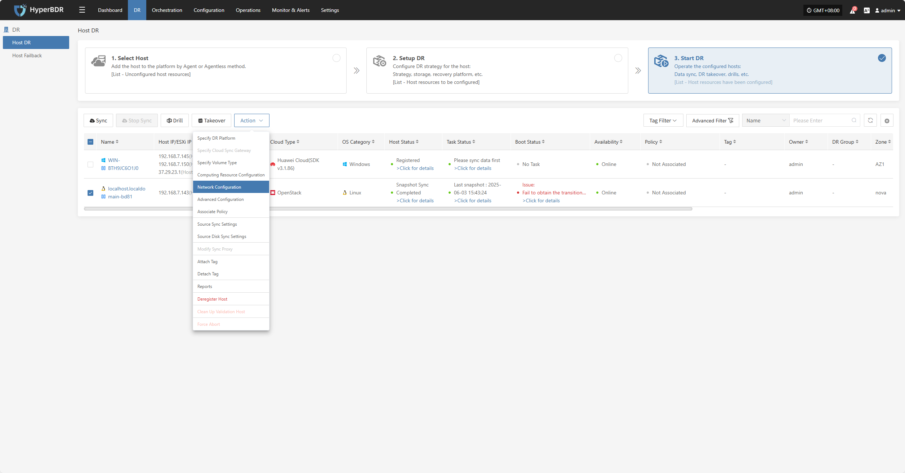

#### **Advanced Configuration**

Click **"Advanced Configuration"** to modify the DR platform. For details, refer to:

Block Storage: [Click to View](#advanced-configuration)

Object Storage: [Click to View](#advanced-configuration-1)

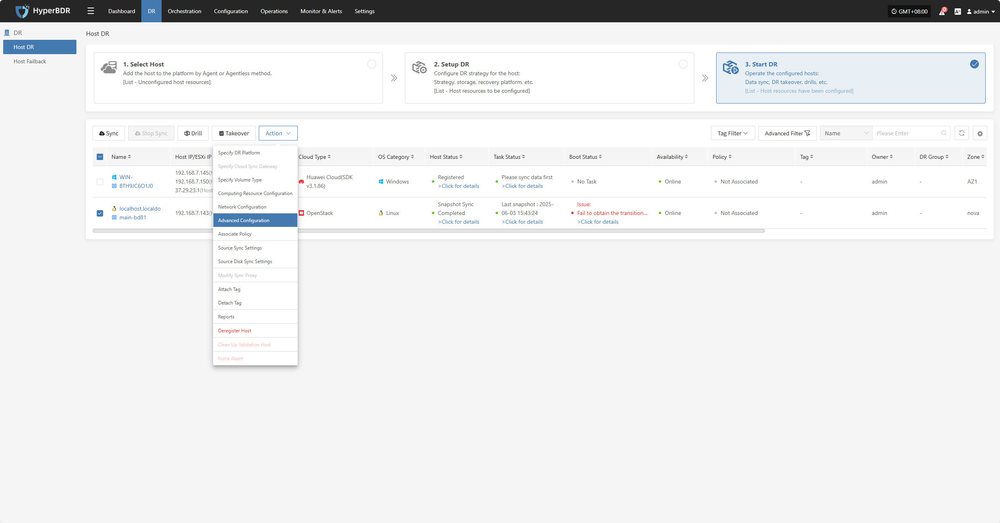

#### **Associate Policy**

Click **"Associate Policy"** to modify the DR platform. For details, refer to:

Block Storage: [Click to View](#associate-policy)

Object Storage: [Click to View](#associate-policy-1)

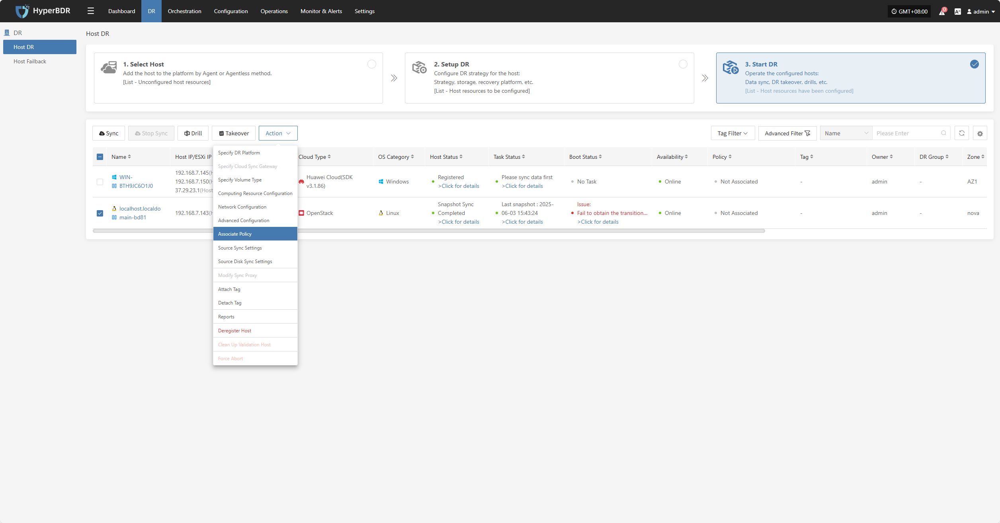

#### **Source Sync Settings**

Click **"Source Sync Settings"** to configure source-side parameters for backup hosts.

##### **General Settings**

| Parameter        | Options       | Description                                                                 |
|------------------|---------------|-----------------------------------------------------------------------------|
| Maximum CPU Usage    | 1–100          | Sets the maximum CPU usage on the source host during backup. Avoid setting it too low to ensure backup efficiency. |
| Encryption       | Yes / No       | Applies only to Object Storage mode. Note: Enabling this option increases CPU usage for encryption processing. |
| Compression      | Yes / No       | Applies only to Object Storage mode. Note: Enabling this option increases CPU usage for compression processing. |

##### **Agentless Mode**

| Parameter             | Options           | Description                                                                                                                                                                                                                     |
|------------------------|-------------------|---------------------------------------------------------------------------------------------------------------------------------------------------------------------------------------------------------------------------------|
| VMware Quiesced Snapshot | Yes / No          | Currently supported only on VMware hosts with VMware Tools installed.                                                                                                                     |
| Read Threads          | Auto / Custom     | Sets the number of read threads per host. "Auto" adjusts the threads based on the sync proxy's resources and the number of disks on the host (1–10). Use "Custom" (1–100) if needed; it's recommended to keep under 30. For 10Gb+ networks, increasing proxy resources (e.g., 8 cores, 16 GB RAM or more) allows setting to 50 or 100 for better performance. |
| Writing Thread         | Auto / Custom     | Sets the number of write threads per host. "Auto" adjusts based on proxy resources and disk count (1–10). Use "Custom" (1–100) if needed; recommended max is 30. For 10Gb+ networks, increase proxy resources before setting to 50 or 100. |
| Concurrent Multi-Disk Read and Write  | Yes / No          | Determines whether all disks on a host are synchronized concurrently.                                                                                                                     |

##### **Sync Retry Settings**

| Parameter   | Options     | Description                                                                                   |
|-------------|-------------|-----------------------------------------------------------------------------------------------|
| Retry on Failure       | Yes / No     | If enabled, the system will retry automatically after a failure (e.g., network issues).       |
| Retry Count | 1–100        | Maximum number of retry attempts.                                                             |
| Retry Interval    | 1–3600       | Wait time (in seconds) between retries.                                                       |

#### **Source Disk Sync Settings**

Click **“Source Disk Sync Settings”** to configure the source disk synchronization policy. When multiple disks are present, you can choose whether each disk participates in the synchronization individually.

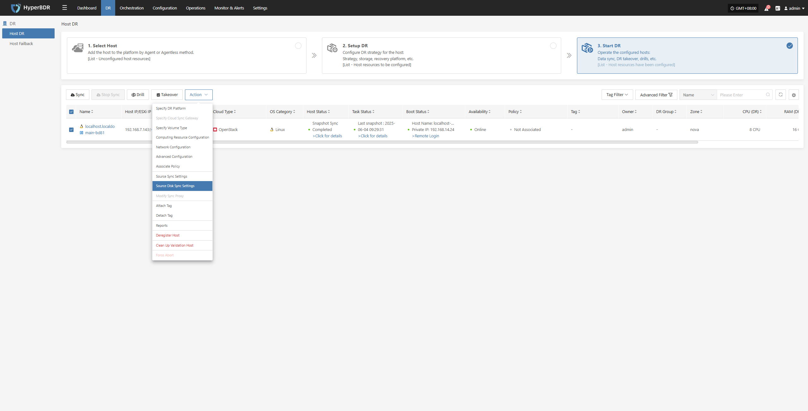

#### **Modify Sync Proxy**

> Note: Hosts with completed data sync cannot change the sync proxy.

Click **"Modify Sync Proxy"** to update the source sync proxy.

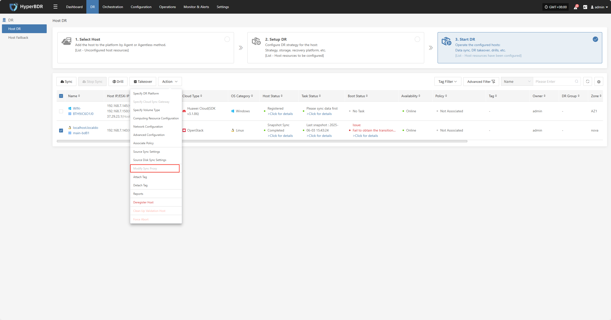

#### **Attach Tag**

Click **"Attach Tag"** to open a sidebar where you can assign tags to the selected host.

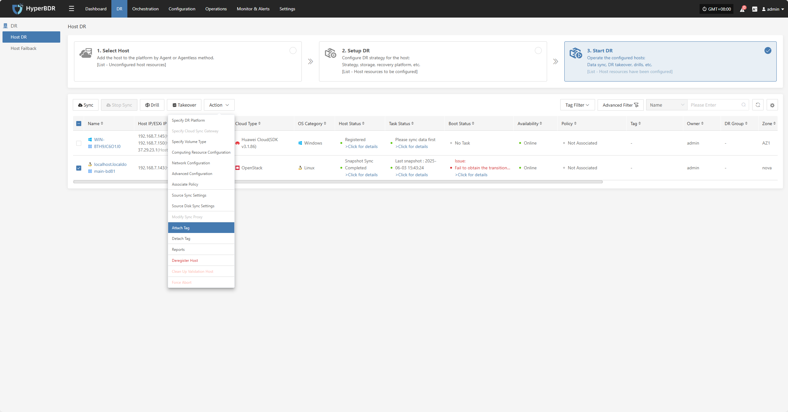

#### **Detach Tag**

Click **"Detach Tag"** to open a sidebar where you can remove tags from the selected host.

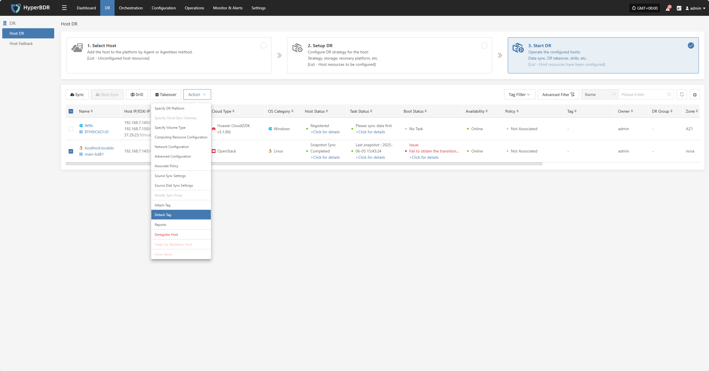

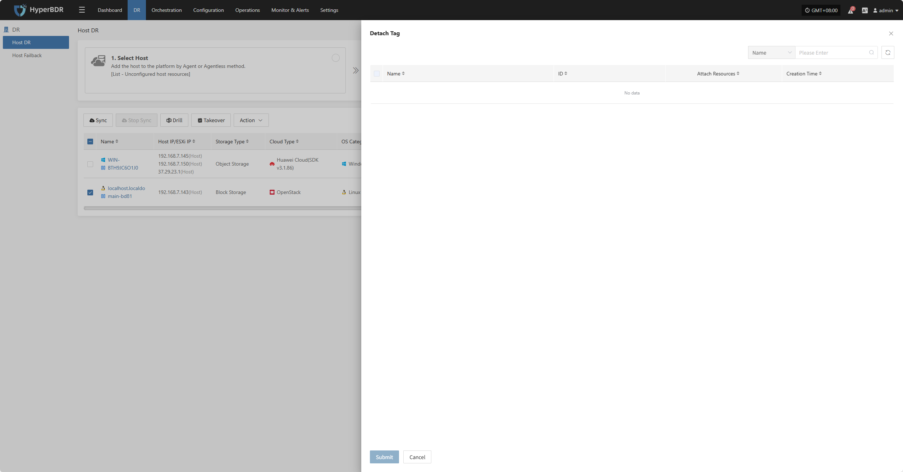

#### **Reports**

Click **"Report"** to open a dialog where you can choose the type of report to export for the selected host. See more: (Report Export)

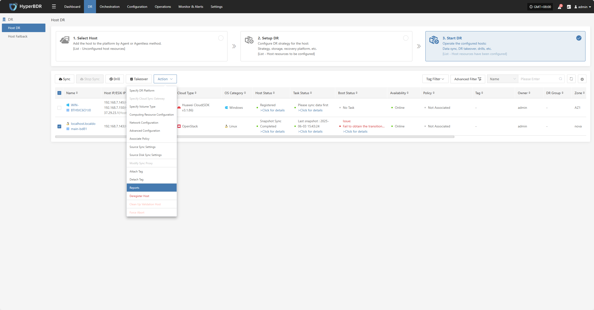

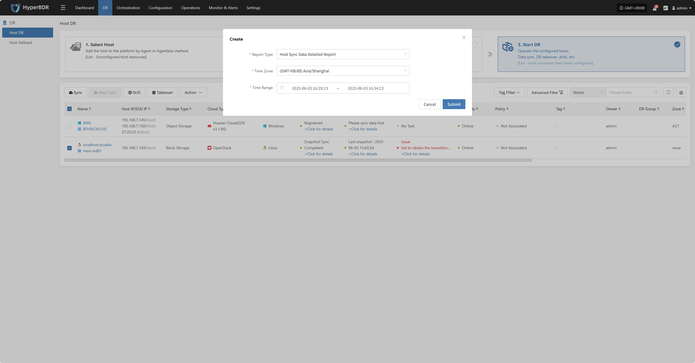

#### **Deregister Host**

> Note: Deregistration will stop services automatically. You must reload the host or reinstall services based on the mode.
>
> * Agentless Mode: Select Host → Reload Host
> * Agent Mode: Reinstall Service

Click the **"Deregister Host"** button to unregister the host. In the pop-up dialog, check the notice and confirm to proceed.

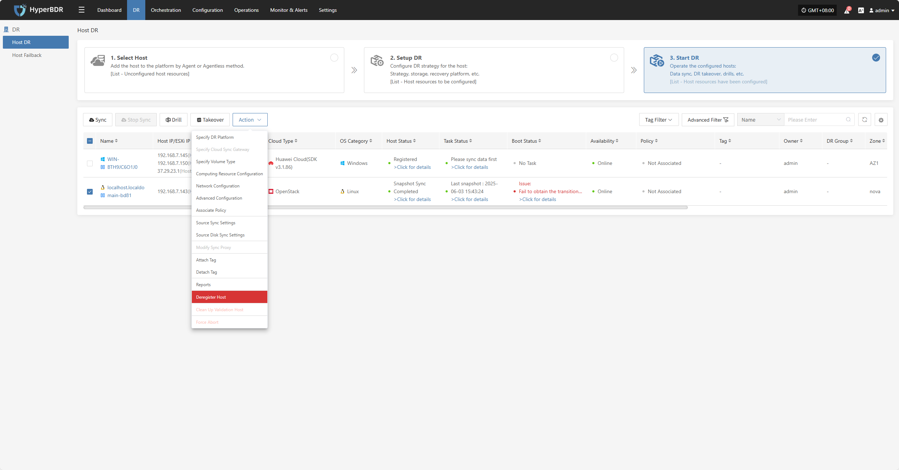

For hosts that have lost connection, force registration is required.

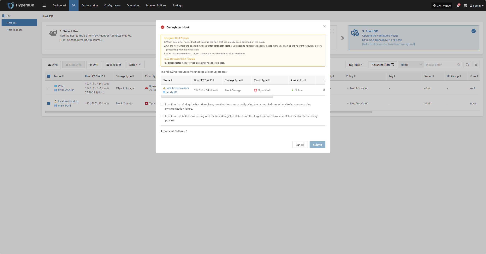

#### **Clean Up Validation Host**

Click the **“Clean Up Validation Host”** button. This operation only cleans up hosts that have started in the cloud. Enter “Yes” in the popup dialog and click confirm to clean up the cloud validation hosts.

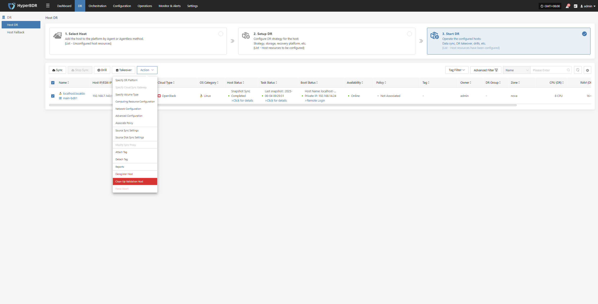

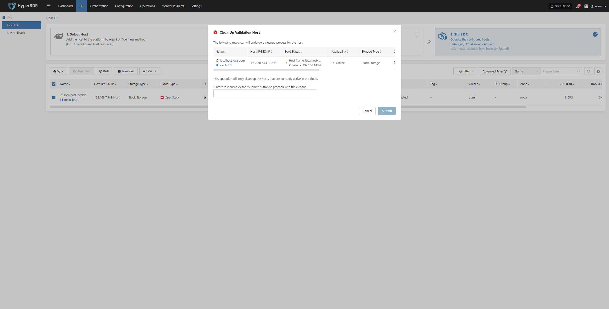

#### **Force Abort**

> Note: When synchronization, drills, or other operations are stuck for a long time or encounter uncontrollable exceptions, this function can be used to forcibly terminate the task.

Click the **“Force Abort”** button to immediately stop the current task.

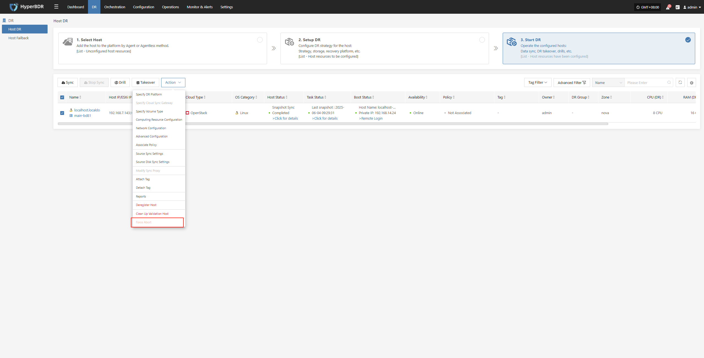
