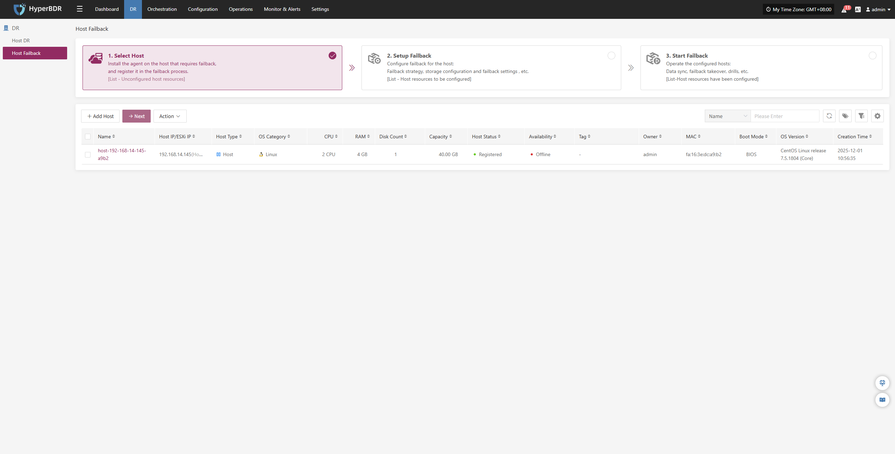

# Host Failback

Host Failback provides step-by-step guidance to restore your business to the source production environment after Drill/Takeover is complete and the source environment recovers from failure. The process consists of three main steps: Select Host, Setup Failback, and Start Failback. By following these three steps, you can complete the entire failback process.

Click the "Resource DR" navigation menu at the top, then click the "Host Failback" menu on the left side to perform the failback operations.

When entering the failback configuration stage, the configuration process is the same as the Host DR workflow. For details on each configuration option and how to use it, refer to the configuration guide in the [**Host DR**](host-dr.md) section. After completing the required settings, you can proceed with the Failback operation.