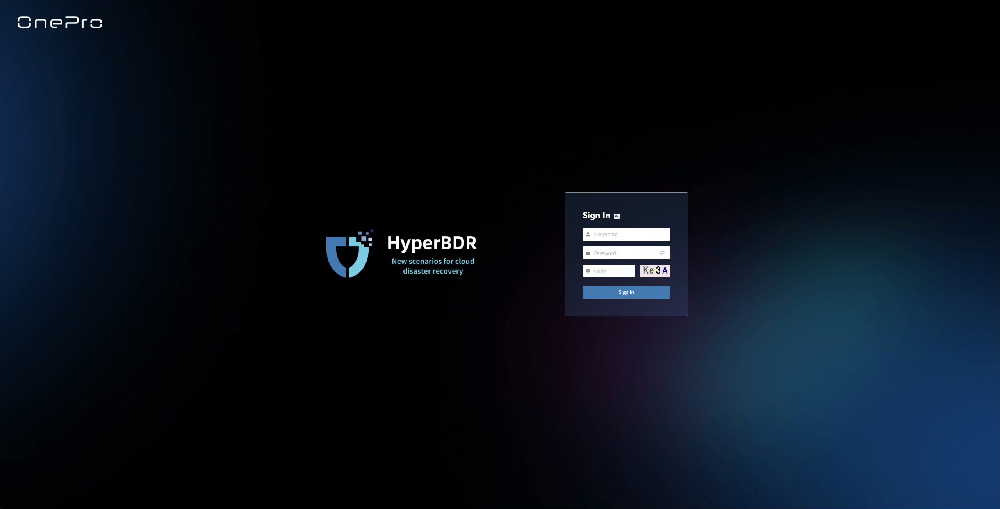

# **Login**

## **Login Entry**

After the system is deployed, operations personnel can access the platform console via a web browser:

* **Console Address**: `https://<IP>:10443`

  

* **Operations Management Platform Address**: `https://<IP>:30443`

  

Enter the above address in the browser's address bar and press **Enter** to access the system and open the login page.

### **Login Information**

On the login page, enter the assigned **username** and **password** to authenticate. The default administrator account credentials are:

* **Username**: `admin`
* **Initial Password**: `P@ssw0rd`

> ⚠️ **Security Notice**: To ensure account security, please change the default password immediately after your first login.
