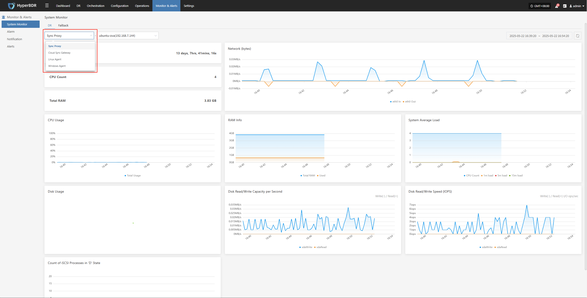
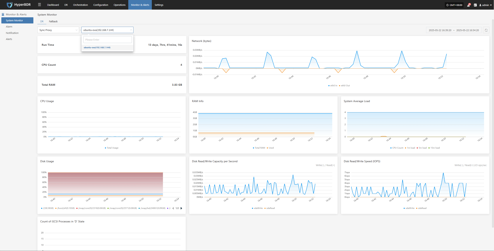

# System Monitor

Provides a visual overview of the operating status of core platform resources, supporting real-time collection of metrics such as CPU, memory, disk, network, and load. This helps administrators fully understand the health of host resources. Users can switch views by resource type and node for unified, hierarchical monitoring.

## System Monitoring Features

The system monitoring module offers real-time visualization and performance analysis of key resources on the platform. For example, with "Sync Proxy", users can select a specific host to view detailed metrics for that node, helping to quickly identify resource bottlenecks or potential risks.

The system supports switching between views by resource type and host instance, enabling users to view monitoring data more efficiently and contextually.

