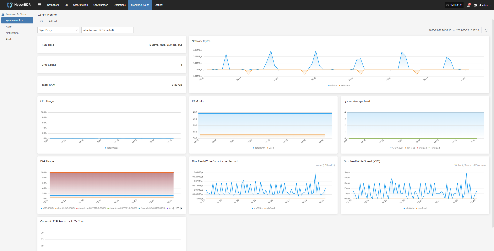
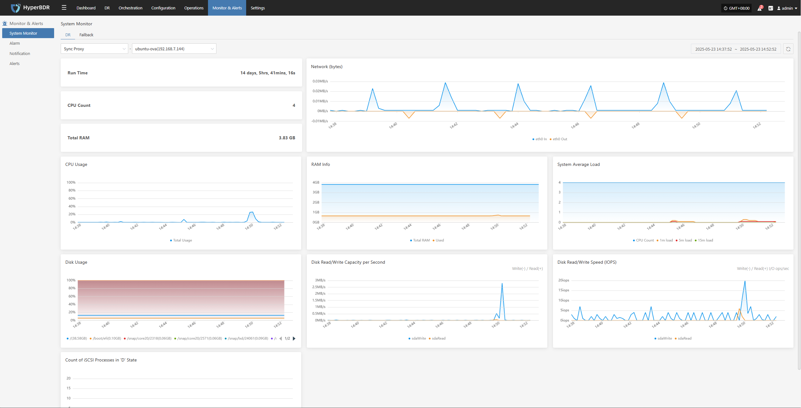
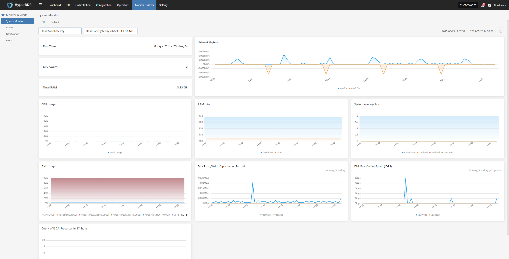
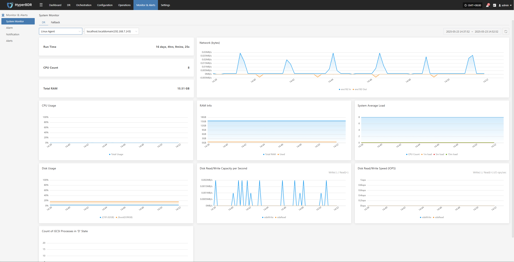
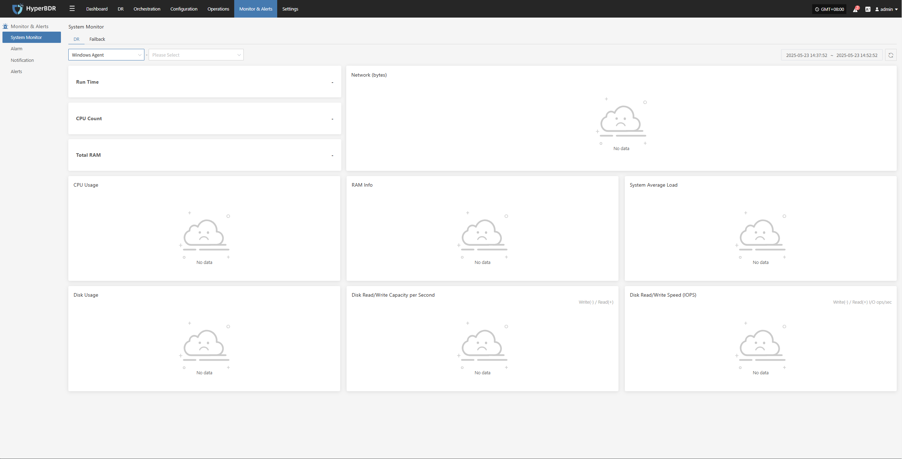
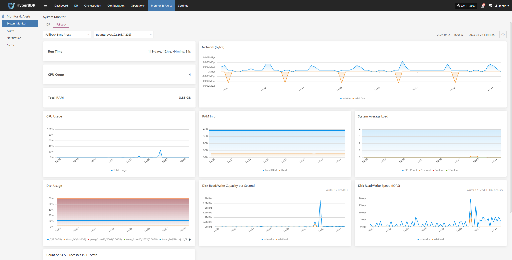
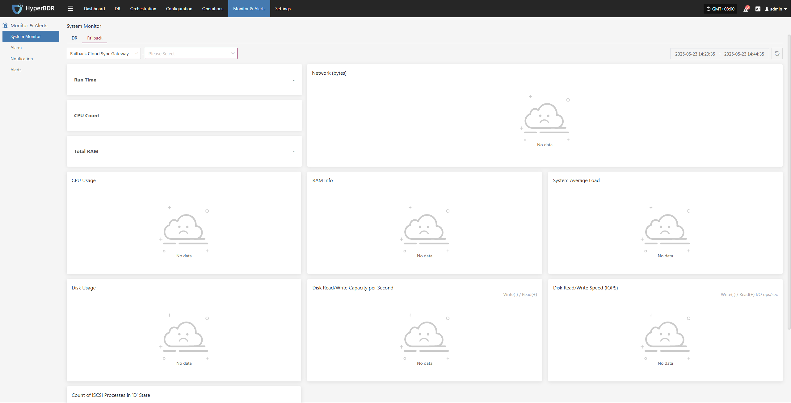
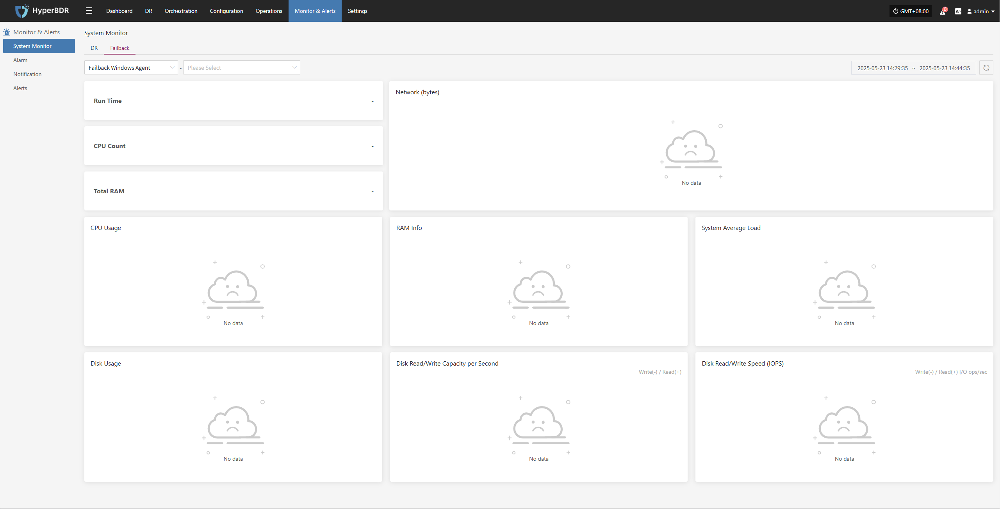

# **System Monitor**

Provides a visual overview of the operating status of core platform resources, supporting real-time collection of metrics such as CPU, memory, disk, network, and load. This helps administrators fully understand the health of host resources. Users can switch views by resource type and node for unified, hierarchical monitoring.

## **System Monitoring Features**

The system monitoring module offers real-time visualization and performance analysis of key resources on the platform. For example, with "Sync Proxy", users can select a specific host to view detailed metrics for that node, helping to quickly identify resource bottlenecks or potential risks.

#### **Basic Information**

* **Uptime**: Shows how long the sync proxy has been running since startup.
* **CPU Cores**: Displays the number of physical CPU cores on the current host.
* **Total Memory**: Shows the total physical memory of the current host.

#### **Resource Usage**

The system uses charts to dynamically display the status of various resources, helping users monitor load and performance changes in real time.

| **Metric**                | **Description**                                              |
|--------------------------|-------------------------------------------------------------|
| **CPU Usage**             | Line chart showing CPU usage changes over time              |
| **RAM Info**           | Displays total, used, and available memory                  |
| **SSystem Average Load**   | Shows average system load for the past 1, 5, and 15 minutes|
| **Network (bytes)** | Graph of inbound (In) and outbound (Out) traffic on eth0  |
| **Disk Usage**            | Shows space usage percentage for each mounted disk path     |
| **Disk Read/Write Capacity per Second**  | Real-time display of disk read/write throughput             |
| **Disk Read/Write Speed (IOPS)**| Shows disk write frequency in IOPS                         |
| **Count of iSCSI Processes in 'D' State**   | Displays changes in the number of iSCSI process statuses    |

> Supports switching views by resource type and host instance for targeted monitoring.

## **DR**

### **Sync Proxy**

Users can go to the "Monitoring & Management" module from the top navigation bar and switch to the **DR** "Sync Proxy" page to view system resource usage for the selected proxy. This view displays the following key monitoring information:

### **Cloud Sync Gateway**

Users can go to the "Monitoring & Management" module from the top navigation bar and switch to the **DR** "Cloud Sync Gateway" page to view system resource usage for the selected proxy. This view displays the following key monitoring information:

### **Linux Agent**

Users can go to the "Monitoring & Management" module from the top navigation bar and switch to the **DR** "Linux Agent" page to view system resource usage for the selected proxy. This view displays the following key monitoring information:

### **Windows Agent**

Users can go to the "Monitoring & Management" module from the top navigation bar and switch to the **DR** "Windows Agent" page to view system resource usage for the selected proxy. This view displays the following key monitoring information:

## **Failback**

### **Failback Sync Proxy**

Users can go to the "Monitoring & Management" module from the top navigation bar and switch to the **Failback** "Failback Sync Proxy" page to view system resource usage for the selected proxy. This view displays the following key monitoring information:

### **Failback Cloud Sync Gateway**

Users can go to the "Monitoring & Management" module from the top navigation bar and switch to the **Failback** "Failback Cloud Sync Gateway" page to view system resource usage for the selected proxy. This view displays the following key monitoring information:

### **Failback Linux Agent**

Users can go to the "Monitoring & Management" module from the top navigation bar and switch to the **Failback** "Failback Linux Agent" page to view system resource usage for the selected proxy. This view displays the following key monitoring information:

### **Failback Windows Agent**

Users can go to the "Monitoring & Management" module from the top navigation bar and switch to the **Failback** "Failback Windows Agent" page to view system resource usage for the selected proxy. This view displays the following key monitoring information:

