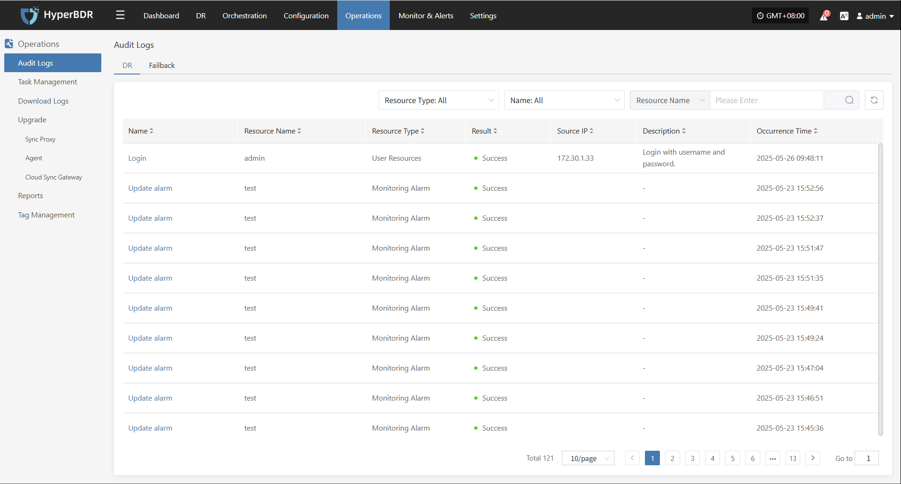
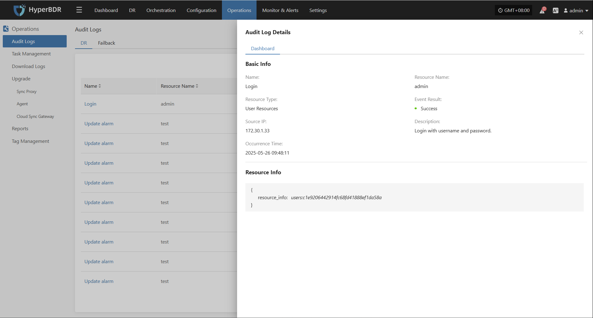

# Audit Logs

In HyperBDR, users can go to "Operations Management > Audit Logs" to view detailed records of all **DR** and **Failback** operations on the platform. This page helps O&M staff track actions, audit behavior, and troubleshoot issues.

## Page Features

Users can quickly search using the top filter options, supporting log filtering by the following fields:

* **Resource Type:** Select the type of resource related to the operation (e.g., VM, user resource, etc.)
* **Message Name:** Filter specific operation events by keyword
* **Resource Name:** Enter a keyword to find the corresponding resource

### Audit Log Description

| **Field Name** | **Example**           | **Description**                                               |
| -------------- | --------------------- | ------------------------------------------------------------- |
| **Name** | Login                | The type of audit event, e.g., user performed a login action. |
| **Resource Name** | admin               | The user or resource that triggered the audit event.          |
| **Resource Type** | User Resource       | The category of resource involved, here related to user ops.  |
| **Result** | Success              | The result of the operation, usually "Success" or "Failure".  |
| **Source IP**    | 172.30.1.33          | The client IP address that initiated the operation.           |
| **Description**  | Login with username and password | Brief description of the operation, helps understand intent.  |
| **Occurrence Time**         | 2025-05-23 09:54:10  | The exact time the event was recorded, for tracking/audit.    |

> Click the message name to view details.

### Resource Type Description

| Resource Type        | Description                                                        |
| -------------------- | ------------------------------------------------------------------ |
| User Resource        | Resources related to user accounts and actions, e.g., login records, permission changes. |
| DR Host Resource     | Hosts involved in DR protection, including configuration and status.|
| License Resource     | Management and status of licenses required for system operation.    |
| Production Site Resource | Agents, hosts, and services in the production environment.      |
| DR Site Resource     | Platforms and components in the DR backup environment.             |
| Monitoring Alarm     | Objects and events related to resource monitoring and alerts.       |
| Resource Group       | Logical groupings of resources by business or function.            |
| Object Storage       | Object storage resources for backup, archiving, etc.               |
| Resource Policies            | Policy objects defining DR behavior, such as sync and failover rules.|

### Other Notes

* The page supports pagination, showing 10 records per page by default.
* You can use the search box in the upper right corner for more precise queries.
* Audit logs cannot be edited manually and are only used for system behavior tracking.
