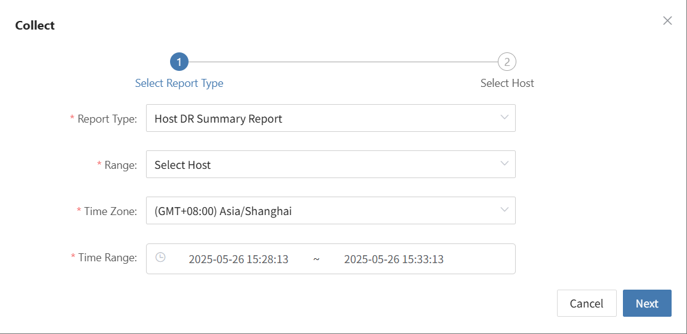
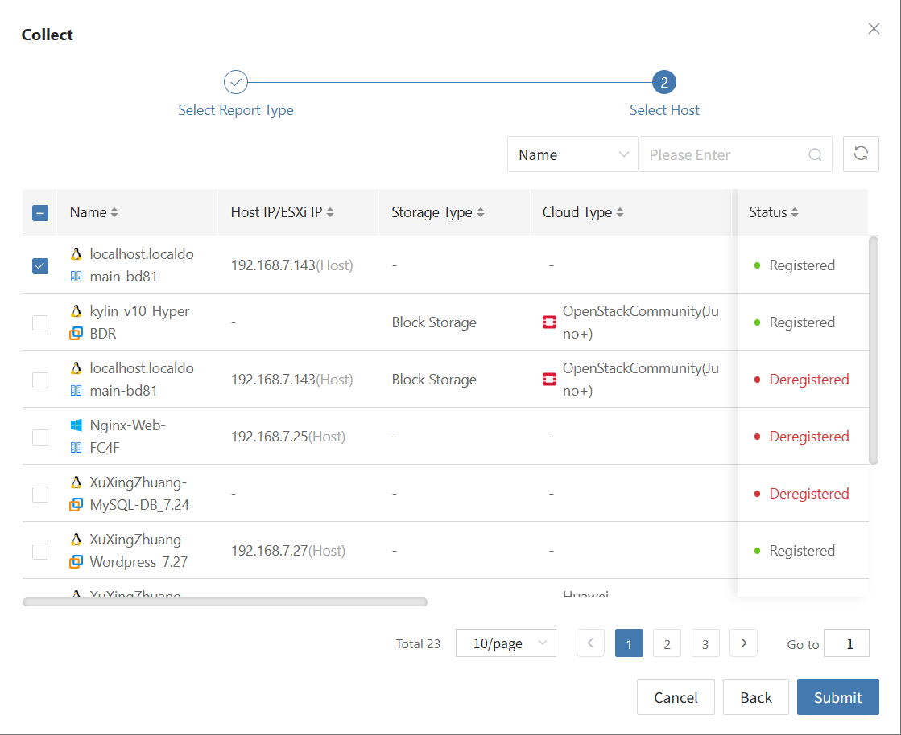
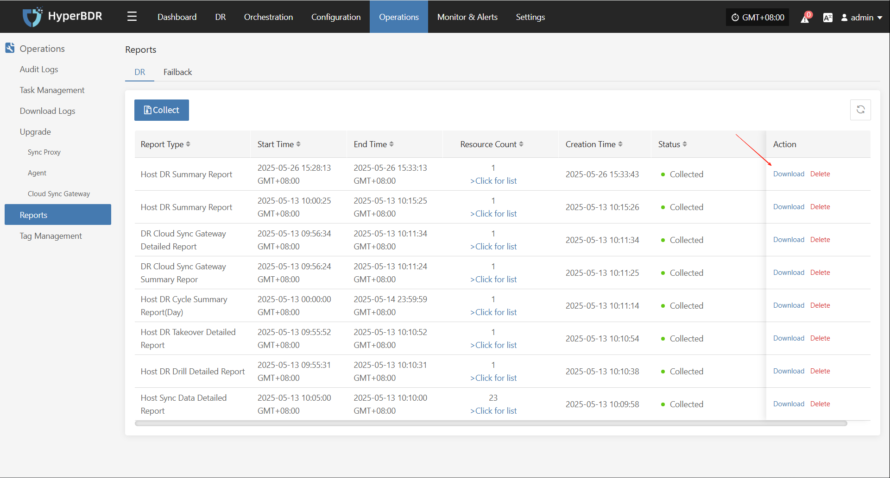

# **Reports**

Currently, users can export various system operation and management reports for **DR** and **Failback** processes through the HyperBDR console. This feature helps users perform **regular analysis and archiving** of platform status, supporting O&M audit, issue tracking, and management evaluation.

## **Supported Report Types and Descriptions**

| **Report Type**                | **Description**                                                                                  |
|-------------------------------|-----------------------------------------------------------------------------------------------|
| Host DR Summary Report         | Summarizes basic info for all registered and unregistered hosts, including sync, drill, takeover counts, OS type, etc. |
| Host Sync Data Detailed Report | Details of sync tasks for all registered and unregistered hosts.                              |
| Host DR Drill Detailed Report  | Details of drill tasks for all registered and unregistered hosts.                             |
| Host DR Takeover Detailed Report | Details of takeover tasks for all registered and unregistered hosts.                        |
| Host DR Cycle Summary Report (Day) | Summarizes DR cycles for all registered and unregistered hosts.                         |
| DR Cloud Sync Gateway Summary Report | Summarizes basic info for all cloud sync gateways.                                   |
| DR Cloud Sync Gateway Detailed Report | Detailed info for all cloud sync gateways, down to each disk.                        |

## **Report Export Details**

### **Host DR Summary Report**

| **Field Name**                 | **Description**                                         |
|-------------------------------|--------------------------------------------------------|
| Host Name                      | Host name, identifies the DR host.                     |
| Host IP                        | Host IP address for network identification.            |
| Step                           | Current step number in DR registration.                |
| Status                         | Current task or operation status, e.g., Registered.    |
| Host Status                    | Whether the host is successfully registered.           |
| Storage Type                   | Storage type, e.g., Block Storage or Object Storage.   |
| Cloud Type                     | Cloud platform type and version, e.g., OpenStack Community (Juno+). |
| OS Type                        | OS type, e.g., Windows or Linux.                       |
| Sync Count (Succeeded)         | Number of successful sync tasks.                       |
| Sync Count (Failed)            | Number of failed sync tasks.                           |
| Drill Count (Succeeded)        | Number of successful drills.                           |
| Drill Count (Failed)           | Number of failed drills.                               |
| Takeover Count (Succeeded)     | Number of successful takeovers.                        |
| Takeover Count (Failed)        | Number of failed takeovers.                            |
| Sync Size (GB)                 | Total synced data in GB.                               |
| Region                         | Cloud platform region.                                 |
| Zone                           | Availability zone (if any).                            |
| Flavors                        | Host specs (vCPU/memory/disk), e.g., 8 cores, 16GB RAM, 50GB disk. |
| Disk Count                     | Number of disks on the host.                           |
| Capacity (GB)                  | Total disk capacity in GB.                             |
| Subnet                         | Subnet name.                                          |
| Network                        | Network name.                                         |
| Security Group                 | Security group policy name.                            |
| Fixed IP                       | Fixed internal IP (if not assigned, blank).            |
| Public IP                      | Public IP (if not assigned, blank).                    |

### **DR Cloud Sync Gateway Detailed Report**

| **Field Name**                 | **Description**                                         |
|-------------------------------|--------------------------------------------------------|
| Created Time                   | Creation time of the cloud sync gateway.               |
| Cloud Sync Gateway Name        | Name of the cloud sync gateway.                        |
| Cloud Account Name             | Cloud account bound to the gateway.                    |
| Block Storage Platform         | Cloud platform type, e.g., OpenStack, VMware.          |
| User Name                      | Tenant or user who created the gateway.                |
| Status                         | Current status (e.g., Enabled, Disabled).              |
| Health Status                  | Health status (e.g., Normal, Abnormal).                |
| Data Transfer Protocol         | Data protocol, e.g., TCP, iSCSI.                       |
| Region                         | Cloud platform region.                                 |
| Zone                           | Cloud platform availability zone.                      |
| Image                          | Image name used by the gateway.                        |
| Flavor                         | Resource template (CPU/memory/disk specs).             |
| System Disk Type               | System disk type, e.g., SSD, SATA.                     |
| System Disk Size               | System disk size in GB.                                |
| Backup Volume                  | Name of the mounted/used backup volume.                |
| Max Backup Volume              | Max supported backup volumes or capacity.              |
| Volume Name                    | Name of the current volume.                            |
| Pool Uuid                      | Unique ID of the storage pool.                         |
| Pool Name                      | Name of the storage pool.                              |
| Total Volume Capacity (GB)     | Total capacity of the current volume in GB.            |
| Usage Status                   | Usage status, e.g., In Use, Idle.                      |
| Allocation Status              | Whether the gateway is associated with a host.         |
| Allocation Host                | If allocated, the host currently using the gateway.    |

### **DR Cloud Sync Gateway Summary Report**

| Field Name                     | Description                                            |
|-------------------------------|-------------------------------------------------------|
| Created Time                   | Creation time (YYYY/MM/DD HH:MM:SS).                  |
| Cloud Sync Gateway Name        | Name or unique ID (often IP address).                 |
| Cloud Account Name             | Cloud service account name.                           |
| Block Storage Platform         | Block storage platform, e.g., OpenStack, AWS.         |
| User Name                      | Username operating the gateway.                       |
| Status                         | Status, e.g., "Creation Success" for success.         |
| Health Status                  | Health, e.g., "Online" for online.                    |
| Data Transfer Protocol         | Protocol, e.g., "S3Block" for S3-based block storage. |
| Region                         | Cloud platform region name.                           |
| Zone                           | Availability zone, or "-" if none.                    |
| Image                          | Image name and unique ID, usually OS image.           |
| Flavor                         | VM specs (CPU, memory, disk).                         |
| System Disk Type               | System disk type, e.g., "DEFAULT_VOLUME_TYPE".        |
| System Disk Size               | System disk size in GB.                               |
| Backup Volume                  | Number of backup volumes.                             |
| Max Backup Volume              | Max allowed backup volumes.                           |
| Total Volume Capacity (GB)     | Total capacity of all volumes in GB.                  |
| Hosts Count                    | Number of associated hosts.                           |

### **Host DR Cycle Summary Report (Day)**

| Field Name                     | Description                                            |
|-------------------------------|-------------------------------------------------------|
| Serial Number                  | Unique entry number.                                  |
| Period                         | Time period covered by the report.                    |
| Host Name                      | Host name.                                            |
| Host IP                        | Host IP address.                                      |
| Step                           | Current step or phase number.                         |
| Status                         | Status, e.g., "Registered" for registered.            |
| Host Status                    | Host status, e.g., "Registered" for registered host.  |
| Storage Type                   | Storage type, e.g., "Block Storage".                  |
| Cloud Type                     | Cloud platform type, e.g., "OpenStackCommunity(Juno+)".|
| OS Type                        | OS type, e.g., Windows, Linux.                        |
| Sync Count(Succeeded)          | Successful sync count.                                |
| Sync Count(Failed)             | Failed sync count.                                    |
| Drill Count(Succeeded)         | Successful drill count.                               |
| Drill Count(Failed)            | Failed drill count.                                   |
| Takeover Count(Succeeded)      | Successful takeover count.                            |
| Takeover Count(Failed)         | Failed takeover count.                                |
| Sync Size(GB)                  | Synced data size in GB.                               |
| Region                         | Cloud platform region.                                |
| Zone                           | Availability zone, or "-" if none.                    |
| Flavors                        | VM specs (CPU, memory, disk).                         |
| Disk Count                     | Number of disks.                                      |
| Capacity(GB)                   | Storage capacity in GB.                               |
| Subnet                         | Subnet name.                                          |
| Network                        | Network name.                                         |
| Security Group                 | Security group name.                                  |
| Fixed IP                       | Fixed IP, or "-" if none.                             |
| Public IP                      | Public IP, or "-" if none.                            |

### **Host DR Takeover Detailed Report**

| Field Name     | Description                                    |
|----------------|------------------------------------------------|
| Host Name      | Host name.                                     |
| Host IP        | Host IP address.                               |
| Status         | Current status, e.g., task completed, abnormal.|
| Task Status    | Task status, reflects takeover progress.       |
| Start Time     | Task start time.                               |
| End Time       | Task end time.                                 |
| Execution Time | Task duration.                                 |
| Storage Type   | Storage type, e.g., Block Storage.             |
| Cloud Type     | Cloud platform type, e.g., OpenStackCommunity(Juno+). |
| Region         | Cloud platform region.                         |
| Zone           | Availability zone, "-" if none.                |
| Flavors        | VM specs (CPU, memory, disk).                  |
| Disk Count     | Number of disks.                               |
| Capacity(GB)   | Storage capacity in GB.                        |
| Network        | Network name.                                  |
| Subnet         | Subnet name.                                   |
| Security Group | Security group name.                           |
| Fixed IP       | Fixed IP, "-" if none.                         |
| Public IP      | Public IP, "-" if none.                        |
| Task Details   | Task details, describes execution info/results.|

### **Host DR Drill Detailed Report**

| Field Name     | Description                                    |
|----------------|------------------------------------------------|
| Host Name      | Host name.                                     |
| Host IP        | Host IP address.                               |
| Status         | Current status, e.g., task completed, abnormal.|
| Task Status    | Task status, reflects drill progress.          |
| Start Time     | Task start time.                               |
| End Time       | Task end time.                                 |
| Execution Time | Task duration.                                 |
| Storage Type   | Storage type, e.g., Block Storage.             |
| Cloud Type     | Cloud platform type, e.g., OpenStackCommunity(Juno+). |
| Region         | Cloud platform region.                         |
| Zone           | Availability zone, "-" if none.                |
| Flavors        | VM specs (CPU, memory, disk).                  |
| Disk Count     | Number of disks.                               |
| Capacity(GB)   | Storage capacity in GB.                        |
| Network        | Network name.                                  |
| Subnet         | Subnet name.                                   |
| Security Group | Security group name.                           |
| Fixed IP       | Fixed IP, "-" if none.                         |
| Public IP      | Public IP, "-" if none.                        |
| Task Details   | Task details, describes execution info/results.|

### **Host Sync Data Detailed Report**

| Field Name              | Description                                    |
|------------------------|------------------------------------------------|
| Host Name              | Host name.                                     |
| Host IP                | Host IP address.                               |
| Status                 | Current status, e.g., task completed, abnormal.|
| Task Status            | Task status, reflects sync progress.           |
| Start Time             | Task start time.                               |
| End Time               | Task end time.                                 |
| Execution Time         | Task duration.                                 |
| Capacity Size(GB)      | Sync capacity in GB.                           |
| Sync Mode              | Sync mode, e.g., full or incremental.          |
| Average Sync Rate(Mbps/s) | Average sync rate in Mbps.                  |
| Synced Size(GB)        | Synced data size in GB.                        |
| Task Details           | Task details, describes execution info/results.|

## **Report Export Example**

> Note: To download reports for different tenants, users of each tenant must log in to the console.

### **Collect Report**

* Click [Operations] > [Reports] to enter the report page.

* After clicking collect, select the report type, scope, time zone, time range, host, etc. as needed, then submit.

### **Download Report**

Select the report row you want to download and click [Download] to get the report.

