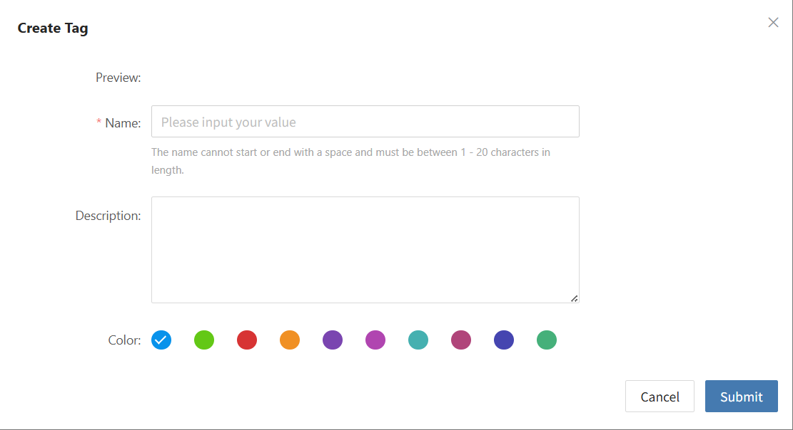
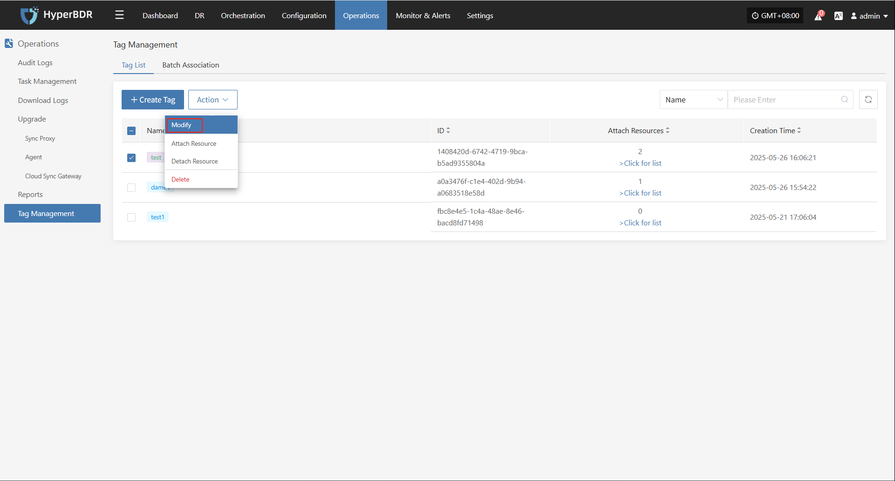
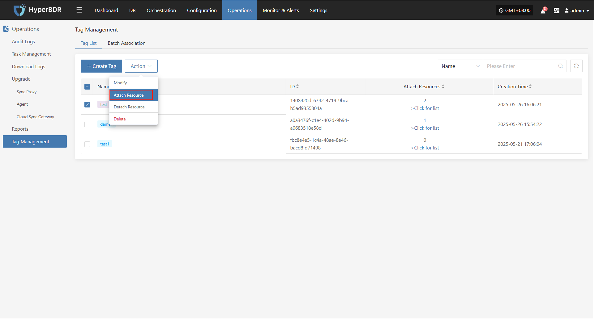
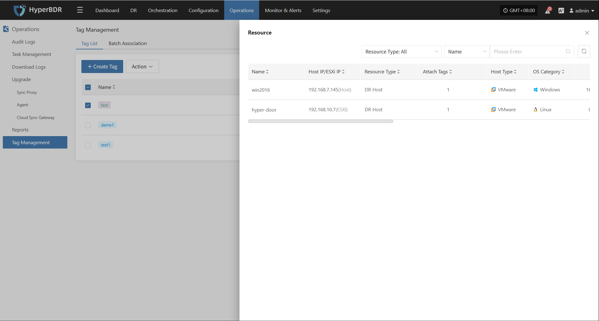
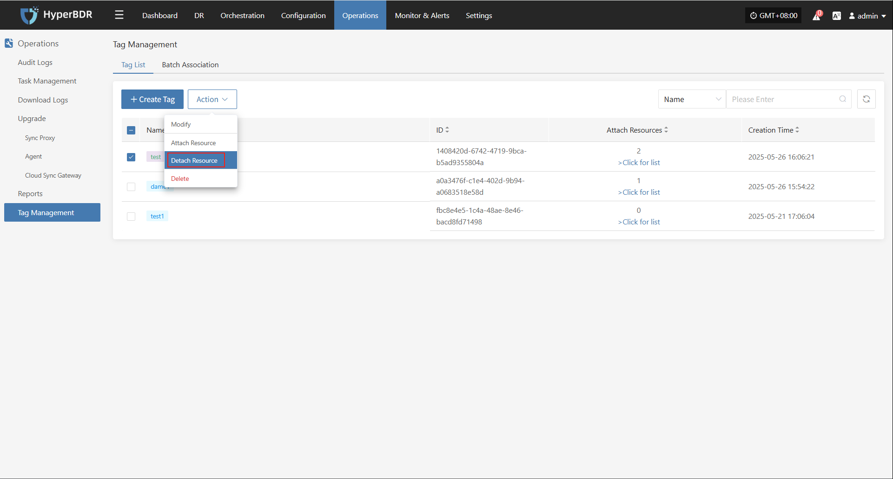
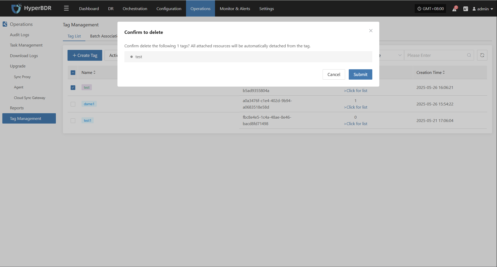
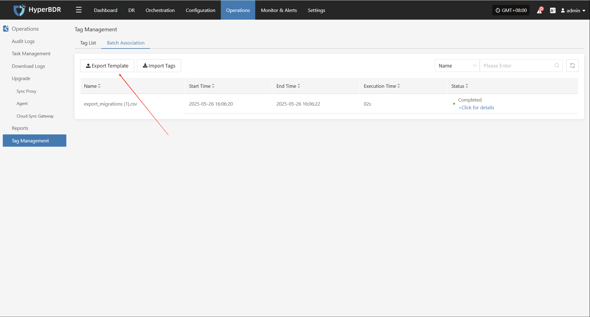
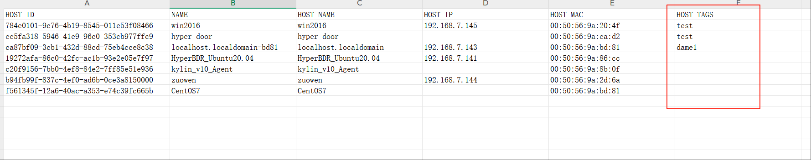
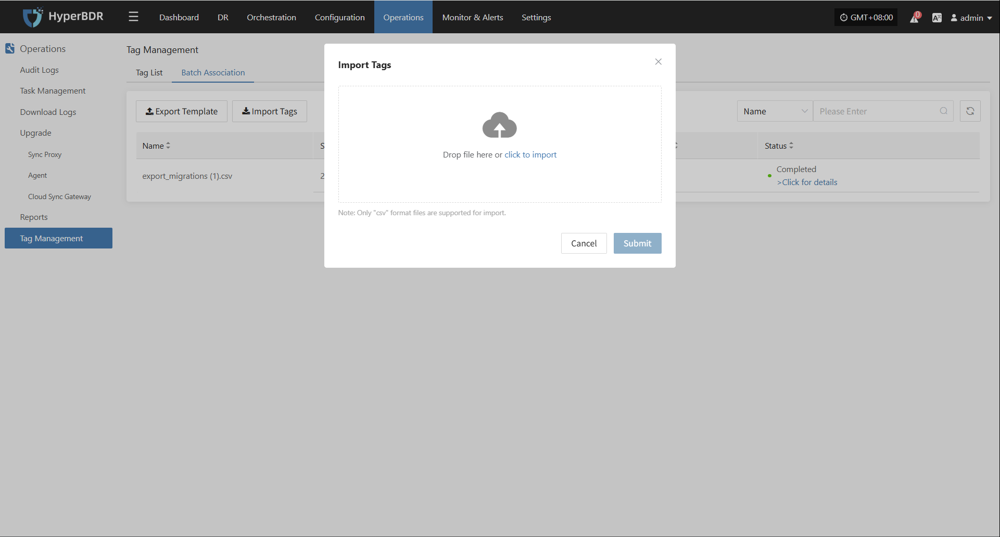

# Tag Management

The tag management module is used to categorize and label resources or objects in the system, making it easy for users to quickly search, organize, and manage resources, and improve management efficiency.

## **Tag List**

Go to [Operations] > [Tag Management] > [Tag List] to access the tag management page.

### **Create Tag**

Click "Create Tag" to start. In the pop-up, add the tag name, description, and tag color.

### **Action**

#### **Modify**

Select a created tag, click [More Actions] > [Modify], and you can modify the name, description, and color.

#### **Attach Resource**

Select a created tag, click [More Actions] > [Attach Resource], and bind the tag to the target host resource.

Click [View List] to see the bound host resources.

#### **Detach Resource**

Select a created tag, click [More Actions] > [Detach Resource], and unbind the tag from the target host resource.

#### **Delete**

Select a created tag, click [More Actions] > [Delete] to remove the tag. All resources bound to this tag will be automatically unbound.

## **Batch Association**

Go to [O&M Management] > [Tag Management] > [Batch Association] to access the batch association page.

### **Export Template**

Click "Export Template" to download the template in XML format.

##### **Template Field Description**

| Field Name | Description                                   |
|------------|----------------------------------------------|
| HOST ID    | Unique host identifier, usually UUID format   |
| NAME       | Host name, user-defined or system assigned    |
| HOST NAME  | Host network name (Hostname)                  |
| HOST IP    | Host IP address                               |
| HOST MAC   | Host MAC address, unique network interface ID |
| HOST TAGS  | Host tags for classification/grouping/custom  |

##### **Fill in the Template**

Fill in the HOST TAGS field with tag names in the exported template and save.

### **Import Tags**

Click "Import Tags" and follow the prompt to drag or upload the file to start importing.

After import, tags will be created automatically and resources will be added to the corresponding tags.

